# 🌌 Complete Messier Catalog Observer's Guide (M1 – M110)
**Visual Observing Program & Deep-Sky Field Guide for Amateur Astronomers**
> **Optics Profile**: Sky-Watcher Skyliner Classic 200P (203/1200mm $f/6$ Dobsonian Newtonian Reflector)  
> **Eyepieces**: 20mm Super (60×, 50' TFOV, 3.4mm exit pupil) & 12.5mm Plössl (96×, 31' TFOV, 2.1mm exit pupil)  
> **Chart Format**: Toner-Saver Negative B/W Edition (Pure `#ffffff` background, black stars, pre-inverted 180° for Newtonians)  
> **Difficulty Ratings**: Calibrated from Michael Swanson's *NexStar User's Guide II* (`Easy`, `Medium`, `Hard`)
---

## 📋 Messier Catalog Master Index
Click any object's **Finder Guide Link** to jump directly to its complete 4-part visual observation suite.

| # | Object Name / Designation | Constellation | Type | Mag ($V$) | Size | Difficulty | Finder Guide |
| :--- | :--- | :--- | :--- | :---: | :---: | :---: | :---: |
| **M1** | **Crab Nebula** (NGC 1952) | Taurus | Supernova Remnant | 8.4 | 8.0' × 4.0' | Medium | [View Guide](#m1) |
| **M2** | NGC 7089 | Aquarius | Globular Cluster | 6.6 | 16.0' × 16.0' | Easy | [View Guide](#m2) |
| **M3** | NGC 5272 | Canes Venatici | Globular Cluster | 6.3 | 18.0' × 18.0' | Easy | [View Guide](#m3) |
| **M4** | NGC 6121 | Scorpius | Globular Cluster | 5.4 | 26.0' × 26.0' | Medium | [View Guide](#m4) |
| **M5** | NGC 5904 | Serpens | Globular Cluster | 5.7 | 23.0' × 23.0' | Easy | [View Guide](#m5) |
| **M6** | **Butterfly Cluster** (NGC 6405) | Scorpius | Open Cluster | 4.2 | 25.0' × 25.0' | Easy | [View Guide](#m6) |
| **M7** | **Ptolemy¹s Cluster** (NGC 6475) | Scorpius | Open Cluster | 3.3 | 80.0' × 80.0' | Easy | [View Guide](#m7) |
| **M8** | **Lagoon Nebula** (NGC 6523) | Sagittarius | Diffuse Nebula | 6.0 | 90.0' × 40.0' | Medium | [View Guide](#m8) |
| **M9** | NGC 6333 | Ophiucus | Globular Cluster | 7.8 | 12.0' × 12.0' | Medium | [View Guide](#m9) |
| **M10** | NGC 6254 | Ophiucus | Globular Cluster | 6.6 | 20.0' × 20.0' | Medium | [View Guide](#m10) |
| **M11** | **Wild Duck Cluster** (NGC 6705) | Scutum | Open Cluster | 5.8 | 14.0' × 14.0' | Easy | [View Guide](#m11) |
| **M12** | NGC 6218 | Ophiucus | Globular Cluster | 6.1 | 16.0' × 16.0' | Medium | [View Guide](#m12) |
| **M13** | **Hercules Globular Cluster** (NGC 6205) | Hercules | Globular Cluster | 5.8 | 20.0' × 7.9' | Easy | [View Guide](#m13) |
| **M14** | NGC 6402 | Ophiucus | Globular Cluster | 7.6 | 11.0' × 11.0' | Medium | [View Guide](#m14) |
| **M15** | NGC 7078 | Pegasus | Globular Cluster | 6.3 | 18.0' × 18.0' | Easy | [View Guide](#m15) |
| **M16** | **Eagle Nebula Cluster** (NGC 6611) | Serpens | Open Cluster | 6.0 | 120.0' × 25.0' | Easy | [View Guide](#m16) |
| **M17** | **Omega, Swan, Horseshoe Nebula** (NGC 6618) | Sagittarius | Diffuse Nebula | 6.0 | 40.0' × 30.0' | Medium | [View Guide](#m17) |
| **M18** | NGC 6613 | Sagittarius | Open Cluster | 6.9 | 7.0' × 7.0' | Easy | [View Guide](#m18) |
| **M19** | NGC 6273 | Ophiucus | Globular Cluster | 6.8 | 17.0' × 17.0' | Easy | [View Guide](#m19) |
| **M20** | **Trifid Nebula** (NGC 6514) | Sagittarius | Diffuse Nebula | 8.5 | 20.0' × 20.0' | Medium | [View Guide](#m20) |
| **M21** | NGC 6531 | Sagittarius | Open Cluster | 5.9 | 16.0' × 16.0' | Easy | [View Guide](#m21) |
| **M22** | NGC 6656 | Sagittarius | Globular Cluster | 5.2 | 32.0' × 32.0' | Easy | [View Guide](#m22) |
| **M23** | NGC 6494 | Sagittarius | Open Cluster | 5.5 | 25.0' × 25.0' | Easy | [View Guide](#m23) |
| **M24** | **Sagittarius Star Cloud** (IC 4715) | Sagittarius | Star Cloud | 4.6 | 90.0' × 60.0' | Easy | [View Guide](#m24) |
| **M25** | IC 4725 | Sagittarius | Open Cluster | 4.6 | 26.0' × 26.0' | Easy | [View Guide](#m25) |
| **M26** | NGC 6694 | Scutum | Open Cluster | 8.0 | 10.0' × 10.0' | Easy | [View Guide](#m26) |
| **M27** | **Dumbbell Nebula** (NGC 6853) | Vulpecula | Planetary Nebula | 7.4 | 8.0' × 5.6' | Medium | [View Guide](#m27) |
| **M28** | NGC 6626 | Sagittarius | Globular Cluster | 6.9 | 11.2' × 11.2' | Medium | [View Guide](#m28) |
| **M29** | NGC 6913 | Cygnus | Open Cluster | 6.6 | 10.0' × 10.0' | Easy | [View Guide](#m29) |
| **M30** | NGC 7099 | Capricornus | Globular Cluster | 6.9 | 12.0' × 12.0' | Medium | [View Guide](#m30) |
| **M31** | **Andromeda Galaxy** (NGC 224) | Andromeda | Spiral Galaxy | 3.4 | 189.1' × 61.7' | Easy | [View Guide](#m31) |
| **M32** | **Satellite of M31** (NGC 221) | Andromeda | Elliptical Galaxy | 8.1 | 8.5' × 6.5' | Medium | [View Guide](#m32) |
| **M33** | **Triangulum/Pinwheel Galaxy** (NGC 598) | Triangulum | Spiral Galaxy | 5.7 | 68.7' × 41.6' | Hard | [View Guide](#m33) |
| **M34** | NGC 1039 | Perseus | Open Cluster | 5.2 | 25.0' × 25.0' | Easy | [View Guide](#m34) |
| **M35** | NGC 2168 | Gemini | Open Cluster | 5.1 | 25.0' × 25.0' | Easy | [View Guide](#m35) |
| **M36** | NGC 1960 | Auriga | Open Cluster | 6.0 | 10.0' × 10.0' | Easy | [View Guide](#m36) |
| **M37** | NGC 2099 | Auriga | Open Cluster | 5.6 | 15.0' × 15.0' | Easy | [View Guide](#m37) |
| **M38** | NGC 1912 | Auriga | Open Cluster | 6.4 | 15.0' × 15.0' | Easy | [View Guide](#m38) |
| **M39** | NGC 7092 | Cygnus | Open Cluster | 4.6 | 31.0' × 31.0' | Easy | [View Guide](#m39) |
| **M40** | **Double Star** (Winnecke 4) | Ursa Major | Double Star | 9.7 | 0.0' × 0.0' | Easy | [View Guide](#m40) |
| **M41** | NGC 2287 | Canis Major | Open Cluster | 4.5 | 39.0' × 39.0' | Easy | [View Guide](#m41) |
| **M42** | **Great Orion Nebula** (NGC 1976) | Orion | Diffuse Nebula | 4.0 | 90.0' × 60.0' | Easy | [View Guide](#m42) |
| **M43** | **de Mairan¹s Nebula** (NGC 1982) | Orion | Diffuse Nebula | 6.8 | 20.0' × 15.0' | Medium | [View Guide](#m43) |
| **M44** | **Beehive Cluster (Praesepe)** (NGC 2632) | Cancer | Open Cluster | 3.1 | 70.0' × 70.0' | Easy | [View Guide](#m44) |
| **M45** | **Pleiades** (Melotte 22) | Taurus | Open Cluster | 1.2 | 110.0' × 110.0' | Easy | [View Guide](#m45) |
| **M46** | NGC 2437 | Puppis | Open Cluster | 6.1 | 20.0' × 20.0' | Medium | [View Guide](#m46) |
| **M47** | NGC 2422 | Puppis | Open Cluster | 4.4 | 25.0' × 25.0' | Easy | [View Guide](#m47) |
| **M48** | NGC 2548 | Hydra | Open Cluster | 5.8 | 30.0' × 30.0' | Medium | [View Guide](#m48) |
| **M49** | NGC 4472 | Virgo | Elliptical Galaxy | 8.4 | 10.2' × 8.3' | Hard | [View Guide](#m49) |
| **M50** | NGC 2323 | Monoceros | Open Cluster | 5.9 | 15.0' × 15.0' | Easy | [View Guide](#m50) |
| **M51** | **Whirlpool Galaxy** (NGC 5194) | Canes Venatici | Spiral Galaxy | 8.1 | 11.2' × 8.4' | Medium | [View Guide](#m51) |
| **M52** | NGC 7654 | Cassiopeia | Open Cluster | 6.9 | 16.0' × 16.0' | Medium | [View Guide](#m52) |
| **M53** | NGC 5024 | Coma Berenices | Globular Cluster | 7.7 | 13.0' × 13.0' | Medium | [View Guide](#m53) |
| **M54** | NGC 6715 | Sagittarius | Globular Cluster | 7.7 | 12.0' × 12.0' | Medium | [View Guide](#m54) |
| **M55** | NGC 6809 | Sagittarius | Globular Cluster | 6.3 | 19.0' × 19.0' | Medium | [View Guide](#m55) |
| **M56** | NGC 6779 | Lyra | Globular Cluster | 8.4 | 8.8' × 8.8' | Medium | [View Guide](#m56) |
| **M57** | **Ring Nebula** (NGC 6720) | Lyra | Planetary Nebula | 8.8 | 3.8' × 2.4' | Easy | [View Guide](#m57) |
| **M58** | NGC 4579 | Virgo | Spiral Galaxy | 9.7 | 9.7' × 4.7' | Hard | [View Guide](#m58) |
| **M59** | NGC 4621 | Virgo | Elliptical Galaxy | 9.6 | 5.4' × 3.7' | Hard | [View Guide](#m59) |
| **M60** | NGC 4649 | Virgo | Elliptical Galaxy | 8.8 | 7.4' × 6.0' | Medium | [View Guide](#m60) |
| **M61** | NGC 4303 | Virgo | Spiral Galaxy | 9.7 | 9.7' × 5.8' | Hard | [View Guide](#m61) |
| **M62** | NGC 6266 | Ophiucus | Globular Cluster | 6.4 | 15.0' × 15.0' | Medium | [View Guide](#m62) |
| **M63** | **Sunflower Galaxy** (NGC 5055) | Canes Venatici | Spiral Galaxy | 8.6 | 13.2' × 7.9' | Hard | [View Guide](#m63) |
| **M64** | **Blackeye Galaxy** (NGC 4826) | Coma Berenices | Spiral Galaxy | 8.5 | 9.8' × 4.9' | Medium | [View Guide](#m64) |
| **M65** | NGC 3623 | Leo | Spiral Galaxy | 9.3 | 8.7' × 2.5' | Medium | [View Guide](#m65) |
| **M66** | NGC 3627 | Leo | Spiral Galaxy | 8.9 | 9.1' × 4.2' | Medium | [View Guide](#m66) |
| **M67** | NGC 2682 | Cancer | Open Cluster | 6.9 | 25.0' × 25.0' | Medium | [View Guide](#m67) |
| **M68** | NGC 4590 | Hydra | Globular Cluster | 7.3 | 11.0' × 11.0' | Hard | [View Guide](#m68) |
| **M69** | NGC 6637 | Sagittarius | Globular Cluster | 8.3 | 8.1' × 8.1' | Medium | [View Guide](#m69) |
| **M70** | NGC 6681 | Sagittarius | Globular Cluster | 7.8 | 8.0' × 8.0' | Medium | [View Guide](#m70) |
| **M71** | NGC 6838 | Sagitta | Globular Cluster | 8.4 | 7.2' × 7.2' | Hard | [View Guide](#m71) |
| **M72** | NGC 6981 | Aquarius | Globular Cluster | 9.2 | 6.6' × 6.6' | Hard | [View Guide](#m72) |
| **M73** | **Four-Star Asterism** (NGC 6994) | Aquarius | Open Cluster | 8.9 | 2.8' × 2.8' | Easy | [View Guide](#m73) |
| **M74** | NGC 628 | Pisces | Spiral Galaxy | 9.4 | 10.5' × 9.5' | Hard | [View Guide](#m74) |
| **M75** | NGC 6864 | Sagittarius | Globular Cluster | 8.6 | 6.8' × 1.9' | Medium | [View Guide](#m75) |
| **M76** | **Little Dumbbell, Cork, Butterfly Nebula** (NGC 650) | Perseus | Planetary Nebula | 10.1 | 3.1' × 2.3' | Medium | [View Guide](#m76) |
| **M77** | **Cetus A** (NGC 1068) | Cetus | Spiral Galaxy | 8.9 | 7.1' × 6.0' | Hard | [View Guide](#m77) |
| **M78** | NGC 2068 | Orion | Diffuse Nebula | 8.0 | 8.0' × 6.0' | Medium | [View Guide](#m78) |
| **M79** | NGC 1904 | Lepus | Globular Cluster | 7.7 | 9.6' × 9.6' | Medium | [View Guide](#m79) |
| **M80** | NGC 6093 | Scorpius | Globular Cluster | 7.3 | 10.0' × 10.0' | Medium | [View Guide](#m80) |
| **M81** | **Bode¹s Galaxy** (NGC 3031) | Ursa Major | Spiral Galaxy | 6.9 | 26.9' × 14.1' | Medium | [View Guide](#m81) |
| **M82** | **Cigar Galaxy** (NGC 3034) | Ursa Major | Galaxy | 8.4 | 11.2' × 4.3' | Medium | [View Guide](#m82) |
| **M83** | **Southern Pinwheel Galaxy** (NGC 5236) | Hydra | Spiral Galaxy | 7.5 | 12.9' × 11.5' | Medium | [View Guide](#m83) |
| **M84** | NGC 4374 | Virgo | Lenticular Galaxy | 9.1 | 6.5' × 5.6' | Hard | [View Guide](#m84) |
| **M85** | NGC 4382 | Coma Berenices | Lenticular Galaxy | 9.1 | 7.1' × 5.5' | Hard | [View Guide](#m85) |
| **M86** | NGC 4406 | Virgo | Lenticular Galaxy | 8.9 | 8.9' × 5.8' | Hard | [View Guide](#m86) |
| **M87** | **Virgo A** (NGC 4486) | Virgo | Elliptical Galaxy | 8.6 | 7.2' × 6.8' | Hard | [View Guide](#m87) |
| **M88** | NGC 4501 | Coma Berenices | Spiral Galaxy | 9.6 | 6.9' × 3.7' | Hard | [View Guide](#m88) |
| **M89** | NGC 4552 | Virgo | Elliptical Galaxy | 9.8 | 5.1' × 4.7' | Hard | [View Guide](#m89) |
| **M90** | NGC 4569 | Virgo | Spiral Galaxy | 9.5 | 9.5' × 4.4' | Hard | [View Guide](#m90) |
| **M91** | NGC 4548 | Coma Berenices | Spiral Galaxy | 10.2 | 5.4' × 4.3' | Hard | [View Guide](#m91) |
| **M92** | NGC 6341 | Hercules | Globular Cluster | 6.5 | 14.0' × 14.0' | Easy | [View Guide](#m92) |
| **M93** | NGC 2447 | Puppis | Open Cluster | 6.2 | 10.0' × 10.0' | Medium | [View Guide](#m93) |
| **M94** | NGC 4736 | Canes Venatici | Spiral Galaxy | 8.2 | 11.2' × 9.1' | Medium | [View Guide](#m94) |
| **M95** | NGC 3351 | Leo | Spiral Galaxy | 9.7 | 3.1' × 2.9' | Hard | [View Guide](#m95) |
| **M96** | NGC 3368 | Leo | Spiral Galaxy | 9.3 | 7.6' × 5.2' | Hard | [View Guide](#m96) |
| **M97** | **Owl Nebula** (NGC 3587) | Ursa Major | Planetary Nebula | 9.9 | 3.4' × 3.3' | Medium | [View Guide](#m97) |
| **M98** | NGC 4192 | Coma Berenices | Spiral Galaxy | 10.1 | 9.8' × 2.8' | Hard | [View Guide](#m98) |
| **M99** | NGC 4254 | Coma Berenices | Spiral Galaxy | 9.9 | 5.4' × 4.7' | Hard | [View Guide](#m99) |
| **M100** | NGC 4321 | Coma Berenices | Spiral Galaxy | 9.4 | 7.4' × 6.3' | Hard | [View Guide](#m100) |
| **M101** | **Pinwheel Galaxy** (NGC 5457) | Ursa Major | Spiral Galaxy | 7.9 | 28.8' × 26.9' | Hard | [View Guide](#m101) |
| **M102** | **Spindle Galaxy** (NGC 5866) | Draco | Lenticular Galaxy | 9.9 | 6.5' × 3.1' | Medium | [View Guide](#m102) |
| **M103** | NGC 581 | Cassiopeia | Open Cluster | 7.4 | 6.0' × 6.0' | Easy | [View Guide](#m103) |
| **M104** | **Sombrero Galaxy** (NGC 4594) | Virgo | Spiral Galaxy | 8.0 | 8.7' × 3.5' | Medium | [View Guide](#m104) |
| **M105** | NGC 3379 | Leo | Elliptical Galaxy | 9.3 | 5.4' × 4.8' | Hard | [View Guide](#m105) |
| **M106** | NGC 4258 | Canes Venatici | Spiral Galaxy | 8.4 | 18.6' × 7.2' | Hard | [View Guide](#m106) |
| **M107** | NGC 6171 | Ophiucus | Globular Cluster | 7.8 | 13.0' × 13.0' | Medium | [View Guide](#m107) |
| **M108** | NGC 3556 | Ursa Major | Spiral Galaxy | 10.0 | 8.7' × 2.2' | Hard | [View Guide](#m108) |
| **M109** | NGC 3992 | Ursa Major | Spiral Galaxy | 9.8 | 7.6' × 4.7' | Hard | [View Guide](#m109) |
| **M110** | **Satellite of M31** (NGC 205) | Andromeda | Elliptical Galaxy | 8.1 | 21.9' × 11.0' | Hard | [View Guide](#m110) |

---

## M1 Crab Nebula (NGC 1952) — Taurus

[↑ Back to Catalog Index](#messier-catalog-index) • [← Previous: M110](#m110) • [Next: M2 →](#m2)

| Technical Parameter | Specification |
| :--- | :--- |
| **Designation** | M1 (NGC 1952) |
| **Common Name** | **Crab Nebula** |
| **Constellation** | Taurus |
| **Classification** | Supernova Remnant (SNR) |
| **Visual Magnitude ($V$)** | 8.4 mag |
| **Apparent Dimensions** | 8.0' × 4.0' |
| **Estimated Distance** | ~6,524 light-years |
| **Swanson Difficulty** | **Medium** (*NexStar User's Guide II*) |
| **Coordinates (J2000)** | RA **5h 34m 31.9s** • Dec **+22° 00' 52.2"** |
| **Recommended Eyepiece** | 12.5mm (96× magnification, 31' TFOV, 2.1mm exit pupil) |

### 1. Telescope Eyepiece Simulation & Technical Dossier
> [!NOTE]
> **Viewport B** depicts the pre-inverted 180° field view through the Newtonian reflector (12.5mm eyepiece / 96× magnification, 31' true field of view: South at top, West at left, N ↓, E →). **Viewport C** integrates target ephemeris and optical notes.

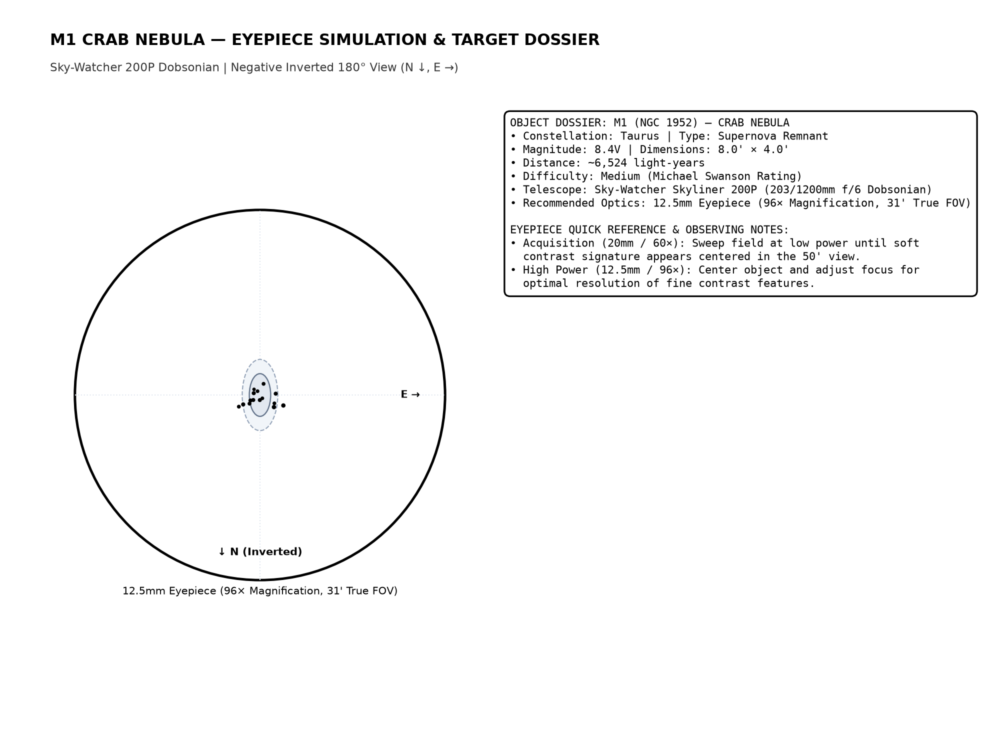

### 2. Constellation Context & Regional Orientation Chart
> [!TIP]
> **Viewport Context** presents a wide ~50°–65° naked-eye orientation field (stars down to visual magnitude 6.5) with official IAU constellation guide lines. The dashed bounding box marks the exact area covered by the wide-field star-hopping chart below.

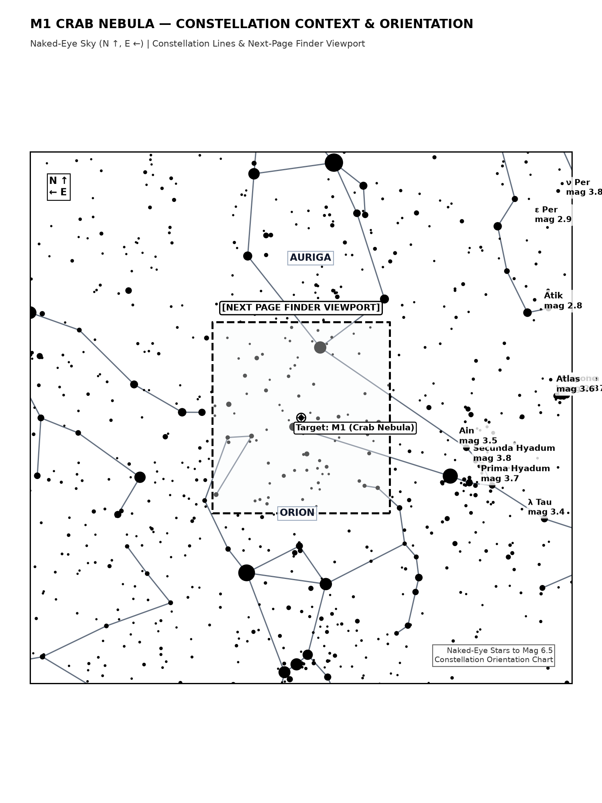

### 3. Wide-Field Star-Hopping Finder Chart
> [!IMPORTANT]
> **Viewport A** provides an upright naked-eye / optical finder orientation (N ↑, E ←) with stars down to visual magnitude 8.5. Standard concentric Telrad rings (0.5°, 2.0°, 4.0°) and 5.0° finder circle are centered directly on the target.

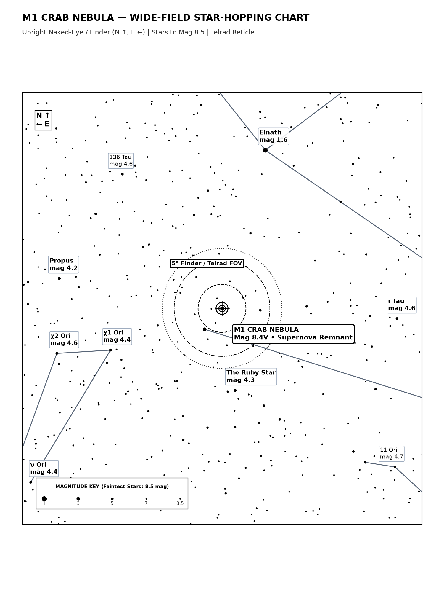

*([📄 Open Full High-Resolution Master A4 Finder Chart](shared/m1/chart_skywatcher-skyliner-200p.png))*

### 4. Observing Strategy & Step-by-Step Hop Instructions

- **Acquisition & Framing (20mm Super / 60×, 50' FOV)**:
  Ghostly oval smudge floating ~1.1° northwest of Tianguan (ζ Tauri); distinctive diffuse envelope stands out from faint field stars.
- **High-Power Inspection & Detail (12.5mm / 96×, 31' FOV)**:
  Careful examination at 96× reveals subtle brightness variations across the 6' × 4' elliptical cloud and irregular, ragged outer boundaries.

**Step-by-Step Star Hop Narrative**:
From Aldebaran, trace Taurus's horns northeast to Tianguan (ζ Tau, mag 3.0). Slew 1.1° northwest into the finder field; M1 floats right beside a 6th-magnitude field star.

---

## M2 (NGC 7089) — Aquarius

[↑ Back to Catalog Index](#messier-catalog-index) • [← Previous: M1](#m1) • [Next: M3 →](#m3)

| Technical Parameter | Specification |
| :--- | :--- |
| **Designation** | M2 (NGC 7089) |
| **Constellation** | Aquarius |
| **Classification** | Globular Cluster (GC) |
| **Visual Magnitude ($V$)** | 6.6 mag |
| **Apparent Dimensions** | 16.0' × 16.0' |
| **Estimated Distance** | ~39,144 light-years |
| **Swanson Difficulty** | **Easy** (*NexStar User's Guide II*) |
| **Coordinates (J2000)** | RA **21h 33m 27.0s** • Dec **-0° 49' 23.7"** |
| **Recommended Eyepiece** | 20mm (60× magnification, 49' TFOV, 3.4mm exit pupil) |

### 1. Telescope Eyepiece Simulation & Technical Dossier
> [!NOTE]
> **Viewport B** depicts the pre-inverted 180° field view through the Newtonian reflector (20mm eyepiece / 60× magnification, 49' true field of view: South at top, West at left, N ↓, E →). **Viewport C** integrates target ephemeris and optical notes.

### 2. Constellation Context & Regional Orientation Chart
> [!TIP]
> **Viewport Context** presents a wide ~50°–65° naked-eye orientation field (stars down to visual magnitude 6.5) with official IAU constellation guide lines. The dashed bounding box marks the exact area covered by the wide-field star-hopping chart below.

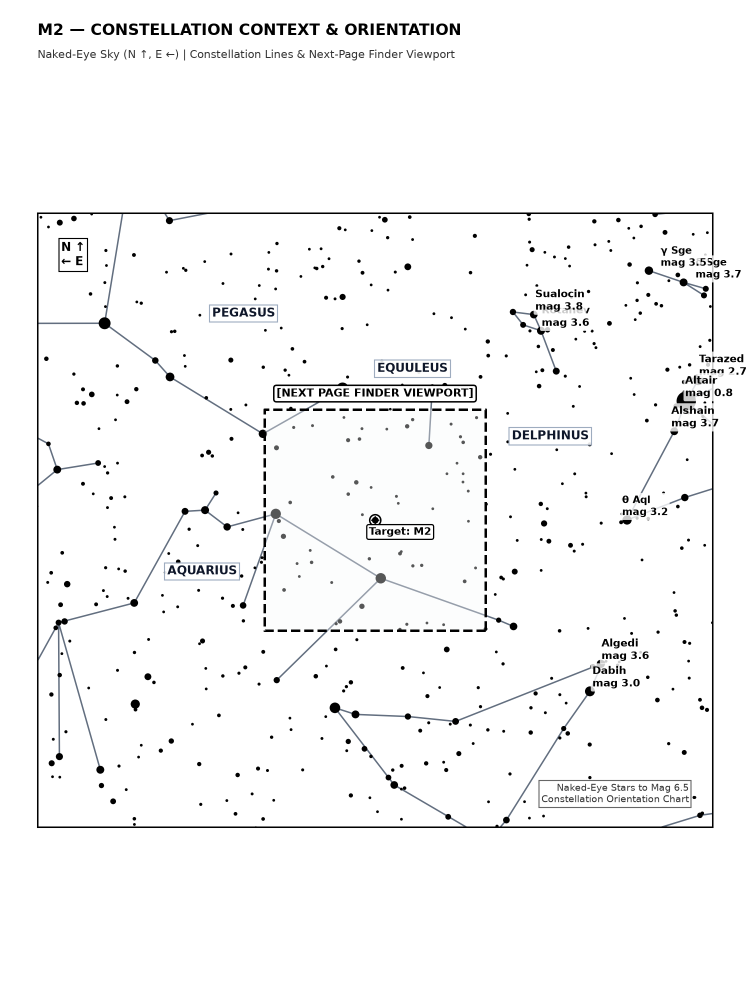

### 3. Wide-Field Star-Hopping Finder Chart
> [!IMPORTANT]
> **Viewport A** provides an upright naked-eye / optical finder orientation (N ↑, E ←) with stars down to visual magnitude 8.5. Standard concentric Telrad rings (0.5°, 2.0°, 4.0°) and 5.0° finder circle are centered directly on the target.

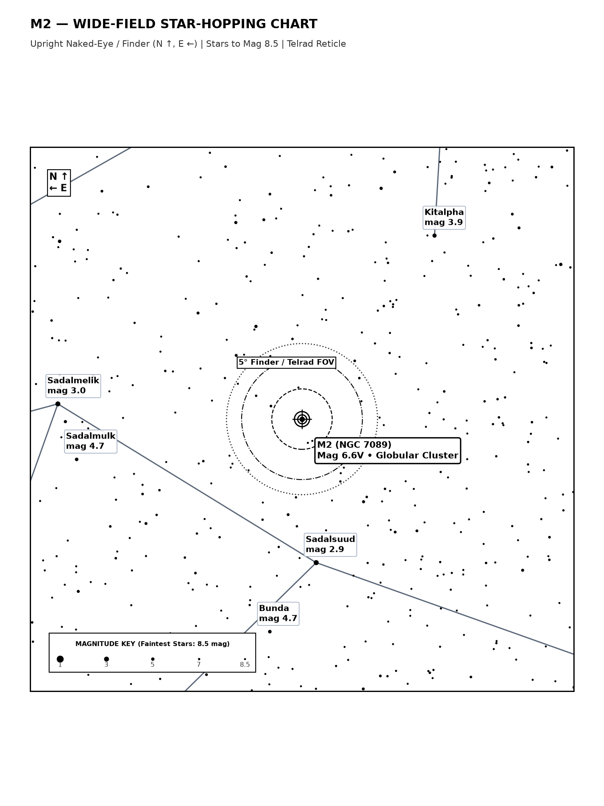

*([📄 Open Full High-Resolution Master A4 Finder Chart](shared/m2/chart_skywatcher-skyliner-200p.png))*

### 4. Observing Strategy & Step-by-Step Hop Instructions

- **Acquisition & Framing (20mm Super / 60×, 50' FOV)**:
  Noticeable circular misty ball with bright concentrated core floating against a dark starry backdrop in Aquarius.
- **High-Power Inspection & Detail (20mm / 60×, 49' FOV)**:
  20mm (60×) resolves the outer edges into sharp, glittering diamond star points; averted vision reveals rich granularity across the core.

**Step-by-Step Star Hop Narrative**:
Locate anchor constellation Aquarius on the Context Chart. Slew Telrad reticle to RA 323.36°, Dec -0.82° and center the fuzzy ball in the 20mm finder eyepiece.

---

## M3 (NGC 5272) — Canes Venatici

[↑ Back to Catalog Index](#messier-catalog-index) • [← Previous: M2](#m2) • [Next: M4 →](#m4)

| Technical Parameter | Specification |
| :--- | :--- |
| **Designation** | M3 (NGC 5272) |
| **Constellation** | Canes Venatici |
| **Classification** | Globular Cluster (GC) |
| **Visual Magnitude ($V$)** | 6.3 mag |
| **Apparent Dimensions** | 18.0' × 18.0' |
| **Estimated Distance** | ~32,620 light-years |
| **Swanson Difficulty** | **Easy** (*NexStar User's Guide II*) |
| **Coordinates (J2000)** | RA **13h 42m 11.6s** • Dec **+28° 22' 38.2"** |
| **Recommended Eyepiece** | 20mm (60× magnification, 49' TFOV, 3.4mm exit pupil) |

### 1. Telescope Eyepiece Simulation & Technical Dossier
> [!NOTE]
> **Viewport B** depicts the pre-inverted 180° field view through the Newtonian reflector (20mm eyepiece / 60× magnification, 49' true field of view: South at top, West at left, N ↓, E →). **Viewport C** integrates target ephemeris and optical notes.

### 2. Constellation Context & Regional Orientation Chart
> [!TIP]
> **Viewport Context** presents a wide ~50°–65° naked-eye orientation field (stars down to visual magnitude 6.5) with official IAU constellation guide lines. The dashed bounding box marks the exact area covered by the wide-field star-hopping chart below.

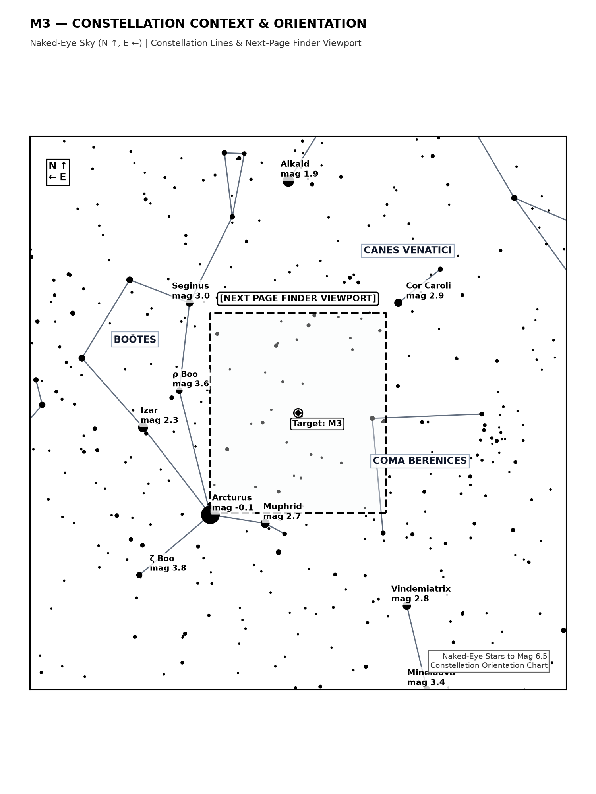

### 3. Wide-Field Star-Hopping Finder Chart
> [!IMPORTANT]
> **Viewport A** provides an upright naked-eye / optical finder orientation (N ↑, E ←) with stars down to visual magnitude 8.5. Standard concentric Telrad rings (0.5°, 2.0°, 4.0°) and 5.0° finder circle are centered directly on the target.

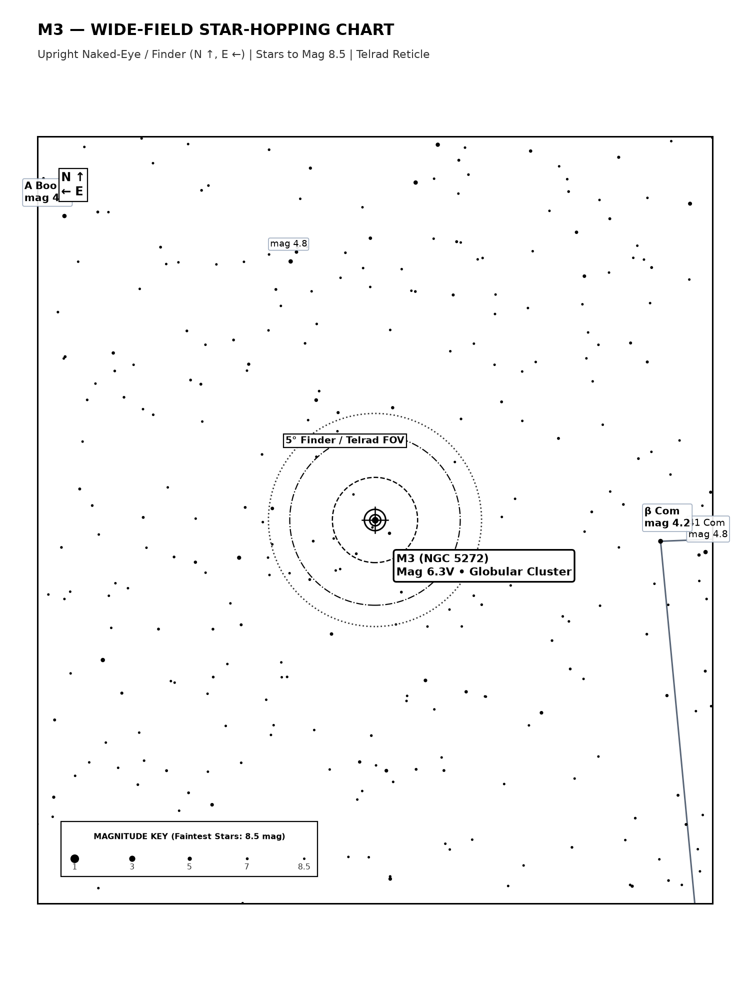

*([📄 Open Full High-Resolution Master A4 Finder Chart](shared/m3/chart_skywatcher-skyliner-200p.png))*

### 4. Observing Strategy & Step-by-Step Hop Instructions

- **Acquisition & Framing (20mm Super / 60×, 50' FOV)**:
  Noticeable circular misty ball with bright concentrated core floating against a dark starry backdrop in Canes Venatici.
- **High-Power Inspection & Detail (20mm / 60×, 49' FOV)**:
  20mm (60×) resolves the outer edges into sharp, glittering diamond star points; averted vision reveals rich granularity across the core.

**Step-by-Step Star Hop Narrative**:
Locate anchor constellation Canes Venatici on the Context Chart. Slew Telrad reticle to RA 205.55°, Dec 28.38° and center the fuzzy ball in the 20mm finder eyepiece.

---

## M4 (NGC 6121) — Scorpius

[↑ Back to Catalog Index](#messier-catalog-index) • [← Previous: M3](#m3) • [Next: M5 →](#m5)

| Technical Parameter | Specification |
| :--- | :--- |
| **Designation** | M4 (NGC 6121) |
| **Constellation** | Scorpius |
| **Classification** | Globular Cluster (GC) |
| **Visual Magnitude ($V$)** | 5.4 mag |
| **Apparent Dimensions** | 26.0' × 26.0' |
| **Estimated Distance** | ~7,176 light-years |
| **Swanson Difficulty** | **Medium** (*NexStar User's Guide II*) |
| **Coordinates (J2000)** | RA **16h 23m 35.2s** • Dec **-26° 31' 32.7"** |
| **Recommended Eyepiece** | 20mm (60× magnification, 49' TFOV, 3.4mm exit pupil) |

### 1. Telescope Eyepiece Simulation & Technical Dossier
> [!NOTE]
> **Viewport B** depicts the pre-inverted 180° field view through the Newtonian reflector (20mm eyepiece / 60× magnification, 49' true field of view: South at top, West at left, N ↓, E →). **Viewport C** integrates target ephemeris and optical notes.

### 2. Constellation Context & Regional Orientation Chart
> [!TIP]
> **Viewport Context** presents a wide ~50°–65° naked-eye orientation field (stars down to visual magnitude 6.5) with official IAU constellation guide lines. The dashed bounding box marks the exact area covered by the wide-field star-hopping chart below.

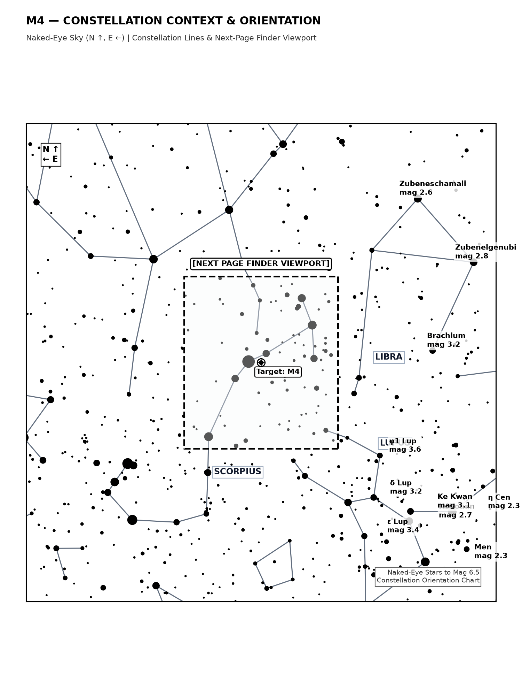

### 3. Wide-Field Star-Hopping Finder Chart
> [!IMPORTANT]
> **Viewport A** provides an upright naked-eye / optical finder orientation (N ↑, E ←) with stars down to visual magnitude 8.5. Standard concentric Telrad rings (0.5°, 2.0°, 4.0°) and 5.0° finder circle are centered directly on the target.

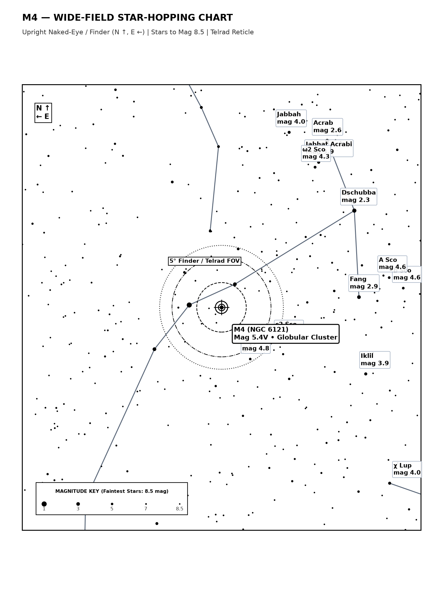

*([📄 Open Full High-Resolution Master A4 Finder Chart](shared/m4/chart_skywatcher-skyliner-200p.png))*

### 4. Observing Strategy & Step-by-Step Hop Instructions

- **Acquisition & Framing (20mm Super / 60×, 50' FOV)**:
  Noticeable circular misty ball with bright concentrated core floating against a dark starry backdrop in Scorpius.
- **High-Power Inspection & Detail (20mm / 60×, 49' FOV)**:
  20mm (60×) resolves the outer edges into sharp, glittering diamond star points; averted vision reveals rich granularity across the core.

**Step-by-Step Star Hop Narrative**:
Locate anchor constellation Scorpius on the Context Chart. Slew Telrad reticle to RA 245.90°, Dec -26.53° and center the fuzzy ball in the 20mm finder eyepiece.

---

## M5 (NGC 5904) — Serpens

[↑ Back to Catalog Index](#messier-catalog-index) • [← Previous: M4](#m4) • [Next: M6 →](#m6)

| Technical Parameter | Specification |
| :--- | :--- |
| **Designation** | M5 (NGC 5904) |
| **Constellation** | Serpens |
| **Classification** | Globular Cluster (GC) |
| **Visual Magnitude ($V$)** | 5.7 mag |
| **Apparent Dimensions** | 23.0' × 23.0' |
| **Estimated Distance** | ~24,465 light-years |
| **Swanson Difficulty** | **Easy** (*NexStar User's Guide II*) |
| **Coordinates (J2000)** | RA **15h 18m 33.2s** • Dec **+2° 04' 51.7"** |
| **Recommended Eyepiece** | 20mm (60× magnification, 49' TFOV, 3.4mm exit pupil) |

### 1. Telescope Eyepiece Simulation & Technical Dossier
> [!NOTE]
> **Viewport B** depicts the pre-inverted 180° field view through the Newtonian reflector (20mm eyepiece / 60× magnification, 49' true field of view: South at top, West at left, N ↓, E →). **Viewport C** integrates target ephemeris and optical notes.

### 2. Constellation Context & Regional Orientation Chart
> [!TIP]
> **Viewport Context** presents a wide ~50°–65° naked-eye orientation field (stars down to visual magnitude 6.5) with official IAU constellation guide lines. The dashed bounding box marks the exact area covered by the wide-field star-hopping chart below.

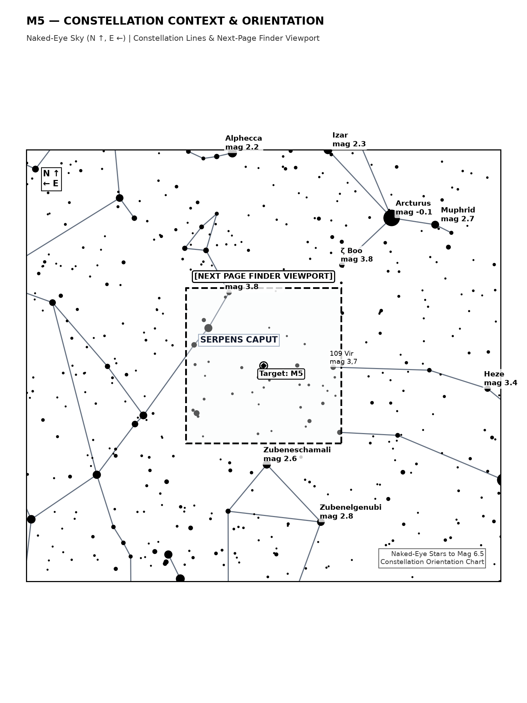

### 3. Wide-Field Star-Hopping Finder Chart
> [!IMPORTANT]
> **Viewport A** provides an upright naked-eye / optical finder orientation (N ↑, E ←) with stars down to visual magnitude 8.5. Standard concentric Telrad rings (0.5°, 2.0°, 4.0°) and 5.0° finder circle are centered directly on the target.

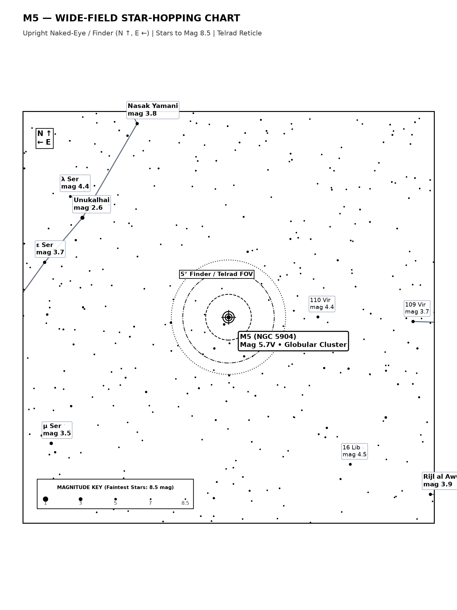

*([📄 Open Full High-Resolution Master A4 Finder Chart](shared/m5/chart_skywatcher-skyliner-200p.png))*

### 4. Observing Strategy & Step-by-Step Hop Instructions

- **Acquisition & Framing (20mm Super / 60×, 50' FOV)**:
  Noticeable circular misty ball with bright concentrated core floating against a dark starry backdrop in Serpens.
- **High-Power Inspection & Detail (20mm / 60×, 49' FOV)**:
  20mm (60×) resolves the outer edges into sharp, glittering diamond star points; averted vision reveals rich granularity across the core.

**Step-by-Step Star Hop Narrative**:
Locate anchor constellation Serpens on the Context Chart. Slew Telrad reticle to RA 229.64°, Dec 2.08° and center the fuzzy ball in the 20mm finder eyepiece.

---

## M6 Butterfly Cluster (NGC 6405) — Scorpius

[↑ Back to Catalog Index](#messier-catalog-index) • [← Previous: M5](#m5) • [Next: M7 →](#m7)

| Technical Parameter | Specification |
| :--- | :--- |
| **Designation** | M6 (NGC 6405) |
| **Common Name** | **Butterfly Cluster** |
| **Constellation** | Scorpius |
| **Classification** | Open Cluster (OC) |
| **Visual Magnitude ($V$)** | 4.2 mag |
| **Apparent Dimensions** | 25.0' × 25.0' |
| **Estimated Distance** | ~1601 light-years |
| **Swanson Difficulty** | **Easy** (*NexStar User's Guide II*) |
| **Coordinates (J2000)** | RA **17h 40m 19.9s** • Dec **-32° 15' 10.8"** |
| **Recommended Eyepiece** | 20mm (60× magnification, 49' TFOV, 3.4mm exit pupil) |

### 1. Telescope Eyepiece Simulation & Technical Dossier
> [!NOTE]
> **Viewport B** depicts the pre-inverted 180° field view through the Newtonian reflector (20mm eyepiece / 60× magnification, 49' true field of view: South at top, West at left, N ↓, E →). **Viewport C** integrates target ephemeris and optical notes.

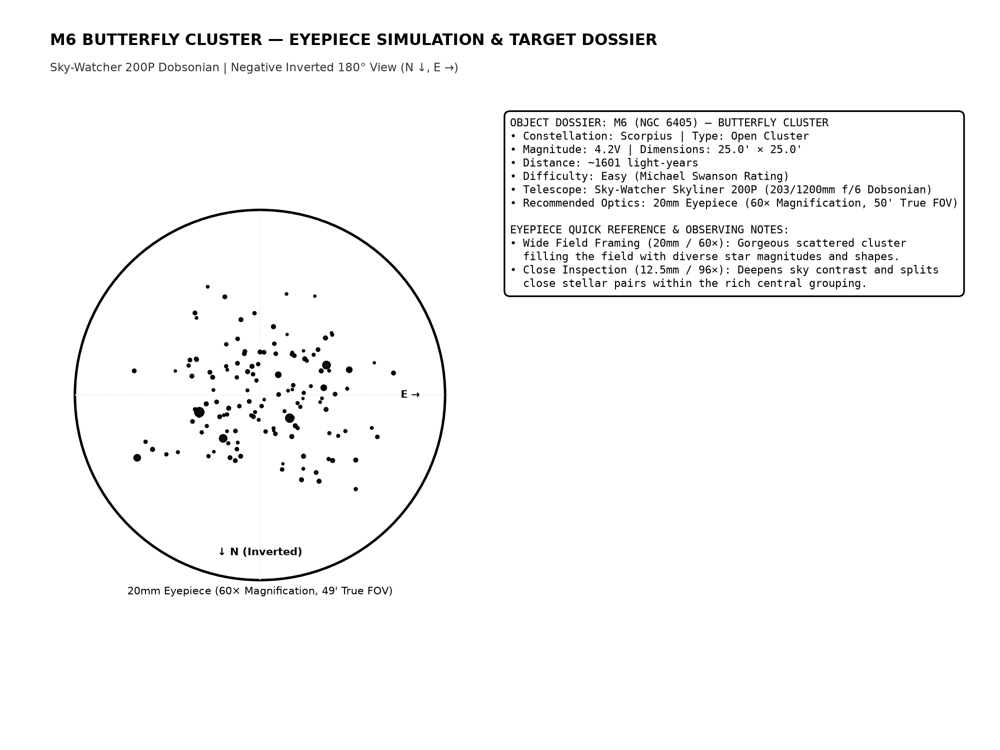

### 2. Constellation Context & Regional Orientation Chart
> [!TIP]
> **Viewport Context** presents a wide ~50°–65° naked-eye orientation field (stars down to visual magnitude 6.5) with official IAU constellation guide lines. The dashed bounding box marks the exact area covered by the wide-field star-hopping chart below.

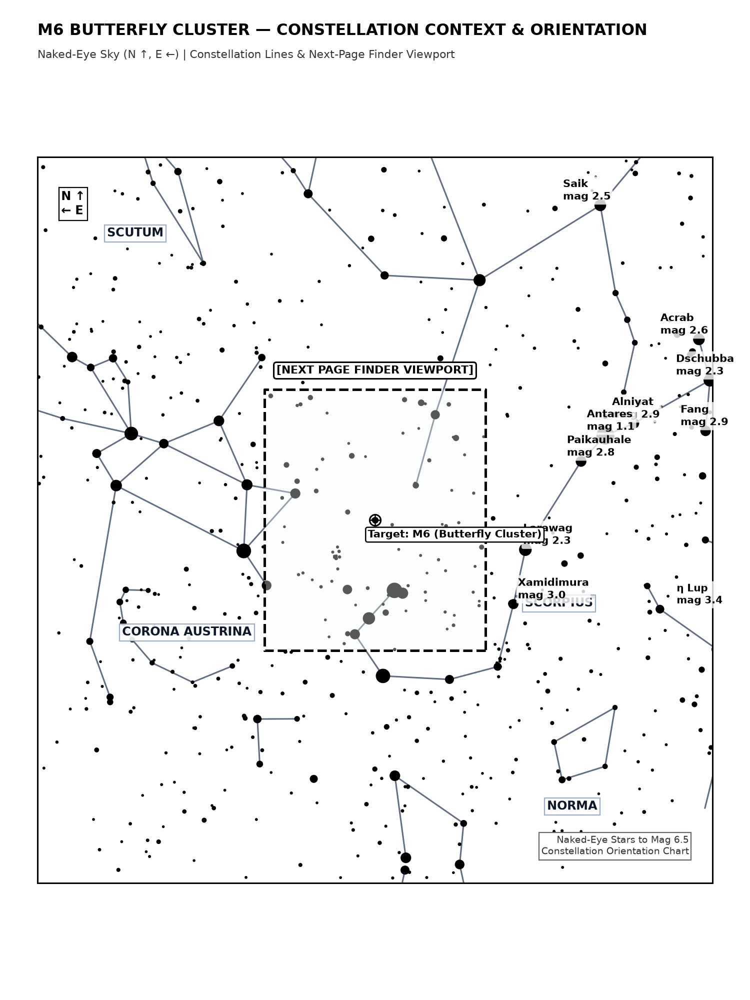

### 3. Wide-Field Star-Hopping Finder Chart
> [!IMPORTANT]
> **Viewport A** provides an upright naked-eye / optical finder orientation (N ↑, E ←) with stars down to visual magnitude 8.5. Standard concentric Telrad rings (0.5°, 2.0°, 4.0°) and 5.0° finder circle are centered directly on the target.

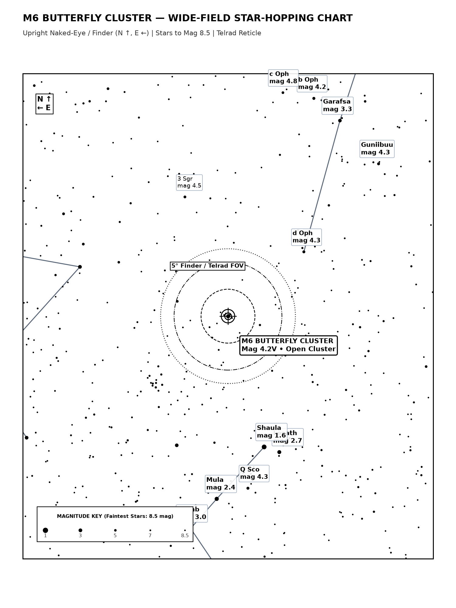

*([📄 Open Full High-Resolution Master A4 Finder Chart](shared/m6/chart_skywatcher-skyliner-200p.png))*

### 4. Observing Strategy & Step-by-Step Hop Instructions

- **Acquisition & Framing (20mm Super / 60×, 50' FOV)**:
  Gorgeous scattered star cluster filling the field with diverse stellar magnitudes and pleasing geometric groupings.
- **High-Power Inspection & Detail (20mm / 60×, 49' FOV)**:
  20mm (60×) deepens sky contrast and splits intimate stellar pairs and chains within the rich central grouping.

**Step-by-Step Star Hop Narrative**:
Locate Scorpius via Context Chart. Align Telrad reticle to target coordinates (RA 265.08°, Dec -32.25°); cluster stars emerge immediately in the finder.

---

## M7 Ptolemy¹s Cluster (NGC 6475) — Scorpius

[↑ Back to Catalog Index](#messier-catalog-index) • [← Previous: M6](#m6) • [Next: M8 →](#m8)

| Technical Parameter | Specification |
| :--- | :--- |
| **Designation** | M7 (NGC 6475) |
| **Common Name** | **Ptolemy¹s Cluster** |
| **Constellation** | Scorpius |
| **Classification** | Open Cluster (OC) |
| **Visual Magnitude ($V$)** | 3.3 mag |
| **Apparent Dimensions** | 80.0' × 80.0' |
| **Estimated Distance** | ~978 light-years |
| **Swanson Difficulty** | **Easy** (*NexStar User's Guide II*) |
| **Coordinates (J2000)** | RA **17h 53m 51.1s** • Dec **-34° 47' 34.8"** |
| **Recommended Eyepiece** | 20mm (60× magnification, 49' TFOV, 3.4mm exit pupil) |

### 1. Telescope Eyepiece Simulation & Technical Dossier
> [!NOTE]
> **Viewport B** depicts the pre-inverted 180° field view through the Newtonian reflector (20mm eyepiece / 60× magnification, 49' true field of view: South at top, West at left, N ↓, E →). **Viewport C** integrates target ephemeris and optical notes.

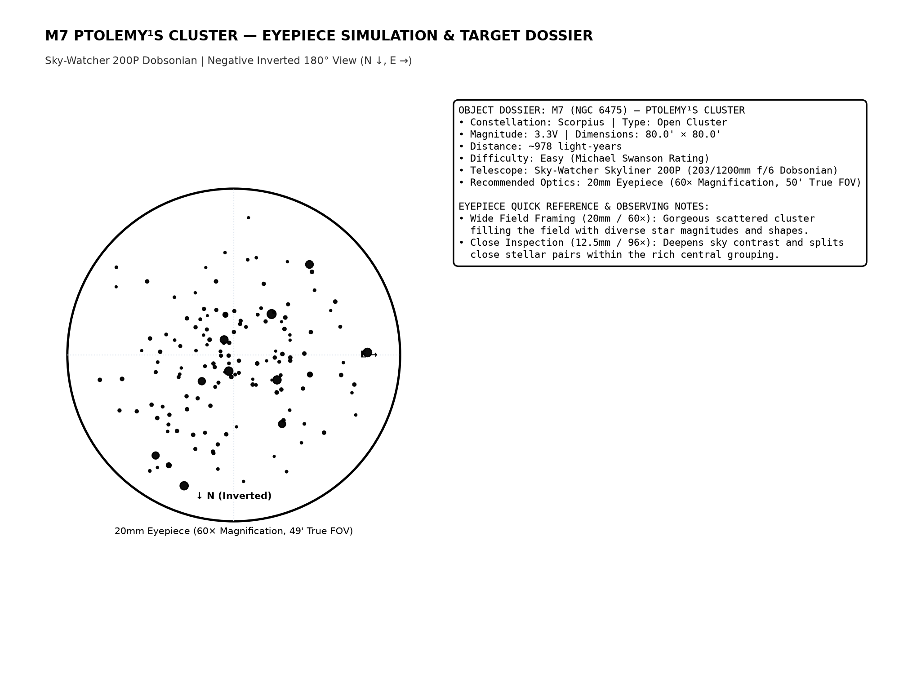

### 2. Constellation Context & Regional Orientation Chart
> [!TIP]
> **Viewport Context** presents a wide ~50°–65° naked-eye orientation field (stars down to visual magnitude 6.5) with official IAU constellation guide lines. The dashed bounding box marks the exact area covered by the wide-field star-hopping chart below.

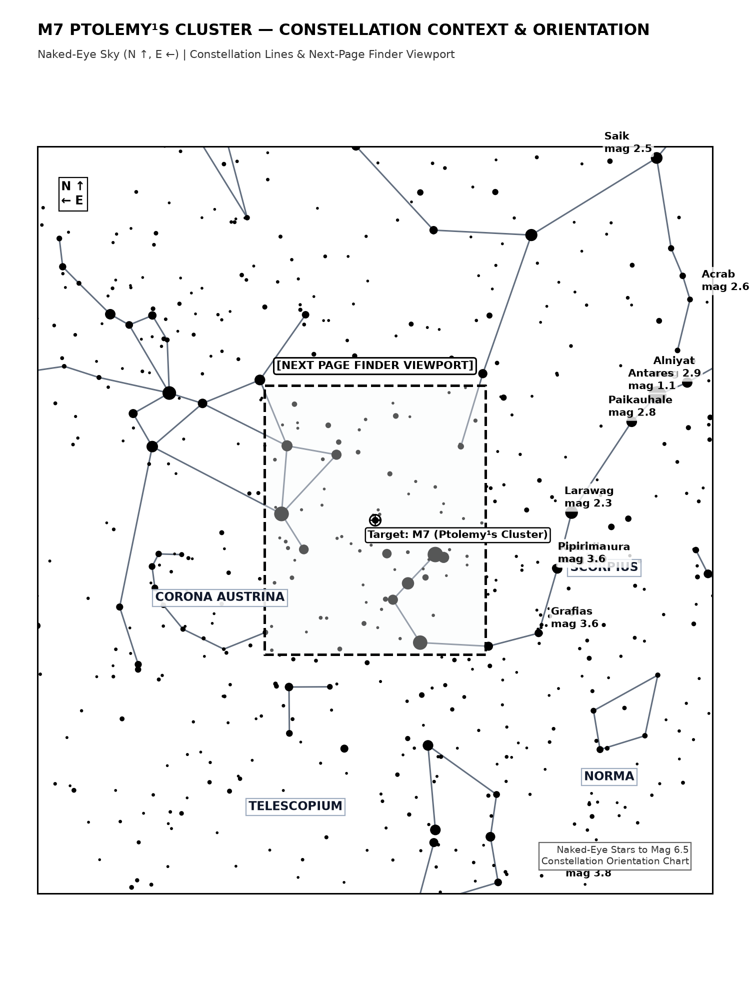

### 3. Wide-Field Star-Hopping Finder Chart
> [!IMPORTANT]
> **Viewport A** provides an upright naked-eye / optical finder orientation (N ↑, E ←) with stars down to visual magnitude 8.5. Standard concentric Telrad rings (0.5°, 2.0°, 4.0°) and 5.0° finder circle are centered directly on the target.

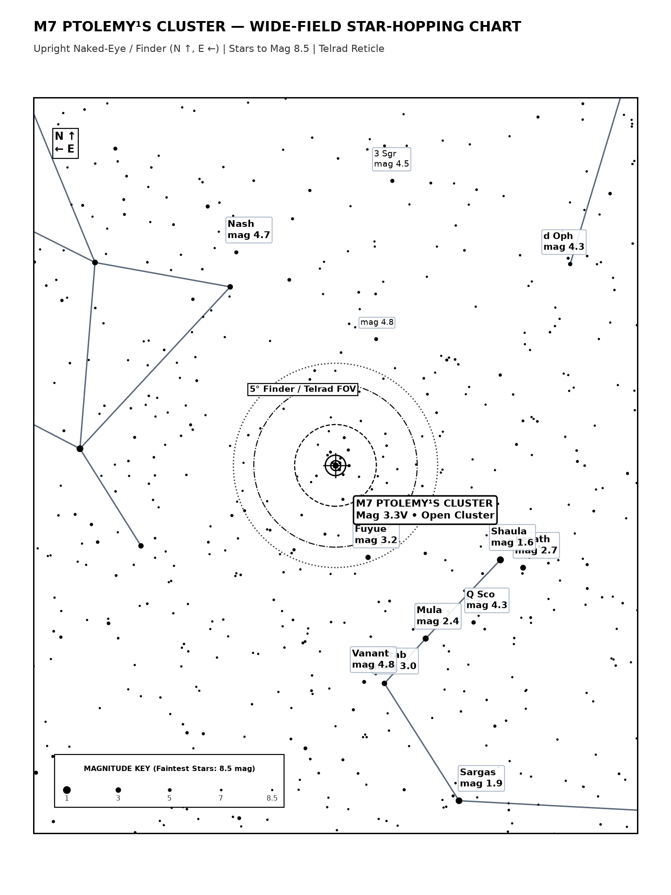

*([📄 Open Full High-Resolution Master A4 Finder Chart](shared/m7/chart_skywatcher-skyliner-200p.png))*

### 4. Observing Strategy & Step-by-Step Hop Instructions

- **Acquisition & Framing (20mm Super / 60×, 50' FOV)**:
  Gorgeous scattered star cluster filling the field with diverse stellar magnitudes and pleasing geometric groupings.
- **High-Power Inspection & Detail (20mm / 60×, 49' FOV)**:
  20mm (60×) deepens sky contrast and splits intimate stellar pairs and chains within the rich central grouping.

**Step-by-Step Star Hop Narrative**:
Locate Scorpius via Context Chart. Align Telrad reticle to target coordinates (RA 268.46°, Dec -34.79°); cluster stars emerge immediately in the finder.

---

## M8 Lagoon Nebula (NGC 6523) — Sagittarius

[↑ Back to Catalog Index](#messier-catalog-index) • [← Previous: M7](#m7) • [Next: M9 →](#m9)

| Technical Parameter | Specification |
| :--- | :--- |
| **Designation** | M8 (NGC 6523) |
| **Common Name** | **Lagoon Nebula** |
| **Constellation** | Sagittarius |
| **Classification** | Diffuse Nebula (Nebula) |
| **Visual Magnitude ($V$)** | 6.0 mag |
| **Apparent Dimensions** | 90.0' × 40.0' |
| **Estimated Distance** | ~4,077 light-years |
| **Swanson Difficulty** | **Medium** (*NexStar User's Guide II*) |
| **Coordinates (J2000)** | RA **18h 03m 37.0s** • Dec **-24° 22' 40.8"** |
| **Recommended Eyepiece** | 20mm (60× magnification, 49' TFOV, 3.4mm exit pupil) |

### 1. Telescope Eyepiece Simulation & Technical Dossier
> [!NOTE]
> **Viewport B** depicts the pre-inverted 180° field view through the Newtonian reflector (20mm eyepiece / 60× magnification, 49' true field of view: South at top, West at left, N ↓, E →). **Viewport C** integrates target ephemeris and optical notes.

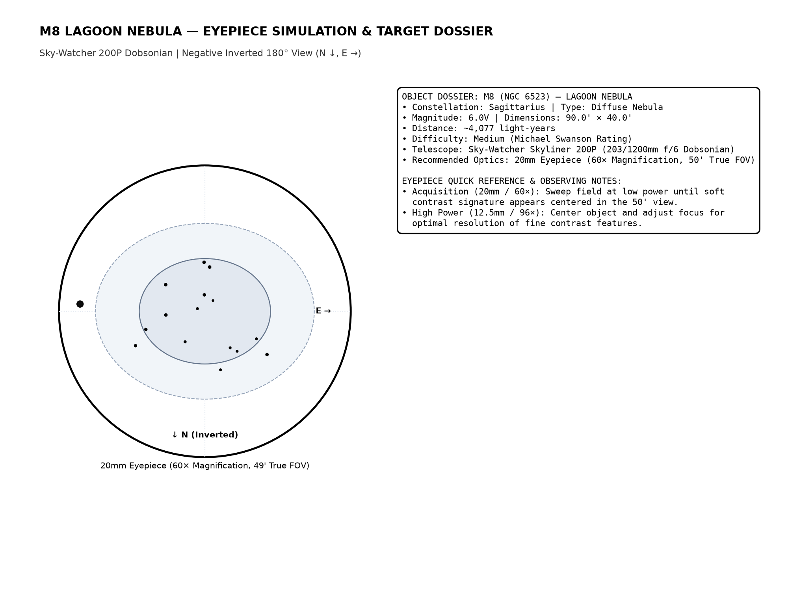

### 2. Constellation Context & Regional Orientation Chart
> [!TIP]
> **Viewport Context** presents a wide ~50°–65° naked-eye orientation field (stars down to visual magnitude 6.5) with official IAU constellation guide lines. The dashed bounding box marks the exact area covered by the wide-field star-hopping chart below.

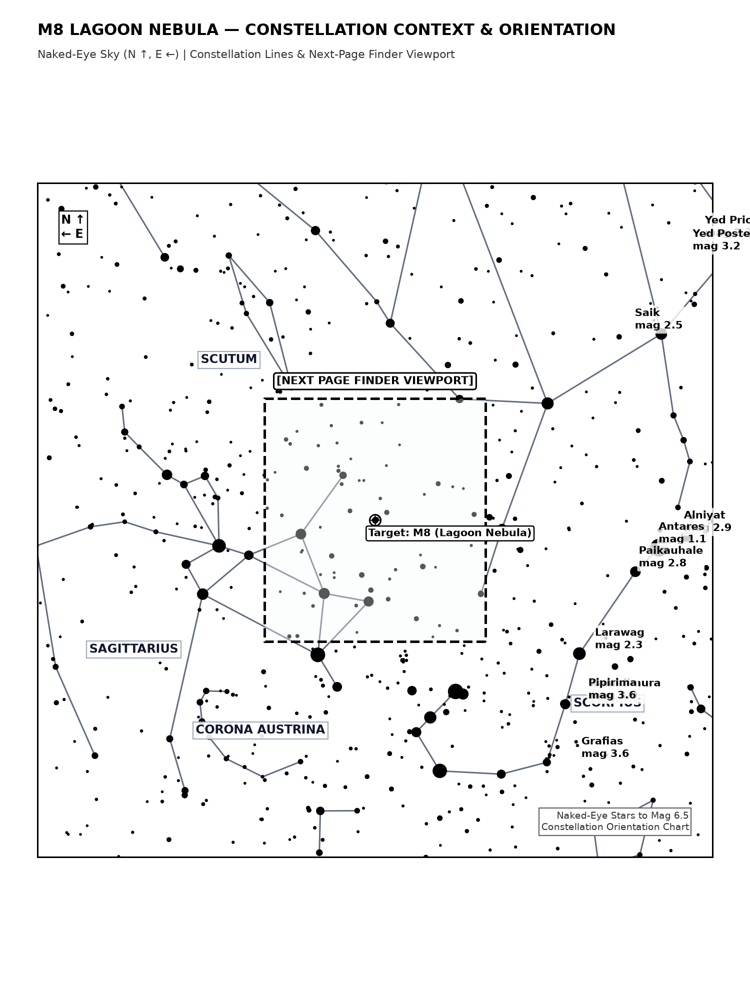

### 3. Wide-Field Star-Hopping Finder Chart
> [!IMPORTANT]
> **Viewport A** provides an upright naked-eye / optical finder orientation (N ↑, E ←) with stars down to visual magnitude 8.5. Standard concentric Telrad rings (0.5°, 2.0°, 4.0°) and 5.0° finder circle are centered directly on the target.

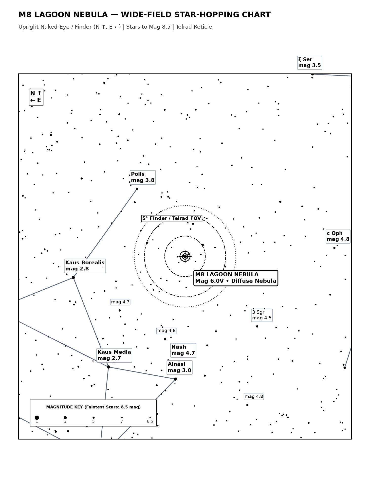

*([📄 Open Full High-Resolution Master A4 Finder Chart](shared/m8/chart_skywatcher-skyliner-200p.png))*

### 4. Observing Strategy & Step-by-Step Hop Instructions

- **Acquisition & Framing (20mm Super / 60×, 50' FOV)**:
  Soft, sprawling contrast signature floating among field stars; best detected by sweeping slowly across the field at 60×.
- **High-Power Inspection & Detail (20mm / 60×, 49' FOV)**:
  20mm (60×) highlights subtle ionization knots, filamentary edges, and embedded star groupings within the glowing cloud.

**Step-by-Step Star Hop Narrative**:
Locate Sagittarius guide stars. Align Telrad reticle to RA 270.90°, Dec -24.38°; sweep gently until nebulous glow fills the field.

---

## M9 (NGC 6333) — Ophiucus

[↑ Back to Catalog Index](#messier-catalog-index) • [← Previous: M8](#m8) • [Next: M10 →](#m10)

| Technical Parameter | Specification |
| :--- | :--- |
| **Designation** | M9 (NGC 6333) |
| **Constellation** | Ophiucus |
| **Classification** | Globular Cluster (GC) |
| **Visual Magnitude ($V$)** | 7.8 mag |
| **Apparent Dimensions** | 12.0' × 12.0' |
| **Estimated Distance** | ~25,769 light-years |
| **Swanson Difficulty** | **Medium** (*NexStar User's Guide II*) |
| **Coordinates (J2000)** | RA **17h 19m 11.8s** • Dec **-18° 30' 58.5"** |
| **Recommended Eyepiece** | 12.5mm (96× magnification, 31' TFOV, 2.1mm exit pupil) |

### 1. Telescope Eyepiece Simulation & Technical Dossier
> [!NOTE]
> **Viewport B** depicts the pre-inverted 180° field view through the Newtonian reflector (12.5mm eyepiece / 96× magnification, 31' true field of view: South at top, West at left, N ↓, E →). **Viewport C** integrates target ephemeris and optical notes.

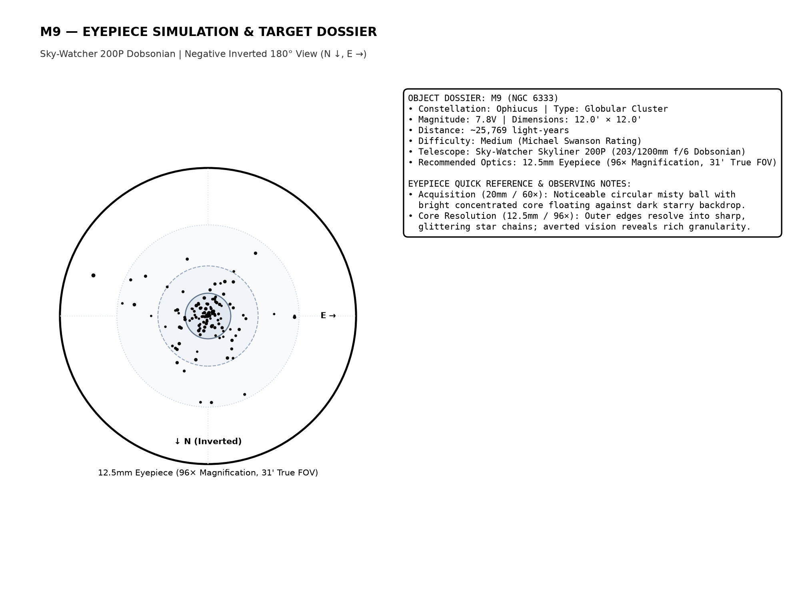

### 2. Constellation Context & Regional Orientation Chart
> [!TIP]
> **Viewport Context** presents a wide ~50°–65° naked-eye orientation field (stars down to visual magnitude 6.5) with official IAU constellation guide lines. The dashed bounding box marks the exact area covered by the wide-field star-hopping chart below.

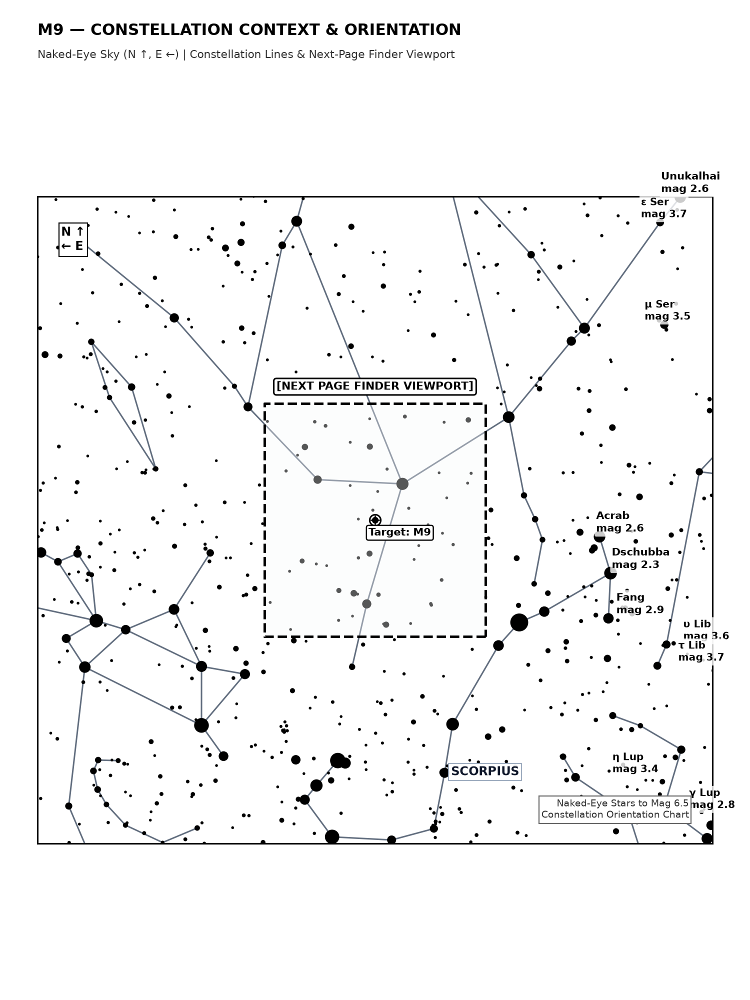

### 3. Wide-Field Star-Hopping Finder Chart
> [!IMPORTANT]
> **Viewport A** provides an upright naked-eye / optical finder orientation (N ↑, E ←) with stars down to visual magnitude 8.5. Standard concentric Telrad rings (0.5°, 2.0°, 4.0°) and 5.0° finder circle are centered directly on the target.

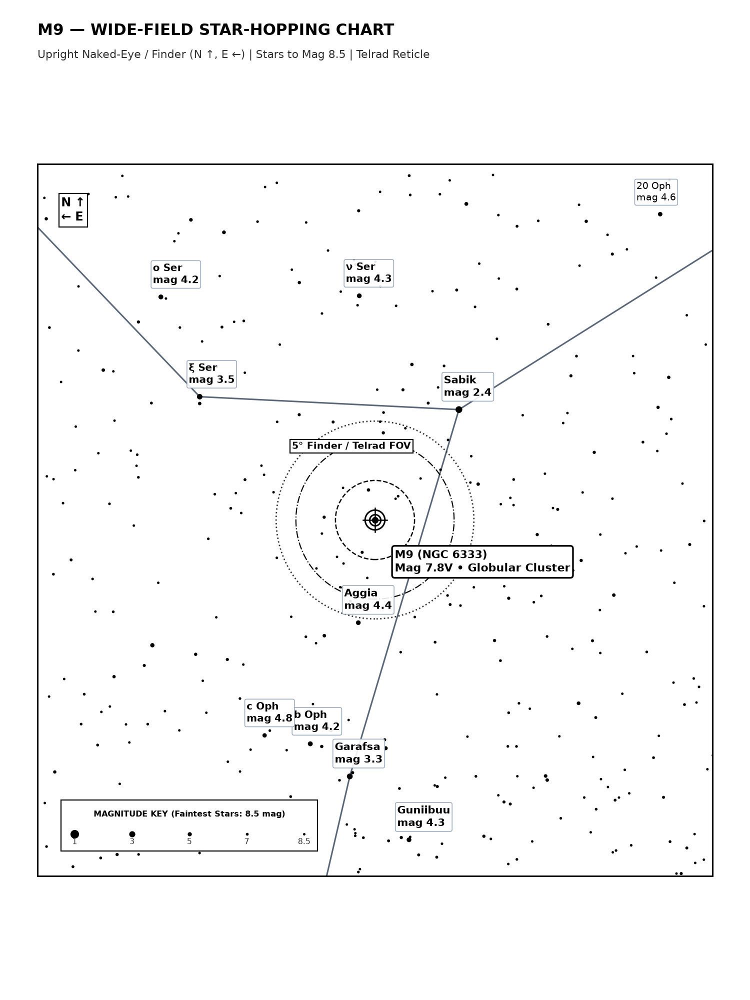

*([📄 Open Full High-Resolution Master A4 Finder Chart](shared/m9/chart_skywatcher-skyliner-200p.png))*

### 4. Observing Strategy & Step-by-Step Hop Instructions

- **Acquisition & Framing (20mm Super / 60×, 50' FOV)**:
  Noticeable circular misty ball with bright concentrated core floating against a dark starry backdrop in Ophiucus.
- **High-Power Inspection & Detail (12.5mm / 96×, 31' FOV)**:
  12.5mm (96×) resolves the outer edges into sharp, glittering diamond star points; averted vision reveals rich granularity across the core.

**Step-by-Step Star Hop Narrative**:
Locate anchor constellation Ophiucus on the Context Chart. Slew Telrad reticle to RA 259.80°, Dec -18.52° and center the fuzzy ball in the 20mm finder eyepiece.

---

## M10 (NGC 6254) — Ophiucus

[↑ Back to Catalog Index](#messier-catalog-index) • [← Previous: M9](#m9) • [Next: M11 →](#m11)

| Technical Parameter | Specification |
| :--- | :--- |
| **Designation** | M10 (NGC 6254) |
| **Constellation** | Ophiucus |
| **Classification** | Globular Cluster (GC) |
| **Visual Magnitude ($V$)** | 6.6 mag |
| **Apparent Dimensions** | 20.0' × 20.0' |
| **Estimated Distance** | ~14,352 light-years |
| **Swanson Difficulty** | **Medium** (*NexStar User's Guide II*) |
| **Coordinates (J2000)** | RA **16h 57m 09.1s** • Dec **-4° 06' 01.1"** |
| **Recommended Eyepiece** | 20mm (60× magnification, 49' TFOV, 3.4mm exit pupil) |

### 1. Telescope Eyepiece Simulation & Technical Dossier
> [!NOTE]
> **Viewport B** depicts the pre-inverted 180° field view through the Newtonian reflector (20mm eyepiece / 60× magnification, 49' true field of view: South at top, West at left, N ↓, E →). **Viewport C** integrates target ephemeris and optical notes.

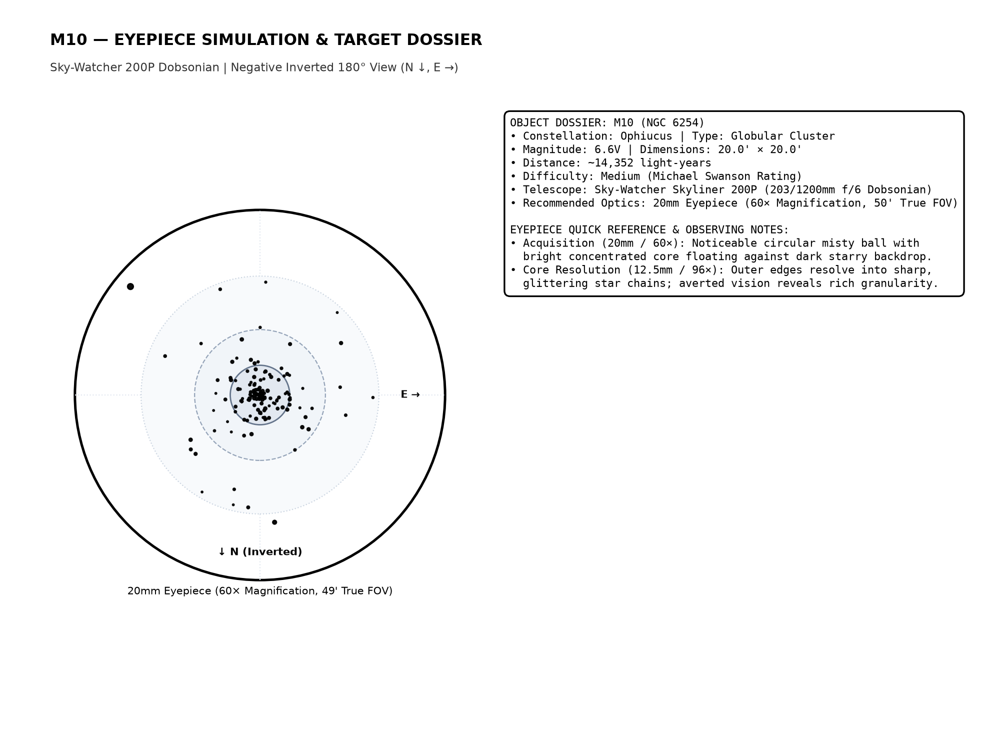

### 2. Constellation Context & Regional Orientation Chart
> [!TIP]
> **Viewport Context** presents a wide ~50°–65° naked-eye orientation field (stars down to visual magnitude 6.5) with official IAU constellation guide lines. The dashed bounding box marks the exact area covered by the wide-field star-hopping chart below.

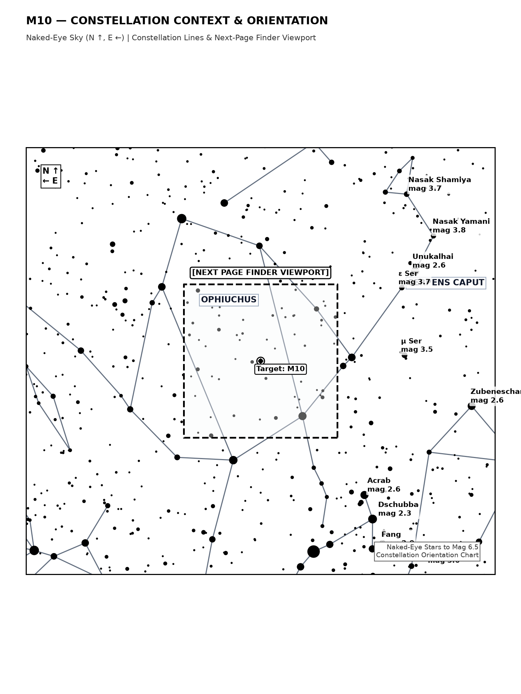

### 3. Wide-Field Star-Hopping Finder Chart
> [!IMPORTANT]
> **Viewport A** provides an upright naked-eye / optical finder orientation (N ↑, E ←) with stars down to visual magnitude 8.5. Standard concentric Telrad rings (0.5°, 2.0°, 4.0°) and 5.0° finder circle are centered directly on the target.

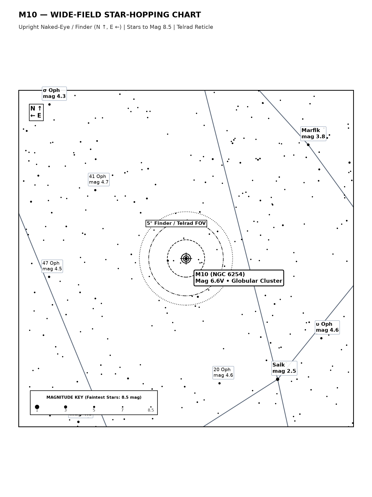

*([📄 Open Full High-Resolution Master A4 Finder Chart](shared/m10/chart_skywatcher-skyliner-200p.png))*

### 4. Observing Strategy & Step-by-Step Hop Instructions

- **Acquisition & Framing (20mm Super / 60×, 50' FOV)**:
  Noticeable circular misty ball with bright concentrated core floating against a dark starry backdrop in Ophiucus.
- **High-Power Inspection & Detail (20mm / 60×, 49' FOV)**:
  20mm (60×) resolves the outer edges into sharp, glittering diamond star points; averted vision reveals rich granularity across the core.

**Step-by-Step Star Hop Narrative**:
Locate anchor constellation Ophiucus on the Context Chart. Slew Telrad reticle to RA 254.29°, Dec -4.10° and center the fuzzy ball in the 20mm finder eyepiece.

---

## M11 Wild Duck Cluster (NGC 6705) — Scutum

[↑ Back to Catalog Index](#messier-catalog-index) • [← Previous: M10](#m10) • [Next: M12 →](#m12)

| Technical Parameter | Specification |
| :--- | :--- |
| **Designation** | M11 (NGC 6705) |
| **Common Name** | **Wild Duck Cluster** |
| **Constellation** | Scutum |
| **Classification** | Open Cluster (OC) |
| **Visual Magnitude ($V$)** | 5.8 mag |
| **Apparent Dimensions** | 14.0' × 14.0' |
| **Estimated Distance** | ~6,197 light-years |
| **Swanson Difficulty** | **Easy** (*NexStar User's Guide II*) |
| **Coordinates (J2000)** | RA **18h 51m 05.0s** • Dec **-6° 16' 12.0"** |
| **Recommended Eyepiece** | 12.5mm (96× magnification, 31' TFOV, 2.1mm exit pupil) |

### 1. Telescope Eyepiece Simulation & Technical Dossier
> [!NOTE]
> **Viewport B** depicts the pre-inverted 180° field view through the Newtonian reflector (12.5mm eyepiece / 96× magnification, 31' true field of view: South at top, West at left, N ↓, E →). **Viewport C** integrates target ephemeris and optical notes.

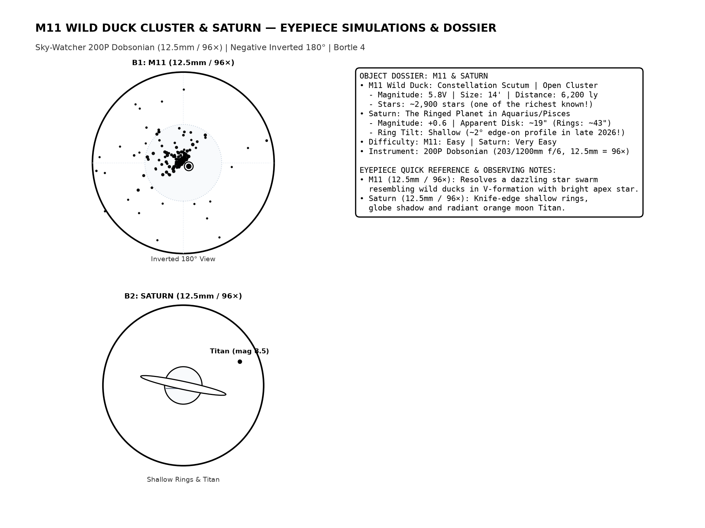

### 2. Constellation Context & Regional Orientation Chart
> [!TIP]
> **Viewport Context** presents a wide ~50°–65° naked-eye orientation field (stars down to visual magnitude 6.5) with official IAU constellation guide lines. The dashed bounding box marks the exact area covered by the wide-field star-hopping chart below.

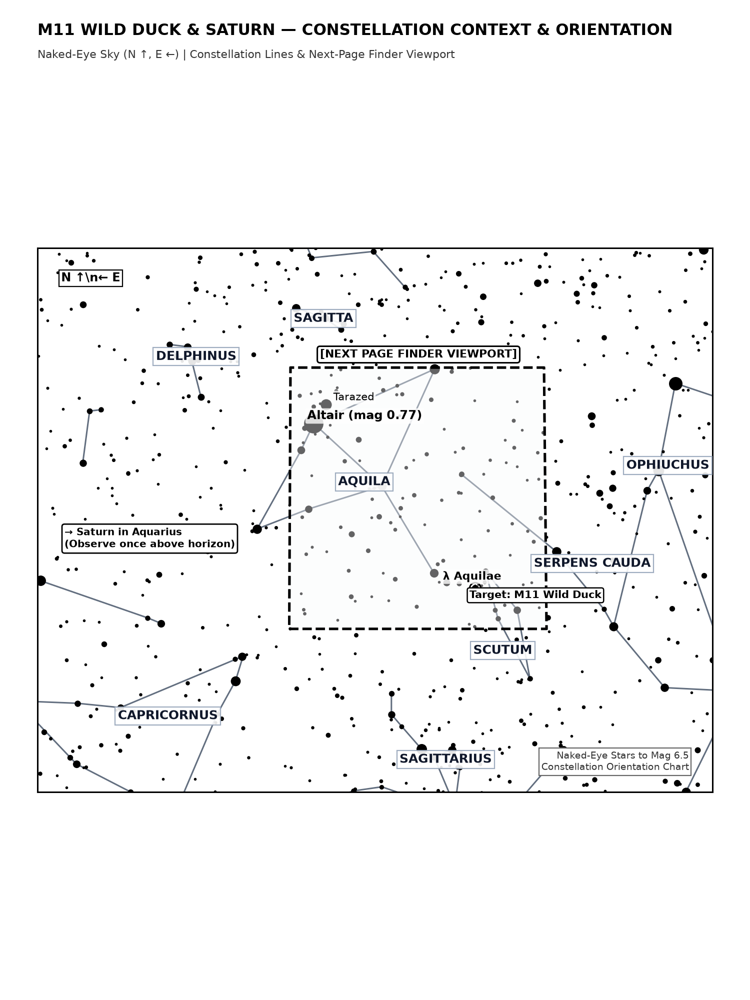

### 3. Wide-Field Star-Hopping Finder Chart
> [!IMPORTANT]
> **Viewport A** provides an upright naked-eye / optical finder orientation (N ↑, E ←) with stars down to visual magnitude 8.5. Standard concentric Telrad rings (0.5°, 2.0°, 4.0°) and 5.0° finder circle are centered directly on the target.

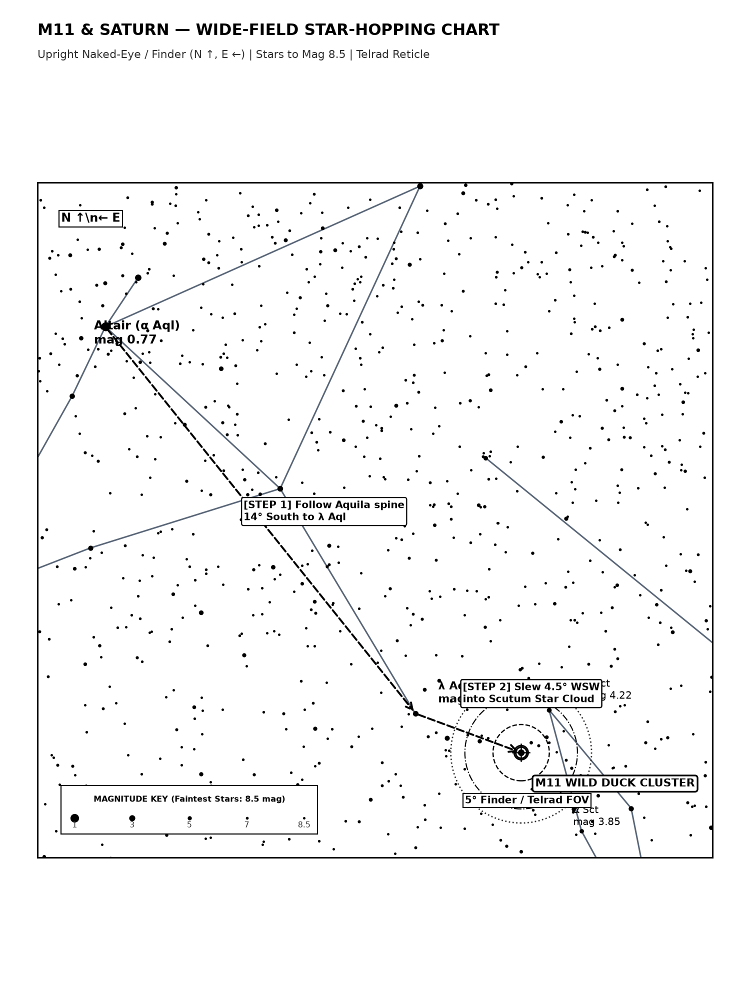

*([📄 Open Full High-Resolution Master A4 Finder Chart](shared/m11/chart_skywatcher-skyliner-200p.png))*

### 4. Observing Strategy & Step-by-Step Hop Instructions

- **Acquisition & Framing (20mm Super / 60×, 50' FOV)**:
  Incredible, compact star swarm resembling a flight of wild ducks in V-formation, anchored by an 8th-magnitude star near the apex.
- **High-Power Inspection & Detail (12.5mm / 96×, 31' FOV)**:
  12.5mm (96×) resolves hundreds of diamond-dust stellar points within the rich Scutum Star Cloud; one of the richest open clusters known (~2,900 member stars).

**Step-by-Step Star Hop Narrative**:
Locate Altair in Aquila. Follow Aquila's backbone 14° South to λ Aquilae (mag 3.4), then slew 4.5° WSW into the glowing Scutum star cloud.

---

## M12 (NGC 6218) — Ophiucus

[↑ Back to Catalog Index](#messier-catalog-index) • [← Previous: M11](#m11) • [Next: M13 →](#m13)

| Technical Parameter | Specification |
| :--- | :--- |
| **Designation** | M12 (NGC 6218) |
| **Constellation** | Ophiucus |
| **Classification** | Globular Cluster (GC) |
| **Visual Magnitude ($V$)** | 6.1 mag |
| **Apparent Dimensions** | 16.0' × 16.0' |
| **Estimated Distance** | ~15,657 light-years |
| **Swanson Difficulty** | **Medium** (*NexStar User's Guide II*) |
| **Coordinates (J2000)** | RA **16h 47m 14.2s** • Dec **-1° 56' 54.7"** |
| **Recommended Eyepiece** | 20mm (60× magnification, 49' TFOV, 3.4mm exit pupil) |

### 1. Telescope Eyepiece Simulation & Technical Dossier
> [!NOTE]
> **Viewport B** depicts the pre-inverted 180° field view through the Newtonian reflector (20mm eyepiece / 60× magnification, 49' true field of view: South at top, West at left, N ↓, E →). **Viewport C** integrates target ephemeris and optical notes.

### 2. Constellation Context & Regional Orientation Chart
> [!TIP]
> **Viewport Context** presents a wide ~50°–65° naked-eye orientation field (stars down to visual magnitude 6.5) with official IAU constellation guide lines. The dashed bounding box marks the exact area covered by the wide-field star-hopping chart below.

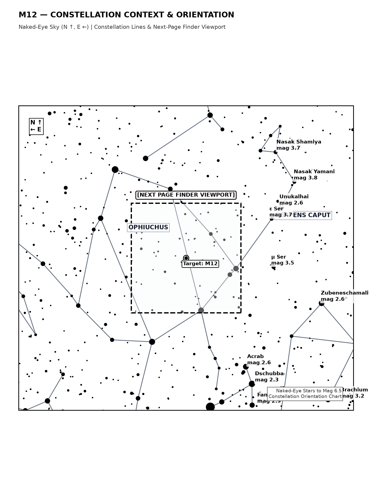

### 3. Wide-Field Star-Hopping Finder Chart
> [!IMPORTANT]
> **Viewport A** provides an upright naked-eye / optical finder orientation (N ↑, E ←) with stars down to visual magnitude 8.5. Standard concentric Telrad rings (0.5°, 2.0°, 4.0°) and 5.0° finder circle are centered directly on the target.

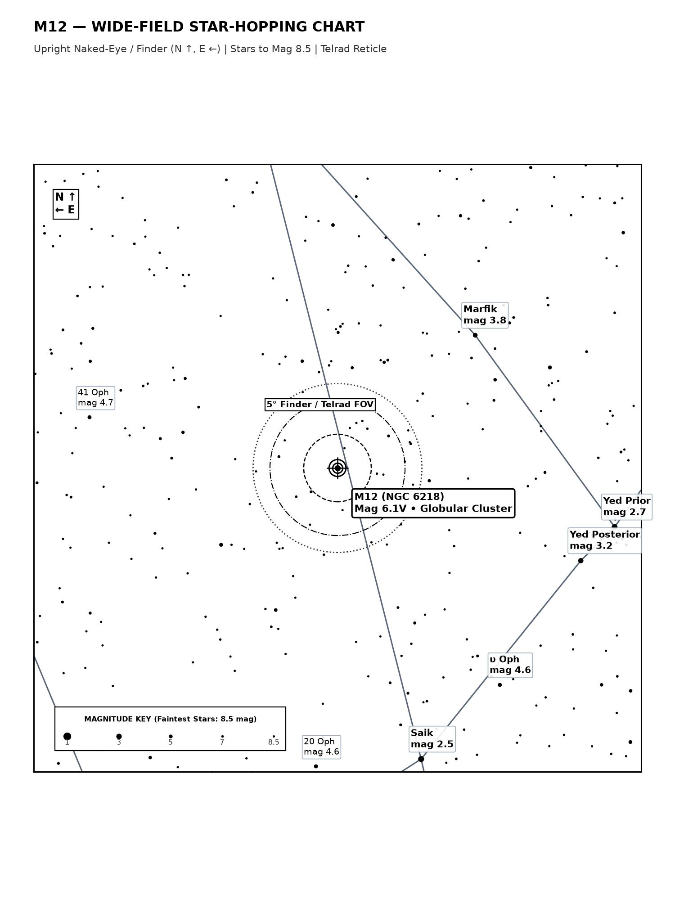

*([📄 Open Full High-Resolution Master A4 Finder Chart](shared/m12/chart_skywatcher-skyliner-200p.png))*

### 4. Observing Strategy & Step-by-Step Hop Instructions

- **Acquisition & Framing (20mm Super / 60×, 50' FOV)**:
  Noticeable circular misty ball with bright concentrated core floating against a dark starry backdrop in Ophiucus.
- **High-Power Inspection & Detail (20mm / 60×, 49' FOV)**:
  20mm (60×) resolves the outer edges into sharp, glittering diamond star points; averted vision reveals rich granularity across the core.

**Step-by-Step Star Hop Narrative**:
Locate anchor constellation Ophiucus on the Context Chart. Slew Telrad reticle to RA 251.81°, Dec -1.95° and center the fuzzy ball in the 20mm finder eyepiece.

---

## M13 Hercules Globular Cluster (NGC 6205) — Hercules

[↑ Back to Catalog Index](#messier-catalog-index) • [← Previous: M12](#m12) • [Next: M14 →](#m14)

| Technical Parameter | Specification |
| :--- | :--- |
| **Designation** | M13 (NGC 6205) |
| **Common Name** | **Hercules Globular Cluster** |
| **Constellation** | Hercules |
| **Classification** | Globular Cluster (GC) |
| **Visual Magnitude ($V$)** | 5.8 mag |
| **Apparent Dimensions** | 20.0' × 7.9' |
| **Estimated Distance** | ~25,117 light-years |
| **Swanson Difficulty** | **Easy** (*NexStar User's Guide II*) |
| **Coordinates (J2000)** | RA **16h 41m 41.6s** • Dec **+36° 27' 40.8"** |
| **Recommended Eyepiece** | 20mm (60× magnification, 49' TFOV, 3.4mm exit pupil) |

### 1. Telescope Eyepiece Simulation & Technical Dossier
> [!NOTE]
> **Viewport B** depicts the pre-inverted 180° field view through the Newtonian reflector (20mm eyepiece / 60× magnification, 49' true field of view: South at top, West at left, N ↓, E →). **Viewport C** integrates target ephemeris and optical notes.

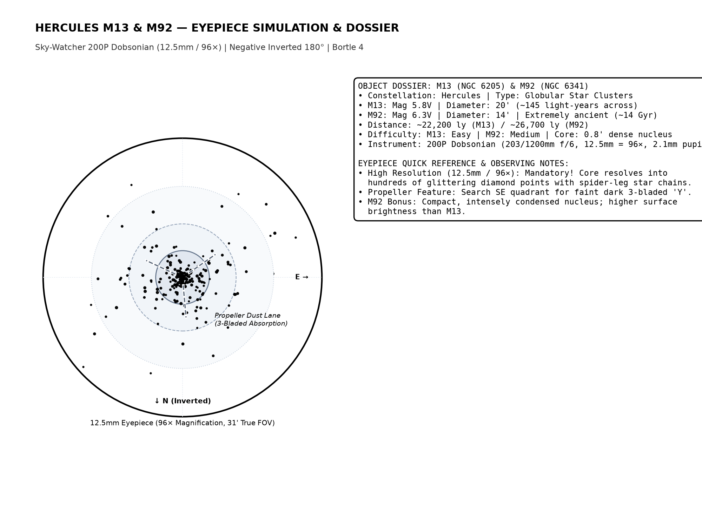

### 2. Constellation Context & Regional Orientation Chart
> [!TIP]
> **Viewport Context** presents a wide ~50°–65° naked-eye orientation field (stars down to visual magnitude 6.5) with official IAU constellation guide lines. The dashed bounding box marks the exact area covered by the wide-field star-hopping chart below.

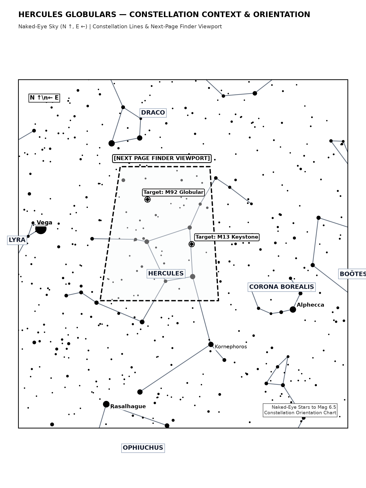

### 3. Wide-Field Star-Hopping Finder Chart
> [!IMPORTANT]
> **Viewport A** provides an upright naked-eye / optical finder orientation (N ↑, E ←) with stars down to visual magnitude 8.5. Standard concentric Telrad rings (0.5°, 2.0°, 4.0°) and 5.0° finder circle are centered directly on the target.

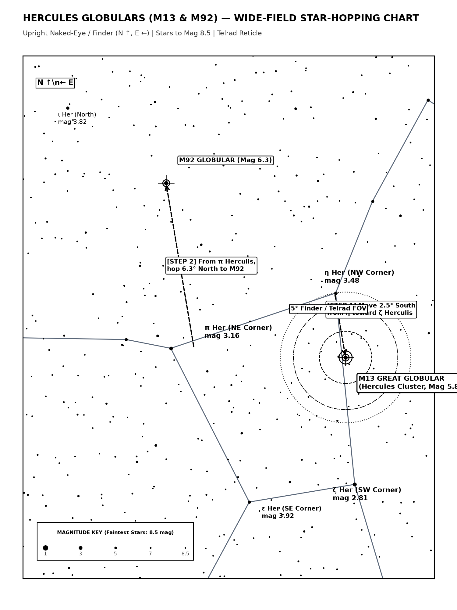

*([📄 Open Full High-Resolution Master A4 Finder Chart](shared/m13/chart_skywatcher-skyliner-200p.png))*

### 4. Observing Strategy & Step-by-Step Hop Instructions

- **Acquisition & Framing (20mm Super / 60×, 50' FOV)**:
  Majestic globular cluster visible even in the optical finder as a hazy, luminous circular patch on the western edge of the Hercules Keystone.
- **High-Power Inspection & Detail (20mm / 60×, 49' FOV)**:
  96× resolution is breathtaking: core resolves into hundreds of diamond points with spider-leg star chains sprawling across 20 arcminutes. Search the SE quadrant for the subtle three-bladed 'Propeller' dust lane.

**Step-by-Step Star Hop Narrative**:
Identify the Keystone of Hercules between Vega and Corona Borealis. Trace the western edge between η and ζ Herculis; M13 lies exactly 1/3 of the way from η toward ζ.

---

## M14 (NGC 6402) — Ophiucus

[↑ Back to Catalog Index](#messier-catalog-index) • [← Previous: M13](#m13) • [Next: M15 →](#m15)

| Technical Parameter | Specification |
| :--- | :--- |
| **Designation** | M14 (NGC 6402) |
| **Constellation** | Ophiucus |
| **Classification** | Globular Cluster (GC) |
| **Visual Magnitude ($V$)** | 7.6 mag |
| **Apparent Dimensions** | 11.0' × 11.0' |
| **Estimated Distance** | ~30,336 light-years |
| **Swanson Difficulty** | **Medium** (*NexStar User's Guide II*) |
| **Coordinates (J2000)** | RA **17h 37m 36.2s** • Dec **-3° 14' 45.3"** |
| **Recommended Eyepiece** | 12.5mm (96× magnification, 31' TFOV, 2.1mm exit pupil) |

### 1. Telescope Eyepiece Simulation & Technical Dossier
> [!NOTE]
> **Viewport B** depicts the pre-inverted 180° field view through the Newtonian reflector (12.5mm eyepiece / 96× magnification, 31' true field of view: South at top, West at left, N ↓, E →). **Viewport C** integrates target ephemeris and optical notes.

### 2. Constellation Context & Regional Orientation Chart
> [!TIP]
> **Viewport Context** presents a wide ~50°–65° naked-eye orientation field (stars down to visual magnitude 6.5) with official IAU constellation guide lines. The dashed bounding box marks the exact area covered by the wide-field star-hopping chart below.

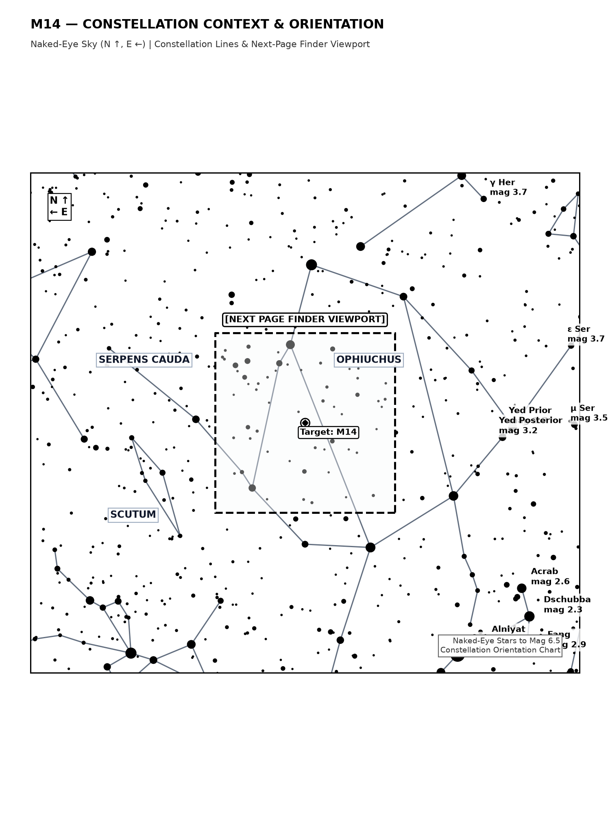

### 3. Wide-Field Star-Hopping Finder Chart
> [!IMPORTANT]
> **Viewport A** provides an upright naked-eye / optical finder orientation (N ↑, E ←) with stars down to visual magnitude 8.5. Standard concentric Telrad rings (0.5°, 2.0°, 4.0°) and 5.0° finder circle are centered directly on the target.

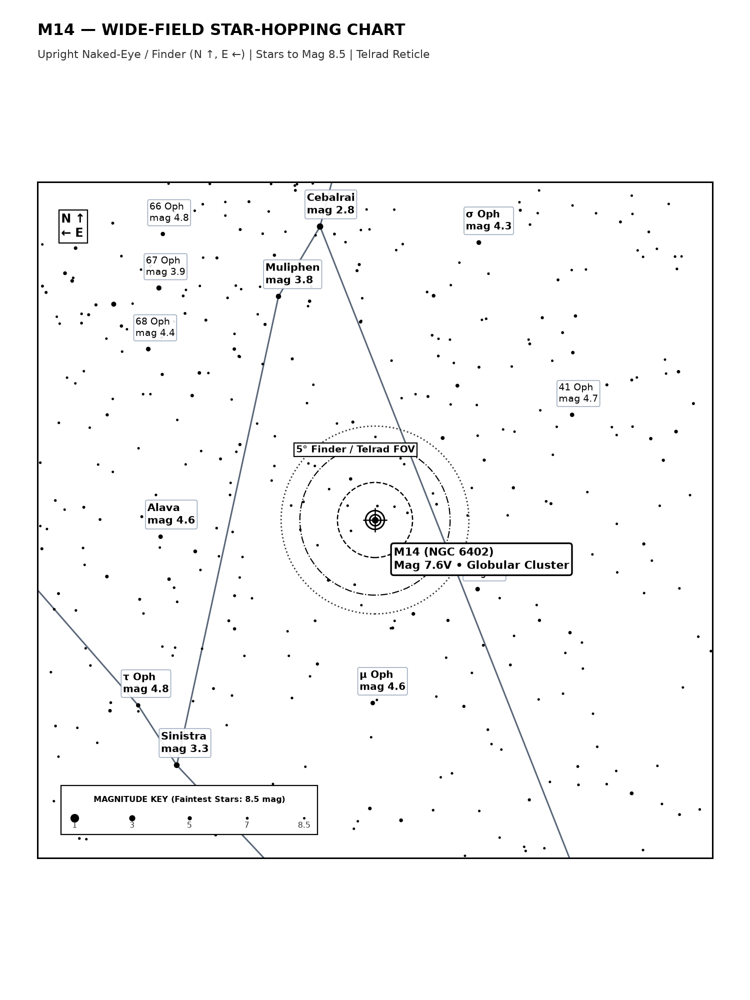

*([📄 Open Full High-Resolution Master A4 Finder Chart](shared/m14/chart_skywatcher-skyliner-200p.png))*

### 4. Observing Strategy & Step-by-Step Hop Instructions

- **Acquisition & Framing (20mm Super / 60×, 50' FOV)**:
  Noticeable circular misty ball with bright concentrated core floating against a dark starry backdrop in Ophiucus.
- **High-Power Inspection & Detail (12.5mm / 96×, 31' FOV)**:
  12.5mm (96×) resolves the outer edges into sharp, glittering diamond star points; averted vision reveals rich granularity across the core.

**Step-by-Step Star Hop Narrative**:
Locate anchor constellation Ophiucus on the Context Chart. Slew Telrad reticle to RA 264.40°, Dec -3.25° and center the fuzzy ball in the 20mm finder eyepiece.

---

## M15 (NGC 7078) — Pegasus

[↑ Back to Catalog Index](#messier-catalog-index) • [← Previous: M14](#m14) • [Next: M16 →](#m16)

| Technical Parameter | Specification |
| :--- | :--- |
| **Designation** | M15 (NGC 7078) |
| **Constellation** | Pegasus |
| **Classification** | Globular Cluster (GC) |
| **Visual Magnitude ($V$)** | 6.3 mag |
| **Apparent Dimensions** | 18.0' × 18.0' |
| **Estimated Distance** | ~32,620 light-years |
| **Swanson Difficulty** | **Easy** (*NexStar User's Guide II*) |
| **Coordinates (J2000)** | RA **21h 29m 58.3s** • Dec **+12° 10' 01.2"** |
| **Recommended Eyepiece** | 20mm (60× magnification, 49' TFOV, 3.4mm exit pupil) |

### 1. Telescope Eyepiece Simulation & Technical Dossier
> [!NOTE]
> **Viewport B** depicts the pre-inverted 180° field view through the Newtonian reflector (20mm eyepiece / 60× magnification, 49' true field of view: South at top, West at left, N ↓, E →). **Viewport C** integrates target ephemeris and optical notes.

### 2. Constellation Context & Regional Orientation Chart
> [!TIP]
> **Viewport Context** presents a wide ~50°–65° naked-eye orientation field (stars down to visual magnitude 6.5) with official IAU constellation guide lines. The dashed bounding box marks the exact area covered by the wide-field star-hopping chart below.

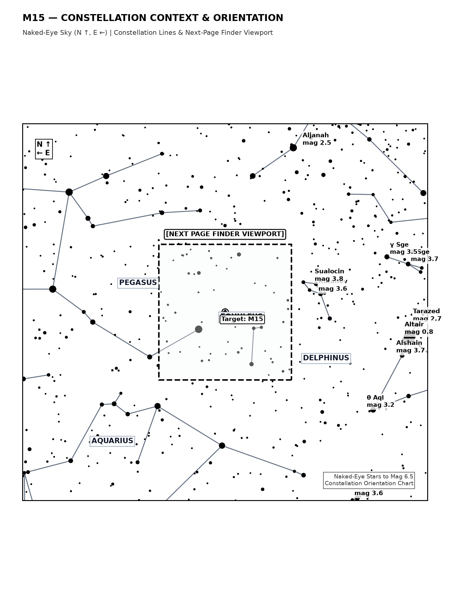

### 3. Wide-Field Star-Hopping Finder Chart
> [!IMPORTANT]
> **Viewport A** provides an upright naked-eye / optical finder orientation (N ↑, E ←) with stars down to visual magnitude 8.5. Standard concentric Telrad rings (0.5°, 2.0°, 4.0°) and 5.0° finder circle are centered directly on the target.

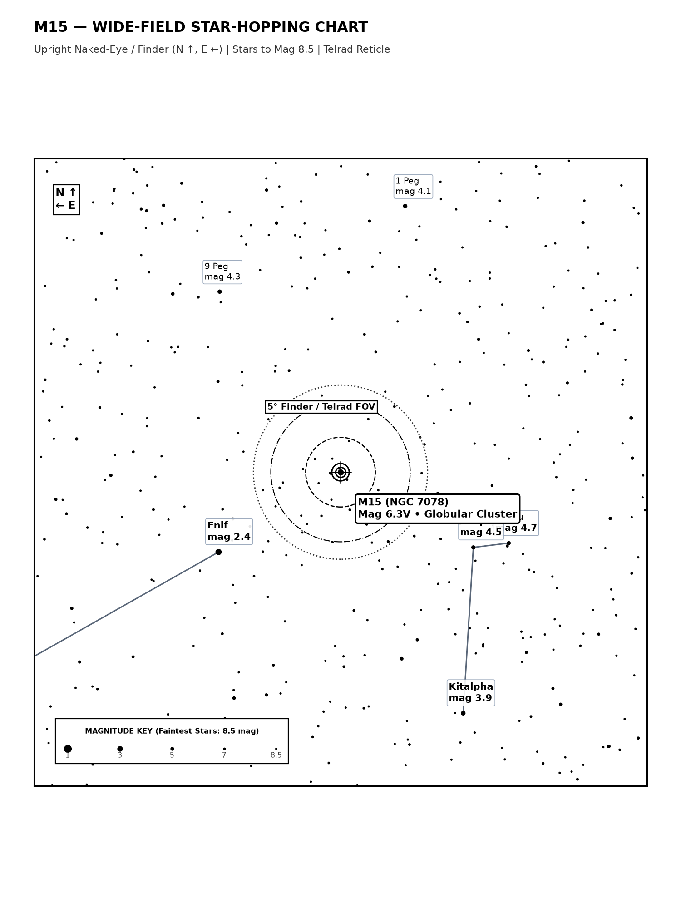

*([📄 Open Full High-Resolution Master A4 Finder Chart](shared/m15/chart_skywatcher-skyliner-200p.png))*

### 4. Observing Strategy & Step-by-Step Hop Instructions

- **Acquisition & Framing (20mm Super / 60×, 50' FOV)**:
  Noticeable circular misty ball with bright concentrated core floating against a dark starry backdrop in Pegasus.
- **High-Power Inspection & Detail (20mm / 60×, 49' FOV)**:
  20mm (60×) resolves the outer edges into sharp, glittering diamond star points; averted vision reveals rich granularity across the core.

**Step-by-Step Star Hop Narrative**:
Locate anchor constellation Pegasus on the Context Chart. Slew Telrad reticle to RA 322.49°, Dec 12.17° and center the fuzzy ball in the 20mm finder eyepiece.

---

## M16 Eagle Nebula Cluster (NGC 6611) — Serpens

[↑ Back to Catalog Index](#messier-catalog-index) • [← Previous: M15](#m15) • [Next: M17 →](#m17)

| Technical Parameter | Specification |
| :--- | :--- |
| **Designation** | M16 (NGC 6611) |
| **Common Name** | **Eagle Nebula Cluster** |
| **Constellation** | Serpens |
| **Classification** | Open Cluster (OC) |
| **Visual Magnitude ($V$)** | 6.0 mag |
| **Apparent Dimensions** | 120.0' × 25.0' |
| **Estimated Distance** | ~7,000 light-years |
| **Swanson Difficulty** | **Easy** (*NexStar User's Guide II*) |
| **Coordinates (J2000)** | RA **18h 18m 48.0s** • Dec **-13° 48' 25.2"** |
| **Recommended Eyepiece** | 20mm (60× magnification, 49' TFOV, 3.4mm exit pupil) |

### 1. Telescope Eyepiece Simulation & Technical Dossier
> [!NOTE]
> **Viewport B** depicts the pre-inverted 180° field view through the Newtonian reflector (20mm eyepiece / 60× magnification, 49' true field of view: South at top, West at left, N ↓, E →). **Viewport C** integrates target ephemeris and optical notes.

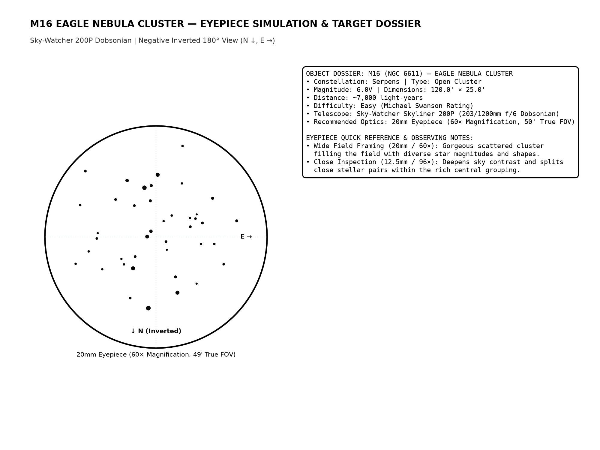

### 2. Constellation Context & Regional Orientation Chart
> [!TIP]
> **Viewport Context** presents a wide ~50°–65° naked-eye orientation field (stars down to visual magnitude 6.5) with official IAU constellation guide lines. The dashed bounding box marks the exact area covered by the wide-field star-hopping chart below.

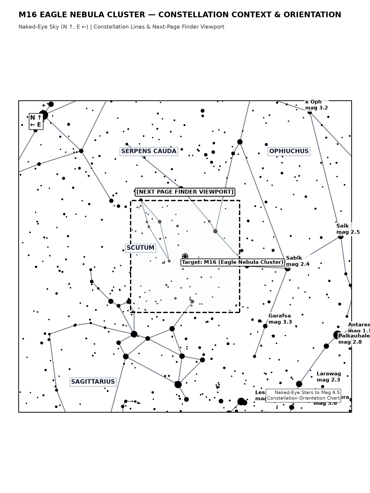

### 3. Wide-Field Star-Hopping Finder Chart
> [!IMPORTANT]
> **Viewport A** provides an upright naked-eye / optical finder orientation (N ↑, E ←) with stars down to visual magnitude 8.5. Standard concentric Telrad rings (0.5°, 2.0°, 4.0°) and 5.0° finder circle are centered directly on the target.

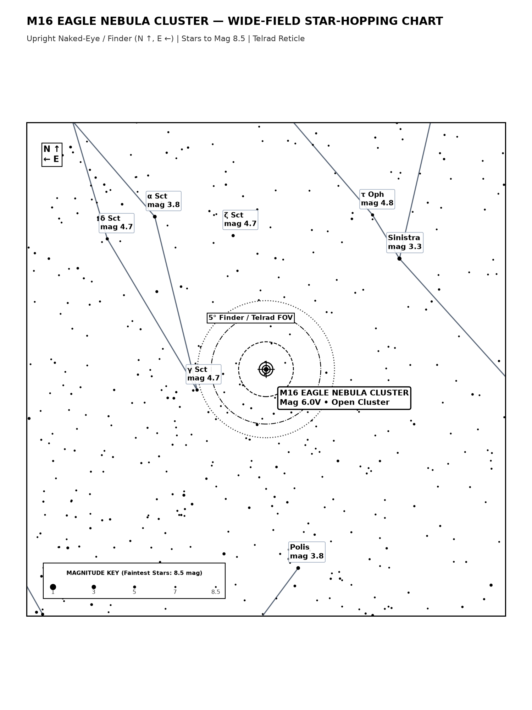

*([📄 Open Full High-Resolution Master A4 Finder Chart](shared/m16/chart_skywatcher-skyliner-200p.png))*

### 4. Observing Strategy & Step-by-Step Hop Instructions

- **Acquisition & Framing (20mm Super / 60×, 50' FOV)**:
  Gorgeous scattered star cluster filling the field with diverse stellar magnitudes and pleasing geometric groupings.
- **High-Power Inspection & Detail (20mm / 60×, 49' FOV)**:
  20mm (60×) deepens sky contrast and splits intimate stellar pairs and chains within the rich central grouping.

**Step-by-Step Star Hop Narrative**:
Locate Serpens via Context Chart. Align Telrad reticle to target coordinates (RA 274.70°, Dec -13.81°); cluster stars emerge immediately in the finder.

---

## M17 Omega, Swan, Horseshoe Nebula (NGC 6618) — Sagittarius

[↑ Back to Catalog Index](#messier-catalog-index) • [← Previous: M16](#m16) • [Next: M18 →](#m18)

| Technical Parameter | Specification |
| :--- | :--- |
| **Designation** | M17 (NGC 6618) |
| **Common Name** | **Omega, Swan, Horseshoe Nebula** |
| **Constellation** | Sagittarius |
| **Classification** | Diffuse Nebula (Nebula) |
| **Visual Magnitude ($V$)** | 6.0 mag |
| **Apparent Dimensions** | 40.0' × 30.0' |
| **Estimated Distance** | ~5,499 light-years |
| **Swanson Difficulty** | **Medium** (*NexStar User's Guide II*) |
| **Coordinates (J2000)** | RA **18h 20m 47.0s** • Dec **-16° 10' 19.2"** |
| **Recommended Eyepiece** | 20mm (60× magnification, 49' TFOV, 3.4mm exit pupil) |

### 1. Telescope Eyepiece Simulation & Technical Dossier
> [!NOTE]
> **Viewport B** depicts the pre-inverted 180° field view through the Newtonian reflector (20mm eyepiece / 60× magnification, 49' true field of view: South at top, West at left, N ↓, E →). **Viewport C** integrates target ephemeris and optical notes.

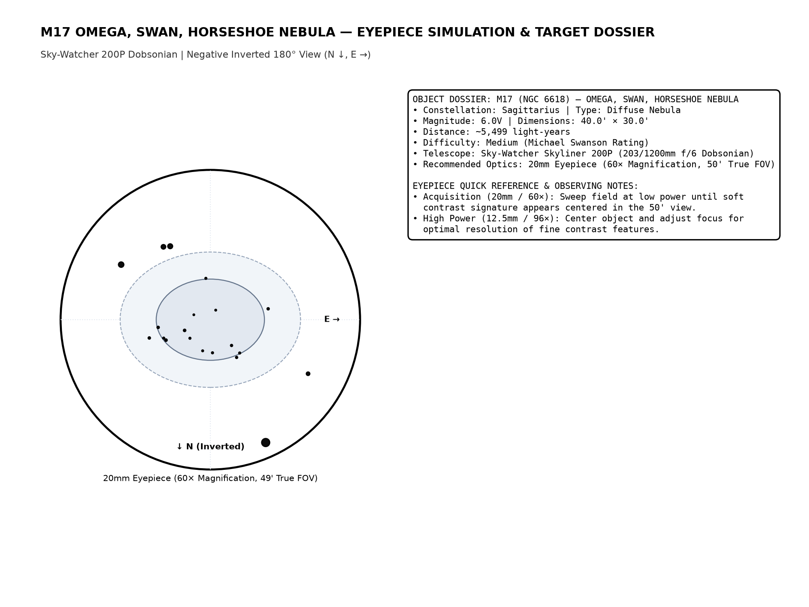

### 2. Constellation Context & Regional Orientation Chart
> [!TIP]
> **Viewport Context** presents a wide ~50°–65° naked-eye orientation field (stars down to visual magnitude 6.5) with official IAU constellation guide lines. The dashed bounding box marks the exact area covered by the wide-field star-hopping chart below.

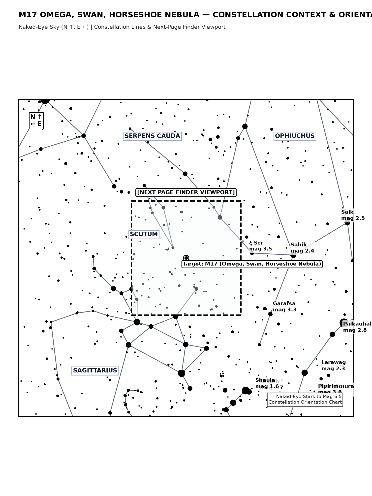

### 3. Wide-Field Star-Hopping Finder Chart
> [!IMPORTANT]
> **Viewport A** provides an upright naked-eye / optical finder orientation (N ↑, E ←) with stars down to visual magnitude 8.5. Standard concentric Telrad rings (0.5°, 2.0°, 4.0°) and 5.0° finder circle are centered directly on the target.

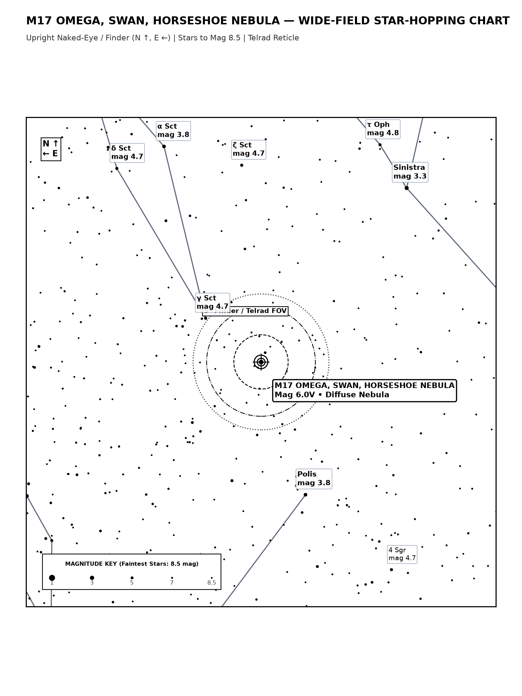

*([📄 Open Full High-Resolution Master A4 Finder Chart](shared/m17/chart_skywatcher-skyliner-200p.png))*

### 4. Observing Strategy & Step-by-Step Hop Instructions

- **Acquisition & Framing (20mm Super / 60×, 50' FOV)**:
  Soft, sprawling contrast signature floating among field stars; best detected by sweeping slowly across the field at 60×.
- **High-Power Inspection & Detail (20mm / 60×, 49' FOV)**:
  20mm (60×) highlights subtle ionization knots, filamentary edges, and embedded star groupings within the glowing cloud.

**Step-by-Step Star Hop Narrative**:
Locate Sagittarius guide stars. Align Telrad reticle to RA 275.20°, Dec -16.17°; sweep gently until nebulous glow fills the field.

---

## M18 (NGC 6613) — Sagittarius

[↑ Back to Catalog Index](#messier-catalog-index) • [← Previous: M17](#m17) • [Next: M19 →](#m19)

| Technical Parameter | Specification |
| :--- | :--- |
| **Designation** | M18 (NGC 6613) |
| **Constellation** | Sagittarius |
| **Classification** | Open Cluster (OC) |
| **Visual Magnitude ($V$)** | 6.9 mag |
| **Apparent Dimensions** | 7.0' × 7.0' |
| **Estimated Distance** | ~4,893 light-years |
| **Swanson Difficulty** | **Easy** (*NexStar User's Guide II*) |
| **Coordinates (J2000)** | RA **18h 19m 58.1s** • Dec **-17° 06' 07.2"** |
| **Recommended Eyepiece** | 12.5mm (96× magnification, 31' TFOV, 2.1mm exit pupil) |

### 1. Telescope Eyepiece Simulation & Technical Dossier
> [!NOTE]
> **Viewport B** depicts the pre-inverted 180° field view through the Newtonian reflector (12.5mm eyepiece / 96× magnification, 31' true field of view: South at top, West at left, N ↓, E →). **Viewport C** integrates target ephemeris and optical notes.

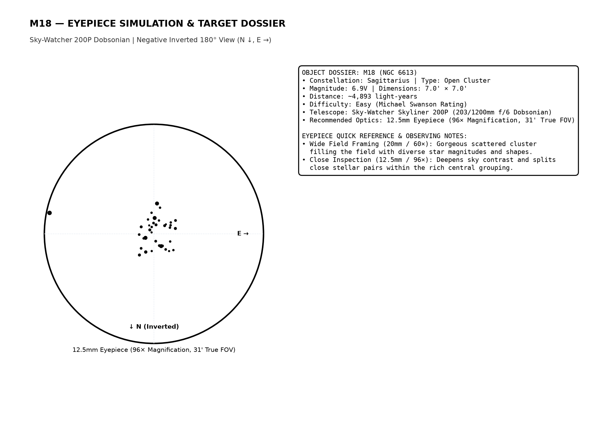

### 2. Constellation Context & Regional Orientation Chart
> [!TIP]
> **Viewport Context** presents a wide ~50°–65° naked-eye orientation field (stars down to visual magnitude 6.5) with official IAU constellation guide lines. The dashed bounding box marks the exact area covered by the wide-field star-hopping chart below.

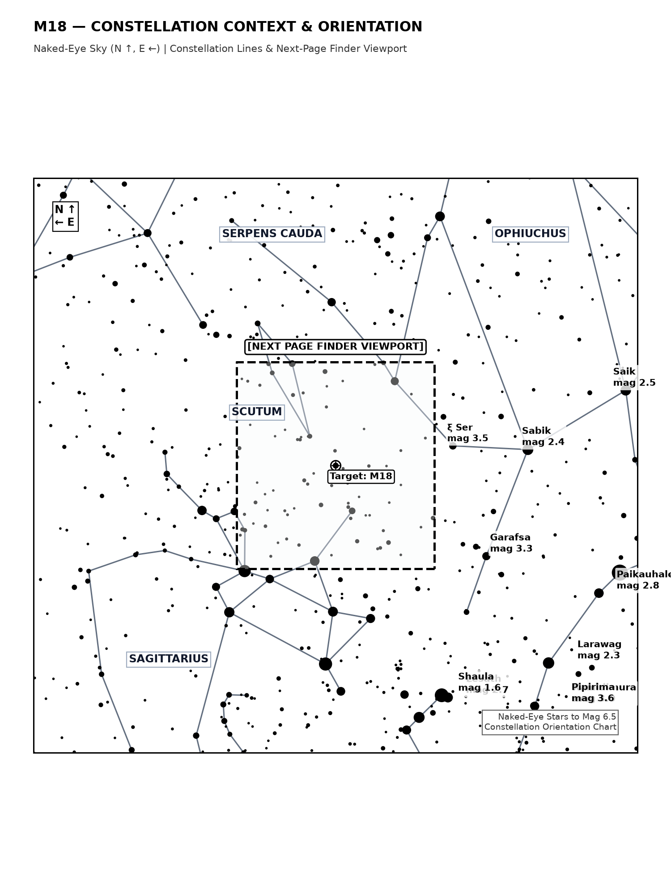

### 3. Wide-Field Star-Hopping Finder Chart
> [!IMPORTANT]
> **Viewport A** provides an upright naked-eye / optical finder orientation (N ↑, E ←) with stars down to visual magnitude 8.5. Standard concentric Telrad rings (0.5°, 2.0°, 4.0°) and 5.0° finder circle are centered directly on the target.

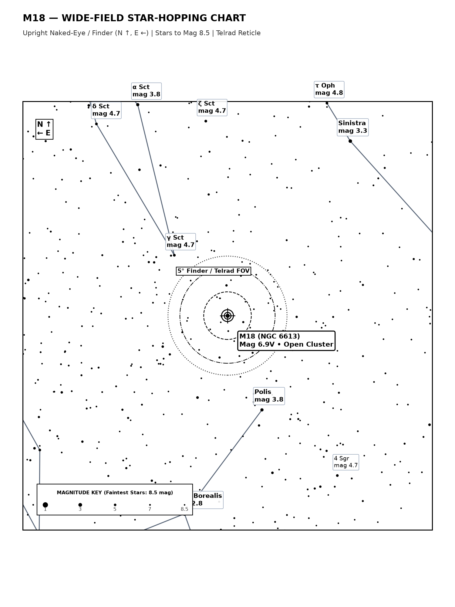

*([📄 Open Full High-Resolution Master A4 Finder Chart](shared/m18/chart_skywatcher-skyliner-200p.png))*

### 4. Observing Strategy & Step-by-Step Hop Instructions

- **Acquisition & Framing (20mm Super / 60×, 50' FOV)**:
  Gorgeous scattered star cluster filling the field with diverse stellar magnitudes and pleasing geometric groupings.
- **High-Power Inspection & Detail (12.5mm / 96×, 31' FOV)**:
  12.5mm (96×) deepens sky contrast and splits intimate stellar pairs and chains within the rich central grouping.

**Step-by-Step Star Hop Narrative**:
Locate Sagittarius via Context Chart. Align Telrad reticle to target coordinates (RA 274.99°, Dec -17.10°); cluster stars emerge immediately in the finder.

---

## M19 (NGC 6273) — Ophiucus

[↑ Back to Catalog Index](#messier-catalog-index) • [← Previous: M18](#m18) • [Next: M20 →](#m20)

| Technical Parameter | Specification |
| :--- | :--- |
| **Designation** | M19 (NGC 6273) |
| **Constellation** | Ophiucus |
| **Classification** | Globular Cluster (GC) |
| **Visual Magnitude ($V$)** | 6.8 mag |
| **Apparent Dimensions** | 17.0' × 17.0' |
| **Estimated Distance** | ~28,705 light-years |
| **Swanson Difficulty** | **Easy** (*NexStar User's Guide II*) |
| **Coordinates (J2000)** | RA **17h 02m 37.7s** • Dec **-26° 16' 04.6"** |
| **Recommended Eyepiece** | 20mm (60× magnification, 49' TFOV, 3.4mm exit pupil) |

### 1. Telescope Eyepiece Simulation & Technical Dossier
> [!NOTE]
> **Viewport B** depicts the pre-inverted 180° field view through the Newtonian reflector (20mm eyepiece / 60× magnification, 49' true field of view: South at top, West at left, N ↓, E →). **Viewport C** integrates target ephemeris and optical notes.

### 2. Constellation Context & Regional Orientation Chart
> [!TIP]
> **Viewport Context** presents a wide ~50°–65° naked-eye orientation field (stars down to visual magnitude 6.5) with official IAU constellation guide lines. The dashed bounding box marks the exact area covered by the wide-field star-hopping chart below.

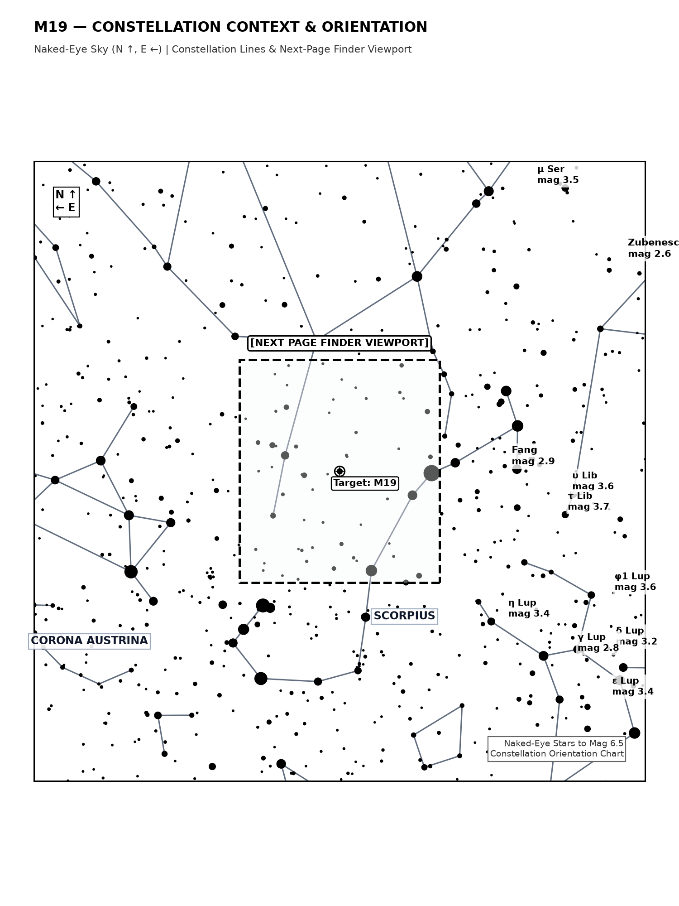

### 3. Wide-Field Star-Hopping Finder Chart
> [!IMPORTANT]
> **Viewport A** provides an upright naked-eye / optical finder orientation (N ↑, E ←) with stars down to visual magnitude 8.5. Standard concentric Telrad rings (0.5°, 2.0°, 4.0°) and 5.0° finder circle are centered directly on the target.

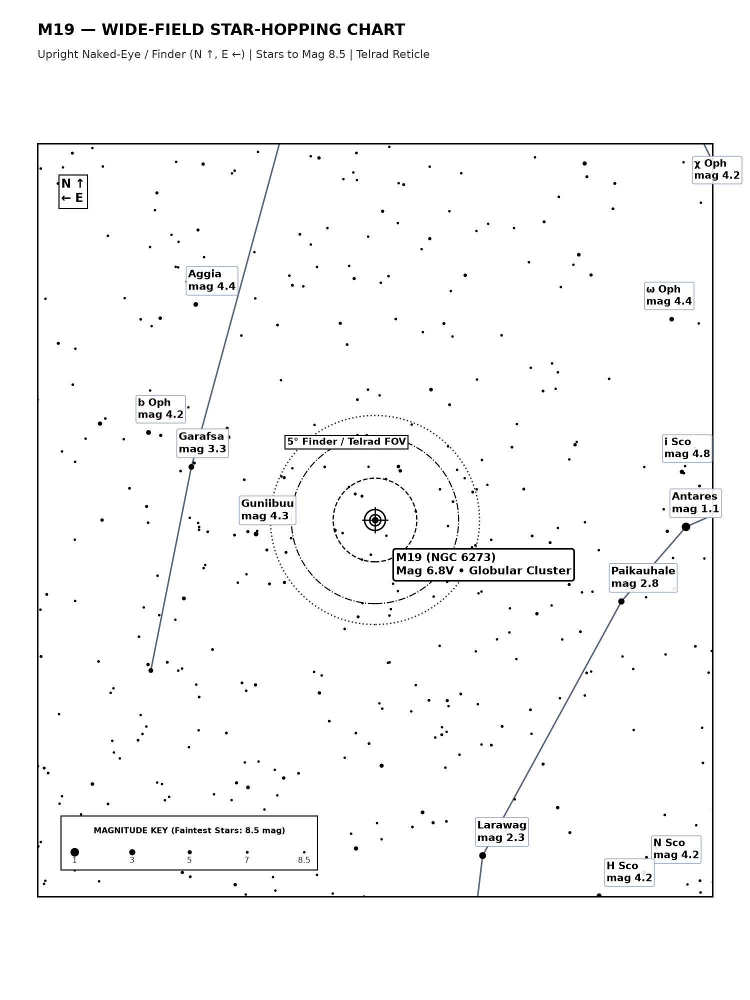

*([📄 Open Full High-Resolution Master A4 Finder Chart](shared/m19/chart_skywatcher-skyliner-200p.png))*

### 4. Observing Strategy & Step-by-Step Hop Instructions

- **Acquisition & Framing (20mm Super / 60×, 50' FOV)**:
  Noticeable circular misty ball with bright concentrated core floating against a dark starry backdrop in Ophiucus.
- **High-Power Inspection & Detail (20mm / 60×, 49' FOV)**:
  20mm (60×) resolves the outer edges into sharp, glittering diamond star points; averted vision reveals rich granularity across the core.

**Step-by-Step Star Hop Narrative**:
Locate anchor constellation Ophiucus on the Context Chart. Slew Telrad reticle to RA 255.66°, Dec -26.27° and center the fuzzy ball in the 20mm finder eyepiece.

---

## M20 Trifid Nebula (NGC 6514) — Sagittarius

[↑ Back to Catalog Index](#messier-catalog-index) • [← Previous: M19](#m19) • [Next: M21 →](#m21)

| Technical Parameter | Specification |
| :--- | :--- |
| **Designation** | M20 (NGC 6514) |
| **Common Name** | **Trifid Nebula** |
| **Constellation** | Sagittarius |
| **Classification** | Diffuse Nebula (Nebula) |
| **Visual Magnitude ($V$)** | 8.5 mag |
| **Apparent Dimensions** | 20.0' × 20.0' |
| **Estimated Distance** | ~5,219 light-years |
| **Swanson Difficulty** | **Medium** (*NexStar User's Guide II*) |
| **Coordinates (J2000)** | RA **18h 02m 42.0s** • Dec **-22° 58' 19.2"** |
| **Recommended Eyepiece** | 20mm (60× magnification, 49' TFOV, 3.4mm exit pupil) |

### 1. Telescope Eyepiece Simulation & Technical Dossier
> [!NOTE]
> **Viewport B** depicts the pre-inverted 180° field view through the Newtonian reflector (20mm eyepiece / 60× magnification, 49' true field of view: South at top, West at left, N ↓, E →). **Viewport C** integrates target ephemeris and optical notes.

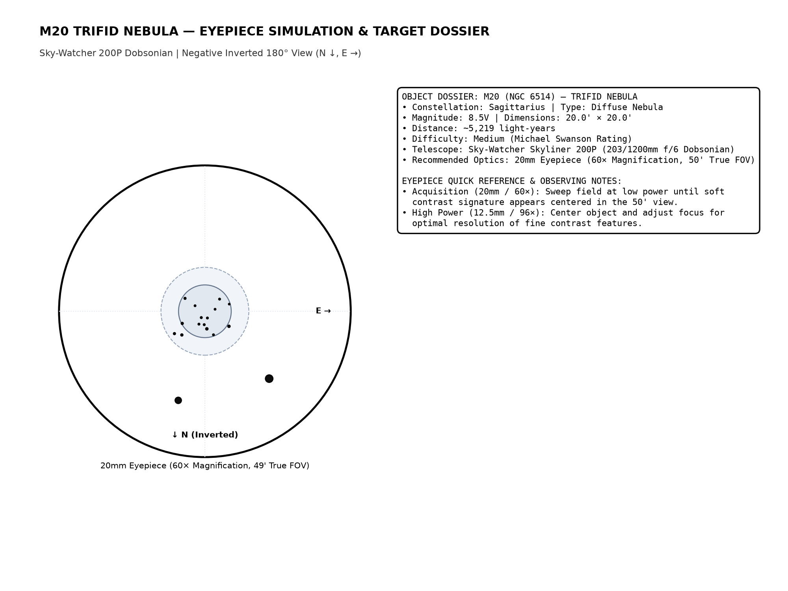

### 2. Constellation Context & Regional Orientation Chart
> [!TIP]
> **Viewport Context** presents a wide ~50°–65° naked-eye orientation field (stars down to visual magnitude 6.5) with official IAU constellation guide lines. The dashed bounding box marks the exact area covered by the wide-field star-hopping chart below.

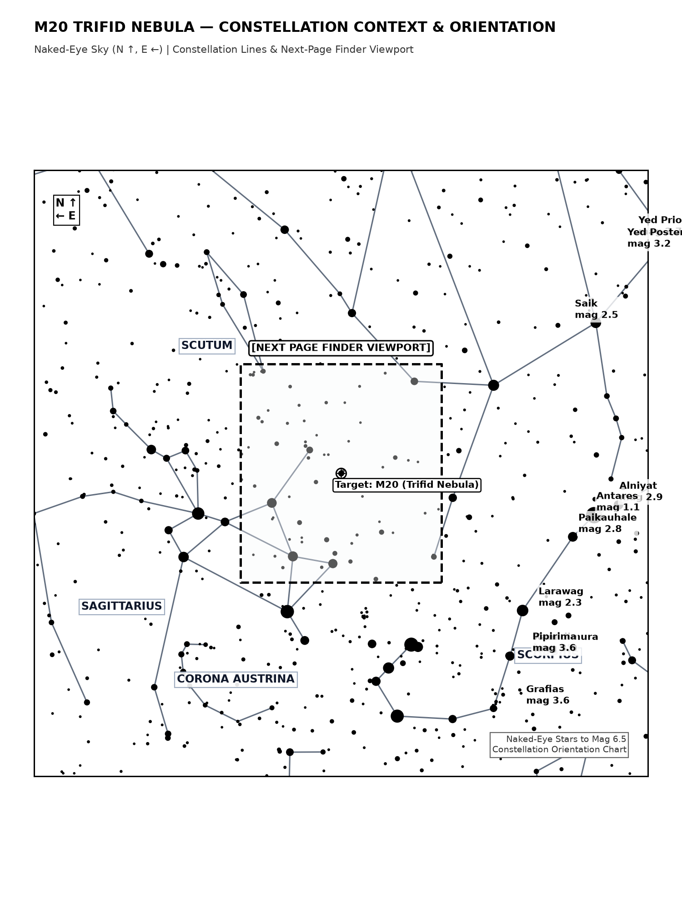

### 3. Wide-Field Star-Hopping Finder Chart
> [!IMPORTANT]
> **Viewport A** provides an upright naked-eye / optical finder orientation (N ↑, E ←) with stars down to visual magnitude 8.5. Standard concentric Telrad rings (0.5°, 2.0°, 4.0°) and 5.0° finder circle are centered directly on the target.

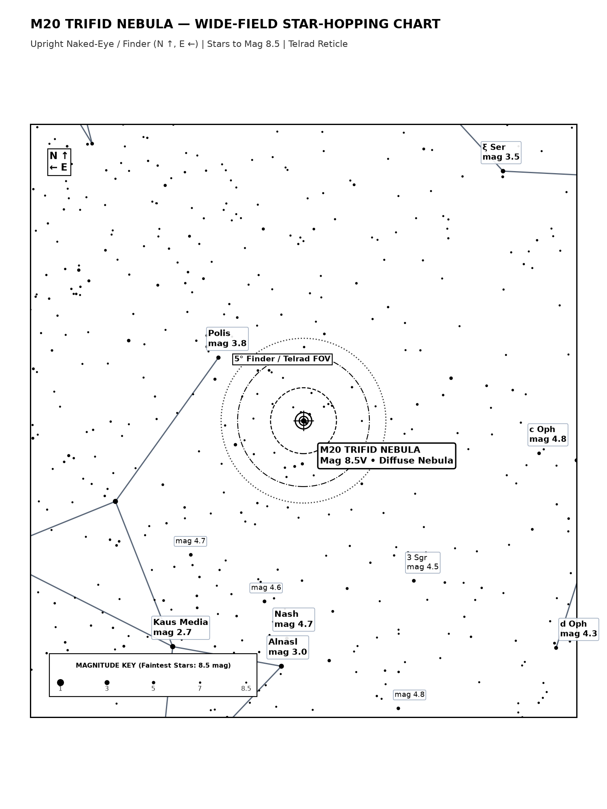

*([📄 Open Full High-Resolution Master A4 Finder Chart](shared/m20/chart_skywatcher-skyliner-200p.png))*

### 4. Observing Strategy & Step-by-Step Hop Instructions

- **Acquisition & Framing (20mm Super / 60×, 50' FOV)**:
  Soft, sprawling contrast signature floating among field stars; best detected by sweeping slowly across the field at 60×.
- **High-Power Inspection & Detail (20mm / 60×, 49' FOV)**:
  20mm (60×) highlights subtle ionization knots, filamentary edges, and embedded star groupings within the glowing cloud.

**Step-by-Step Star Hop Narrative**:
Locate Sagittarius guide stars. Align Telrad reticle to RA 270.68°, Dec -22.97°; sweep gently until nebulous glow fills the field.

---

## M21 (NGC 6531) — Sagittarius

[↑ Back to Catalog Index](#messier-catalog-index) • [← Previous: M20](#m20) • [Next: M22 →](#m22)

| Technical Parameter | Specification |
| :--- | :--- |
| **Designation** | M21 (NGC 6531) |
| **Constellation** | Sagittarius |
| **Classification** | Open Cluster (OC) |
| **Visual Magnitude ($V$)** | 5.9 mag |
| **Apparent Dimensions** | 16.0' × 16.0' |
| **Estimated Distance** | ~4,240 light-years |
| **Swanson Difficulty** | **Easy** (*NexStar User's Guide II*) |
| **Coordinates (J2000)** | RA **18h 04m 13.0s** • Dec **-22° 29' 24.0"** |
| **Recommended Eyepiece** | 20mm (60× magnification, 49' TFOV, 3.4mm exit pupil) |

### 1. Telescope Eyepiece Simulation & Technical Dossier
> [!NOTE]
> **Viewport B** depicts the pre-inverted 180° field view through the Newtonian reflector (20mm eyepiece / 60× magnification, 49' true field of view: South at top, West at left, N ↓, E →). **Viewport C** integrates target ephemeris and optical notes.

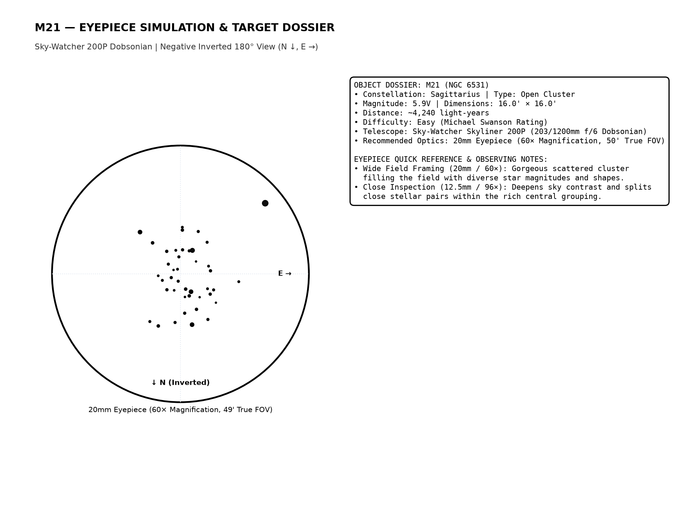

### 2. Constellation Context & Regional Orientation Chart
> [!TIP]
> **Viewport Context** presents a wide ~50°–65° naked-eye orientation field (stars down to visual magnitude 6.5) with official IAU constellation guide lines. The dashed bounding box marks the exact area covered by the wide-field star-hopping chart below.

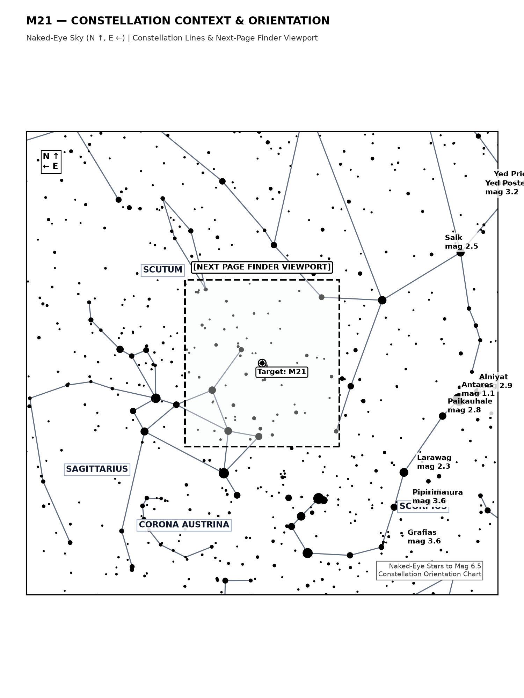

### 3. Wide-Field Star-Hopping Finder Chart
> [!IMPORTANT]
> **Viewport A** provides an upright naked-eye / optical finder orientation (N ↑, E ←) with stars down to visual magnitude 8.5. Standard concentric Telrad rings (0.5°, 2.0°, 4.0°) and 5.0° finder circle are centered directly on the target.

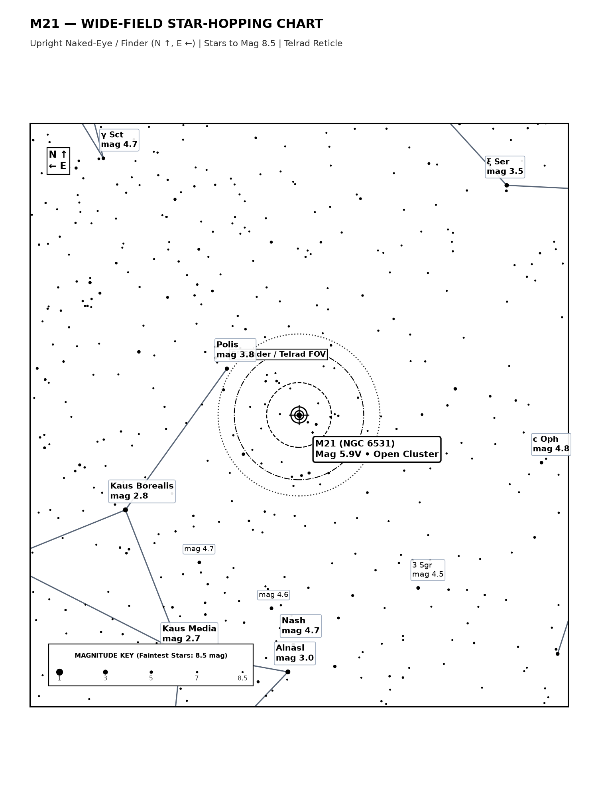

*([📄 Open Full High-Resolution Master A4 Finder Chart](shared/m21/chart_skywatcher-skyliner-200p.png))*

### 4. Observing Strategy & Step-by-Step Hop Instructions

- **Acquisition & Framing (20mm Super / 60×, 50' FOV)**:
  Gorgeous scattered star cluster filling the field with diverse stellar magnitudes and pleasing geometric groupings.
- **High-Power Inspection & Detail (20mm / 60×, 49' FOV)**:
  20mm (60×) deepens sky contrast and splits intimate stellar pairs and chains within the rich central grouping.

**Step-by-Step Star Hop Narrative**:
Locate Sagittarius via Context Chart. Align Telrad reticle to target coordinates (RA 271.05°, Dec -22.49°); cluster stars emerge immediately in the finder.

---

## M22 (NGC 6656) — Sagittarius

[↑ Back to Catalog Index](#messier-catalog-index) • [← Previous: M21](#m21) • [Next: M23 →](#m23)

| Technical Parameter | Specification |
| :--- | :--- |
| **Designation** | M22 (NGC 6656) |
| **Constellation** | Sagittarius |
| **Classification** | Globular Cluster (GC) |
| **Visual Magnitude ($V$)** | 5.2 mag |
| **Apparent Dimensions** | 32.0' × 32.0' |
| **Estimated Distance** | ~9,786 light-years |
| **Swanson Difficulty** | **Easy** (*NexStar User's Guide II*) |
| **Coordinates (J2000)** | RA **18h 36m 23.9s** • Dec **-23° 54' 17.1"** |
| **Recommended Eyepiece** | 20mm (60× magnification, 49' TFOV, 3.4mm exit pupil) |

### 1. Telescope Eyepiece Simulation & Technical Dossier
> [!NOTE]
> **Viewport B** depicts the pre-inverted 180° field view through the Newtonian reflector (20mm eyepiece / 60× magnification, 49' true field of view: South at top, West at left, N ↓, E →). **Viewport C** integrates target ephemeris and optical notes.

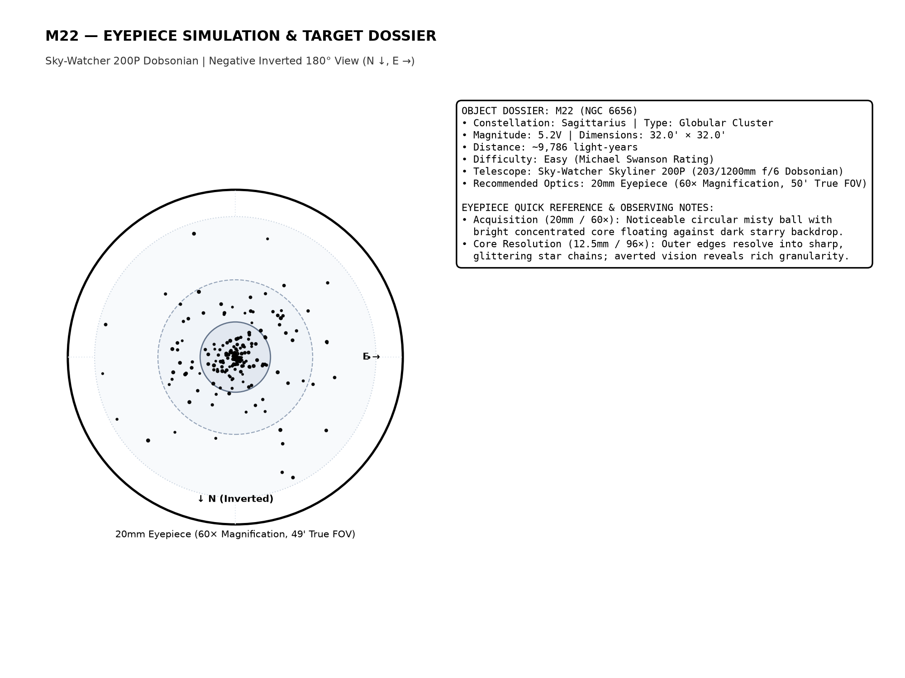

### 2. Constellation Context & Regional Orientation Chart
> [!TIP]
> **Viewport Context** presents a wide ~50°–65° naked-eye orientation field (stars down to visual magnitude 6.5) with official IAU constellation guide lines. The dashed bounding box marks the exact area covered by the wide-field star-hopping chart below.

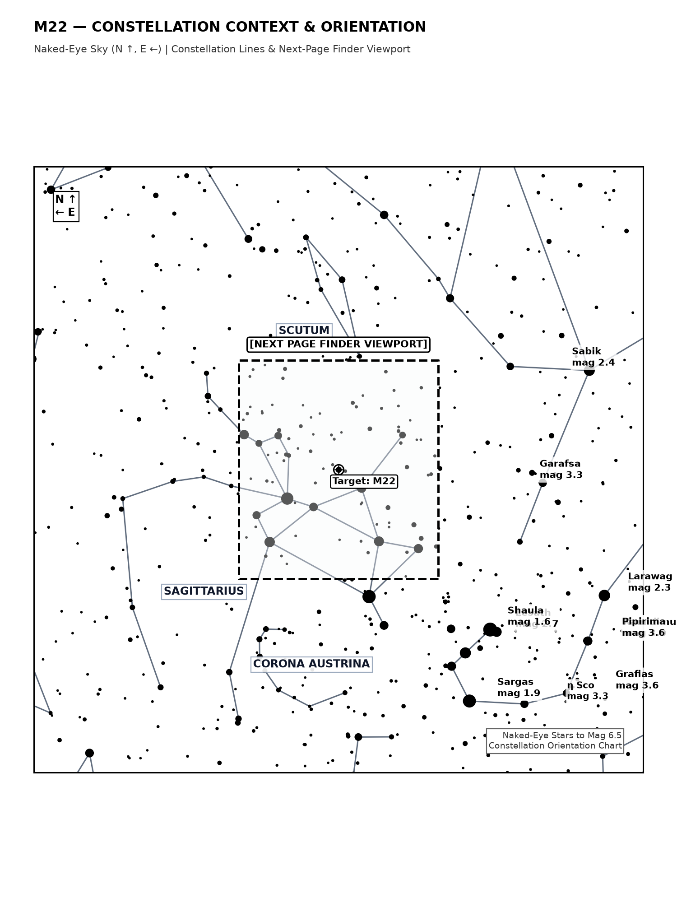

### 3. Wide-Field Star-Hopping Finder Chart
> [!IMPORTANT]
> **Viewport A** provides an upright naked-eye / optical finder orientation (N ↑, E ←) with stars down to visual magnitude 8.5. Standard concentric Telrad rings (0.5°, 2.0°, 4.0°) and 5.0° finder circle are centered directly on the target.

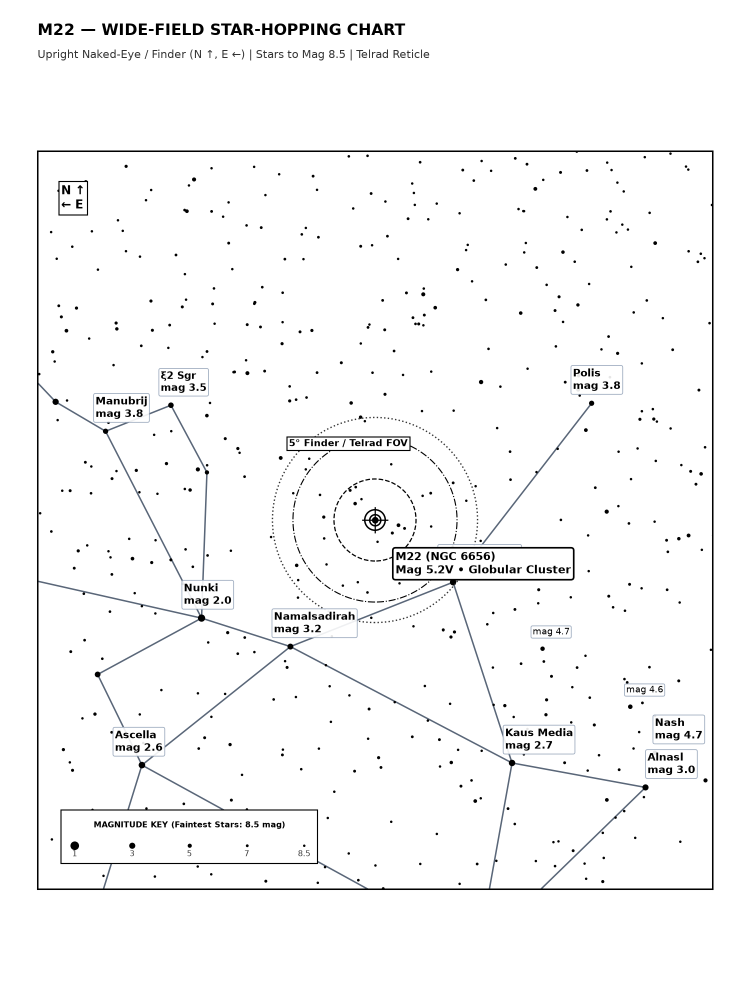

*([📄 Open Full High-Resolution Master A4 Finder Chart](shared/m22/chart_skywatcher-skyliner-200p.png))*

### 4. Observing Strategy & Step-by-Step Hop Instructions

- **Acquisition & Framing (20mm Super / 60×, 50' FOV)**:
  Noticeable circular misty ball with bright concentrated core floating against a dark starry backdrop in Sagittarius.
- **High-Power Inspection & Detail (20mm / 60×, 49' FOV)**:
  20mm (60×) resolves the outer edges into sharp, glittering diamond star points; averted vision reveals rich granularity across the core.

**Step-by-Step Star Hop Narrative**:
Locate anchor constellation Sagittarius on the Context Chart. Slew Telrad reticle to RA 279.10°, Dec -23.90° and center the fuzzy ball in the 20mm finder eyepiece.

---

## M23 (NGC 6494) — Sagittarius

[↑ Back to Catalog Index](#messier-catalog-index) • [← Previous: M22](#m22) • [Next: M24 →](#m24)

| Technical Parameter | Specification |
| :--- | :--- |
| **Designation** | M23 (NGC 6494) |
| **Constellation** | Sagittarius |
| **Classification** | Open Cluster (OC) |
| **Visual Magnitude ($V$)** | 5.5 mag |
| **Apparent Dimensions** | 25.0' × 25.0' |
| **Estimated Distance** | ~2149 light-years |
| **Swanson Difficulty** | **Easy** (*NexStar User's Guide II*) |
| **Coordinates (J2000)** | RA **17h 57m 04.1s** • Dec **-18° 59' 06.0"** |
| **Recommended Eyepiece** | 20mm (60× magnification, 49' TFOV, 3.4mm exit pupil) |

### 1. Telescope Eyepiece Simulation & Technical Dossier
> [!NOTE]
> **Viewport B** depicts the pre-inverted 180° field view through the Newtonian reflector (20mm eyepiece / 60× magnification, 49' true field of view: South at top, West at left, N ↓, E →). **Viewport C** integrates target ephemeris and optical notes.

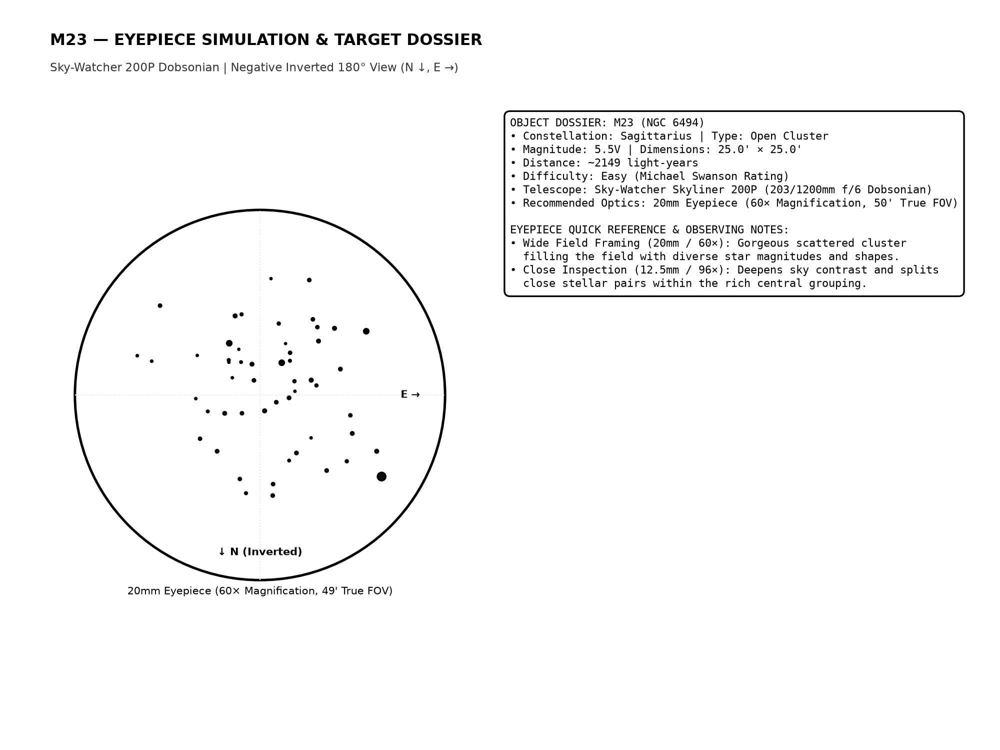

### 2. Constellation Context & Regional Orientation Chart
> [!TIP]
> **Viewport Context** presents a wide ~50°–65° naked-eye orientation field (stars down to visual magnitude 6.5) with official IAU constellation guide lines. The dashed bounding box marks the exact area covered by the wide-field star-hopping chart below.

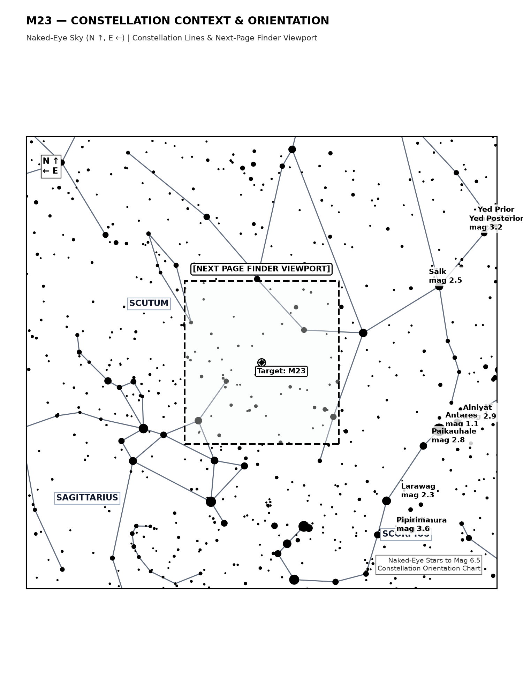

### 3. Wide-Field Star-Hopping Finder Chart
> [!IMPORTANT]
> **Viewport A** provides an upright naked-eye / optical finder orientation (N ↑, E ←) with stars down to visual magnitude 8.5. Standard concentric Telrad rings (0.5°, 2.0°, 4.0°) and 5.0° finder circle are centered directly on the target.

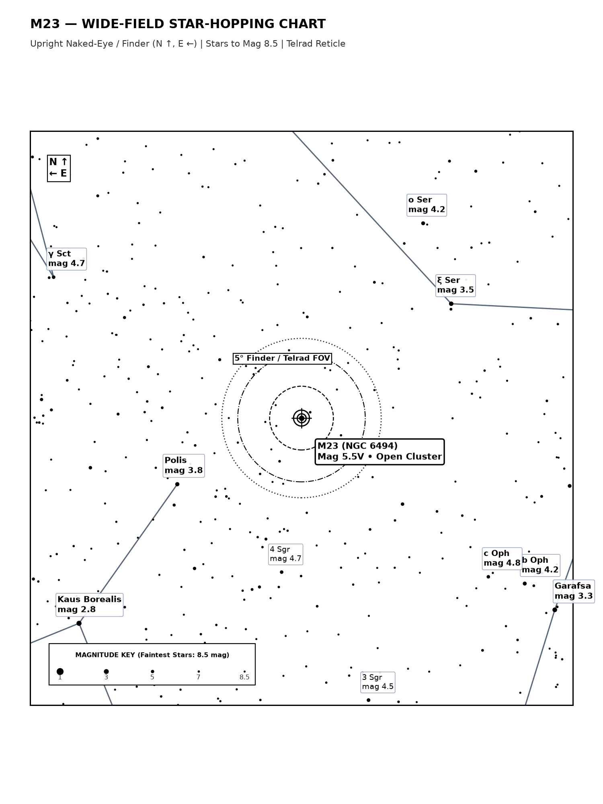

*([📄 Open Full High-Resolution Master A4 Finder Chart](shared/m23/chart_skywatcher-skyliner-200p.png))*

### 4. Observing Strategy & Step-by-Step Hop Instructions

- **Acquisition & Framing (20mm Super / 60×, 50' FOV)**:
  Gorgeous scattered star cluster filling the field with diverse stellar magnitudes and pleasing geometric groupings.
- **High-Power Inspection & Detail (20mm / 60×, 49' FOV)**:
  20mm (60×) deepens sky contrast and splits intimate stellar pairs and chains within the rich central grouping.

**Step-by-Step Star Hop Narrative**:
Locate Sagittarius via Context Chart. Align Telrad reticle to target coordinates (RA 269.27°, Dec -18.98°); cluster stars emerge immediately in the finder.

---

## M24 Sagittarius Star Cloud (IC 4715) — Sagittarius

[↑ Back to Catalog Index](#messier-catalog-index) • [← Previous: M23](#m23) • [Next: M25 →](#m25)

| Technical Parameter | Specification |
| :--- | :--- |
| **Designation** | M24 (IC 4715) |
| **Common Name** | **Sagittarius Star Cloud** |
| **Constellation** | Sagittarius |
| **Classification** | Star Cloud (Star Cloud) |
| **Visual Magnitude ($V$)** | 4.6 mag |
| **Apparent Dimensions** | 90.0' × 60.0' |
| **Estimated Distance** | ~10,014 light-years |
| **Swanson Difficulty** | **Easy** (*NexStar User's Guide II*) |
| **Coordinates (J2000)** | RA **18h 16m 48.0s** • Dec **-18° 33' 00.0"** |
| **Recommended Eyepiece** | 20mm (60× magnification, 49' TFOV, 3.4mm exit pupil) |

### 1. Telescope Eyepiece Simulation & Technical Dossier
> [!NOTE]
> **Viewport B** depicts the pre-inverted 180° field view through the Newtonian reflector (20mm eyepiece / 60× magnification, 49' true field of view: South at top, West at left, N ↓, E →). **Viewport C** integrates target ephemeris and optical notes.

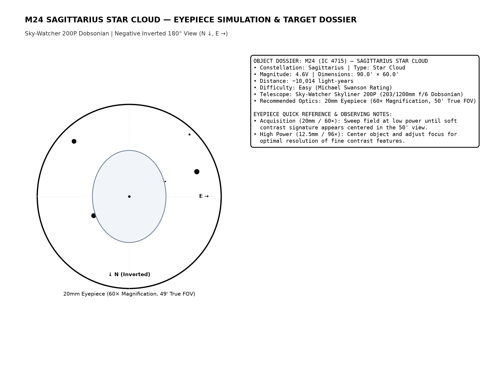

### 2. Constellation Context & Regional Orientation Chart
> [!TIP]
> **Viewport Context** presents a wide ~50°–65° naked-eye orientation field (stars down to visual magnitude 6.5) with official IAU constellation guide lines. The dashed bounding box marks the exact area covered by the wide-field star-hopping chart below.

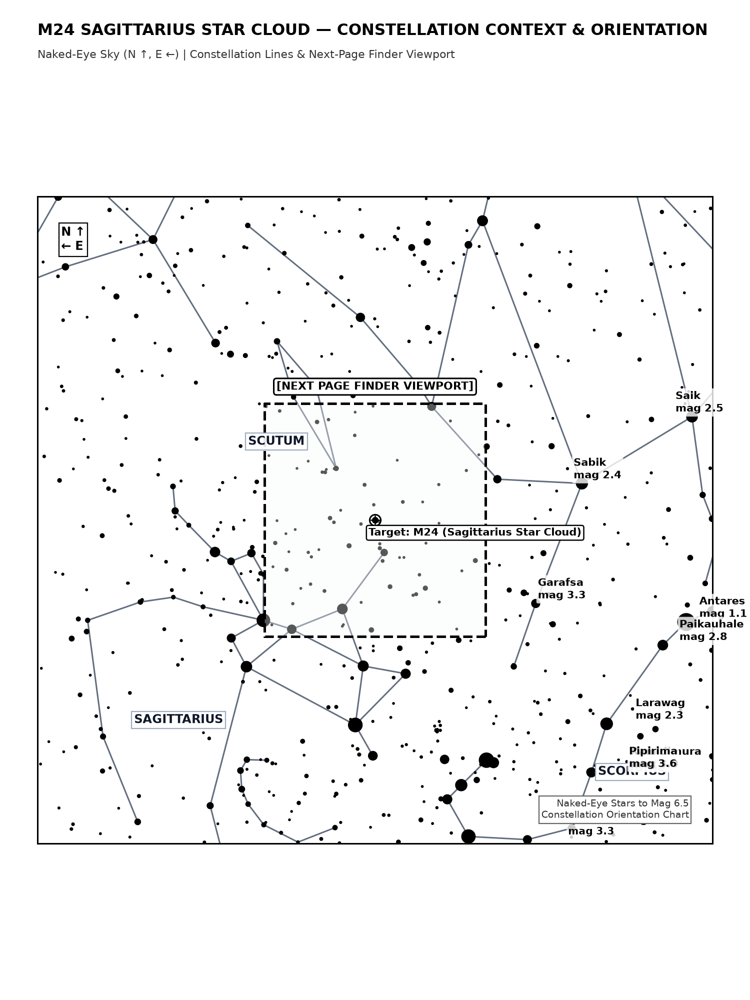

### 3. Wide-Field Star-Hopping Finder Chart
> [!IMPORTANT]
> **Viewport A** provides an upright naked-eye / optical finder orientation (N ↑, E ←) with stars down to visual magnitude 8.5. Standard concentric Telrad rings (0.5°, 2.0°, 4.0°) and 5.0° finder circle are centered directly on the target.

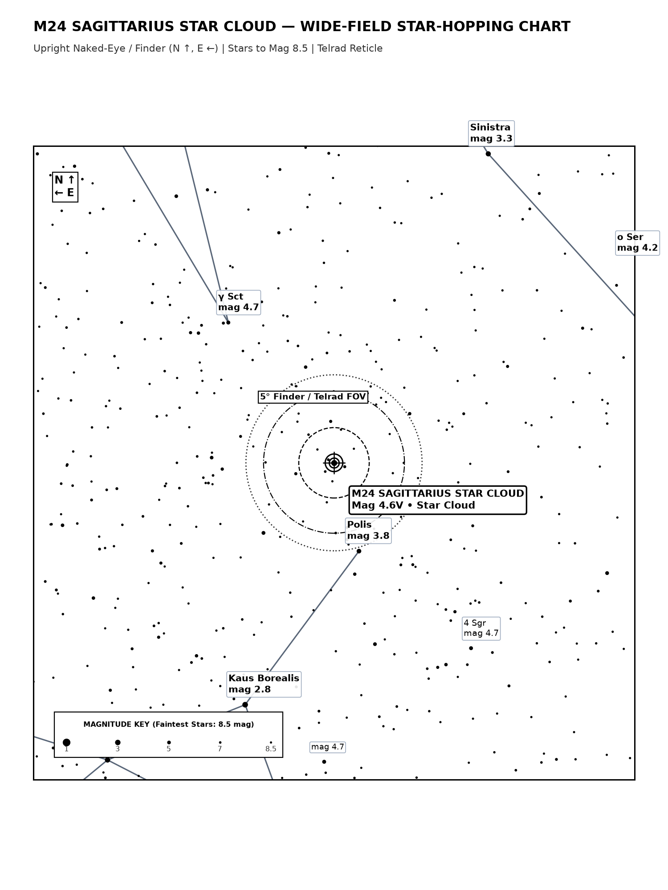

*([📄 Open Full High-Resolution Master A4 Finder Chart](shared/m24/chart_skywatcher-skyliner-200p.png))*

### 4. Observing Strategy & Step-by-Step Hop Instructions

- **Acquisition & Framing (20mm Super / 60×, 50' FOV)**:
  Sweep field at 20mm (60×) until distinct contrast signature appears centered in the 50' view.
- **High-Power Inspection & Detail (20mm / 60×, 49' FOV)**:
  20mm (60×) deepens sky contrast and brings out fine structural detail under dark, transparent skies.

**Step-by-Step Star Hop Narrative**:
Align finder to Sagittarius target coordinates at RA 274.20°, Dec -18.55°.

---

## M25 (IC 4725) — Sagittarius

[↑ Back to Catalog Index](#messier-catalog-index) • [← Previous: M24](#m24) • [Next: M26 →](#m26)

| Technical Parameter | Specification |
| :--- | :--- |
| **Designation** | M25 (IC 4725) |
| **Constellation** | Sagittarius |
| **Classification** | Open Cluster (OC) |
| **Visual Magnitude ($V$)** | 4.6 mag |
| **Apparent Dimensions** | 26.0' × 26.0' |
| **Estimated Distance** | ~1999 light-years |
| **Swanson Difficulty** | **Easy** (*NexStar User's Guide II*) |
| **Coordinates (J2000)** | RA **18h 31m 47.0s** • Dec **-19° 07' 01.2"** |
| **Recommended Eyepiece** | 20mm (60× magnification, 49' TFOV, 3.4mm exit pupil) |

### 1. Telescope Eyepiece Simulation & Technical Dossier
> [!NOTE]
> **Viewport B** depicts the pre-inverted 180° field view through the Newtonian reflector (20mm eyepiece / 60× magnification, 49' true field of view: South at top, West at left, N ↓, E →). **Viewport C** integrates target ephemeris and optical notes.

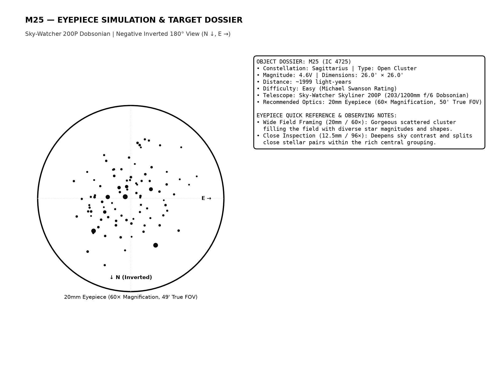

### 2. Constellation Context & Regional Orientation Chart
> [!TIP]
> **Viewport Context** presents a wide ~50°–65° naked-eye orientation field (stars down to visual magnitude 6.5) with official IAU constellation guide lines. The dashed bounding box marks the exact area covered by the wide-field star-hopping chart below.

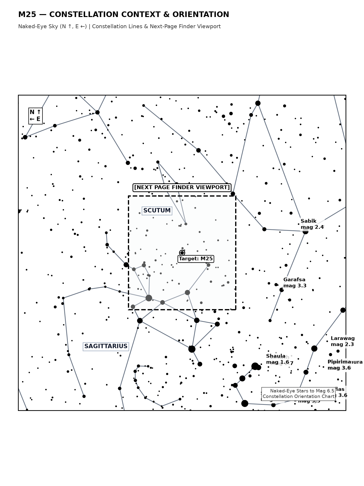

### 3. Wide-Field Star-Hopping Finder Chart
> [!IMPORTANT]
> **Viewport A** provides an upright naked-eye / optical finder orientation (N ↑, E ←) with stars down to visual magnitude 8.5. Standard concentric Telrad rings (0.5°, 2.0°, 4.0°) and 5.0° finder circle are centered directly on the target.

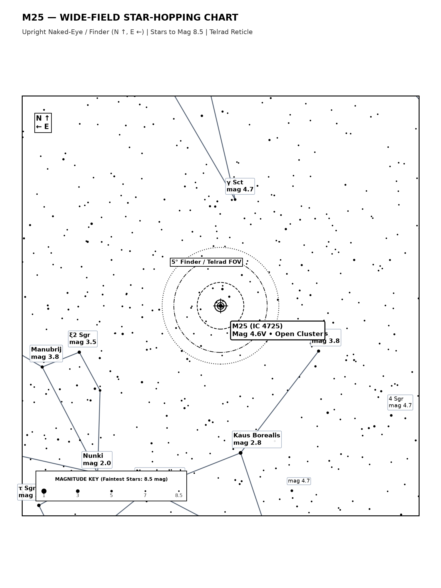

*([📄 Open Full High-Resolution Master A4 Finder Chart](shared/m25/chart_skywatcher-skyliner-200p.png))*

### 4. Observing Strategy & Step-by-Step Hop Instructions

- **Acquisition & Framing (20mm Super / 60×, 50' FOV)**:
  Gorgeous scattered star cluster filling the field with diverse stellar magnitudes and pleasing geometric groupings.
- **High-Power Inspection & Detail (20mm / 60×, 49' FOV)**:
  20mm (60×) deepens sky contrast and splits intimate stellar pairs and chains within the rich central grouping.

**Step-by-Step Star Hop Narrative**:
Locate Sagittarius via Context Chart. Align Telrad reticle to target coordinates (RA 277.95°, Dec -19.12°); cluster stars emerge immediately in the finder.

---

## M26 (NGC 6694) — Scutum

[↑ Back to Catalog Index](#messier-catalog-index) • [← Previous: M25](#m25) • [Next: M27 →](#m27)

| Technical Parameter | Specification |
| :--- | :--- |
| **Designation** | M26 (NGC 6694) |
| **Constellation** | Scutum |
| **Classification** | Open Cluster (OC) |
| **Visual Magnitude ($V$)** | 8.0 mag |
| **Apparent Dimensions** | 10.0' × 10.0' |
| **Estimated Distance** | ~5,003 light-years |
| **Swanson Difficulty** | **Easy** (*NexStar User's Guide II*) |
| **Coordinates (J2000)** | RA **18h 45m 18.0s** • Dec **-9° 22' 58.8"** |
| **Recommended Eyepiece** | 12.5mm (96× magnification, 31' TFOV, 2.1mm exit pupil) |

### 1. Telescope Eyepiece Simulation & Technical Dossier
> [!NOTE]
> **Viewport B** depicts the pre-inverted 180° field view through the Newtonian reflector (12.5mm eyepiece / 96× magnification, 31' true field of view: South at top, West at left, N ↓, E →). **Viewport C** integrates target ephemeris and optical notes.

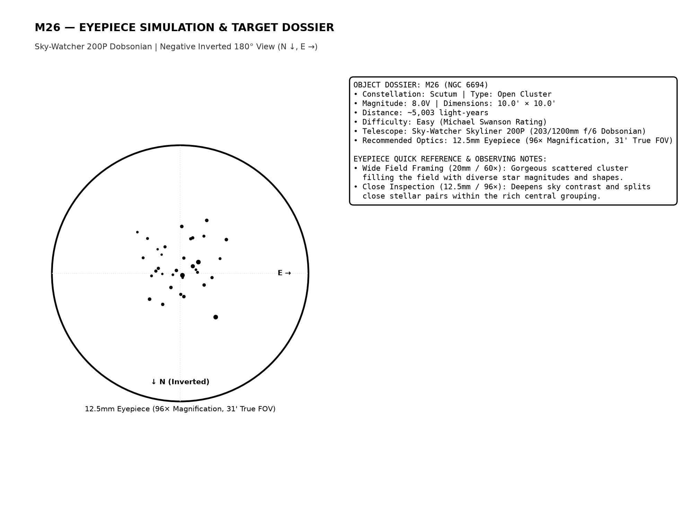

### 2. Constellation Context & Regional Orientation Chart
> [!TIP]
> **Viewport Context** presents a wide ~50°–65° naked-eye orientation field (stars down to visual magnitude 6.5) with official IAU constellation guide lines. The dashed bounding box marks the exact area covered by the wide-field star-hopping chart below.

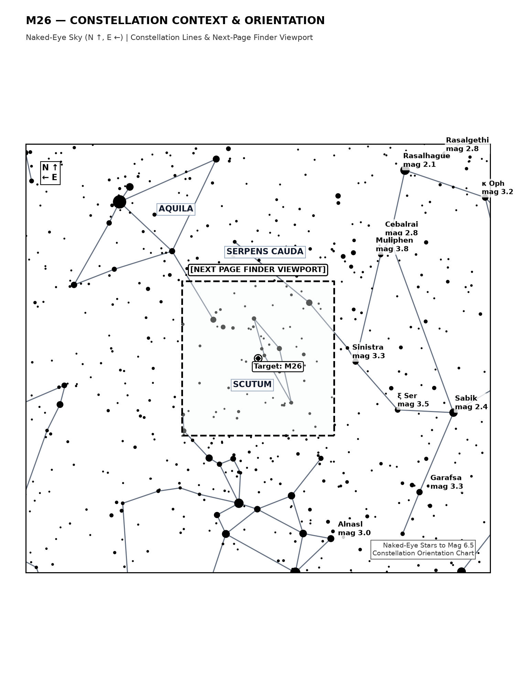

### 3. Wide-Field Star-Hopping Finder Chart
> [!IMPORTANT]
> **Viewport A** provides an upright naked-eye / optical finder orientation (N ↑, E ←) with stars down to visual magnitude 8.5. Standard concentric Telrad rings (0.5°, 2.0°, 4.0°) and 5.0° finder circle are centered directly on the target.

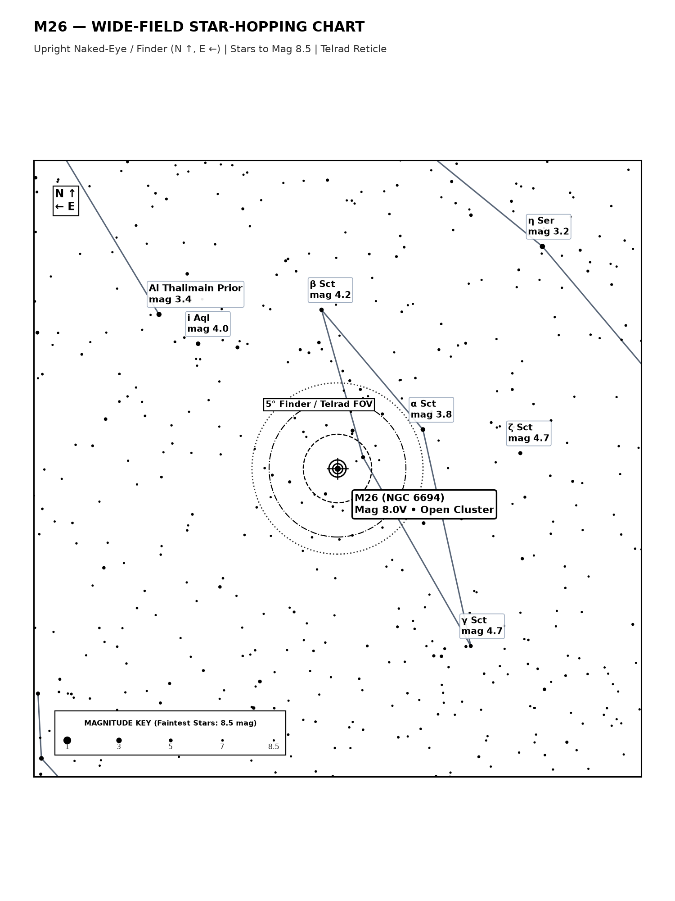

*([📄 Open Full High-Resolution Master A4 Finder Chart](shared/m26/chart_skywatcher-skyliner-200p.png))*

### 4. Observing Strategy & Step-by-Step Hop Instructions

- **Acquisition & Framing (20mm Super / 60×, 50' FOV)**:
  Gorgeous scattered star cluster filling the field with diverse stellar magnitudes and pleasing geometric groupings.
- **High-Power Inspection & Detail (12.5mm / 96×, 31' FOV)**:
  12.5mm (96×) deepens sky contrast and splits intimate stellar pairs and chains within the rich central grouping.

**Step-by-Step Star Hop Narrative**:
Locate Scutum via Context Chart. Align Telrad reticle to target coordinates (RA 281.32°, Dec -9.38°); cluster stars emerge immediately in the finder.

---

## M27 Dumbbell Nebula (NGC 6853) — Vulpecula

[↑ Back to Catalog Index](#messier-catalog-index) • [← Previous: M26](#m26) • [Next: M28 →](#m28)

| Technical Parameter | Specification |
| :--- | :--- |
| **Designation** | M27 (NGC 6853) |
| **Common Name** | **Dumbbell Nebula** |
| **Constellation** | Vulpecula |
| **Classification** | Planetary Nebula (PN) |
| **Visual Magnitude ($V$)** | 7.4 mag |
| **Apparent Dimensions** | 8.0' × 5.6' |
| **Estimated Distance** | ~861 light-years |
| **Swanson Difficulty** | **Medium** (*NexStar User's Guide II*) |
| **Coordinates (J2000)** | RA **19h 59m 36.4s** • Dec **+22° 43' 15.7"** |
| **Recommended Eyepiece** | 12.5mm (96× magnification, 31' TFOV, 2.1mm exit pupil) |

### 1. Telescope Eyepiece Simulation & Technical Dossier
> [!NOTE]
> **Viewport B** depicts the pre-inverted 180° field view through the Newtonian reflector (12.5mm eyepiece / 96× magnification, 31' true field of view: South at top, West at left, N ↓, E →). **Viewport C** integrates target ephemeris and optical notes.

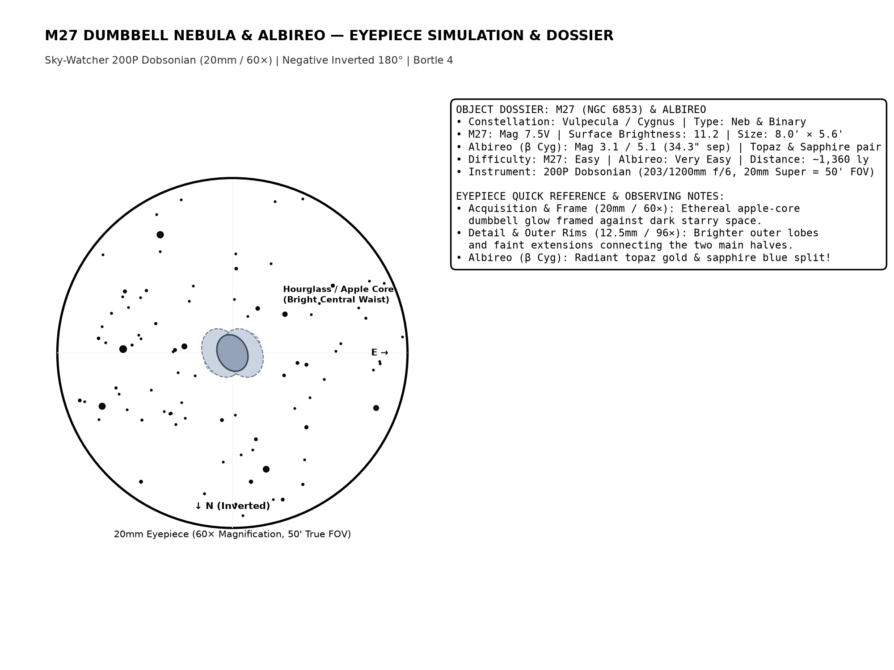

### 2. Constellation Context & Regional Orientation Chart
> [!TIP]
> **Viewport Context** presents a wide ~50°–65° naked-eye orientation field (stars down to visual magnitude 6.5) with official IAU constellation guide lines. The dashed bounding box marks the exact area covered by the wide-field star-hopping chart below.

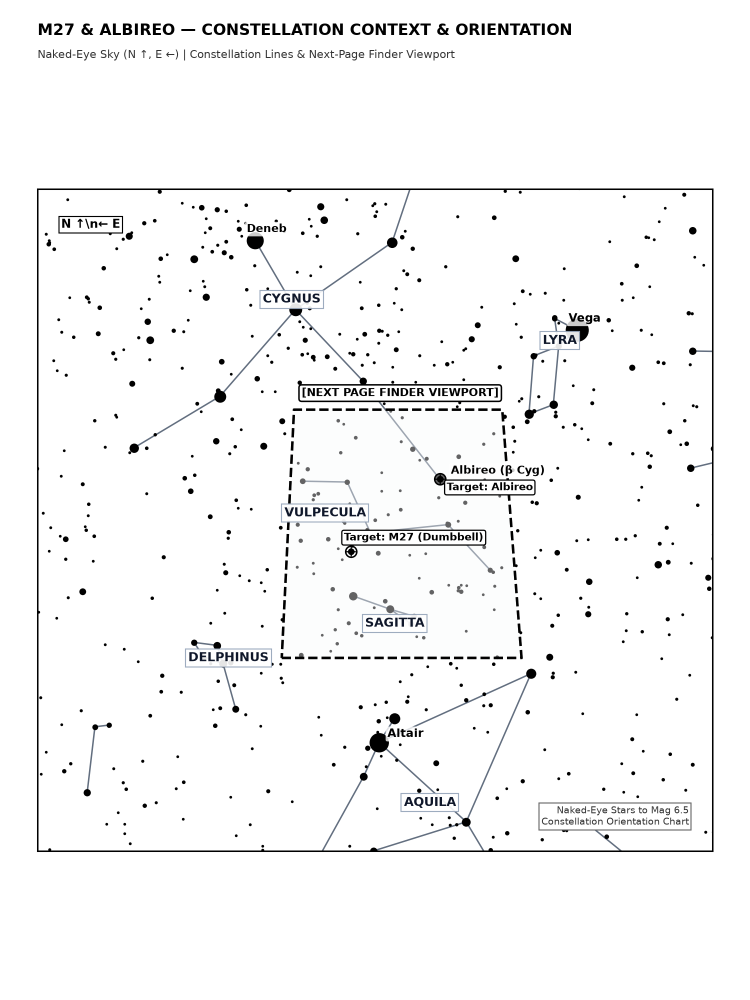

### 3. Wide-Field Star-Hopping Finder Chart
> [!IMPORTANT]
> **Viewport A** provides an upright naked-eye / optical finder orientation (N ↑, E ←) with stars down to visual magnitude 8.5. Standard concentric Telrad rings (0.5°, 2.0°, 4.0°) and 5.0° finder circle are centered directly on the target.

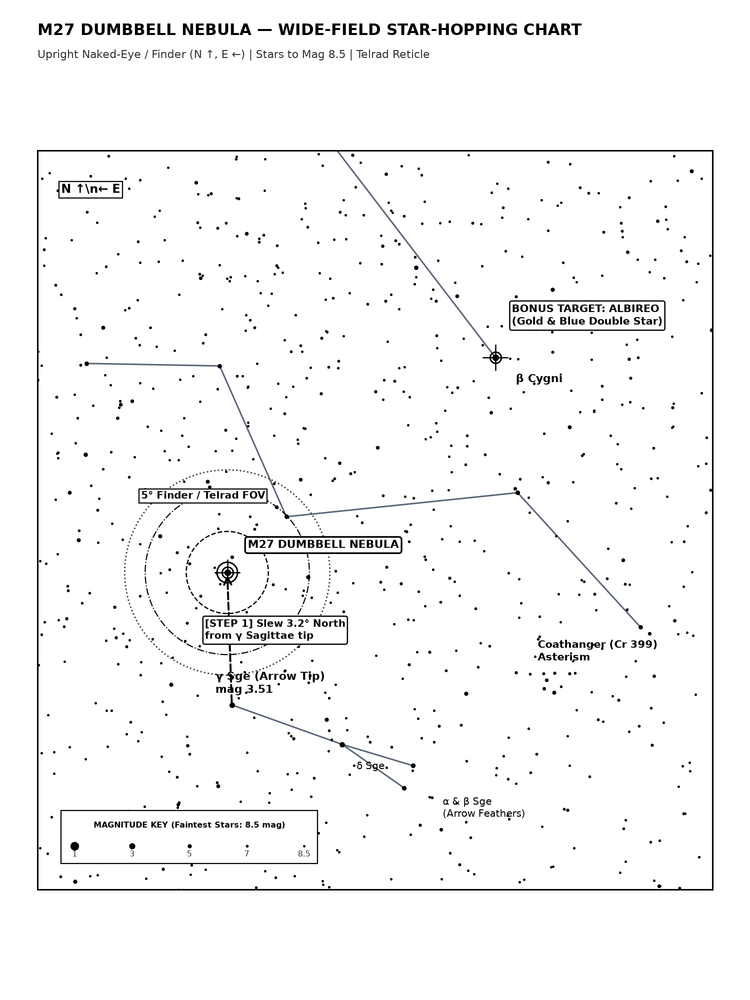

*([📄 Open Full High-Resolution Master A4 Finder Chart](shared/m27/chart_skywatcher-skyliner-200p.png))*

### 4. Observing Strategy & Step-by-Step Hop Instructions

- **Acquisition & Framing (20mm Super / 60×, 50' FOV)**:
  Ethereal apple-core / hourglass nebula glow floating prominently against the rich starry Milky Way background in Vulpecula.
- **High-Power Inspection & Detail (12.5mm / 96×, 31' FOV)**:
  12.5mm (96×) brings out the bright central waist, flanking outer 'ear' lobes, and subtle green-grey ionization tints under dark skies.

**Step-by-Step Star Hop Narrative**:
Locate Sagitta (The Arrow) just south of Albireo. From γ Sagittae (the arrow tip), slew 3.2° due North; M27 appears unmistakably in the center of the field.

---

## M28 (NGC 6626) — Sagittarius

[↑ Back to Catalog Index](#messier-catalog-index) • [← Previous: M27](#m27) • [Next: M29 →](#m29)

| Technical Parameter | Specification |
| :--- | :--- |
| **Designation** | M28 (NGC 6626) |
| **Constellation** | Sagittarius |
| **Classification** | Globular Cluster (GC) |
| **Visual Magnitude ($V$)** | 6.9 mag |
| **Apparent Dimensions** | 11.2' × 11.2' |
| **Estimated Distance** | ~17,941 light-years |
| **Swanson Difficulty** | **Medium** (*NexStar User's Guide II*) |
| **Coordinates (J2000)** | RA **18h 24m 32.9s** • Dec **-24° 52' 11.4"** |
| **Recommended Eyepiece** | 12.5mm (96× magnification, 31' TFOV, 2.1mm exit pupil) |

### 1. Telescope Eyepiece Simulation & Technical Dossier
> [!NOTE]
> **Viewport B** depicts the pre-inverted 180° field view through the Newtonian reflector (12.5mm eyepiece / 96× magnification, 31' true field of view: South at top, West at left, N ↓, E →). **Viewport C** integrates target ephemeris and optical notes.

### 2. Constellation Context & Regional Orientation Chart
> [!TIP]
> **Viewport Context** presents a wide ~50°–65° naked-eye orientation field (stars down to visual magnitude 6.5) with official IAU constellation guide lines. The dashed bounding box marks the exact area covered by the wide-field star-hopping chart below.

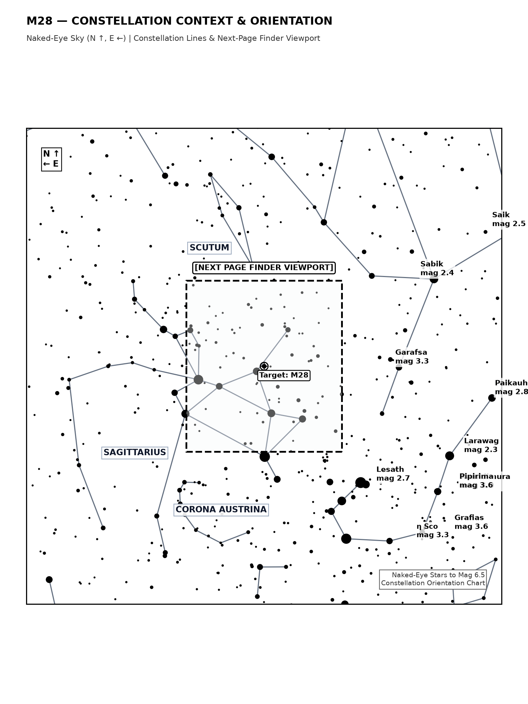

### 3. Wide-Field Star-Hopping Finder Chart
> [!IMPORTANT]
> **Viewport A** provides an upright naked-eye / optical finder orientation (N ↑, E ←) with stars down to visual magnitude 8.5. Standard concentric Telrad rings (0.5°, 2.0°, 4.0°) and 5.0° finder circle are centered directly on the target.

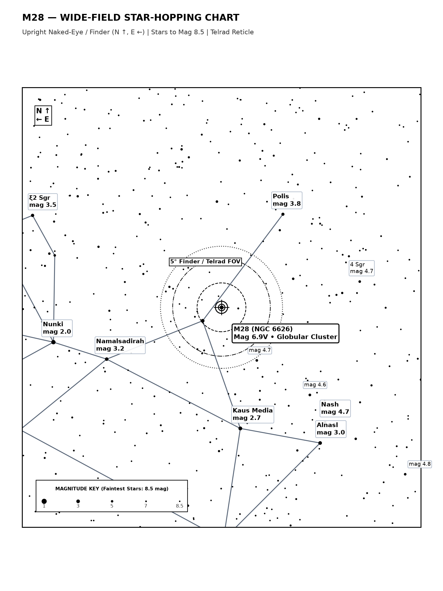

*([📄 Open Full High-Resolution Master A4 Finder Chart](shared/m28/chart_skywatcher-skyliner-200p.png))*

### 4. Observing Strategy & Step-by-Step Hop Instructions

- **Acquisition & Framing (20mm Super / 60×, 50' FOV)**:
  Noticeable circular misty ball with bright concentrated core floating against a dark starry backdrop in Sagittarius.
- **High-Power Inspection & Detail (12.5mm / 96×, 31' FOV)**:
  12.5mm (96×) resolves the outer edges into sharp, glittering diamond star points; averted vision reveals rich granularity across the core.

**Step-by-Step Star Hop Narrative**:
Locate anchor constellation Sagittarius on the Context Chart. Slew Telrad reticle to RA 276.14°, Dec -24.87° and center the fuzzy ball in the 20mm finder eyepiece.

---

## M29 (NGC 6913) — Cygnus

[↑ Back to Catalog Index](#messier-catalog-index) • [← Previous: M28](#m28) • [Next: M30 →](#m30)

| Technical Parameter | Specification |
| :--- | :--- |
| **Designation** | M29 (NGC 6913) |
| **Constellation** | Cygnus |
| **Classification** | Open Cluster (OC) |
| **Visual Magnitude ($V$)** | 6.6 mag |
| **Apparent Dimensions** | 10.0' × 10.0' |
| **Estimated Distance** | ~13,048 light-years |
| **Swanson Difficulty** | **Easy** (*NexStar User's Guide II*) |
| **Coordinates (J2000)** | RA **20h 23m 55.9s** • Dec **+38° 31' 22.8"** |
| **Recommended Eyepiece** | 12.5mm (96× magnification, 31' TFOV, 2.1mm exit pupil) |

### 1. Telescope Eyepiece Simulation & Technical Dossier
> [!NOTE]
> **Viewport B** depicts the pre-inverted 180° field view through the Newtonian reflector (12.5mm eyepiece / 96× magnification, 31' true field of view: South at top, West at left, N ↓, E →). **Viewport C** integrates target ephemeris and optical notes.

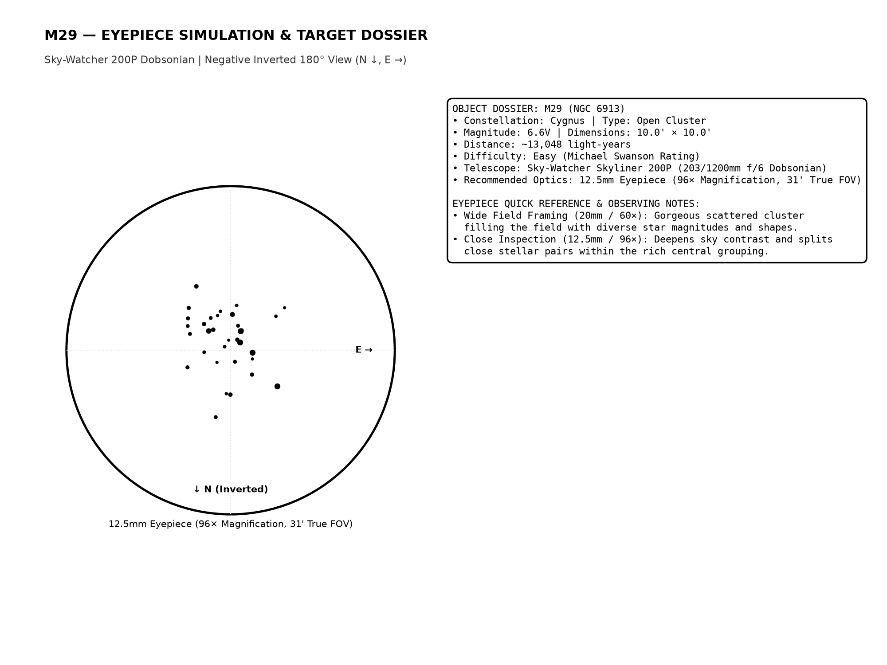

### 2. Constellation Context & Regional Orientation Chart
> [!TIP]
> **Viewport Context** presents a wide ~50°–65° naked-eye orientation field (stars down to visual magnitude 6.5) with official IAU constellation guide lines. The dashed bounding box marks the exact area covered by the wide-field star-hopping chart below.

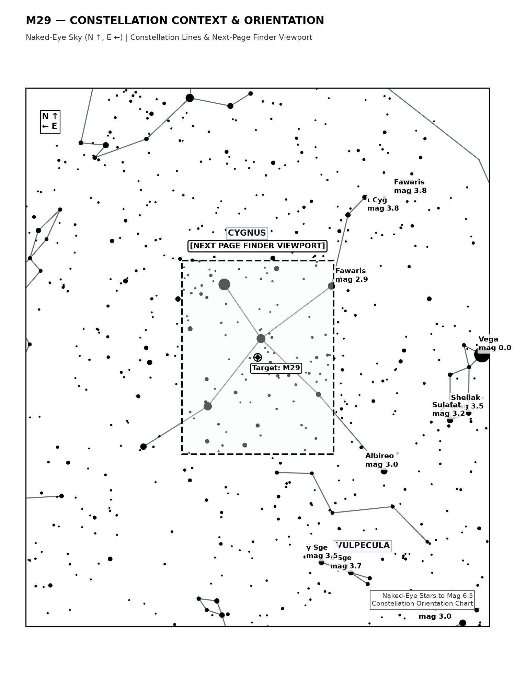

### 3. Wide-Field Star-Hopping Finder Chart
> [!IMPORTANT]
> **Viewport A** provides an upright naked-eye / optical finder orientation (N ↑, E ←) with stars down to visual magnitude 8.5. Standard concentric Telrad rings (0.5°, 2.0°, 4.0°) and 5.0° finder circle are centered directly on the target.

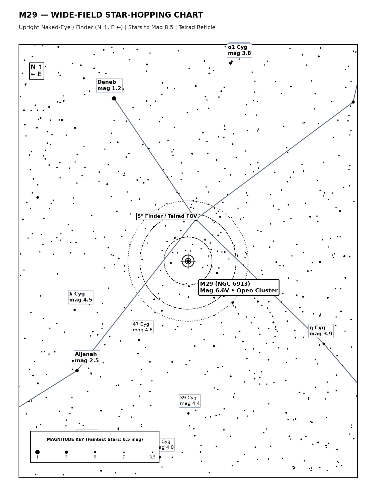

*([📄 Open Full High-Resolution Master A4 Finder Chart](shared/m29/chart_skywatcher-skyliner-200p.png))*

### 4. Observing Strategy & Step-by-Step Hop Instructions

- **Acquisition & Framing (20mm Super / 60×, 50' FOV)**:
  Gorgeous scattered star cluster filling the field with diverse stellar magnitudes and pleasing geometric groupings.
- **High-Power Inspection & Detail (12.5mm / 96×, 31' FOV)**:
  12.5mm (96×) deepens sky contrast and splits intimate stellar pairs and chains within the rich central grouping.

**Step-by-Step Star Hop Narrative**:
Locate Cygnus via Context Chart. Align Telrad reticle to target coordinates (RA 305.98°, Dec 38.52°); cluster stars emerge immediately in the finder.

---

## M30 (NGC 7099) — Capricornus

[↑ Back to Catalog Index](#messier-catalog-index) • [← Previous: M29](#m29) • [Next: M31 →](#m31)

| Technical Parameter | Specification |
| :--- | :--- |
| **Designation** | M30 (NGC 7099) |
| **Constellation** | Capricornus |
| **Classification** | Globular Cluster (GC) |
| **Visual Magnitude ($V$)** | 6.9 mag |
| **Apparent Dimensions** | 12.0' × 12.0' |
| **Estimated Distance** | ~27,074 light-years |
| **Swanson Difficulty** | **Medium** (*NexStar User's Guide II*) |
| **Coordinates (J2000)** | RA **21h 40m 22.1s** • Dec **-23° 10' 47.5"** |
| **Recommended Eyepiece** | 12.5mm (96× magnification, 31' TFOV, 2.1mm exit pupil) |

### 1. Telescope Eyepiece Simulation & Technical Dossier
> [!NOTE]
> **Viewport B** depicts the pre-inverted 180° field view through the Newtonian reflector (12.5mm eyepiece / 96× magnification, 31' true field of view: South at top, West at left, N ↓, E →). **Viewport C** integrates target ephemeris and optical notes.

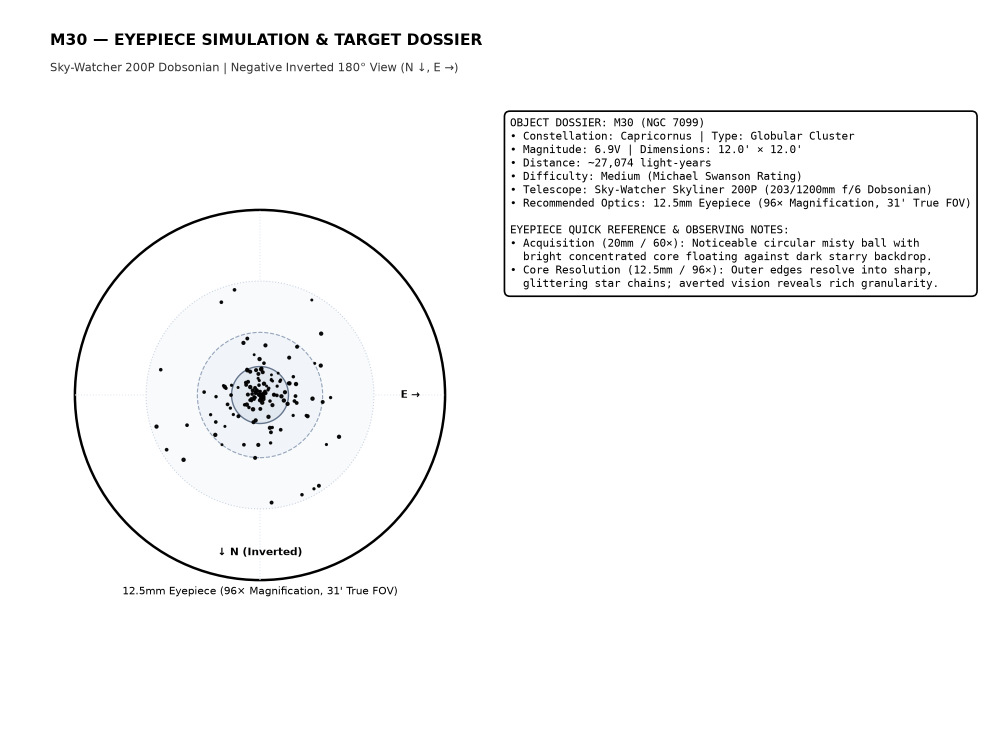

### 2. Constellation Context & Regional Orientation Chart
> [!TIP]
> **Viewport Context** presents a wide ~50°–65° naked-eye orientation field (stars down to visual magnitude 6.5) with official IAU constellation guide lines. The dashed bounding box marks the exact area covered by the wide-field star-hopping chart below.

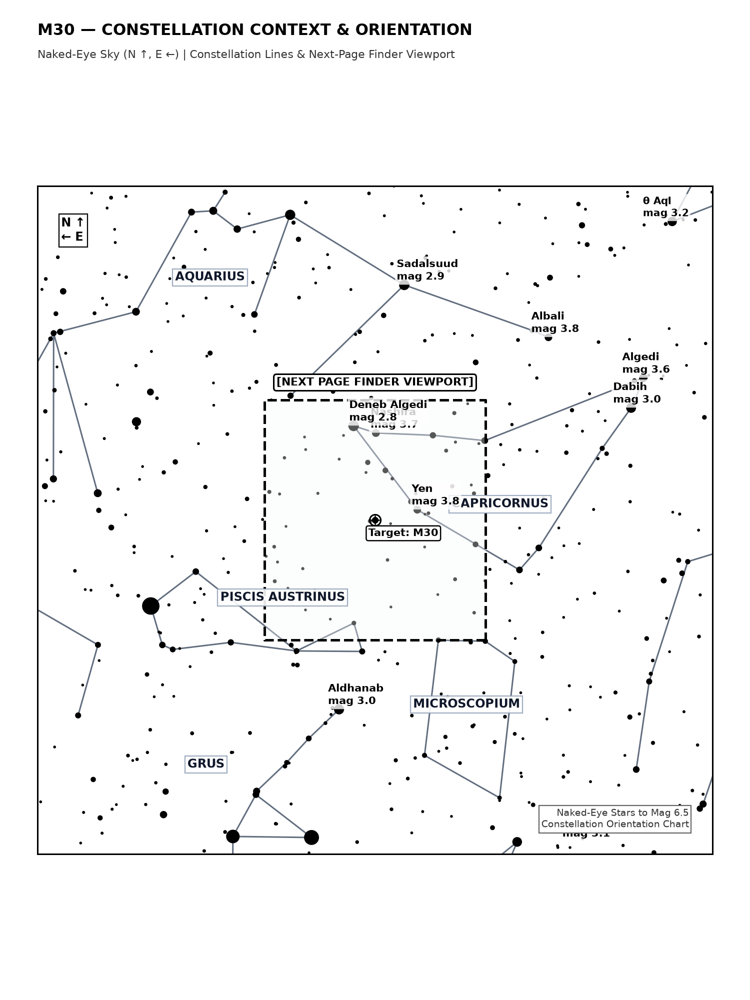

### 3. Wide-Field Star-Hopping Finder Chart
> [!IMPORTANT]
> **Viewport A** provides an upright naked-eye / optical finder orientation (N ↑, E ←) with stars down to visual magnitude 8.5. Standard concentric Telrad rings (0.5°, 2.0°, 4.0°) and 5.0° finder circle are centered directly on the target.

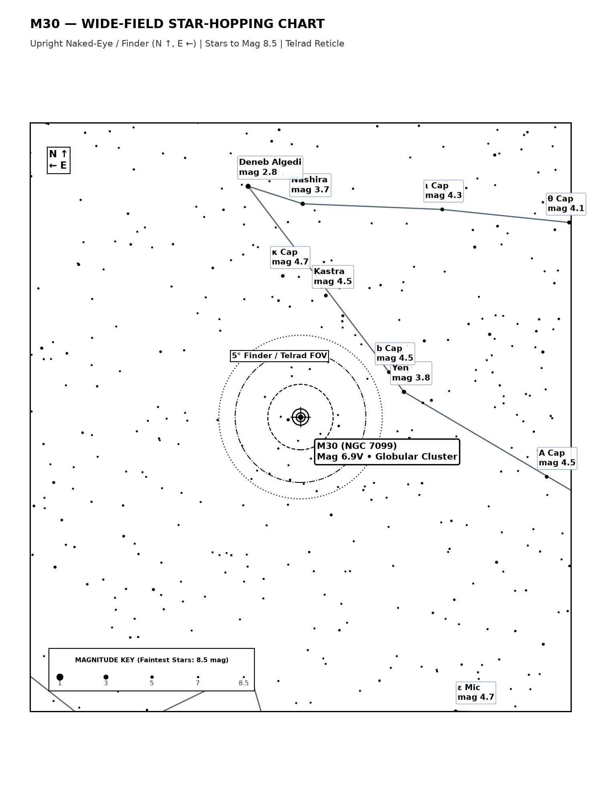

*([📄 Open Full High-Resolution Master A4 Finder Chart](shared/m30/chart_skywatcher-skyliner-200p.png))*

### 4. Observing Strategy & Step-by-Step Hop Instructions

- **Acquisition & Framing (20mm Super / 60×, 50' FOV)**:
  Noticeable circular misty ball with bright concentrated core floating against a dark starry backdrop in Capricornus.
- **High-Power Inspection & Detail (12.5mm / 96×, 31' FOV)**:
  12.5mm (96×) resolves the outer edges into sharp, glittering diamond star points; averted vision reveals rich granularity across the core.

**Step-by-Step Star Hop Narrative**:
Locate anchor constellation Capricornus on the Context Chart. Slew Telrad reticle to RA 325.09°, Dec -23.18° and center the fuzzy ball in the 20mm finder eyepiece.

---

## M31 Andromeda Galaxy (NGC 224) — Andromeda

[↑ Back to Catalog Index](#messier-catalog-index) • [← Previous: M30](#m30) • [Next: M32 →](#m32)

| Technical Parameter | Specification |
| :--- | :--- |
| **Designation** | M31 (NGC 224) |
| **Common Name** | **Andromeda Galaxy** |
| **Constellation** | Andromeda |
| **Classification** | Spiral Galaxy (Galaxy) |
| **Visual Magnitude ($V$)** | 3.4 mag |
| **Apparent Dimensions** | 189.1' × 61.7' |
| **Estimated Distance** | ~2,537,836 light-years |
| **Swanson Difficulty** | **Easy** (*NexStar User's Guide II*) |
| **Coordinates (J2000)** | RA **0h 42m 44.3s** • Dec **+41° 16' 07.5"** |
| **Recommended Eyepiece** | 20mm (60× magnification, 49' TFOV, 3.4mm exit pupil) |

### 1. Telescope Eyepiece Simulation & Technical Dossier
> [!NOTE]
> **Viewport B** depicts the pre-inverted 180° field view through the Newtonian reflector (20mm eyepiece / 60× magnification, 49' true field of view: South at top, West at left, N ↓, E →). **Viewport C** integrates target ephemeris and optical notes.

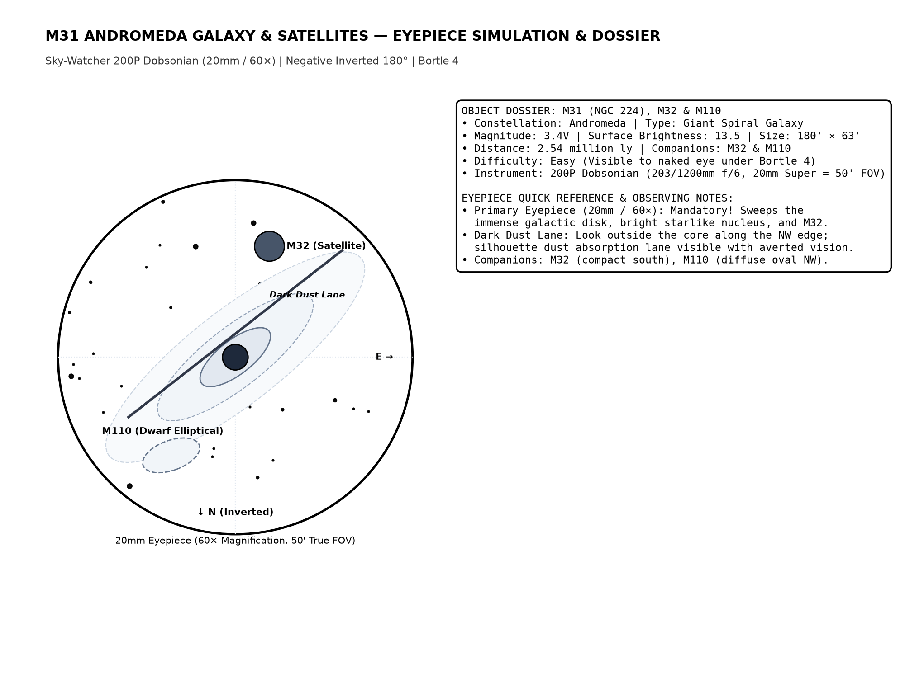

### 2. Constellation Context & Regional Orientation Chart
> [!TIP]
> **Viewport Context** presents a wide ~50°–65° naked-eye orientation field (stars down to visual magnitude 6.5) with official IAU constellation guide lines. The dashed bounding box marks the exact area covered by the wide-field star-hopping chart below.

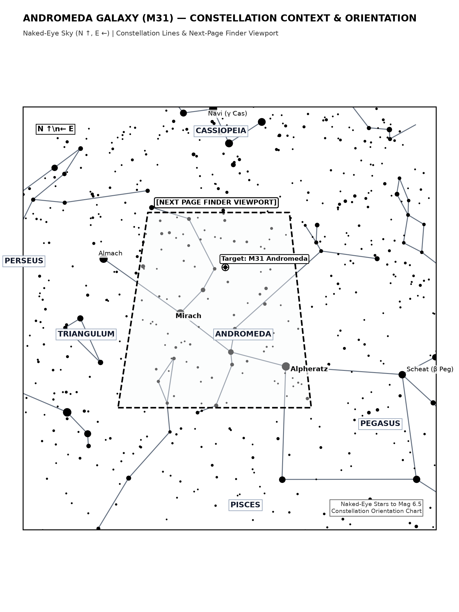

### 3. Wide-Field Star-Hopping Finder Chart
> [!IMPORTANT]
> **Viewport A** provides an upright naked-eye / optical finder orientation (N ↑, E ←) with stars down to visual magnitude 8.5. Standard concentric Telrad rings (0.5°, 2.0°, 4.0°) and 5.0° finder circle are centered directly on the target.

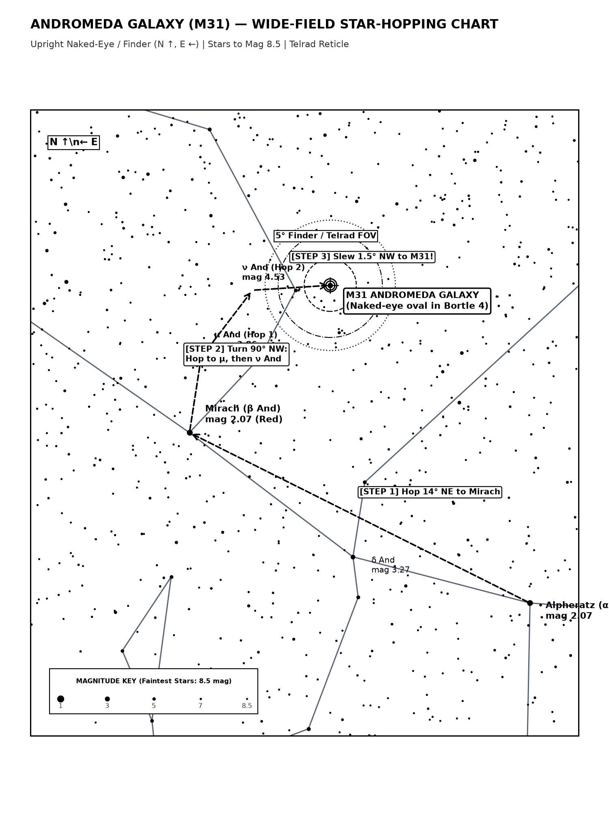

*([📄 Open Full High-Resolution Master A4 Finder Chart](shared/m31/chart_skywatcher-skyliner-200p.png))*

### 4. Observing Strategy & Step-by-Step Hop Instructions

- **Acquisition & Framing (20mm Super / 60×, 50' FOV)**:
  Magnificent Andromeda Galaxy; naked-eye visible under Bortle 4 skies. Sweeps the entire 50' field of view in the 20mm Super eyepiece.
- **High-Power Inspection & Detail (20mm / 60×, 49' FOV)**:
  20mm (60×) captures the brilliant concentrated galactic nucleus, sprawling spiral disk, satellite dwarf galaxy M32 to the south, companion M110 to the northwest, and the prominent dark dust absorption lane along the northwest flank.

**Step-by-Step Star Hop Narrative**:
From the Great Square of Pegasus, identify Alpheratz (α And). Follow the Andromeda chain 7° to δ And, then 7° to reddish Mirach (β And). Turn 90° NW: hop 3.5° to μ And, then 3.5° to ν And. Slew 1.5° further NW into M31.

---

## M32 Satellite of M31 (NGC 221) — Andromeda

[↑ Back to Catalog Index](#messier-catalog-index) • [← Previous: M31](#m31) • [Next: M33 →](#m33)

| Technical Parameter | Specification |
| :--- | :--- |
| **Designation** | M32 (NGC 221) |
| **Common Name** | **Satellite of M31** |
| **Constellation** | Andromeda |
| **Classification** | Elliptical Galaxy (Galaxy) |
| **Visual Magnitude ($V$)** | 8.1 mag |
| **Apparent Dimensions** | 8.5' × 6.5' |
| **Estimated Distance** | ~2,488,906 light-years |
| **Swanson Difficulty** | **Medium** (*NexStar User's Guide II*) |
| **Coordinates (J2000)** | RA **0h 42m 41.8s** • Dec **+40° 51' 54.6"** |
| **Recommended Eyepiece** | 12.5mm (96× magnification, 31' TFOV, 2.1mm exit pupil) |

### 1. Telescope Eyepiece Simulation & Technical Dossier
> [!NOTE]
> **Viewport B** depicts the pre-inverted 180° field view through the Newtonian reflector (12.5mm eyepiece / 96× magnification, 31' true field of view: South at top, West at left, N ↓, E →). **Viewport C** integrates target ephemeris and optical notes.

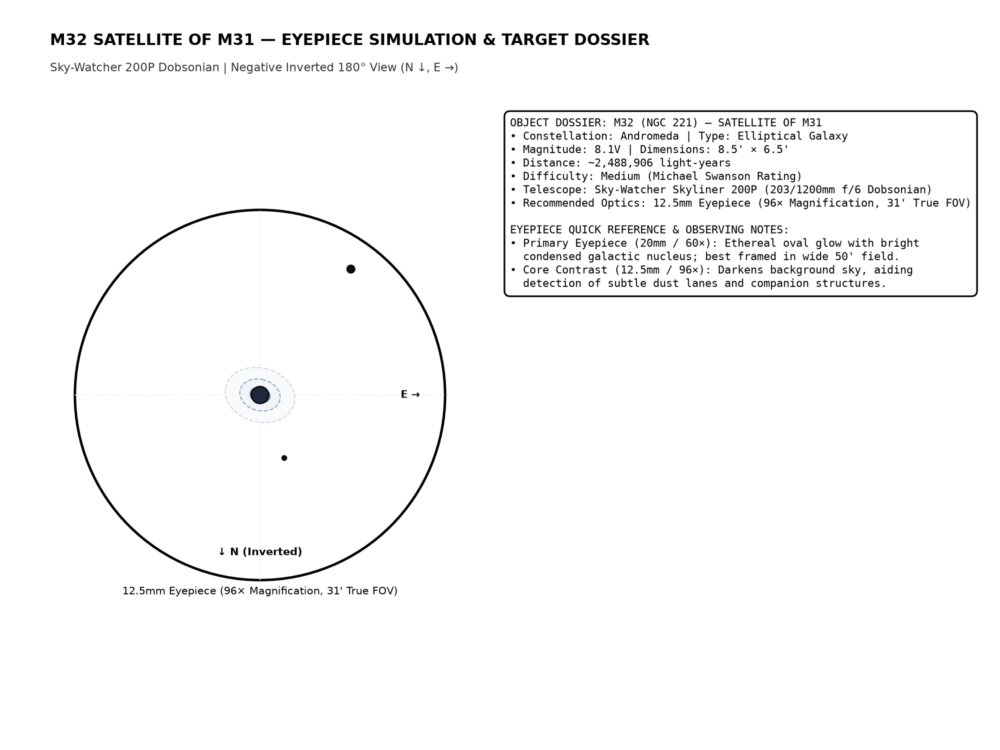

### 2. Constellation Context & Regional Orientation Chart
> [!TIP]
> **Viewport Context** presents a wide ~50°–65° naked-eye orientation field (stars down to visual magnitude 6.5) with official IAU constellation guide lines. The dashed bounding box marks the exact area covered by the wide-field star-hopping chart below.

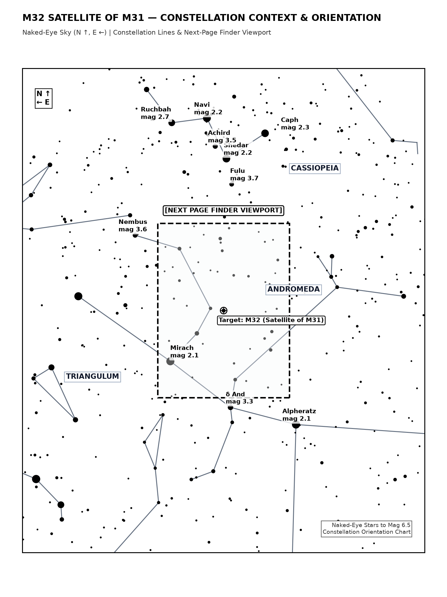

### 3. Wide-Field Star-Hopping Finder Chart
> [!IMPORTANT]
> **Viewport A** provides an upright naked-eye / optical finder orientation (N ↑, E ←) with stars down to visual magnitude 8.5. Standard concentric Telrad rings (0.5°, 2.0°, 4.0°) and 5.0° finder circle are centered directly on the target.

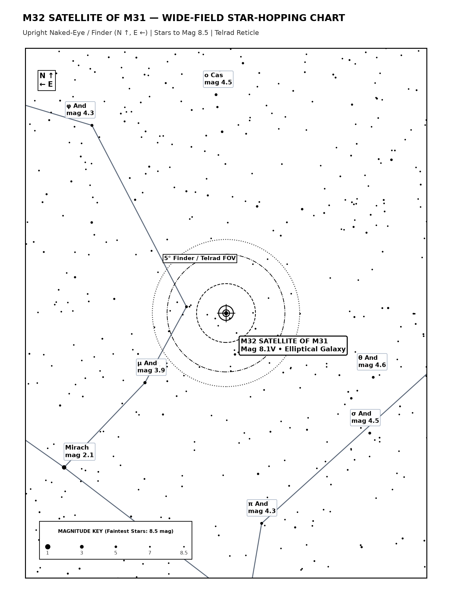

*([📄 Open Full High-Resolution Master A4 Finder Chart](shared/m32/chart_skywatcher-skyliner-200p.png))*

### 4. Observing Strategy & Step-by-Step Hop Instructions

- **Acquisition & Framing (20mm Super / 60×, 50' FOV)**:
  Ethereal oval glow with condensed galactic nucleus; framing the galaxy within the wide 50' field maximizes contrast against the sky.
- **High-Power Inspection & Detail (12.5mm / 96×, 31' FOV)**:
  12.5mm (96×) darkens the background sky, aiding detection of subtle core elongation, dust lanes, and halo extent with averted vision.

**Step-by-Step Star Hop Narrative**:
Locate constellation Andromeda. Follow the guide stars on the Wide-Field Chart to RA 10.67°, Dec 40.87°; look for a soft hazy smudge.

---

## M33 Triangulum/Pinwheel Galaxy (NGC 598) — Triangulum

[↑ Back to Catalog Index](#messier-catalog-index) • [← Previous: M32](#m32) • [Next: M34 →](#m34)

| Technical Parameter | Specification |
| :--- | :--- |
| **Designation** | M33 (NGC 598) |
| **Common Name** | **Triangulum/Pinwheel Galaxy** |
| **Constellation** | Triangulum |
| **Classification** | Spiral Galaxy (Galaxy) |
| **Visual Magnitude ($V$)** | 5.7 mag |
| **Apparent Dimensions** | 68.7' × 41.6' |
| **Estimated Distance** | ~2,723,770 light-years |
| **Swanson Difficulty** | **Hard** (*NexStar User's Guide II*) |
| **Coordinates (J2000)** | RA **1h 33m 50.9s** • Dec **+30° 39' 35.8"** |
| **Recommended Eyepiece** | 20mm (60× magnification, 49' TFOV, 3.4mm exit pupil) |

### 1. Telescope Eyepiece Simulation & Technical Dossier
> [!NOTE]
> **Viewport B** depicts the pre-inverted 180° field view through the Newtonian reflector (20mm eyepiece / 60× magnification, 49' true field of view: South at top, West at left, N ↓, E →). **Viewport C** integrates target ephemeris and optical notes.

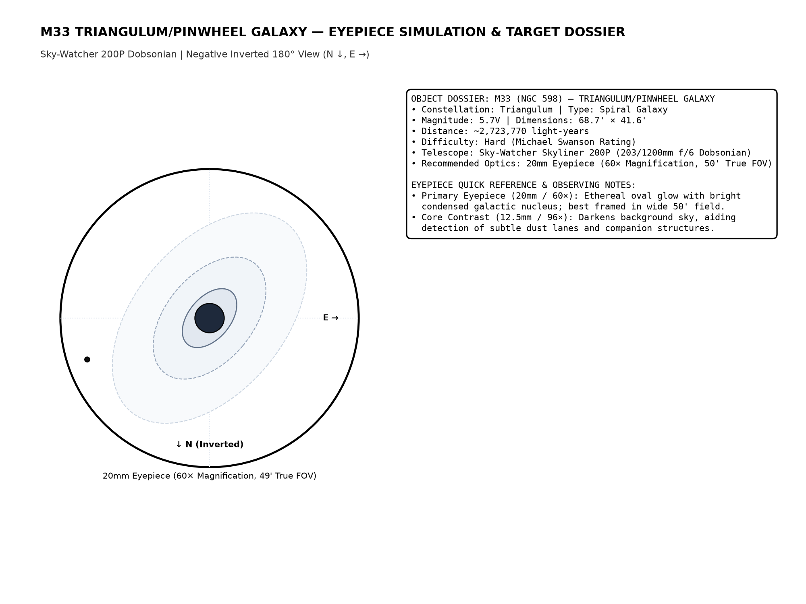

### 2. Constellation Context & Regional Orientation Chart
> [!TIP]
> **Viewport Context** presents a wide ~50°–65° naked-eye orientation field (stars down to visual magnitude 6.5) with official IAU constellation guide lines. The dashed bounding box marks the exact area covered by the wide-field star-hopping chart below.

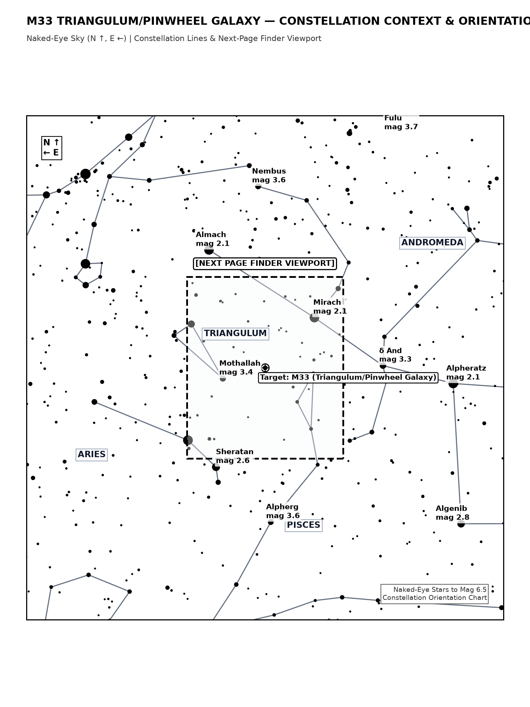

### 3. Wide-Field Star-Hopping Finder Chart
> [!IMPORTANT]
> **Viewport A** provides an upright naked-eye / optical finder orientation (N ↑, E ←) with stars down to visual magnitude 8.5. Standard concentric Telrad rings (0.5°, 2.0°, 4.0°) and 5.0° finder circle are centered directly on the target.

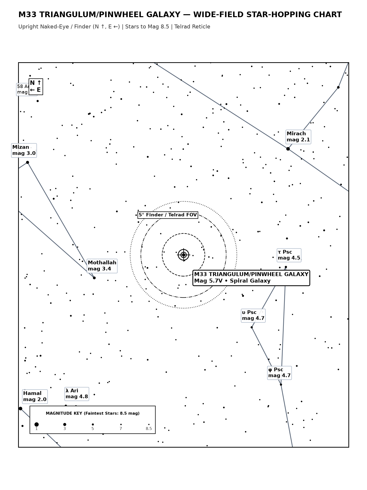

*([📄 Open Full High-Resolution Master A4 Finder Chart](shared/m33/chart_skywatcher-skyliner-200p.png))*

### 4. Observing Strategy & Step-by-Step Hop Instructions

- **Acquisition & Framing (20mm Super / 60×, 50' FOV)**:
  Ethereal oval glow with condensed galactic nucleus; framing the galaxy within the wide 50' field maximizes contrast against the sky.
- **High-Power Inspection & Detail (20mm / 60×, 49' FOV)**:
  20mm (60×) darkens the background sky, aiding detection of subtle core elongation, dust lanes, and halo extent with averted vision.

**Step-by-Step Star Hop Narrative**:
Locate constellation Triangulum. Follow the guide stars on the Wide-Field Chart to RA 23.46°, Dec 30.66°; look for a soft hazy smudge.

---

## M34 (NGC 1039) — Perseus

[↑ Back to Catalog Index](#messier-catalog-index) • [← Previous: M33](#m33) • [Next: M35 →](#m35)

| Technical Parameter | Specification |
| :--- | :--- |
| **Designation** | M34 (NGC 1039) |
| **Constellation** | Perseus |
| **Classification** | Open Cluster (OC) |
| **Visual Magnitude ($V$)** | 5.2 mag |
| **Apparent Dimensions** | 25.0' × 25.0' |
| **Estimated Distance** | ~1533 light-years |
| **Swanson Difficulty** | **Easy** (*NexStar User's Guide II*) |
| **Coordinates (J2000)** | RA **2h 42m 05.0s** • Dec **+42° 45' 43.2"** |
| **Recommended Eyepiece** | 20mm (60× magnification, 49' TFOV, 3.4mm exit pupil) |

### 1. Telescope Eyepiece Simulation & Technical Dossier
> [!NOTE]
> **Viewport B** depicts the pre-inverted 180° field view through the Newtonian reflector (20mm eyepiece / 60× magnification, 49' true field of view: South at top, West at left, N ↓, E →). **Viewport C** integrates target ephemeris and optical notes.

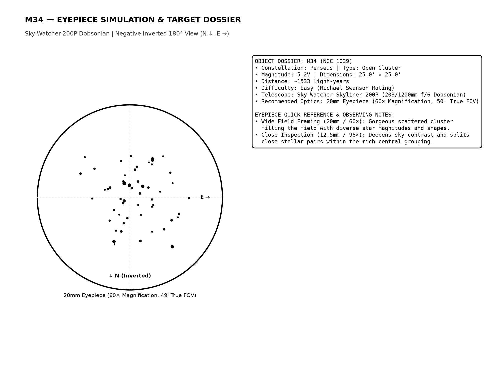

### 2. Constellation Context & Regional Orientation Chart
> [!TIP]
> **Viewport Context** presents a wide ~50°–65° naked-eye orientation field (stars down to visual magnitude 6.5) with official IAU constellation guide lines. The dashed bounding box marks the exact area covered by the wide-field star-hopping chart below.

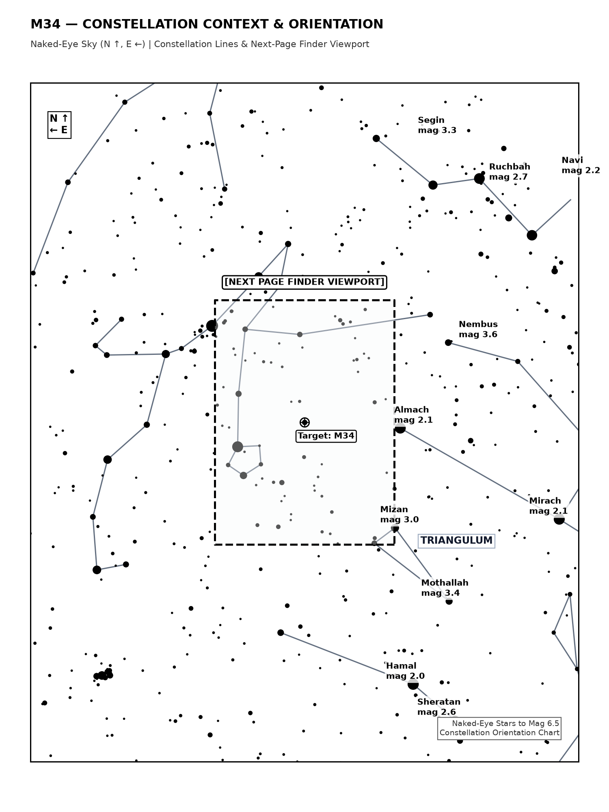

### 3. Wide-Field Star-Hopping Finder Chart
> [!IMPORTANT]
> **Viewport A** provides an upright naked-eye / optical finder orientation (N ↑, E ←) with stars down to visual magnitude 8.5. Standard concentric Telrad rings (0.5°, 2.0°, 4.0°) and 5.0° finder circle are centered directly on the target.

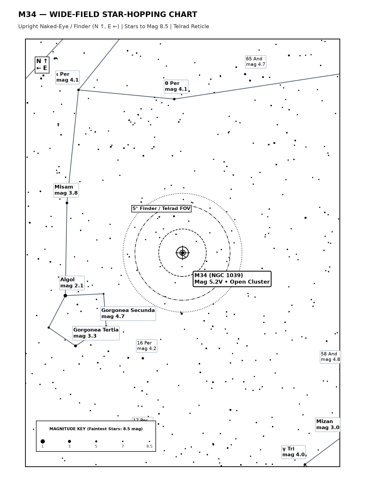

*([📄 Open Full High-Resolution Master A4 Finder Chart](shared/m34/chart_skywatcher-skyliner-200p.png))*

### 4. Observing Strategy & Step-by-Step Hop Instructions

- **Acquisition & Framing (20mm Super / 60×, 50' FOV)**:
  Gorgeous scattered star cluster filling the field with diverse stellar magnitudes and pleasing geometric groupings.
- **High-Power Inspection & Detail (20mm / 60×, 49' FOV)**:
  20mm (60×) deepens sky contrast and splits intimate stellar pairs and chains within the rich central grouping.

**Step-by-Step Star Hop Narrative**:
Locate Perseus via Context Chart. Align Telrad reticle to target coordinates (RA 40.52°, Dec 42.76°); cluster stars emerge immediately in the finder.

---

## M35 (NGC 2168) — Gemini

[↑ Back to Catalog Index](#messier-catalog-index) • [← Previous: M34](#m34) • [Next: M36 →](#m36)

| Technical Parameter | Specification |
| :--- | :--- |
| **Designation** | M35 (NGC 2168) |
| **Constellation** | Gemini |
| **Classification** | Open Cluster (OC) |
| **Visual Magnitude ($V$)** | 5.1 mag |
| **Apparent Dimensions** | 25.0' × 25.0' |
| **Estimated Distance** | ~2772 light-years |
| **Swanson Difficulty** | **Easy** (*NexStar User's Guide II*) |
| **Coordinates (J2000)** | RA **6h 08m 54.0s** • Dec **+24° 19' 58.8"** |
| **Recommended Eyepiece** | 20mm (60× magnification, 49' TFOV, 3.4mm exit pupil) |

### 1. Telescope Eyepiece Simulation & Technical Dossier
> [!NOTE]
> **Viewport B** depicts the pre-inverted 180° field view through the Newtonian reflector (20mm eyepiece / 60× magnification, 49' true field of view: South at top, West at left, N ↓, E →). **Viewport C** integrates target ephemeris and optical notes.

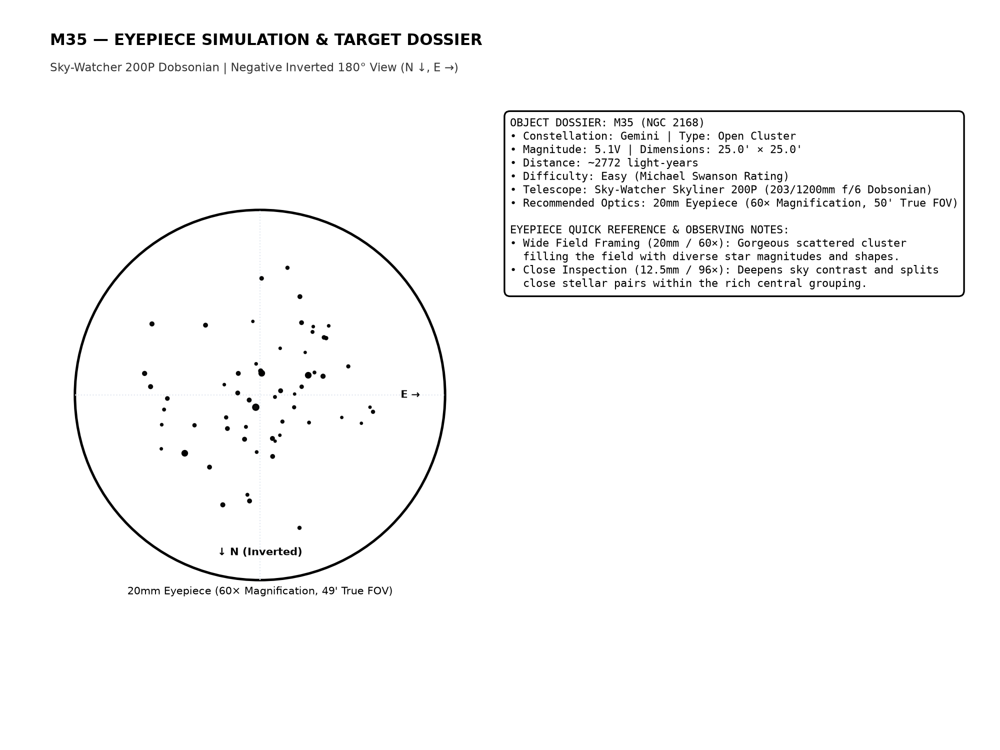

### 2. Constellation Context & Regional Orientation Chart
> [!TIP]
> **Viewport Context** presents a wide ~50°–65° naked-eye orientation field (stars down to visual magnitude 6.5) with official IAU constellation guide lines. The dashed bounding box marks the exact area covered by the wide-field star-hopping chart below.

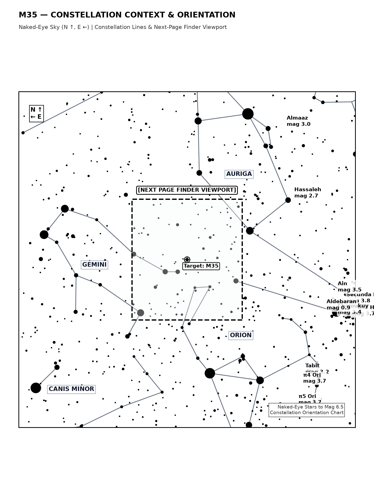

### 3. Wide-Field Star-Hopping Finder Chart
> [!IMPORTANT]
> **Viewport A** provides an upright naked-eye / optical finder orientation (N ↑, E ←) with stars down to visual magnitude 8.5. Standard concentric Telrad rings (0.5°, 2.0°, 4.0°) and 5.0° finder circle are centered directly on the target.

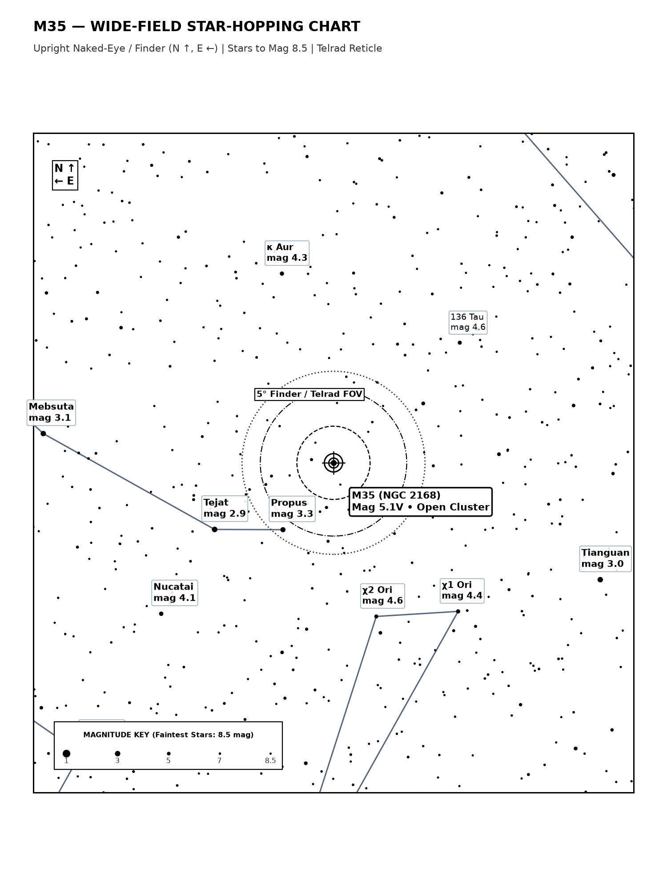

*([📄 Open Full High-Resolution Master A4 Finder Chart](shared/m35/chart_skywatcher-skyliner-200p.png))*

### 4. Observing Strategy & Step-by-Step Hop Instructions

- **Acquisition & Framing (20mm Super / 60×, 50' FOV)**:
  Gorgeous scattered star cluster filling the field with diverse stellar magnitudes and pleasing geometric groupings.
- **High-Power Inspection & Detail (20mm / 60×, 49' FOV)**:
  20mm (60×) deepens sky contrast and splits intimate stellar pairs and chains within the rich central grouping.

**Step-by-Step Star Hop Narrative**:
Locate Gemini via Context Chart. Align Telrad reticle to target coordinates (RA 92.22°, Dec 24.33°); cluster stars emerge immediately in the finder.

---

## M36 (NGC 1960) — Auriga

[↑ Back to Catalog Index](#messier-catalog-index) • [← Previous: M35](#m35) • [Next: M37 →](#m37)

| Technical Parameter | Specification |
| :--- | :--- |
| **Designation** | M36 (NGC 1960) |
| **Constellation** | Auriga |
| **Classification** | Open Cluster (OC) |
| **Visual Magnitude ($V$)** | 6.0 mag |
| **Apparent Dimensions** | 10.0' × 10.0' |
| **Estimated Distance** | ~4,240 light-years |
| **Swanson Difficulty** | **Easy** (*NexStar User's Guide II*) |
| **Coordinates (J2000)** | RA **5h 36m 18.0s** • Dec **+34° 08' 24.0"** |
| **Recommended Eyepiece** | 12.5mm (96× magnification, 31' TFOV, 2.1mm exit pupil) |

### 1. Telescope Eyepiece Simulation & Technical Dossier
> [!NOTE]
> **Viewport B** depicts the pre-inverted 180° field view through the Newtonian reflector (12.5mm eyepiece / 96× magnification, 31' true field of view: South at top, West at left, N ↓, E →). **Viewport C** integrates target ephemeris and optical notes.

### 2. Constellation Context & Regional Orientation Chart
> [!TIP]
> **Viewport Context** presents a wide ~50°–65° naked-eye orientation field (stars down to visual magnitude 6.5) with official IAU constellation guide lines. The dashed bounding box marks the exact area covered by the wide-field star-hopping chart below.

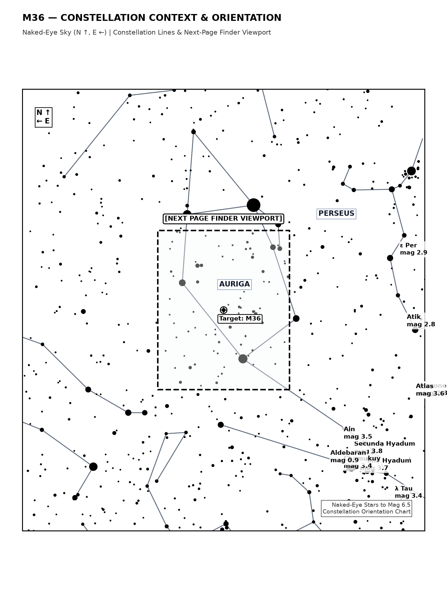

### 3. Wide-Field Star-Hopping Finder Chart
> [!IMPORTANT]
> **Viewport A** provides an upright naked-eye / optical finder orientation (N ↑, E ←) with stars down to visual magnitude 8.5. Standard concentric Telrad rings (0.5°, 2.0°, 4.0°) and 5.0° finder circle are centered directly on the target.

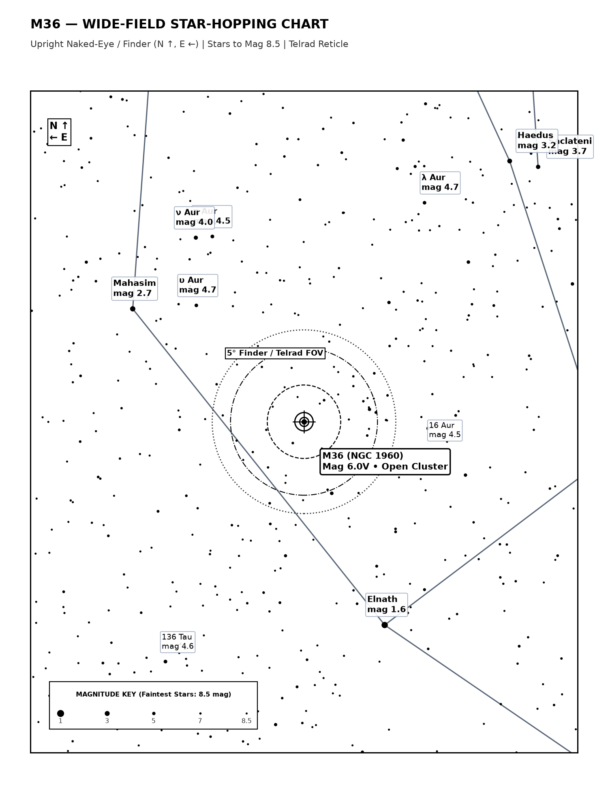

*([📄 Open Full High-Resolution Master A4 Finder Chart](shared/m36/chart_skywatcher-skyliner-200p.png))*

### 4. Observing Strategy & Step-by-Step Hop Instructions

- **Acquisition & Framing (20mm Super / 60×, 50' FOV)**:
  Gorgeous scattered star cluster filling the field with diverse stellar magnitudes and pleasing geometric groupings.
- **High-Power Inspection & Detail (12.5mm / 96×, 31' FOV)**:
  12.5mm (96×) deepens sky contrast and splits intimate stellar pairs and chains within the rich central grouping.

**Step-by-Step Star Hop Narrative**:
Locate Auriga via Context Chart. Align Telrad reticle to target coordinates (RA 84.08°, Dec 34.14°); cluster stars emerge immediately in the finder.

---

## M37 (NGC 2099) — Auriga

[↑ Back to Catalog Index](#messier-catalog-index) • [← Previous: M36](#m36) • [Next: M38 →](#m38)

| Technical Parameter | Specification |
| :--- | :--- |
| **Designation** | M37 (NGC 2099) |
| **Constellation** | Auriga |
| **Classification** | Open Cluster (OC) |
| **Visual Magnitude ($V$)** | 5.6 mag |
| **Apparent Dimensions** | 15.0' × 15.0' |
| **Estimated Distance** | ~4,511 light-years |
| **Swanson Difficulty** | **Easy** (*NexStar User's Guide II*) |
| **Coordinates (J2000)** | RA **5h 52m 18.0s** • Dec **+32° 33' 10.8"** |
| **Recommended Eyepiece** | 20mm (60× magnification, 49' TFOV, 3.4mm exit pupil) |

### 1. Telescope Eyepiece Simulation & Technical Dossier
> [!NOTE]
> **Viewport B** depicts the pre-inverted 180° field view through the Newtonian reflector (20mm eyepiece / 60× magnification, 49' true field of view: South at top, West at left, N ↓, E →). **Viewport C** integrates target ephemeris and optical notes.

### 2. Constellation Context & Regional Orientation Chart
> [!TIP]
> **Viewport Context** presents a wide ~50°–65° naked-eye orientation field (stars down to visual magnitude 6.5) with official IAU constellation guide lines. The dashed bounding box marks the exact area covered by the wide-field star-hopping chart below.

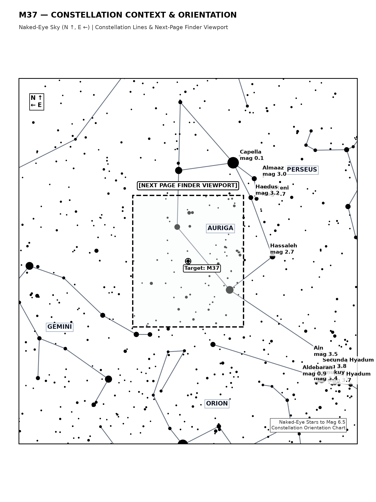

### 3. Wide-Field Star-Hopping Finder Chart
> [!IMPORTANT]
> **Viewport A** provides an upright naked-eye / optical finder orientation (N ↑, E ←) with stars down to visual magnitude 8.5. Standard concentric Telrad rings (0.5°, 2.0°, 4.0°) and 5.0° finder circle are centered directly on the target.

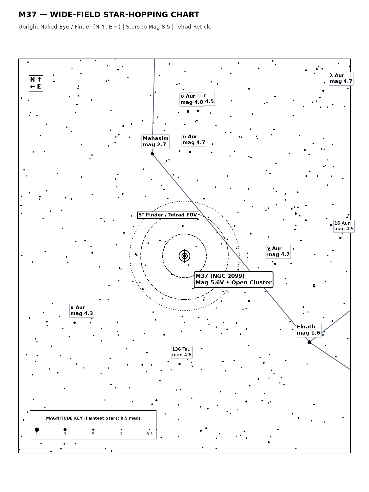

*([📄 Open Full High-Resolution Master A4 Finder Chart](shared/m37/chart_skywatcher-skyliner-200p.png))*

### 4. Observing Strategy & Step-by-Step Hop Instructions

- **Acquisition & Framing (20mm Super / 60×, 50' FOV)**:
  Gorgeous scattered star cluster filling the field with diverse stellar magnitudes and pleasing geometric groupings.
- **High-Power Inspection & Detail (20mm / 60×, 49' FOV)**:
  20mm (60×) deepens sky contrast and splits intimate stellar pairs and chains within the rich central grouping.

**Step-by-Step Star Hop Narrative**:
Locate Auriga via Context Chart. Align Telrad reticle to target coordinates (RA 88.08°, Dec 32.55°); cluster stars emerge immediately in the finder.

---

## M38 (NGC 1912) — Auriga

[↑ Back to Catalog Index](#messier-catalog-index) • [← Previous: M37](#m37) • [Next: M39 →](#m39)

| Technical Parameter | Specification |
| :--- | :--- |
| **Designation** | M38 (NGC 1912) |
| **Constellation** | Auriga |
| **Classification** | Open Cluster (OC) |
| **Visual Magnitude ($V$)** | 6.4 mag |
| **Apparent Dimensions** | 15.0' × 15.0' |
| **Estimated Distance** | ~4,240 light-years |
| **Swanson Difficulty** | **Easy** (*NexStar User's Guide II*) |
| **Coordinates (J2000)** | RA **5h 28m 43.0s** • Dec **+35° 51' 18.0"** |
| **Recommended Eyepiece** | 20mm (60× magnification, 49' TFOV, 3.4mm exit pupil) |

### 1. Telescope Eyepiece Simulation & Technical Dossier
> [!NOTE]
> **Viewport B** depicts the pre-inverted 180° field view through the Newtonian reflector (20mm eyepiece / 60× magnification, 49' true field of view: South at top, West at left, N ↓, E →). **Viewport C** integrates target ephemeris and optical notes.

### 2. Constellation Context & Regional Orientation Chart
> [!TIP]
> **Viewport Context** presents a wide ~50°–65° naked-eye orientation field (stars down to visual magnitude 6.5) with official IAU constellation guide lines. The dashed bounding box marks the exact area covered by the wide-field star-hopping chart below.

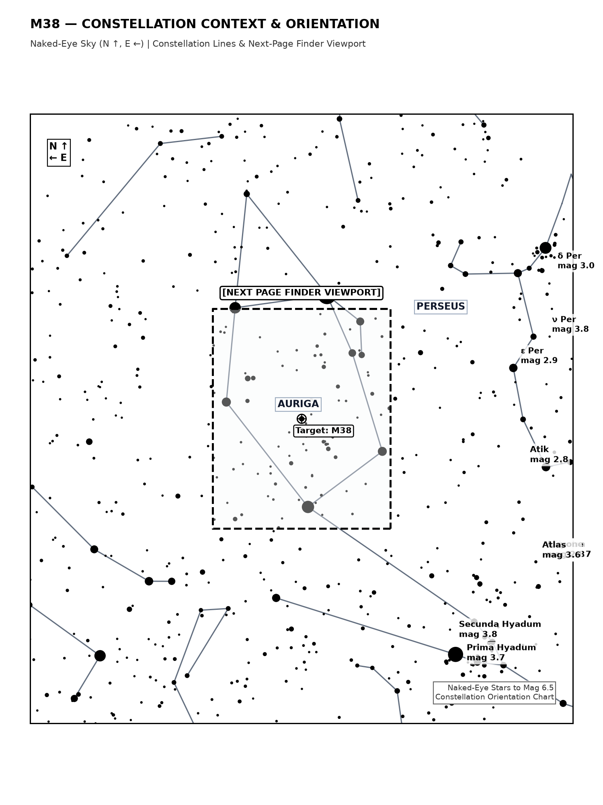

### 3. Wide-Field Star-Hopping Finder Chart
> [!IMPORTANT]
> **Viewport A** provides an upright naked-eye / optical finder orientation (N ↑, E ←) with stars down to visual magnitude 8.5. Standard concentric Telrad rings (0.5°, 2.0°, 4.0°) and 5.0° finder circle are centered directly on the target.

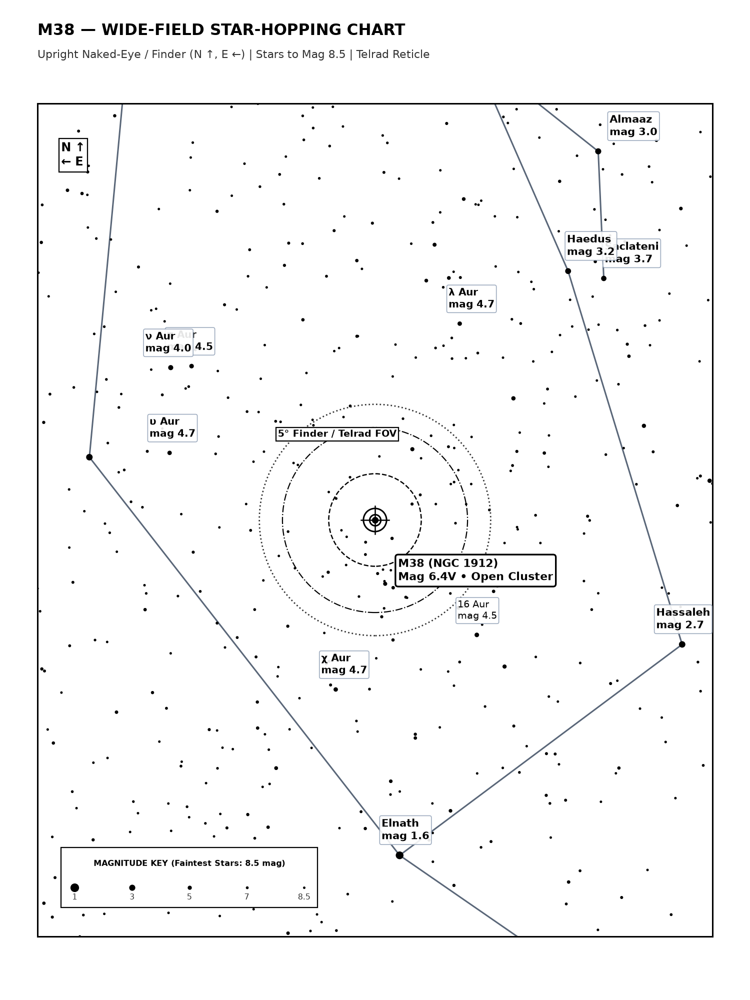

*([📄 Open Full High-Resolution Master A4 Finder Chart](shared/m38/chart_skywatcher-skyliner-200p.png))*

### 4. Observing Strategy & Step-by-Step Hop Instructions

- **Acquisition & Framing (20mm Super / 60×, 50' FOV)**:
  Gorgeous scattered star cluster filling the field with diverse stellar magnitudes and pleasing geometric groupings.
- **High-Power Inspection & Detail (20mm / 60×, 49' FOV)**:
  20mm (60×) deepens sky contrast and splits intimate stellar pairs and chains within the rich central grouping.

**Step-by-Step Star Hop Narrative**:
Locate Auriga via Context Chart. Align Telrad reticle to target coordinates (RA 82.18°, Dec 35.85°); cluster stars emerge immediately in the finder.

---

## M39 (NGC 7092) — Cygnus

[↑ Back to Catalog Index](#messier-catalog-index) • [← Previous: M38](#m38) • [Next: M40 →](#m40)

| Technical Parameter | Specification |
| :--- | :--- |
| **Designation** | M39 (NGC 7092) |
| **Constellation** | Cygnus |
| **Classification** | Open Cluster (OC) |
| **Visual Magnitude ($V$)** | 4.6 mag |
| **Apparent Dimensions** | 31.0' × 31.0' |
| **Estimated Distance** | ~825 light-years |
| **Swanson Difficulty** | **Easy** (*NexStar User's Guide II*) |
| **Coordinates (J2000)** | RA **21h 31m 48.0s** • Dec **+48° 25' 58.8"** |
| **Recommended Eyepiece** | 20mm (60× magnification, 49' TFOV, 3.4mm exit pupil) |

### 1. Telescope Eyepiece Simulation & Technical Dossier
> [!NOTE]
> **Viewport B** depicts the pre-inverted 180° field view through the Newtonian reflector (20mm eyepiece / 60× magnification, 49' true field of view: South at top, West at left, N ↓, E →). **Viewport C** integrates target ephemeris and optical notes.

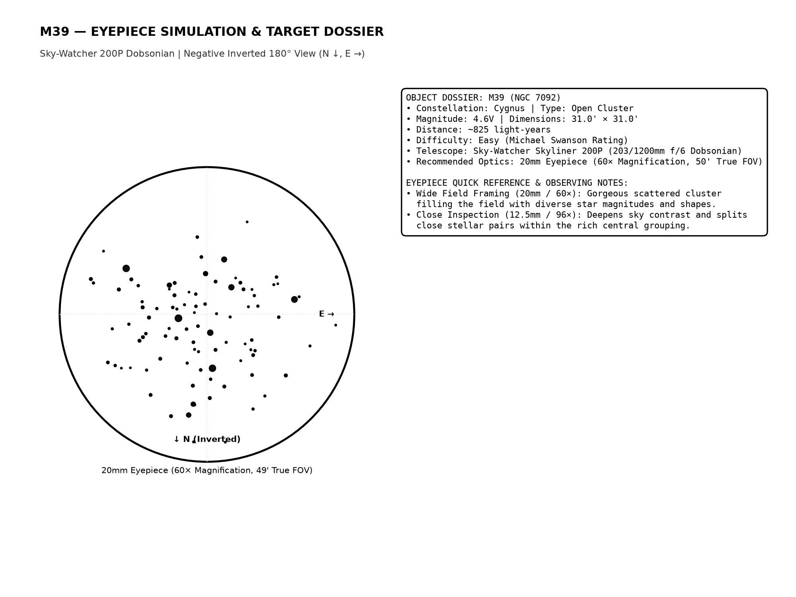

### 2. Constellation Context & Regional Orientation Chart
> [!TIP]
> **Viewport Context** presents a wide ~50°–65° naked-eye orientation field (stars down to visual magnitude 6.5) with official IAU constellation guide lines. The dashed bounding box marks the exact area covered by the wide-field star-hopping chart below.

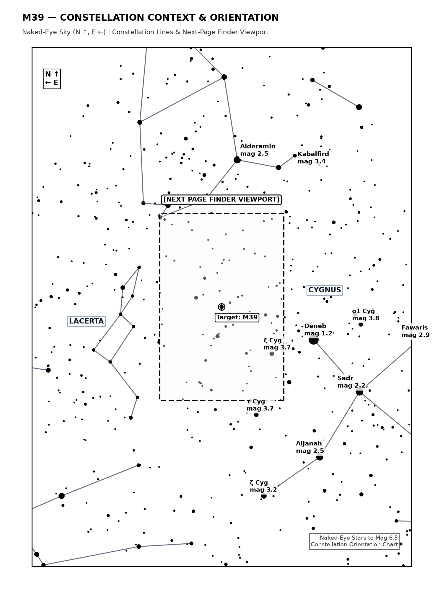

### 3. Wide-Field Star-Hopping Finder Chart
> [!IMPORTANT]
> **Viewport A** provides an upright naked-eye / optical finder orientation (N ↑, E ←) with stars down to visual magnitude 8.5. Standard concentric Telrad rings (0.5°, 2.0°, 4.0°) and 5.0° finder circle are centered directly on the target.

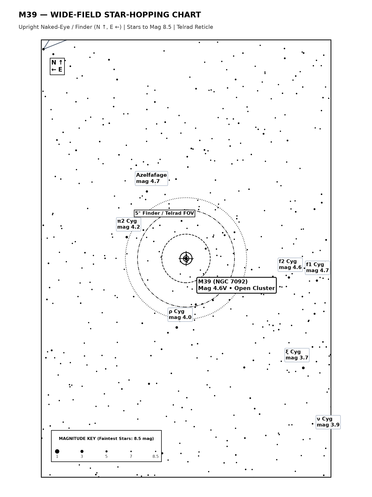

*([📄 Open Full High-Resolution Master A4 Finder Chart](shared/m39/chart_skywatcher-skyliner-200p.png))*

### 4. Observing Strategy & Step-by-Step Hop Instructions

- **Acquisition & Framing (20mm Super / 60×, 50' FOV)**:
  Gorgeous scattered star cluster filling the field with diverse stellar magnitudes and pleasing geometric groupings.
- **High-Power Inspection & Detail (20mm / 60×, 49' FOV)**:
  20mm (60×) deepens sky contrast and splits intimate stellar pairs and chains within the rich central grouping.

**Step-by-Step Star Hop Narrative**:
Locate Cygnus via Context Chart. Align Telrad reticle to target coordinates (RA 322.95°, Dec 48.43°); cluster stars emerge immediately in the finder.

---

## M40 Double Star (Winnecke 4) — Ursa Major

[↑ Back to Catalog Index](#messier-catalog-index) • [← Previous: M39](#m39) • [Next: M41 →](#m41)

| Technical Parameter | Specification |
| :--- | :--- |
| **Designation** | M40 (Winnecke 4) |
| **Common Name** | **Double Star** |
| **Constellation** | Ursa Major |
| **Classification** | Double Star (Double Star) |
| **Visual Magnitude ($V$)** | 9.7 mag |
| **Apparent Dimensions** | 0.0' × 0.0' |
| **Estimated Distance** | ~508 light-years |
| **Swanson Difficulty** | **Easy** (*NexStar User's Guide II*) |
| **Coordinates (J2000)** | RA **12h 22m 12.5s** • Dec **+58° 04' 58.6"** |
| **Recommended Eyepiece** | 12.5mm (96× magnification, 31' TFOV, 2.1mm exit pupil) |

### 1. Telescope Eyepiece Simulation & Technical Dossier
> [!NOTE]
> **Viewport B** depicts the pre-inverted 180° field view through the Newtonian reflector (12.5mm eyepiece / 96× magnification, 31' true field of view: South at top, West at left, N ↓, E →). **Viewport C** integrates target ephemeris and optical notes.

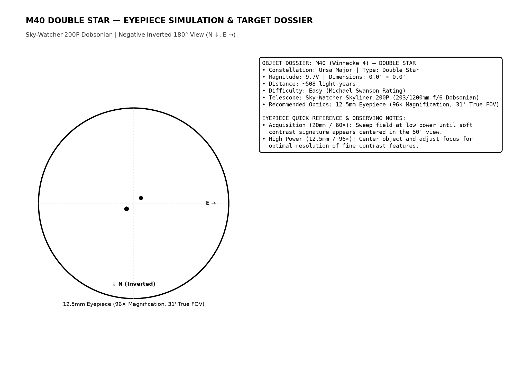

### 2. Constellation Context & Regional Orientation Chart
> [!TIP]
> **Viewport Context** presents a wide ~50°–65° naked-eye orientation field (stars down to visual magnitude 6.5) with official IAU constellation guide lines. The dashed bounding box marks the exact area covered by the wide-field star-hopping chart below.

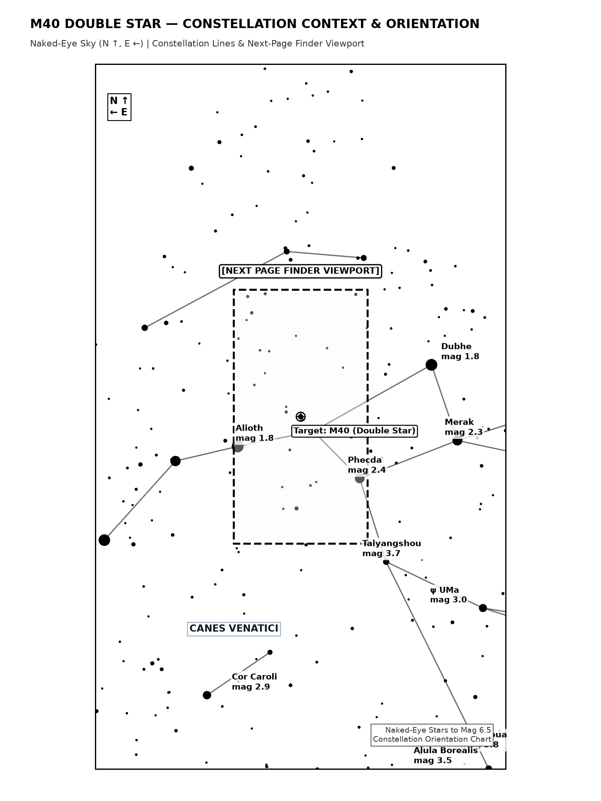

### 3. Wide-Field Star-Hopping Finder Chart
> [!IMPORTANT]
> **Viewport A** provides an upright naked-eye / optical finder orientation (N ↑, E ←) with stars down to visual magnitude 8.5. Standard concentric Telrad rings (0.5°, 2.0°, 4.0°) and 5.0° finder circle are centered directly on the target.

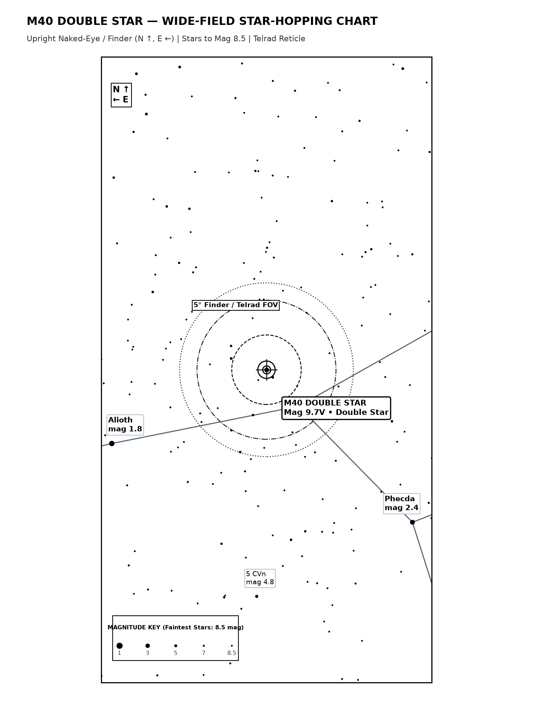

*([📄 Open Full High-Resolution Master A4 Finder Chart](shared/m40/chart_skywatcher-skyliner-200p.png))*

### 4. Observing Strategy & Step-by-Step Hop Instructions

- **Acquisition & Framing (20mm Super / 60×, 50' FOV)**:
  Sweep field at 20mm (60×) until distinct contrast signature appears centered in the 50' view.
- **High-Power Inspection & Detail (12.5mm / 96×, 31' FOV)**:
  12.5mm (96×) deepens sky contrast and brings out fine structural detail under dark, transparent skies.

**Step-by-Step Star Hop Narrative**:
Align finder to Ursa Major target coordinates at RA 185.55°, Dec 58.08°.

---

## M41 (NGC 2287) — Canis Major

[↑ Back to Catalog Index](#messier-catalog-index) • [← Previous: M40](#m40) • [Next: M42 →](#m42)

| Technical Parameter | Specification |
| :--- | :--- |
| **Designation** | M41 (NGC 2287) |
| **Constellation** | Canis Major |
| **Classification** | Open Cluster (OC) |
| **Visual Magnitude ($V$)** | 4.5 mag |
| **Apparent Dimensions** | 39.0' × 39.0' |
| **Estimated Distance** | ~2316 light-years |
| **Swanson Difficulty** | **Easy** (*NexStar User's Guide II*) |
| **Coordinates (J2000)** | RA **6h 46m 01.0s** • Dec **-20° 45' 25.2"** |
| **Recommended Eyepiece** | 20mm (60× magnification, 49' TFOV, 3.4mm exit pupil) |

### 1. Telescope Eyepiece Simulation & Technical Dossier
> [!NOTE]
> **Viewport B** depicts the pre-inverted 180° field view through the Newtonian reflector (20mm eyepiece / 60× magnification, 49' true field of view: South at top, West at left, N ↓, E →). **Viewport C** integrates target ephemeris and optical notes.

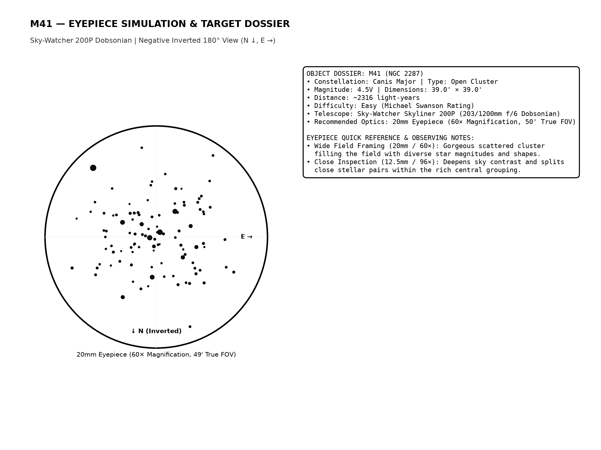

### 2. Constellation Context & Regional Orientation Chart
> [!TIP]
> **Viewport Context** presents a wide ~50°–65° naked-eye orientation field (stars down to visual magnitude 6.5) with official IAU constellation guide lines. The dashed bounding box marks the exact area covered by the wide-field star-hopping chart below.

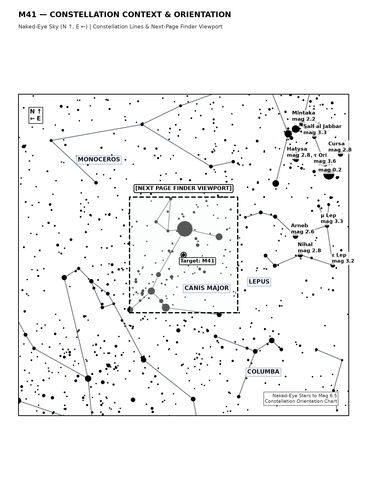

### 3. Wide-Field Star-Hopping Finder Chart
> [!IMPORTANT]
> **Viewport A** provides an upright naked-eye / optical finder orientation (N ↑, E ←) with stars down to visual magnitude 8.5. Standard concentric Telrad rings (0.5°, 2.0°, 4.0°) and 5.0° finder circle are centered directly on the target.

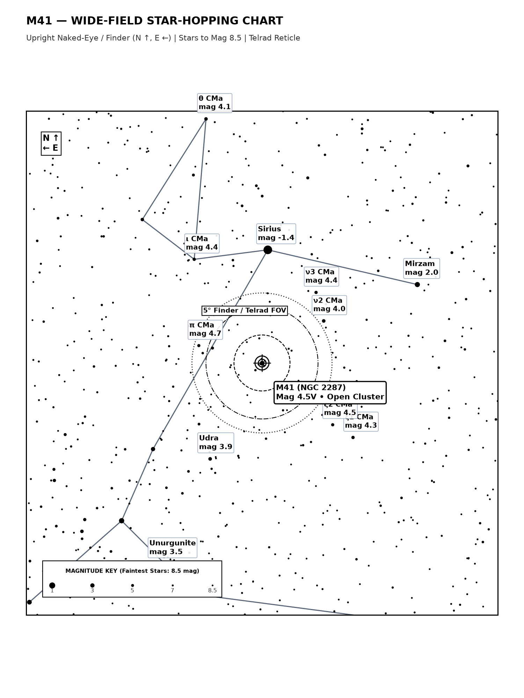

*([📄 Open Full High-Resolution Master A4 Finder Chart](shared/m41/chart_skywatcher-skyliner-200p.png))*

### 4. Observing Strategy & Step-by-Step Hop Instructions

- **Acquisition & Framing (20mm Super / 60×, 50' FOV)**:
  Gorgeous scattered star cluster filling the field with diverse stellar magnitudes and pleasing geometric groupings.
- **High-Power Inspection & Detail (20mm / 60×, 49' FOV)**:
  20mm (60×) deepens sky contrast and splits intimate stellar pairs and chains within the rich central grouping.

**Step-by-Step Star Hop Narrative**:
Locate Canis Major via Context Chart. Align Telrad reticle to target coordinates (RA 101.50°, Dec -20.76°); cluster stars emerge immediately in the finder.

---

## M42 Great Orion Nebula (NGC 1976) — Orion

[↑ Back to Catalog Index](#messier-catalog-index) • [← Previous: M41](#m41) • [Next: M43 →](#m43)

| Technical Parameter | Specification |
| :--- | :--- |
| **Designation** | M42 (NGC 1976) |
| **Common Name** | **Great Orion Nebula** |
| **Constellation** | Orion |
| **Classification** | Diffuse Nebula (Nebula) |
| **Visual Magnitude ($V$)** | 4.0 mag |
| **Apparent Dimensions** | 90.0' × 60.0' |
| **Estimated Distance** | ~1343 light-years |
| **Swanson Difficulty** | **Easy** (*NexStar User's Guide II*) |
| **Coordinates (J2000)** | RA **5h 35m 17.3s** • Dec **-5° 23' 28.0"** |
| **Recommended Eyepiece** | 20mm (60× magnification, 49' TFOV, 3.4mm exit pupil) |

### 1. Telescope Eyepiece Simulation & Technical Dossier
> [!NOTE]
> **Viewport B** depicts the pre-inverted 180° field view through the Newtonian reflector (20mm eyepiece / 60× magnification, 49' true field of view: South at top, West at left, N ↓, E →). **Viewport C** integrates target ephemeris and optical notes.

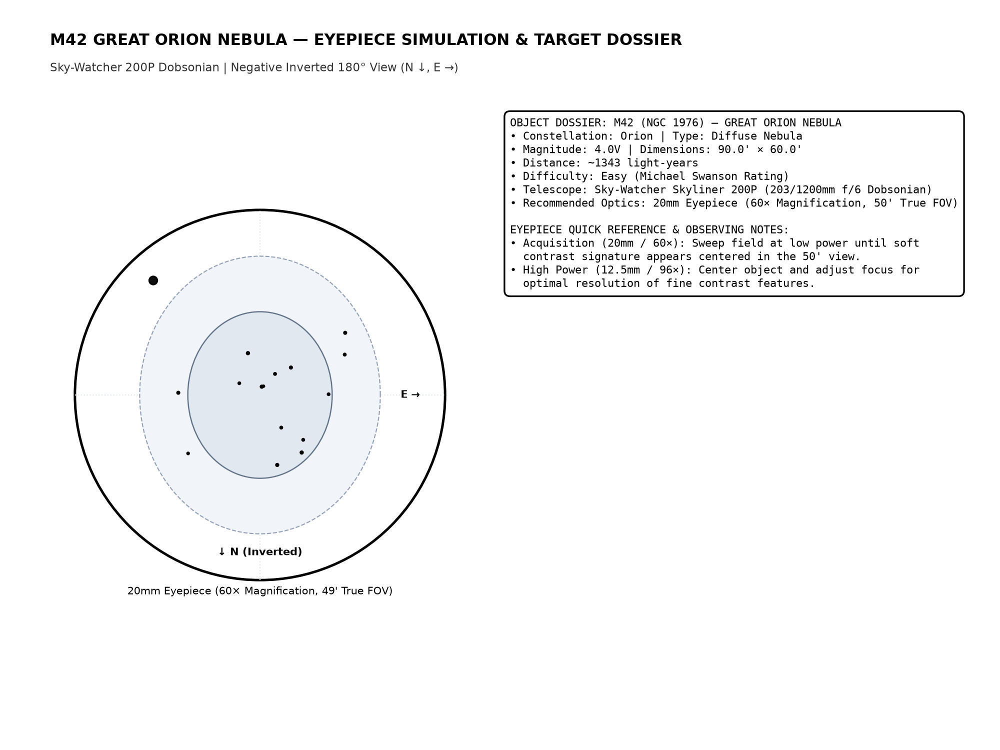

### 2. Constellation Context & Regional Orientation Chart
> [!TIP]
> **Viewport Context** presents a wide ~50°–65° naked-eye orientation field (stars down to visual magnitude 6.5) with official IAU constellation guide lines. The dashed bounding box marks the exact area covered by the wide-field star-hopping chart below.

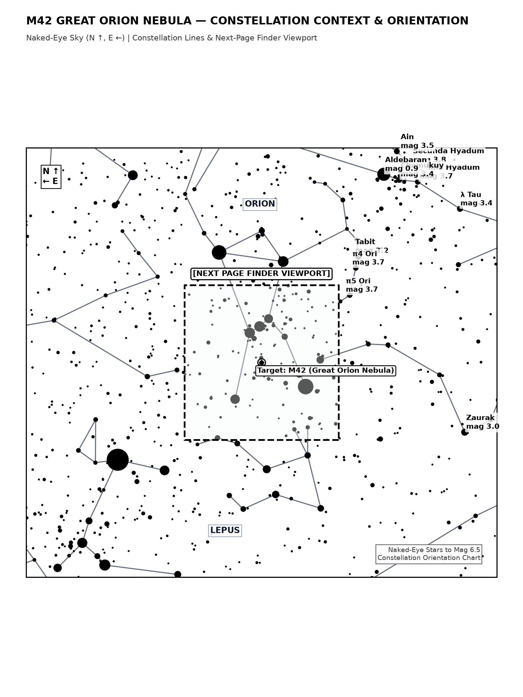

### 3. Wide-Field Star-Hopping Finder Chart
> [!IMPORTANT]
> **Viewport A** provides an upright naked-eye / optical finder orientation (N ↑, E ←) with stars down to visual magnitude 8.5. Standard concentric Telrad rings (0.5°, 2.0°, 4.0°) and 5.0° finder circle are centered directly on the target.

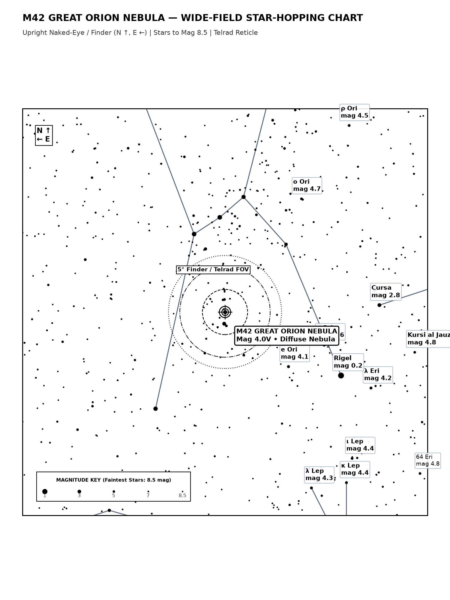

*([📄 Open Full High-Resolution Master A4 Finder Chart](shared/m42/chart_skywatcher-skyliner-200p.png))*

### 4. Observing Strategy & Step-by-Step Hop Instructions

- **Acquisition & Framing (20mm Super / 60×, 50' FOV)**:
  The Great Orion Nebula; sweeping luminous green-grey gas curtains surrounding the radiant Trapezium multiple star cluster in Orion's Sword.
- **High-Power Inspection & Detail (20mm / 60×, 49' FOV)**:
  60× frames the immense wings of nebulosity, the dark 'Fish's Mouth' absorption bay, and the neighboring reflection nebula M43.

**Step-by-Step Star Hop Narrative**:
Locate Orion's Belt (Alnitak, Alnilam, Mintaka). Drop 4° South to Orion's Sword; M42 is the middle fuzzy 'star' easily visible to the naked eye.

---

## M43 de Mairan¹s Nebula (NGC 1982) — Orion

[↑ Back to Catalog Index](#messier-catalog-index) • [← Previous: M42](#m42) • [Next: M44 →](#m44)

| Technical Parameter | Specification |
| :--- | :--- |
| **Designation** | M43 (NGC 1982) |
| **Common Name** | **de Mairan¹s Nebula** |
| **Constellation** | Orion |
| **Classification** | Diffuse Nebula (Nebula) |
| **Visual Magnitude ($V$)** | 6.8 mag |
| **Apparent Dimensions** | 20.0' × 15.0' |
| **Estimated Distance** | ~1598 light-years |
| **Swanson Difficulty** | **Medium** (*NexStar User's Guide II*) |
| **Coordinates (J2000)** | RA **5h 35m 31.0s** • Dec **-5° 16' 12.0"** |
| **Recommended Eyepiece** | 20mm (60× magnification, 49' TFOV, 3.4mm exit pupil) |

### 1. Telescope Eyepiece Simulation & Technical Dossier
> [!NOTE]
> **Viewport B** depicts the pre-inverted 180° field view through the Newtonian reflector (20mm eyepiece / 60× magnification, 49' true field of view: South at top, West at left, N ↓, E →). **Viewport C** integrates target ephemeris and optical notes.

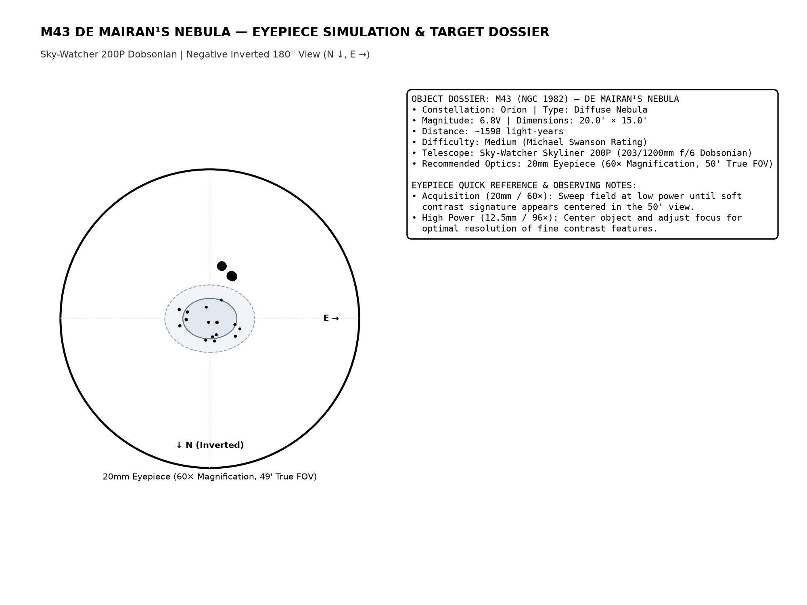

### 2. Constellation Context & Regional Orientation Chart
> [!TIP]
> **Viewport Context** presents a wide ~50°–65° naked-eye orientation field (stars down to visual magnitude 6.5) with official IAU constellation guide lines. The dashed bounding box marks the exact area covered by the wide-field star-hopping chart below.

### 3. Wide-Field Star-Hopping Finder Chart
> [!IMPORTANT]
> **Viewport A** provides an upright naked-eye / optical finder orientation (N ↑, E ←) with stars down to visual magnitude 8.5. Standard concentric Telrad rings (0.5°, 2.0°, 4.0°) and 5.0° finder circle are centered directly on the target.

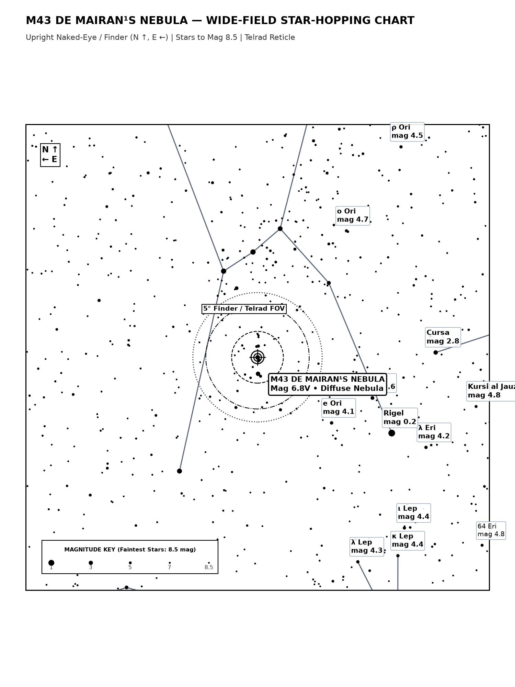

*([📄 Open Full High-Resolution Master A4 Finder Chart](shared/m43/chart_skywatcher-skyliner-200p.png))*

### 4. Observing Strategy & Step-by-Step Hop Instructions

- **Acquisition & Framing (20mm Super / 60×, 50' FOV)**:
  Soft, sprawling contrast signature floating among field stars; best detected by sweeping slowly across the field at 60×.
- **High-Power Inspection & Detail (20mm / 60×, 49' FOV)**:
  20mm (60×) highlights subtle ionization knots, filamentary edges, and embedded star groupings within the glowing cloud.

**Step-by-Step Star Hop Narrative**:
Locate Orion guide stars. Align Telrad reticle to RA 83.88°, Dec -5.27°; sweep gently until nebulous glow fills the field.

---

## M44 Beehive Cluster (Praesepe) (NGC 2632) — Cancer

[↑ Back to Catalog Index](#messier-catalog-index) • [← Previous: M43](#m43) • [Next: M45 →](#m45)

| Technical Parameter | Specification |
| :--- | :--- |
| **Designation** | M44 (NGC 2632) |
| **Common Name** | **Beehive Cluster (Praesepe)** |
| **Constellation** | Cancer |
| **Classification** | Open Cluster (OC) |
| **Visual Magnitude ($V$)** | 3.1 mag |
| **Apparent Dimensions** | 70.0' × 70.0' |
| **Estimated Distance** | ~577 light-years |
| **Swanson Difficulty** | **Easy** (*NexStar User's Guide II*) |
| **Coordinates (J2000)** | RA **8h 40m 24.0s** • Dec **+19° 40' 01.2"** |
| **Recommended Eyepiece** | 20mm (60× magnification, 49' TFOV, 3.4mm exit pupil) |

### 1. Telescope Eyepiece Simulation & Technical Dossier
> [!NOTE]
> **Viewport B** depicts the pre-inverted 180° field view through the Newtonian reflector (20mm eyepiece / 60× magnification, 49' true field of view: South at top, West at left, N ↓, E →). **Viewport C** integrates target ephemeris and optical notes.

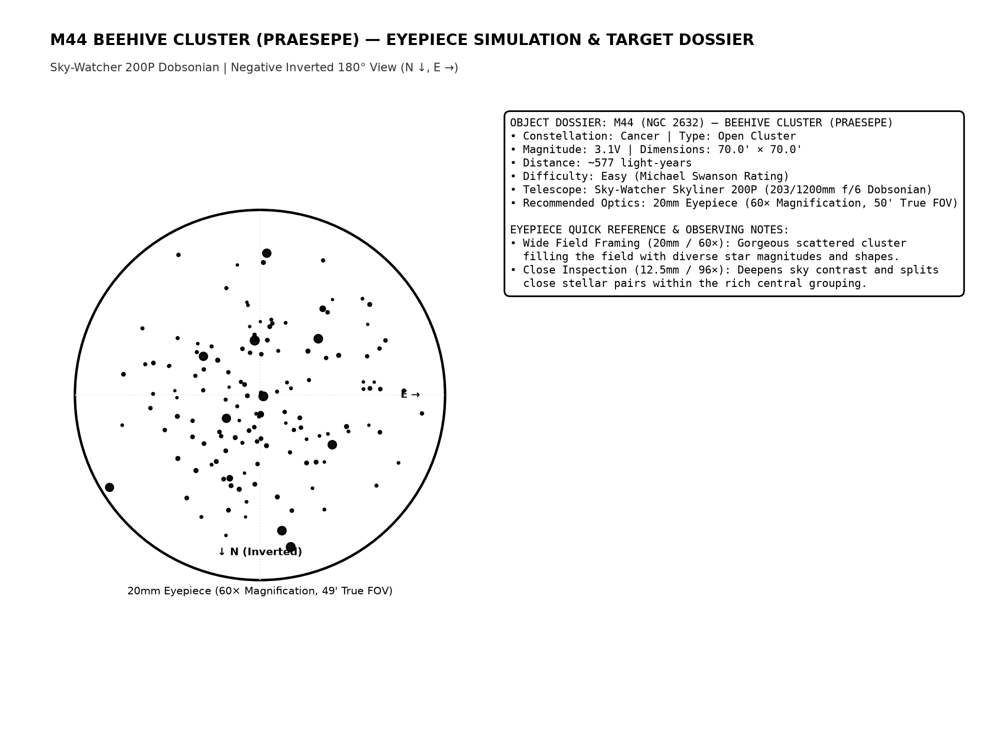

### 2. Constellation Context & Regional Orientation Chart
> [!TIP]
> **Viewport Context** presents a wide ~50°–65° naked-eye orientation field (stars down to visual magnitude 6.5) with official IAU constellation guide lines. The dashed bounding box marks the exact area covered by the wide-field star-hopping chart below.

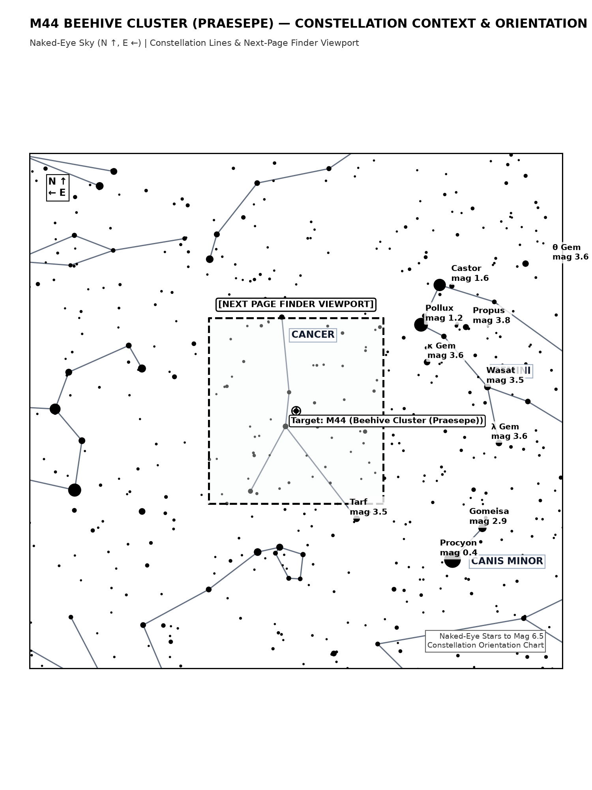

### 3. Wide-Field Star-Hopping Finder Chart
> [!IMPORTANT]
> **Viewport A** provides an upright naked-eye / optical finder orientation (N ↑, E ←) with stars down to visual magnitude 8.5. Standard concentric Telrad rings (0.5°, 2.0°, 4.0°) and 5.0° finder circle are centered directly on the target.

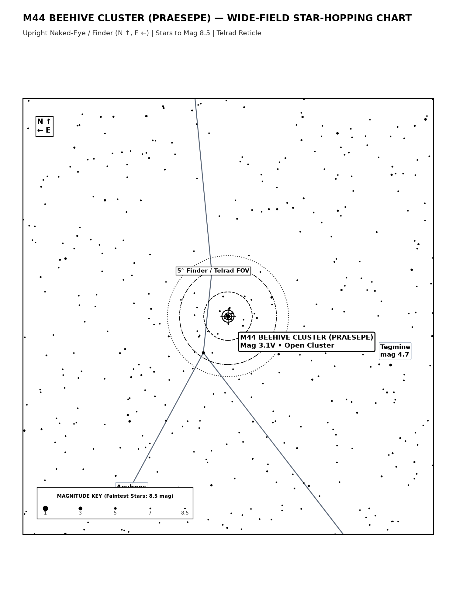

*([📄 Open Full High-Resolution Master A4 Finder Chart](shared/m44/chart_skywatcher-skyliner-200p.png))*

### 4. Observing Strategy & Step-by-Step Hop Instructions

- **Acquisition & Framing (20mm Super / 60×, 50' FOV)**:
  Gorgeous scattered star cluster filling the field with diverse stellar magnitudes and pleasing geometric groupings.
- **High-Power Inspection & Detail (20mm / 60×, 49' FOV)**:
  20mm (60×) deepens sky contrast and splits intimate stellar pairs and chains within the rich central grouping.

**Step-by-Step Star Hop Narrative**:
Locate Cancer via Context Chart. Align Telrad reticle to target coordinates (RA 130.10°, Dec 19.67°); cluster stars emerge immediately in the finder.

---

## M45 Pleiades (Melotte 22) — Taurus

[↑ Back to Catalog Index](#messier-catalog-index) • [← Previous: M44](#m44) • [Next: M46 →](#m46)

| Technical Parameter | Specification |
| :--- | :--- |
| **Designation** | M45 (Melotte 22) |
| **Common Name** | **Pleiades** |
| **Constellation** | Taurus |
| **Classification** | Open Cluster (OC) |
| **Visual Magnitude ($V$)** | 1.2 mag |
| **Apparent Dimensions** | 110.0' × 110.0' |
| **Estimated Distance** | ~444 light-years |
| **Swanson Difficulty** | **Easy** (*NexStar User's Guide II*) |
| **Coordinates (J2000)** | RA **3h 47m 00.0s** • Dec **+24° 07' 01.2"** |
| **Recommended Eyepiece** | 20mm (60× magnification, 49' TFOV, 3.4mm exit pupil) |

### 1. Telescope Eyepiece Simulation & Technical Dossier
> [!NOTE]
> **Viewport B** depicts the pre-inverted 180° field view through the Newtonian reflector (20mm eyepiece / 60× magnification, 49' true field of view: South at top, West at left, N ↓, E →). **Viewport C** integrates target ephemeris and optical notes.

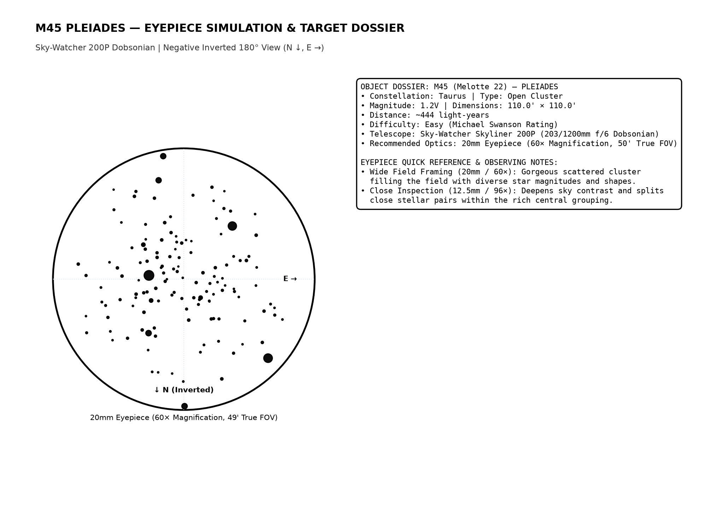

### 2. Constellation Context & Regional Orientation Chart
> [!TIP]
> **Viewport Context** presents a wide ~50°–65° naked-eye orientation field (stars down to visual magnitude 6.5) with official IAU constellation guide lines. The dashed bounding box marks the exact area covered by the wide-field star-hopping chart below.

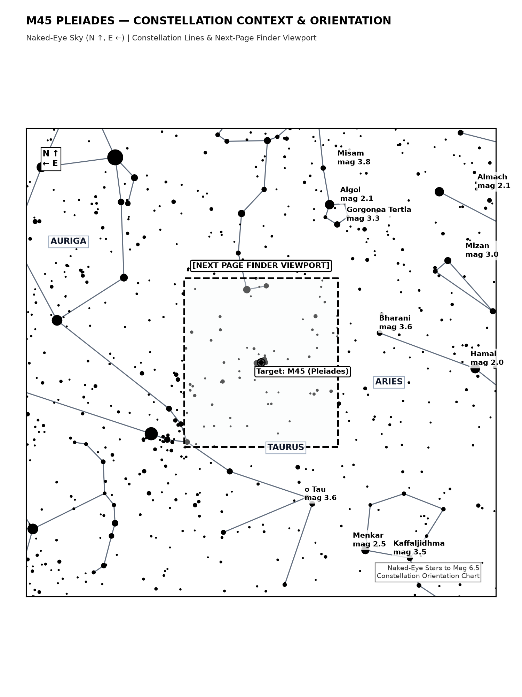

### 3. Wide-Field Star-Hopping Finder Chart
> [!IMPORTANT]
> **Viewport A** provides an upright naked-eye / optical finder orientation (N ↑, E ←) with stars down to visual magnitude 8.5. Standard concentric Telrad rings (0.5°, 2.0°, 4.0°) and 5.0° finder circle are centered directly on the target.

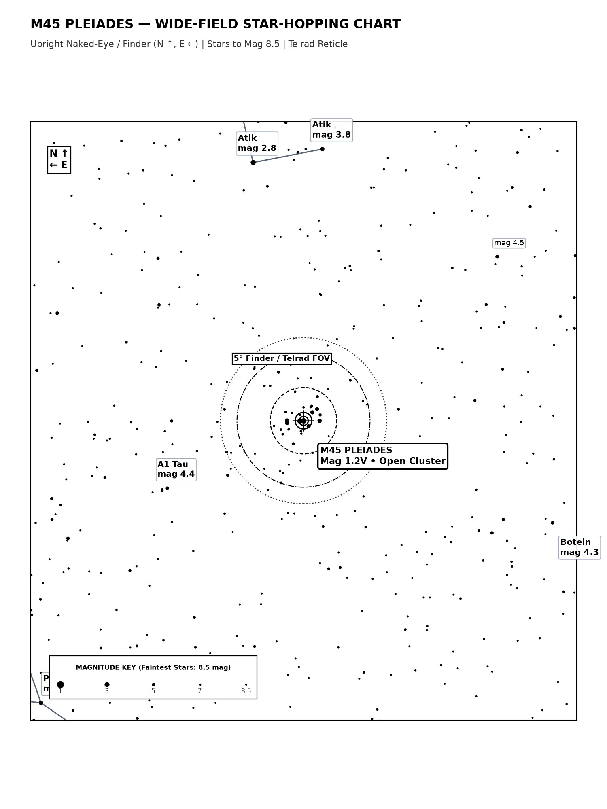

*([📄 Open Full High-Resolution Master A4 Finder Chart](shared/m45/chart_skywatcher-skyliner-200p.png))*

### 4. Observing Strategy & Step-by-Step Hop Instructions

- **Acquisition & Framing (20mm Super / 60×, 50' FOV)**:
  The Pleiades (Seven Sisters); spectacular open cluster spanning nearly 2° of sky; fills the finder and low-power eyepiece with radiant blue-white B-type giants.
- **High-Power Inspection & Detail (20mm / 60×, 49' FOV)**:
  Best observed with the lowest magnification available (20mm / 60× or binoculars) to take in the cluster geometry, Alcyone, Maia, Electra, and surrounding star chains.

**Step-by-Step Star Hop Narrative**:
Look 14° northwest of Aldebaran in Taurus; unmistakable naked-eye cluster visible from almost any location.

---

## M46 (NGC 2437) — Puppis

[↑ Back to Catalog Index](#messier-catalog-index) • [← Previous: M45](#m45) • [Next: M47 →](#m47)

| Technical Parameter | Specification |
| :--- | :--- |
| **Designation** | M46 (NGC 2437) |
| **Constellation** | Puppis |
| **Classification** | Open Cluster (OC) |
| **Visual Magnitude ($V$)** | 6.1 mag |
| **Apparent Dimensions** | 20.0' × 20.0' |
| **Estimated Distance** | ~5,545 light-years |
| **Swanson Difficulty** | **Medium** (*NexStar User's Guide II*) |
| **Coordinates (J2000)** | RA **7h 41m 46.1s** • Dec **-14° 48' 36.0"** |
| **Recommended Eyepiece** | 20mm (60× magnification, 49' TFOV, 3.4mm exit pupil) |

### 1. Telescope Eyepiece Simulation & Technical Dossier
> [!NOTE]
> **Viewport B** depicts the pre-inverted 180° field view through the Newtonian reflector (20mm eyepiece / 60× magnification, 49' true field of view: South at top, West at left, N ↓, E →). **Viewport C** integrates target ephemeris and optical notes.

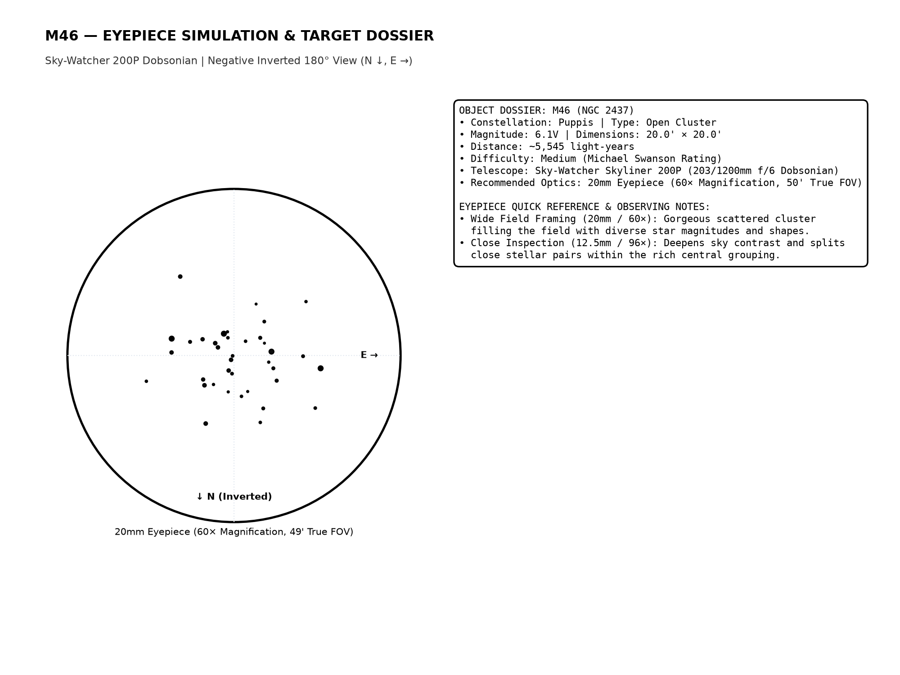

### 2. Constellation Context & Regional Orientation Chart
> [!TIP]
> **Viewport Context** presents a wide ~50°–65° naked-eye orientation field (stars down to visual magnitude 6.5) with official IAU constellation guide lines. The dashed bounding box marks the exact area covered by the wide-field star-hopping chart below.

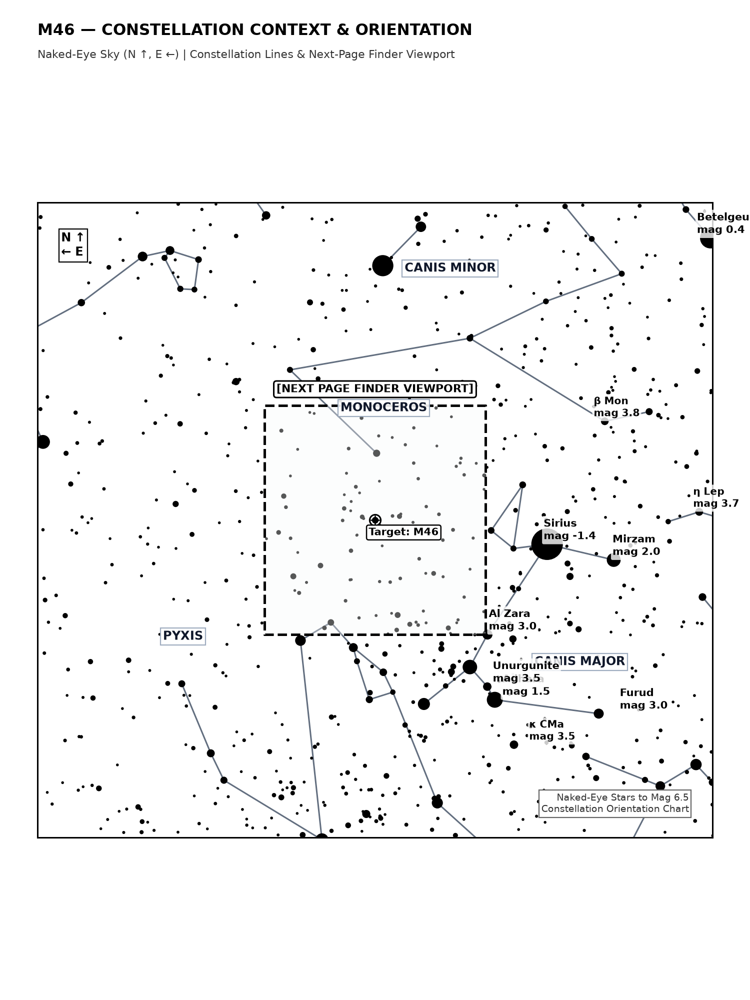

### 3. Wide-Field Star-Hopping Finder Chart
> [!IMPORTANT]
> **Viewport A** provides an upright naked-eye / optical finder orientation (N ↑, E ←) with stars down to visual magnitude 8.5. Standard concentric Telrad rings (0.5°, 2.0°, 4.0°) and 5.0° finder circle are centered directly on the target.

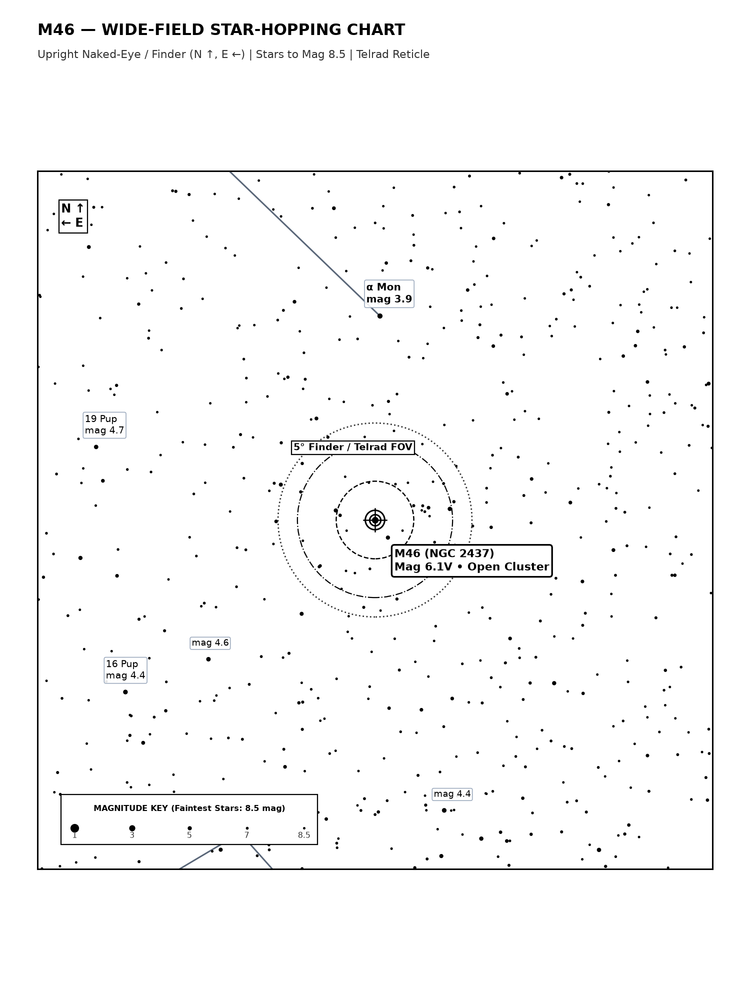

*([📄 Open Full High-Resolution Master A4 Finder Chart](shared/m46/chart_skywatcher-skyliner-200p.png))*

### 4. Observing Strategy & Step-by-Step Hop Instructions

- **Acquisition & Framing (20mm Super / 60×, 50' FOV)**:
  Gorgeous scattered star cluster filling the field with diverse stellar magnitudes and pleasing geometric groupings.
- **High-Power Inspection & Detail (20mm / 60×, 49' FOV)**:
  20mm (60×) deepens sky contrast and splits intimate stellar pairs and chains within the rich central grouping.

**Step-by-Step Star Hop Narrative**:
Locate Puppis via Context Chart. Align Telrad reticle to target coordinates (RA 115.44°, Dec -14.81°); cluster stars emerge immediately in the finder.

---

## M47 (NGC 2422) — Puppis

[↑ Back to Catalog Index](#messier-catalog-index) • [← Previous: M46](#m46) • [Next: M48 →](#m48)

| Technical Parameter | Specification |
| :--- | :--- |
| **Designation** | M47 (NGC 2422) |
| **Constellation** | Puppis |
| **Classification** | Open Cluster (OC) |
| **Visual Magnitude ($V$)** | 4.4 mag |
| **Apparent Dimensions** | 25.0' × 25.0' |
| **Estimated Distance** | ~1598 light-years |
| **Swanson Difficulty** | **Easy** (*NexStar User's Guide II*) |
| **Coordinates (J2000)** | RA **7h 36m 35.0s** • Dec **-14° 28' 58.8"** |
| **Recommended Eyepiece** | 20mm (60× magnification, 49' TFOV, 3.4mm exit pupil) |

### 1. Telescope Eyepiece Simulation & Technical Dossier
> [!NOTE]
> **Viewport B** depicts the pre-inverted 180° field view through the Newtonian reflector (20mm eyepiece / 60× magnification, 49' true field of view: South at top, West at left, N ↓, E →). **Viewport C** integrates target ephemeris and optical notes.

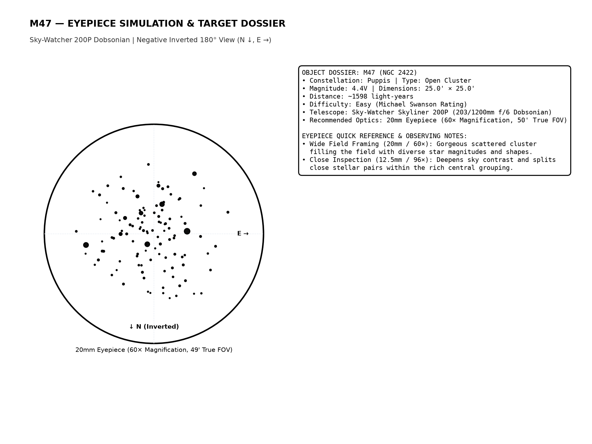

### 2. Constellation Context & Regional Orientation Chart
> [!TIP]
> **Viewport Context** presents a wide ~50°–65° naked-eye orientation field (stars down to visual magnitude 6.5) with official IAU constellation guide lines. The dashed bounding box marks the exact area covered by the wide-field star-hopping chart below.

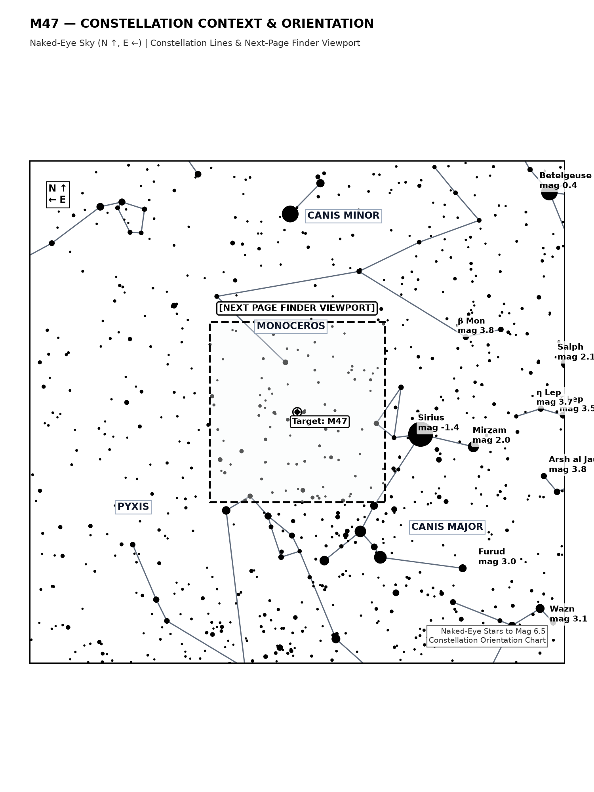

### 3. Wide-Field Star-Hopping Finder Chart
> [!IMPORTANT]
> **Viewport A** provides an upright naked-eye / optical finder orientation (N ↑, E ←) with stars down to visual magnitude 8.5. Standard concentric Telrad rings (0.5°, 2.0°, 4.0°) and 5.0° finder circle are centered directly on the target.

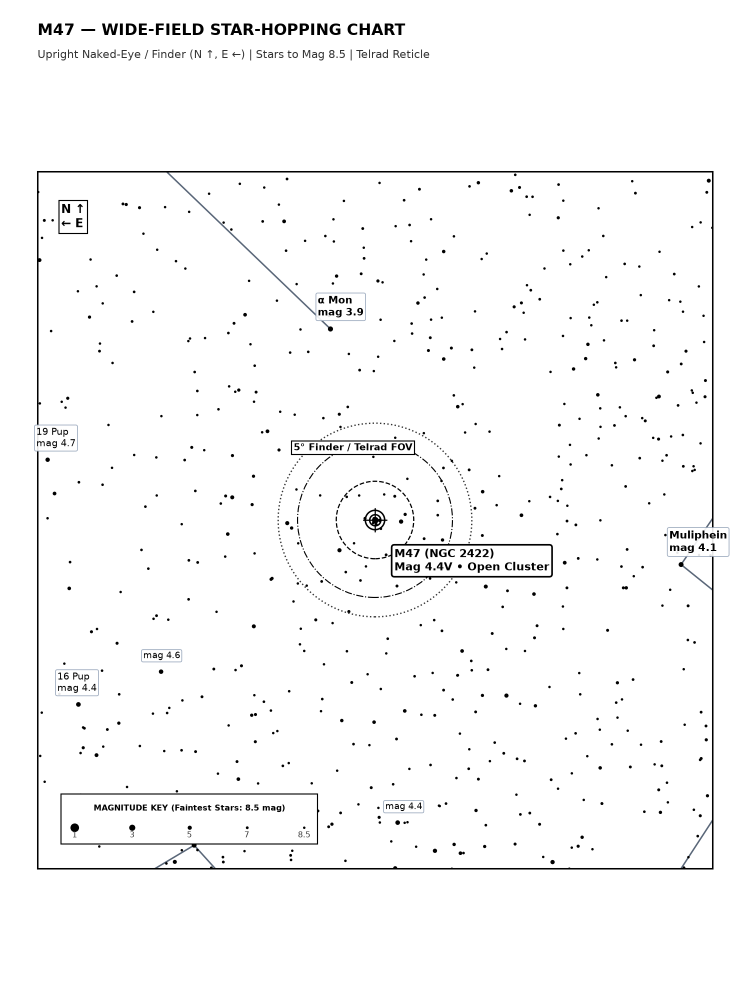

*([📄 Open Full High-Resolution Master A4 Finder Chart](shared/m47/chart_skywatcher-skyliner-200p.png))*

### 4. Observing Strategy & Step-by-Step Hop Instructions

- **Acquisition & Framing (20mm Super / 60×, 50' FOV)**:
  Gorgeous scattered star cluster filling the field with diverse stellar magnitudes and pleasing geometric groupings.
- **High-Power Inspection & Detail (20mm / 60×, 49' FOV)**:
  20mm (60×) deepens sky contrast and splits intimate stellar pairs and chains within the rich central grouping.

**Step-by-Step Star Hop Narrative**:
Locate Puppis via Context Chart. Align Telrad reticle to target coordinates (RA 114.15°, Dec -14.48°); cluster stars emerge immediately in the finder.

---

## M48 (NGC 2548) — Hydra

[↑ Back to Catalog Index](#messier-catalog-index) • [← Previous: M47](#m47) • [Next: M49 →](#m49)

| Technical Parameter | Specification |
| :--- | :--- |
| **Designation** | M48 (NGC 2548) |
| **Constellation** | Hydra |
| **Classification** | Open Cluster (OC) |
| **Visual Magnitude ($V$)** | 5.8 mag |
| **Apparent Dimensions** | 30.0' × 30.0' |
| **Estimated Distance** | ~1500 light-years |
| **Swanson Difficulty** | **Medium** (*NexStar User's Guide II*) |
| **Coordinates (J2000)** | RA **8h 13m 43.0s** • Dec **-5° 45' 00.0"** |
| **Recommended Eyepiece** | 20mm (60× magnification, 49' TFOV, 3.4mm exit pupil) |

### 1. Telescope Eyepiece Simulation & Technical Dossier
> [!NOTE]
> **Viewport B** depicts the pre-inverted 180° field view through the Newtonian reflector (20mm eyepiece / 60× magnification, 49' true field of view: South at top, West at left, N ↓, E →). **Viewport C** integrates target ephemeris and optical notes.

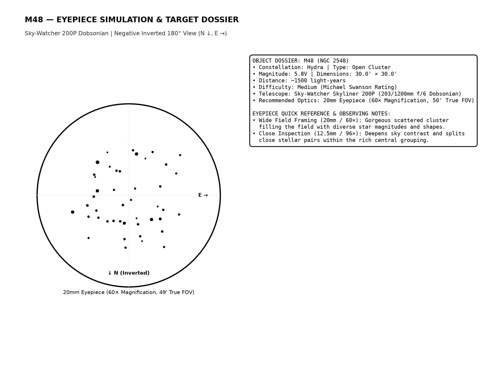

### 2. Constellation Context & Regional Orientation Chart
> [!TIP]
> **Viewport Context** presents a wide ~50°–65° naked-eye orientation field (stars down to visual magnitude 6.5) with official IAU constellation guide lines. The dashed bounding box marks the exact area covered by the wide-field star-hopping chart below.

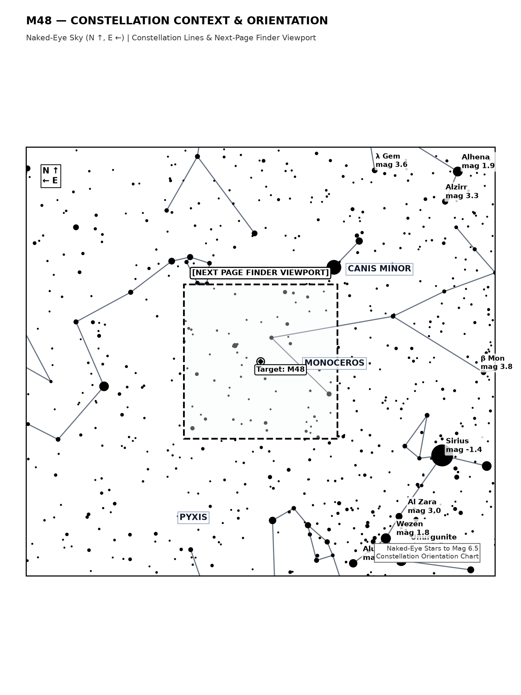

### 3. Wide-Field Star-Hopping Finder Chart
> [!IMPORTANT]
> **Viewport A** provides an upright naked-eye / optical finder orientation (N ↑, E ←) with stars down to visual magnitude 8.5. Standard concentric Telrad rings (0.5°, 2.0°, 4.0°) and 5.0° finder circle are centered directly on the target.

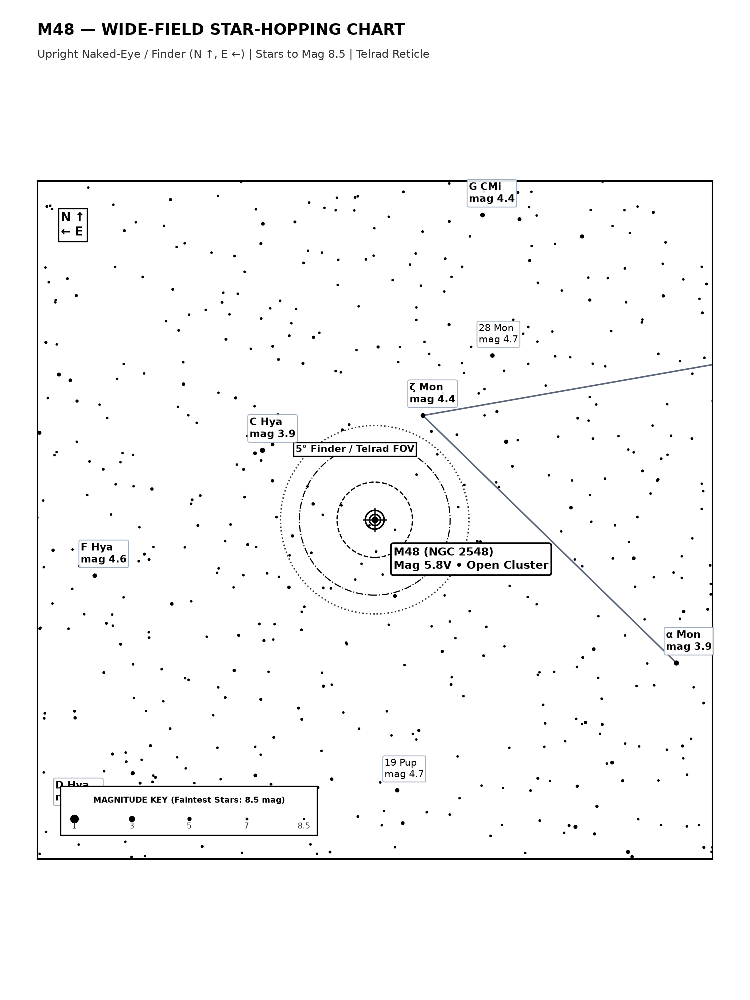

*([📄 Open Full High-Resolution Master A4 Finder Chart](shared/m48/chart_skywatcher-skyliner-200p.png))*

### 4. Observing Strategy & Step-by-Step Hop Instructions

- **Acquisition & Framing (20mm Super / 60×, 50' FOV)**:
  Gorgeous scattered star cluster filling the field with diverse stellar magnitudes and pleasing geometric groupings.
- **High-Power Inspection & Detail (20mm / 60×, 49' FOV)**:
  20mm (60×) deepens sky contrast and splits intimate stellar pairs and chains within the rich central grouping.

**Step-by-Step Star Hop Narrative**:
Locate Hydra via Context Chart. Align Telrad reticle to target coordinates (RA 123.43°, Dec -5.75°); cluster stars emerge immediately in the finder.

---

## M49 (NGC 4472) — Virgo

[↑ Back to Catalog Index](#messier-catalog-index) • [← Previous: M48](#m48) • [Next: M50 →](#m50)

| Technical Parameter | Specification |
| :--- | :--- |
| **Designation** | M49 (NGC 4472) |
| **Constellation** | Virgo |
| **Classification** | Elliptical Galaxy (Galaxy) |
| **Visual Magnitude ($V$)** | 8.4 mag |
| **Apparent Dimensions** | 10.2' × 8.3' |
| **Estimated Distance** | ~17.7 million light-years |
| **Swanson Difficulty** | **Hard** (*NexStar User's Guide II*) |
| **Coordinates (J2000)** | RA **12h 29m 46.8s** • Dec **+8° 00' 01.5"** |
| **Recommended Eyepiece** | 12.5mm (96× magnification, 31' TFOV, 2.1mm exit pupil) |

### 1. Telescope Eyepiece Simulation & Technical Dossier
> [!NOTE]
> **Viewport B** depicts the pre-inverted 180° field view through the Newtonian reflector (12.5mm eyepiece / 96× magnification, 31' true field of view: South at top, West at left, N ↓, E →). **Viewport C** integrates target ephemeris and optical notes.

### 2. Constellation Context & Regional Orientation Chart
> [!TIP]
> **Viewport Context** presents a wide ~50°–65° naked-eye orientation field (stars down to visual magnitude 6.5) with official IAU constellation guide lines. The dashed bounding box marks the exact area covered by the wide-field star-hopping chart below.

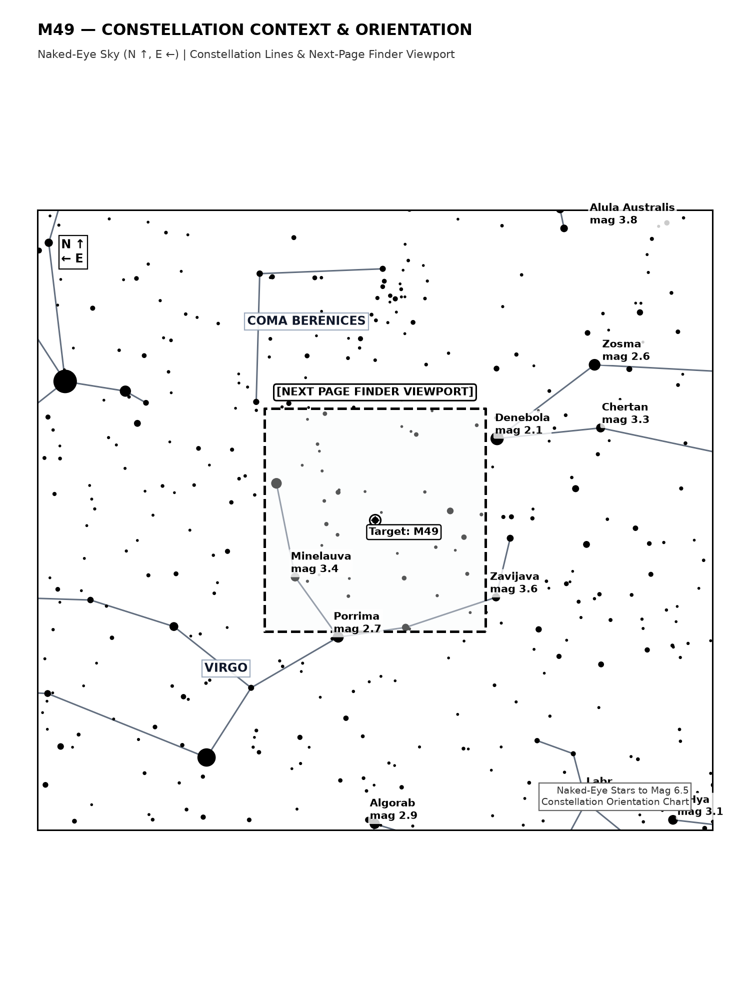

### 3. Wide-Field Star-Hopping Finder Chart
> [!IMPORTANT]
> **Viewport A** provides an upright naked-eye / optical finder orientation (N ↑, E ←) with stars down to visual magnitude 8.5. Standard concentric Telrad rings (0.5°, 2.0°, 4.0°) and 5.0° finder circle are centered directly on the target.

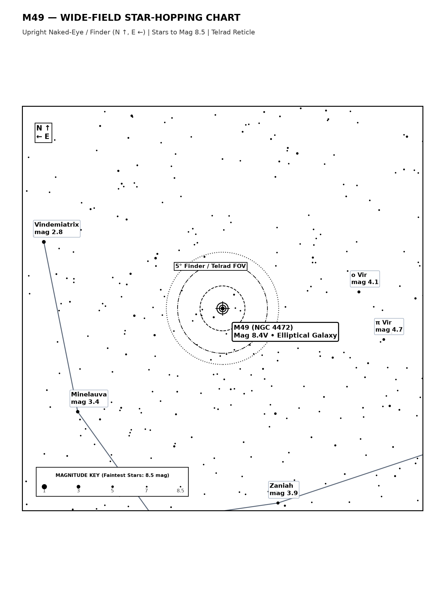

*([📄 Open Full High-Resolution Master A4 Finder Chart](shared/m49/chart_skywatcher-skyliner-200p.png))*

### 4. Observing Strategy & Step-by-Step Hop Instructions

- **Acquisition & Framing (20mm Super / 60×, 50' FOV)**:
  Ethereal oval glow with condensed galactic nucleus; framing the galaxy within the wide 50' field maximizes contrast against the sky.
- **High-Power Inspection & Detail (12.5mm / 96×, 31' FOV)**:
  12.5mm (96×) darkens the background sky, aiding detection of subtle core elongation, dust lanes, and halo extent with averted vision.

**Step-by-Step Star Hop Narrative**:
Locate constellation Virgo. Follow the guide stars on the Wide-Field Chart to RA 187.44°, Dec 8.00°; look for a soft hazy smudge.

---

## M50 (NGC 2323) — Monoceros

[↑ Back to Catalog Index](#messier-catalog-index) • [← Previous: M49](#m49) • [Next: M51 →](#m51)

| Technical Parameter | Specification |
| :--- | :--- |
| **Designation** | M50 (NGC 2323) |
| **Constellation** | Monoceros |
| **Classification** | Open Cluster (OC) |
| **Visual Magnitude ($V$)** | 5.9 mag |
| **Apparent Dimensions** | 15.0' × 15.0' |
| **Estimated Distance** | ~3,262 light-years |
| **Swanson Difficulty** | **Easy** (*NexStar User's Guide II*) |
| **Coordinates (J2000)** | RA **7h 02m 47.5s** • Dec **-8° 20' 16.1"** |
| **Recommended Eyepiece** | 20mm (60× magnification, 49' TFOV, 3.4mm exit pupil) |

### 1. Telescope Eyepiece Simulation & Technical Dossier
> [!NOTE]
> **Viewport B** depicts the pre-inverted 180° field view through the Newtonian reflector (20mm eyepiece / 60× magnification, 49' true field of view: South at top, West at left, N ↓, E →). **Viewport C** integrates target ephemeris and optical notes.

### 2. Constellation Context & Regional Orientation Chart
> [!TIP]
> **Viewport Context** presents a wide ~50°–65° naked-eye orientation field (stars down to visual magnitude 6.5) with official IAU constellation guide lines. The dashed bounding box marks the exact area covered by the wide-field star-hopping chart below.

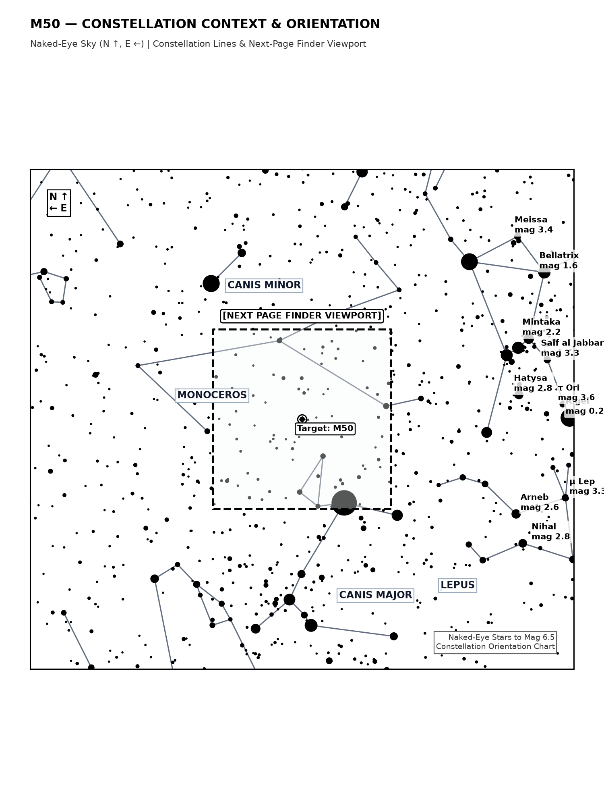

### 3. Wide-Field Star-Hopping Finder Chart
> [!IMPORTANT]
> **Viewport A** provides an upright naked-eye / optical finder orientation (N ↑, E ←) with stars down to visual magnitude 8.5. Standard concentric Telrad rings (0.5°, 2.0°, 4.0°) and 5.0° finder circle are centered directly on the target.

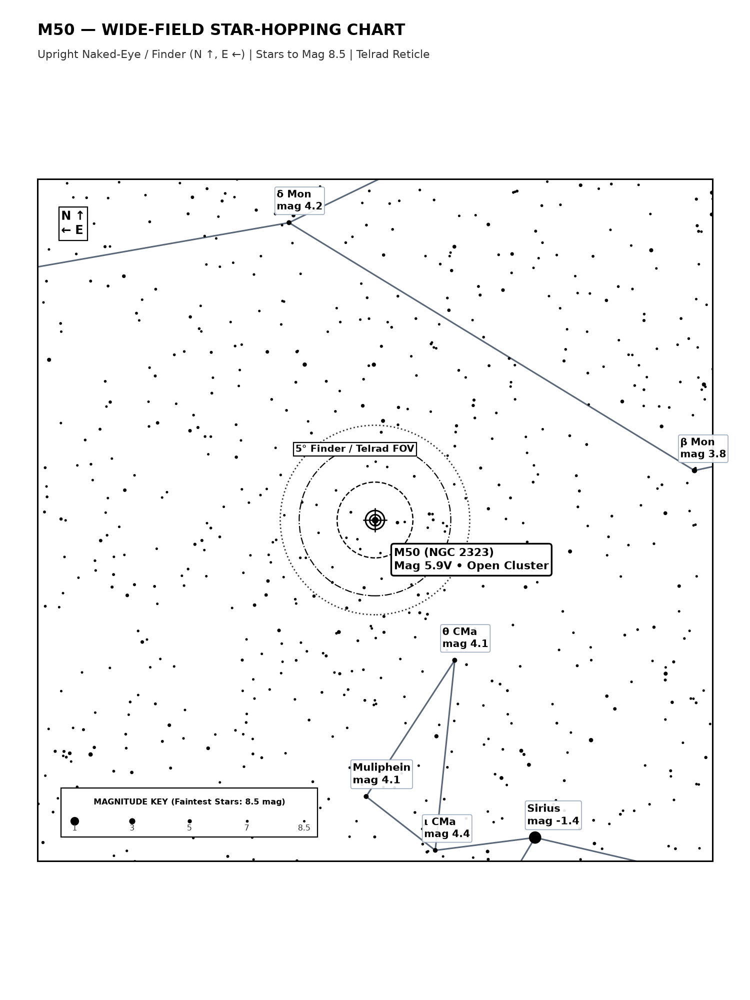

*([📄 Open Full High-Resolution Master A4 Finder Chart](shared/m50/chart_skywatcher-skyliner-200p.png))*

### 4. Observing Strategy & Step-by-Step Hop Instructions

- **Acquisition & Framing (20mm Super / 60×, 50' FOV)**:
  Gorgeous scattered star cluster filling the field with diverse stellar magnitudes and pleasing geometric groupings.
- **High-Power Inspection & Detail (20mm / 60×, 49' FOV)**:
  20mm (60×) deepens sky contrast and splits intimate stellar pairs and chains within the rich central grouping.

**Step-by-Step Star Hop Narrative**:
Locate Monoceros via Context Chart. Align Telrad reticle to target coordinates (RA 105.70°, Dec -8.34°); cluster stars emerge immediately in the finder.

---

## M51 Whirlpool Galaxy (NGC 5194) — Canes Venatici

[↑ Back to Catalog Index](#messier-catalog-index) • [← Previous: M50](#m50) • [Next: M52 →](#m52)

| Technical Parameter | Specification |
| :--- | :--- |
| **Designation** | M51 (NGC 5194) |
| **Common Name** | **Whirlpool Galaxy** |
| **Constellation** | Canes Venatici |
| **Classification** | Spiral Galaxy (Galaxy) |
| **Visual Magnitude ($V$)** | 8.1 mag |
| **Apparent Dimensions** | 11.2' × 8.4' |
| **Estimated Distance** | ~7.1 million light-years |
| **Swanson Difficulty** | **Medium** (*NexStar User's Guide II*) |
| **Coordinates (J2000)** | RA **13h 29m 52.7s** • Dec **+47° 11' 42.9"** |
| **Recommended Eyepiece** | 12.5mm (96× magnification, 31' TFOV, 2.1mm exit pupil) |

### 1. Telescope Eyepiece Simulation & Technical Dossier
> [!NOTE]
> **Viewport B** depicts the pre-inverted 180° field view through the Newtonian reflector (12.5mm eyepiece / 96× magnification, 31' true field of view: South at top, West at left, N ↓, E →). **Viewport C** integrates target ephemeris and optical notes.

### 2. Constellation Context & Regional Orientation Chart
> [!TIP]
> **Viewport Context** presents a wide ~50°–65° naked-eye orientation field (stars down to visual magnitude 6.5) with official IAU constellation guide lines. The dashed bounding box marks the exact area covered by the wide-field star-hopping chart below.

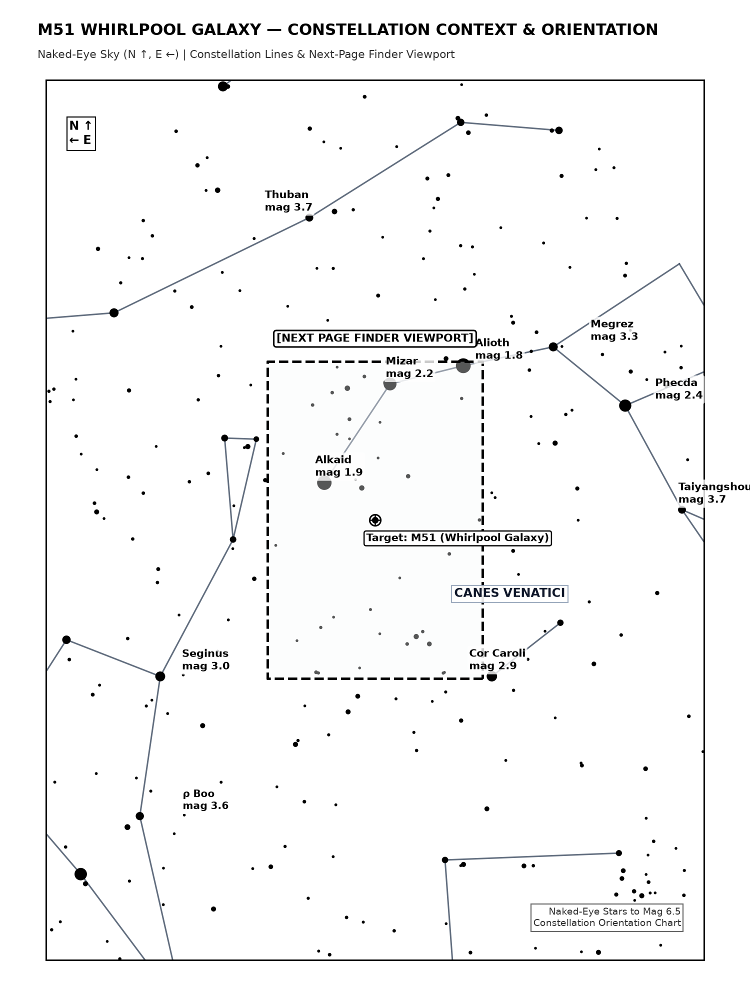

### 3. Wide-Field Star-Hopping Finder Chart
> [!IMPORTANT]
> **Viewport A** provides an upright naked-eye / optical finder orientation (N ↑, E ←) with stars down to visual magnitude 8.5. Standard concentric Telrad rings (0.5°, 2.0°, 4.0°) and 5.0° finder circle are centered directly on the target.

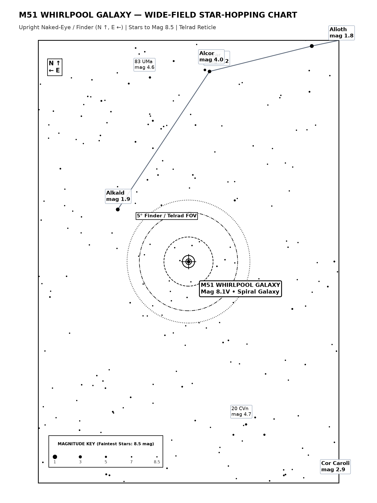

*([📄 Open Full High-Resolution Master A4 Finder Chart](shared/m51/chart_skywatcher-skyliner-200p.png))*

### 4. Observing Strategy & Step-by-Step Hop Instructions

- **Acquisition & Framing (20mm Super / 60×, 50' FOV)**:
  The Whirlpool Galaxy; famous face-on spiral interacting with dwarf companion NGC 5195 near Alkaid in Ursa Major.
- **High-Power Inspection & Detail (12.5mm / 96×, 31' FOV)**:
  96× reveals the dual galactic cores and distinctive annular spiral structure with averted vision under steady, dark skies.

**Step-by-Step Star Hop Narrative**:
Locate Alkaid (η UMa) at the tip of the Big Dipper's handle. Slew 3.5° southwest toward Cor Caroli; center the pair of interacting cores.

---

## M52 (NGC 7654) — Cassiopeia

[↑ Back to Catalog Index](#messier-catalog-index) • [← Previous: M51](#m51) • [Next: M53 →](#m53)

| Technical Parameter | Specification |
| :--- | :--- |
| **Designation** | M52 (NGC 7654) |
| **Constellation** | Cassiopeia |
| **Classification** | Open Cluster (OC) |
| **Visual Magnitude ($V$)** | 6.9 mag |
| **Apparent Dimensions** | 16.0' × 16.0' |
| **Estimated Distance** | ~499 light-years |
| **Swanson Difficulty** | **Medium** (*NexStar User's Guide II*) |
| **Coordinates (J2000)** | RA **23h 24m 48.0s** • Dec **+61° 35' 34.8"** |
| **Recommended Eyepiece** | 20mm (60× magnification, 49' TFOV, 3.4mm exit pupil) |

### 1. Telescope Eyepiece Simulation & Technical Dossier
> [!NOTE]
> **Viewport B** depicts the pre-inverted 180° field view through the Newtonian reflector (20mm eyepiece / 60× magnification, 49' true field of view: South at top, West at left, N ↓, E →). **Viewport C** integrates target ephemeris and optical notes.

### 2. Constellation Context & Regional Orientation Chart
> [!TIP]
> **Viewport Context** presents a wide ~50°–65° naked-eye orientation field (stars down to visual magnitude 6.5) with official IAU constellation guide lines. The dashed bounding box marks the exact area covered by the wide-field star-hopping chart below.

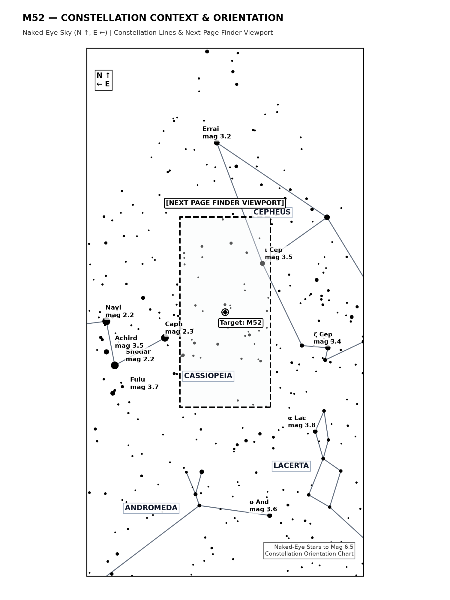

### 3. Wide-Field Star-Hopping Finder Chart
> [!IMPORTANT]
> **Viewport A** provides an upright naked-eye / optical finder orientation (N ↑, E ←) with stars down to visual magnitude 8.5. Standard concentric Telrad rings (0.5°, 2.0°, 4.0°) and 5.0° finder circle are centered directly on the target.

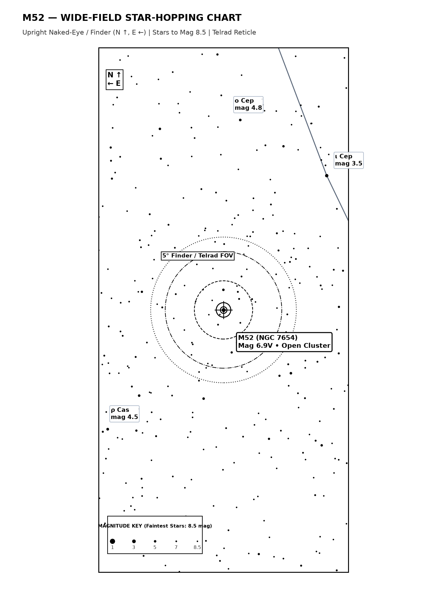

*([📄 Open Full High-Resolution Master A4 Finder Chart](shared/m52/chart_skywatcher-skyliner-200p.png))*

### 4. Observing Strategy & Step-by-Step Hop Instructions

- **Acquisition & Framing (20mm Super / 60×, 50' FOV)**:
  Gorgeous scattered star cluster filling the field with diverse stellar magnitudes and pleasing geometric groupings.
- **High-Power Inspection & Detail (20mm / 60×, 49' FOV)**:
  20mm (60×) deepens sky contrast and splits intimate stellar pairs and chains within the rich central grouping.

**Step-by-Step Star Hop Narrative**:
Locate Cassiopeia via Context Chart. Align Telrad reticle to target coordinates (RA 351.20°, Dec 61.59°); cluster stars emerge immediately in the finder.

---

## M53 (NGC 5024) — Coma Berenices

[↑ Back to Catalog Index](#messier-catalog-index) • [← Previous: M52](#m52) • [Next: M54 →](#m54)

| Technical Parameter | Specification |
| :--- | :--- |
| **Designation** | M53 (NGC 5024) |
| **Constellation** | Coma Berenices |
| **Classification** | Globular Cluster (GC) |
| **Visual Magnitude ($V$)** | 7.7 mag |
| **Apparent Dimensions** | 13.0' × 13.0' |
| **Estimated Distance** | ~58,716 light-years |
| **Swanson Difficulty** | **Medium** (*NexStar User's Guide II*) |
| **Coordinates (J2000)** | RA **13h 12m 55.3s** • Dec **+18° 10' 05.4"** |
| **Recommended Eyepiece** | 12.5mm (96× magnification, 31' TFOV, 2.1mm exit pupil) |

### 1. Telescope Eyepiece Simulation & Technical Dossier
> [!NOTE]
> **Viewport B** depicts the pre-inverted 180° field view through the Newtonian reflector (12.5mm eyepiece / 96× magnification, 31' true field of view: South at top, West at left, N ↓, E →). **Viewport C** integrates target ephemeris and optical notes.

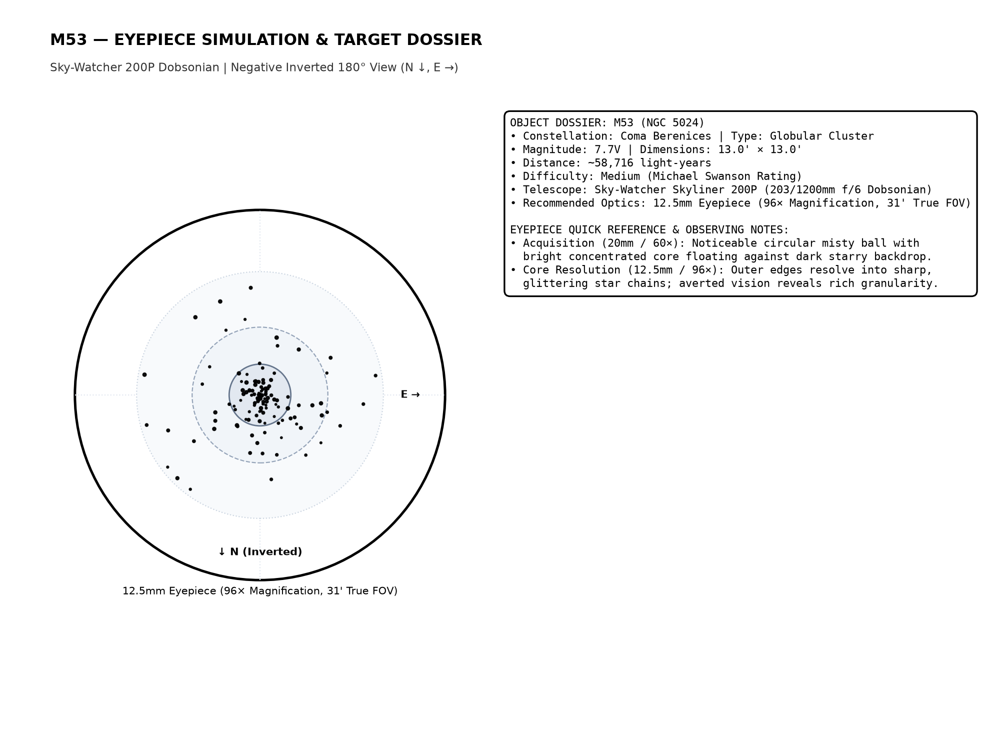

### 2. Constellation Context & Regional Orientation Chart
> [!TIP]
> **Viewport Context** presents a wide ~50°–65° naked-eye orientation field (stars down to visual magnitude 6.5) with official IAU constellation guide lines. The dashed bounding box marks the exact area covered by the wide-field star-hopping chart below.

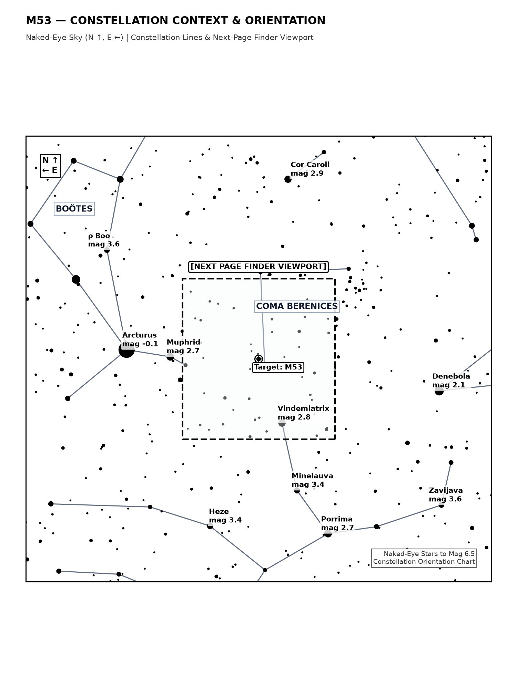

### 3. Wide-Field Star-Hopping Finder Chart
> [!IMPORTANT]
> **Viewport A** provides an upright naked-eye / optical finder orientation (N ↑, E ←) with stars down to visual magnitude 8.5. Standard concentric Telrad rings (0.5°, 2.0°, 4.0°) and 5.0° finder circle are centered directly on the target.

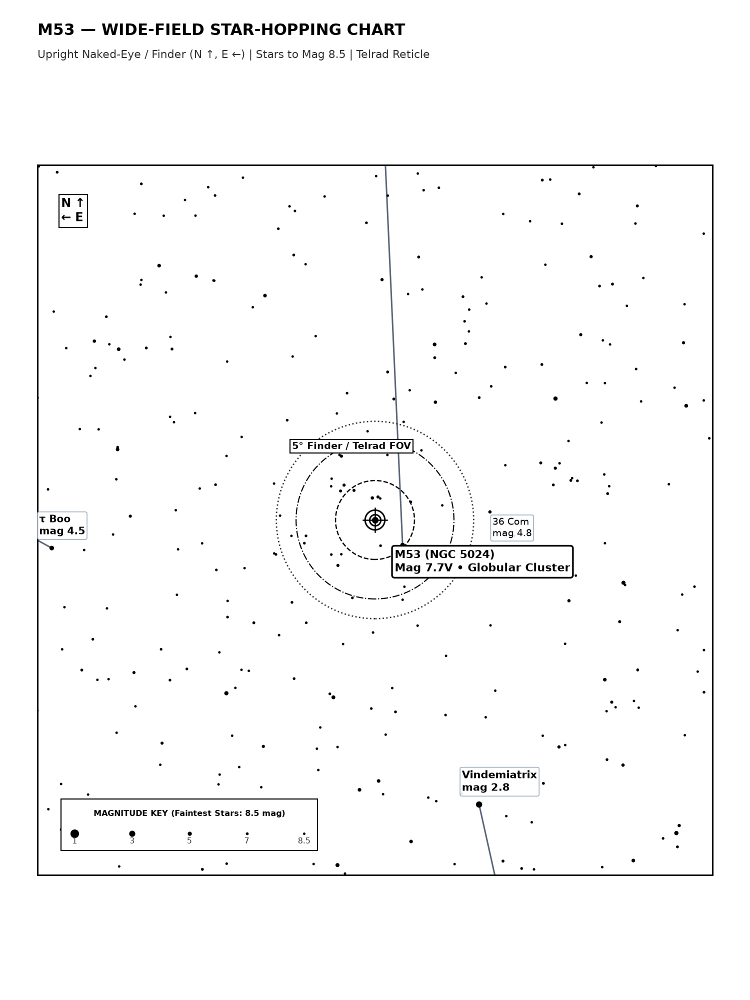

*([📄 Open Full High-Resolution Master A4 Finder Chart](shared/m53/chart_skywatcher-skyliner-200p.png))*

### 4. Observing Strategy & Step-by-Step Hop Instructions

- **Acquisition & Framing (20mm Super / 60×, 50' FOV)**:
  Noticeable circular misty ball with bright concentrated core floating against a dark starry backdrop in Coma Berenices.
- **High-Power Inspection & Detail (12.5mm / 96×, 31' FOV)**:
  12.5mm (96×) resolves the outer edges into sharp, glittering diamond star points; averted vision reveals rich granularity across the core.

**Step-by-Step Star Hop Narrative**:
Locate anchor constellation Coma Berenices on the Context Chart. Slew Telrad reticle to RA 198.23°, Dec 18.17° and center the fuzzy ball in the 20mm finder eyepiece.

---

## M54 (NGC 6715) — Sagittarius

[↑ Back to Catalog Index](#messier-catalog-index) • [← Previous: M53](#m53) • [Next: M55 →](#m55)

| Technical Parameter | Specification |
| :--- | :--- |
| **Designation** | M54 (NGC 6715) |
| **Constellation** | Sagittarius |
| **Classification** | Globular Cluster (GC) |
| **Visual Magnitude ($V$)** | 7.7 mag |
| **Apparent Dimensions** | 12.0' × 12.0' |
| **Estimated Distance** | ~87,421 light-years |
| **Swanson Difficulty** | **Medium** (*NexStar User's Guide II*) |
| **Coordinates (J2000)** | RA **18h 55m 03.3s** • Dec **-30° 28' 47.5"** |
| **Recommended Eyepiece** | 12.5mm (96× magnification, 31' TFOV, 2.1mm exit pupil) |

### 1. Telescope Eyepiece Simulation & Technical Dossier
> [!NOTE]
> **Viewport B** depicts the pre-inverted 180° field view through the Newtonian reflector (12.5mm eyepiece / 96× magnification, 31' true field of view: South at top, West at left, N ↓, E →). **Viewport C** integrates target ephemeris and optical notes.

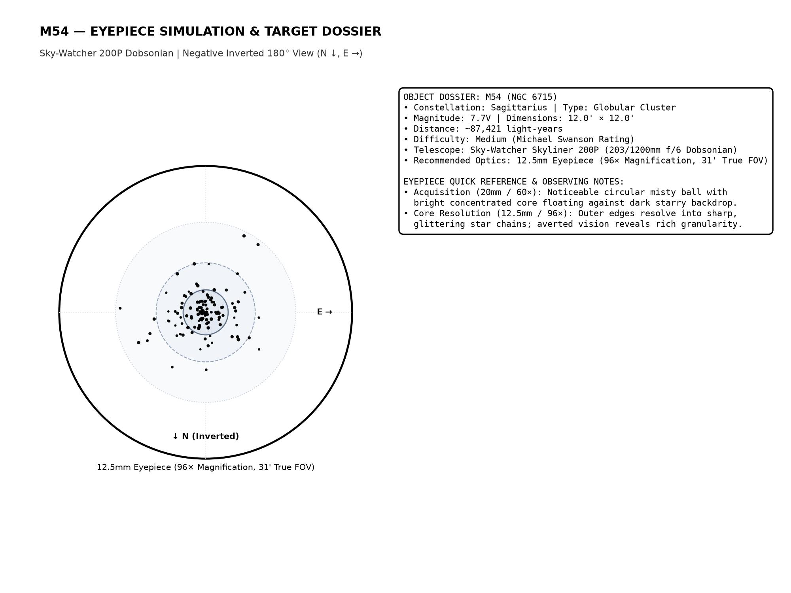

### 2. Constellation Context & Regional Orientation Chart
> [!TIP]
> **Viewport Context** presents a wide ~50°–65° naked-eye orientation field (stars down to visual magnitude 6.5) with official IAU constellation guide lines. The dashed bounding box marks the exact area covered by the wide-field star-hopping chart below.

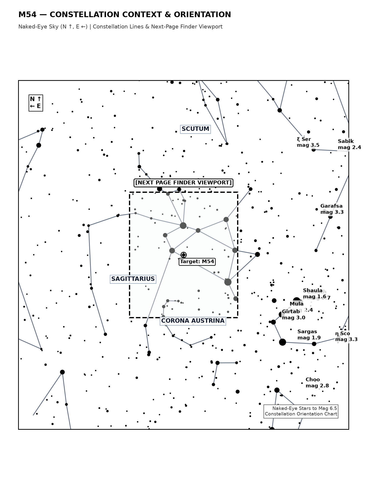

### 3. Wide-Field Star-Hopping Finder Chart
> [!IMPORTANT]
> **Viewport A** provides an upright naked-eye / optical finder orientation (N ↑, E ←) with stars down to visual magnitude 8.5. Standard concentric Telrad rings (0.5°, 2.0°, 4.0°) and 5.0° finder circle are centered directly on the target.

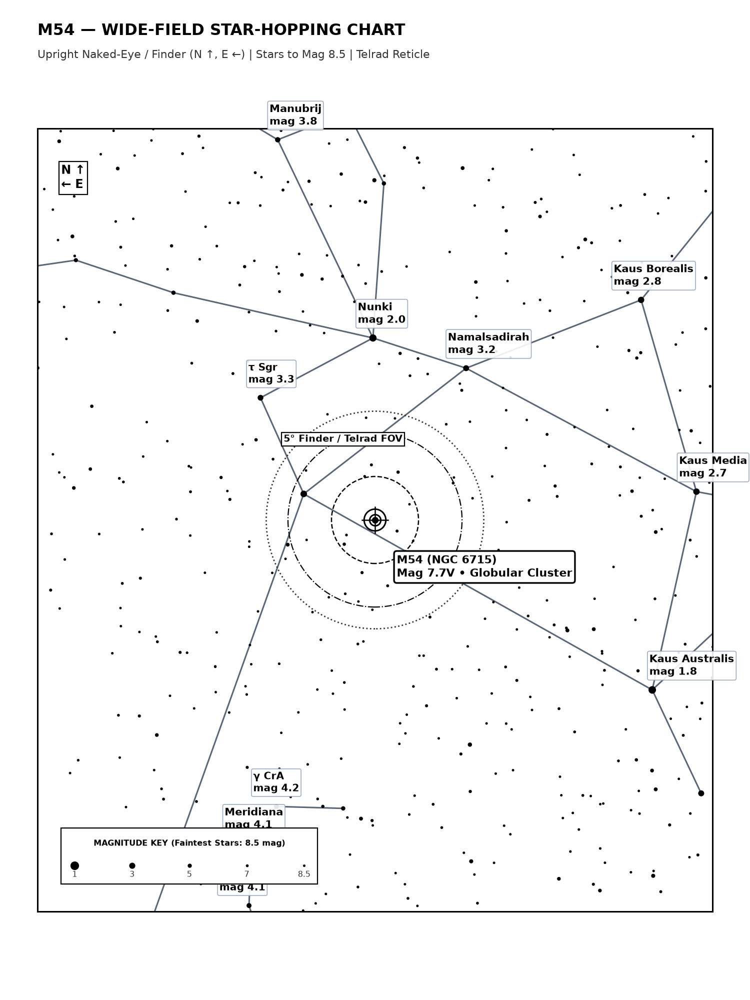

*([📄 Open Full High-Resolution Master A4 Finder Chart](shared/m54/chart_skywatcher-skyliner-200p.png))*

### 4. Observing Strategy & Step-by-Step Hop Instructions

- **Acquisition & Framing (20mm Super / 60×, 50' FOV)**:
  Noticeable circular misty ball with bright concentrated core floating against a dark starry backdrop in Sagittarius.
- **High-Power Inspection & Detail (12.5mm / 96×, 31' FOV)**:
  12.5mm (96×) resolves the outer edges into sharp, glittering diamond star points; averted vision reveals rich granularity across the core.

**Step-by-Step Star Hop Narrative**:
Locate anchor constellation Sagittarius on the Context Chart. Slew Telrad reticle to RA 283.76°, Dec -30.48° and center the fuzzy ball in the 20mm finder eyepiece.

---

## M55 (NGC 6809) — Sagittarius

[↑ Back to Catalog Index](#messier-catalog-index) • [← Previous: M54](#m54) • [Next: M56 →](#m56)

| Technical Parameter | Specification |
| :--- | :--- |
| **Designation** | M55 (NGC 6809) |
| **Constellation** | Sagittarius |
| **Classification** | Globular Cluster (GC) |
| **Visual Magnitude ($V$)** | 6.3 mag |
| **Apparent Dimensions** | 19.0' × 19.0' |
| **Estimated Distance** | ~17,614 light-years |
| **Swanson Difficulty** | **Medium** (*NexStar User's Guide II*) |
| **Coordinates (J2000)** | RA **19h 39m 59.7s** • Dec **-30° 57' 53.1"** |
| **Recommended Eyepiece** | 20mm (60× magnification, 49' TFOV, 3.4mm exit pupil) |

### 1. Telescope Eyepiece Simulation & Technical Dossier
> [!NOTE]
> **Viewport B** depicts the pre-inverted 180° field view through the Newtonian reflector (20mm eyepiece / 60× magnification, 49' true field of view: South at top, West at left, N ↓, E →). **Viewport C** integrates target ephemeris and optical notes.

### 2. Constellation Context & Regional Orientation Chart
> [!TIP]
> **Viewport Context** presents a wide ~50°–65° naked-eye orientation field (stars down to visual magnitude 6.5) with official IAU constellation guide lines. The dashed bounding box marks the exact area covered by the wide-field star-hopping chart below.

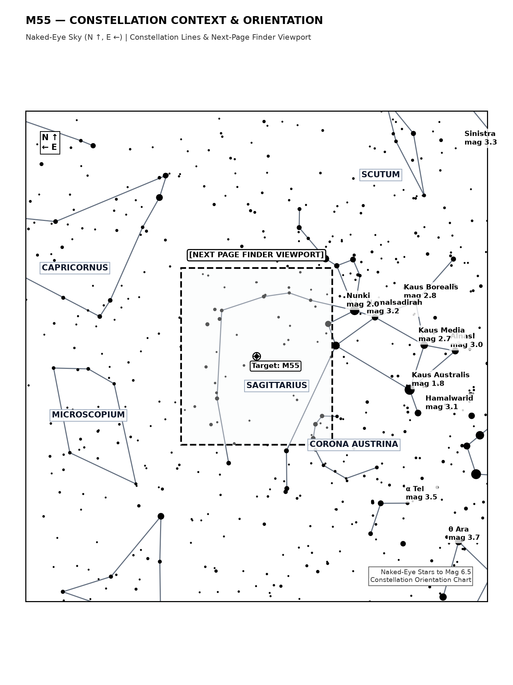

### 3. Wide-Field Star-Hopping Finder Chart
> [!IMPORTANT]
> **Viewport A** provides an upright naked-eye / optical finder orientation (N ↑, E ←) with stars down to visual magnitude 8.5. Standard concentric Telrad rings (0.5°, 2.0°, 4.0°) and 5.0° finder circle are centered directly on the target.

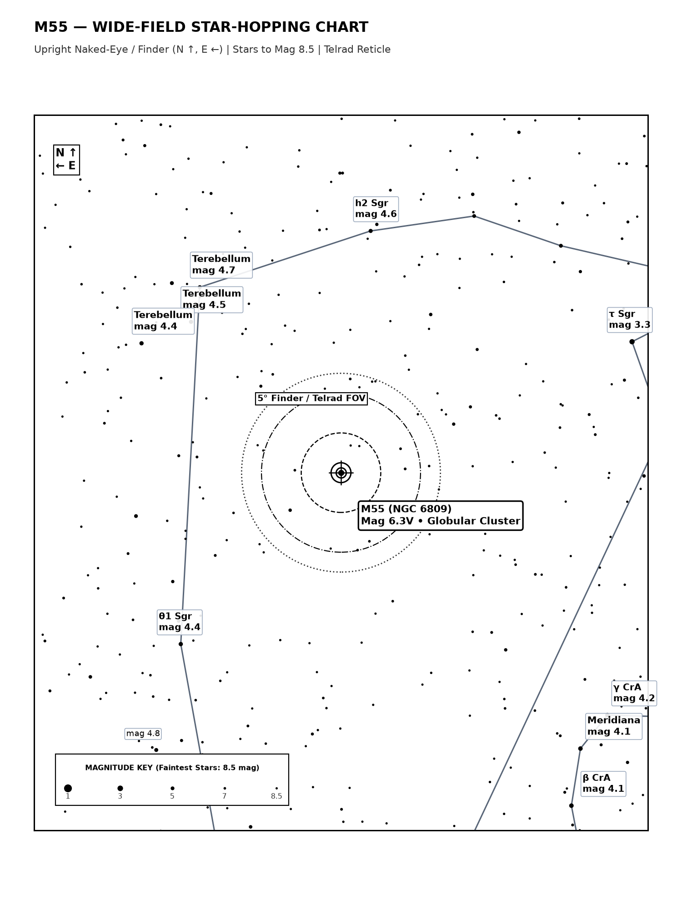

*([📄 Open Full High-Resolution Master A4 Finder Chart](shared/m55/chart_skywatcher-skyliner-200p.png))*

### 4. Observing Strategy & Step-by-Step Hop Instructions

- **Acquisition & Framing (20mm Super / 60×, 50' FOV)**:
  Noticeable circular misty ball with bright concentrated core floating against a dark starry backdrop in Sagittarius.
- **High-Power Inspection & Detail (20mm / 60×, 49' FOV)**:
  20mm (60×) resolves the outer edges into sharp, glittering diamond star points; averted vision reveals rich granularity across the core.

**Step-by-Step Star Hop Narrative**:
Locate anchor constellation Sagittarius on the Context Chart. Slew Telrad reticle to RA 295.00°, Dec -30.96° and center the fuzzy ball in the 20mm finder eyepiece.

---

## M56 (NGC 6779) — Lyra

[↑ Back to Catalog Index](#messier-catalog-index) • [← Previous: M55](#m55) • [Next: M57 →](#m57)

| Technical Parameter | Specification |
| :--- | :--- |
| **Designation** | M56 (NGC 6779) |
| **Constellation** | Lyra |
| **Classification** | Globular Cluster (GC) |
| **Visual Magnitude ($V$)** | 8.4 mag |
| **Apparent Dimensions** | 8.8' × 8.8' |
| **Estimated Distance** | ~32,620 light-years |
| **Swanson Difficulty** | **Medium** (*NexStar User's Guide II*) |
| **Coordinates (J2000)** | RA **19h 16m 35.6s** • Dec **+30° 11' 00.5"** |
| **Recommended Eyepiece** | 12.5mm (96× magnification, 31' TFOV, 2.1mm exit pupil) |

### 1. Telescope Eyepiece Simulation & Technical Dossier
> [!NOTE]
> **Viewport B** depicts the pre-inverted 180° field view through the Newtonian reflector (12.5mm eyepiece / 96× magnification, 31' true field of view: South at top, West at left, N ↓, E →). **Viewport C** integrates target ephemeris and optical notes.

### 2. Constellation Context & Regional Orientation Chart
> [!TIP]
> **Viewport Context** presents a wide ~50°–65° naked-eye orientation field (stars down to visual magnitude 6.5) with official IAU constellation guide lines. The dashed bounding box marks the exact area covered by the wide-field star-hopping chart below.

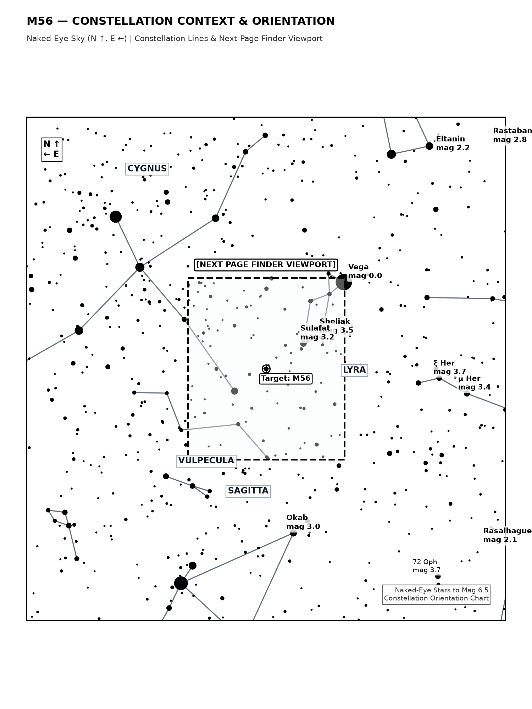

### 3. Wide-Field Star-Hopping Finder Chart
> [!IMPORTANT]
> **Viewport A** provides an upright naked-eye / optical finder orientation (N ↑, E ←) with stars down to visual magnitude 8.5. Standard concentric Telrad rings (0.5°, 2.0°, 4.0°) and 5.0° finder circle are centered directly on the target.

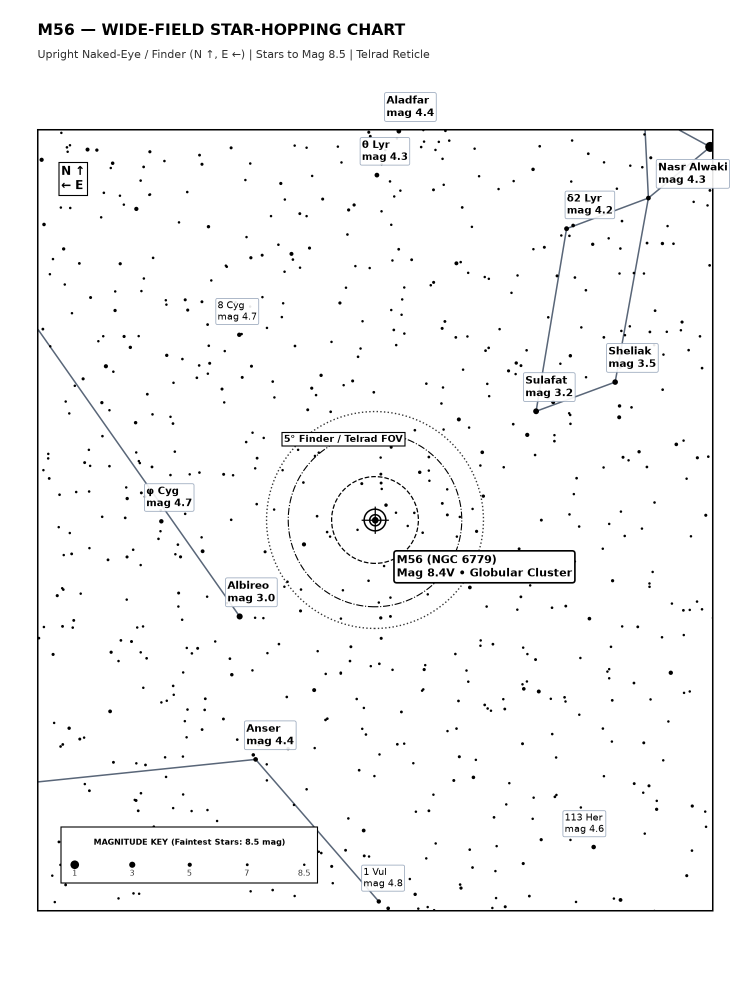

*([📄 Open Full High-Resolution Master A4 Finder Chart](shared/m56/chart_skywatcher-skyliner-200p.png))*

### 4. Observing Strategy & Step-by-Step Hop Instructions

- **Acquisition & Framing (20mm Super / 60×, 50' FOV)**:
  Noticeable circular misty ball with bright concentrated core floating against a dark starry backdrop in Lyra.
- **High-Power Inspection & Detail (12.5mm / 96×, 31' FOV)**:
  12.5mm (96×) resolves the outer edges into sharp, glittering diamond star points; averted vision reveals rich granularity across the core.

**Step-by-Step Star Hop Narrative**:
Locate anchor constellation Lyra on the Context Chart. Slew Telrad reticle to RA 289.15°, Dec 30.18° and center the fuzzy ball in the 20mm finder eyepiece.

---

## M57 Ring Nebula (NGC 6720) — Lyra

[↑ Back to Catalog Index](#messier-catalog-index) • [← Previous: M56](#m56) • [Next: M58 →](#m58)

| Technical Parameter | Specification |
| :--- | :--- |
| **Designation** | M57 (NGC 6720) |
| **Common Name** | **Ring Nebula** |
| **Constellation** | Lyra |
| **Classification** | Planetary Nebula (PN) |
| **Visual Magnitude ($V$)** | 8.8 mag |
| **Apparent Dimensions** | 3.8' × 2.4' |
| **Estimated Distance** | ~2870 light-years |
| **Swanson Difficulty** | **Easy** (*NexStar User's Guide II*) |
| **Coordinates (J2000)** | RA **18h 53m 35.1s** • Dec **+33° 01' 45.0"** |
| **Recommended Eyepiece** | 12.5mm (96× magnification, 31' TFOV, 2.1mm exit pupil) |

### 1. Telescope Eyepiece Simulation & Technical Dossier
> [!NOTE]
> **Viewport B** depicts the pre-inverted 180° field view through the Newtonian reflector (12.5mm eyepiece / 96× magnification, 31' true field of view: South at top, West at left, N ↓, E →). **Viewport C** integrates target ephemeris and optical notes.

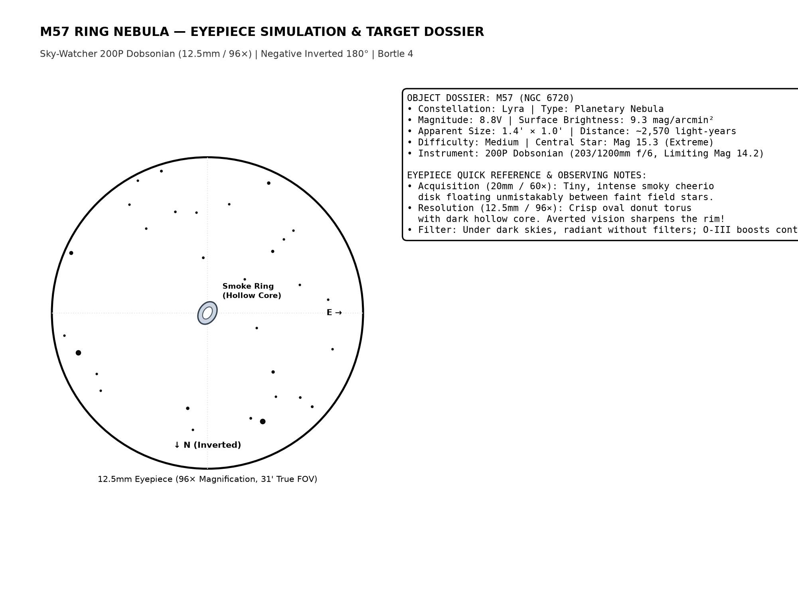

### 2. Constellation Context & Regional Orientation Chart
> [!TIP]
> **Viewport Context** presents a wide ~50°–65° naked-eye orientation field (stars down to visual magnitude 6.5) with official IAU constellation guide lines. The dashed bounding box marks the exact area covered by the wide-field star-hopping chart below.

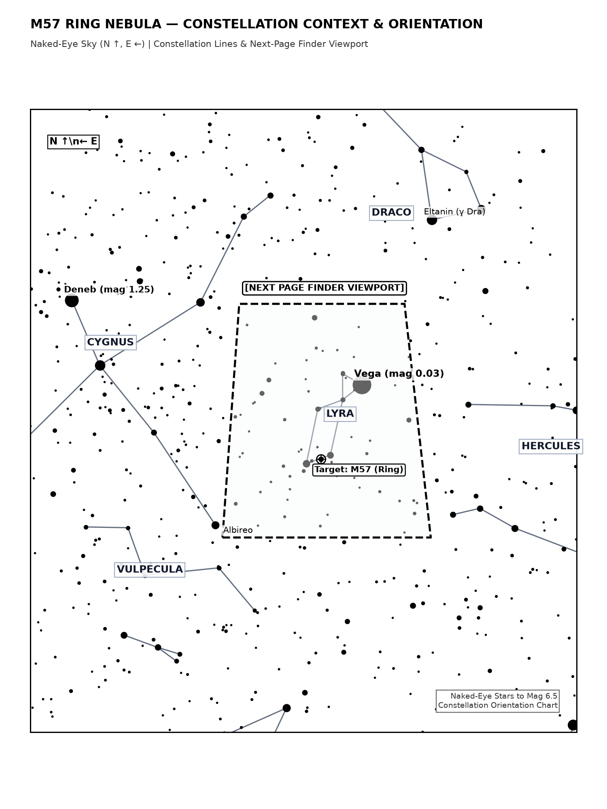

### 3. Wide-Field Star-Hopping Finder Chart
> [!IMPORTANT]
> **Viewport A** provides an upright naked-eye / optical finder orientation (N ↑, E ←) with stars down to visual magnitude 8.5. Standard concentric Telrad rings (0.5°, 2.0°, 4.0°) and 5.0° finder circle are centered directly on the target.

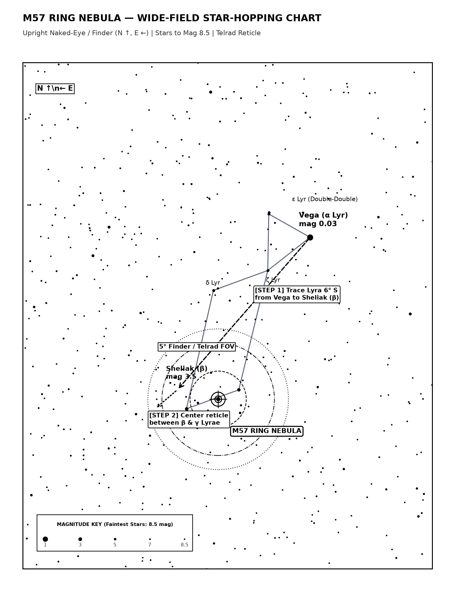

*([📄 Open Full High-Resolution Master A4 Finder Chart](shared/m57/chart_skywatcher-skyliner-200p.png))*

### 4. Observing Strategy & Step-by-Step Hop Instructions

- **Acquisition & Framing (20mm Super / 60×, 50' FOV)**:
  The Ring Nebula; unmistakable smoky cheerio disc floating midway between Sheliak (β) and Sulafat (γ) in Lyra.
- **High-Power Inspection & Detail (12.5mm / 96×, 31' FOV)**:
  12.5mm (96×) magnifies the ring to 1.4' × 1.0', clearly displaying the hollow dark core, bright outer oval rim, and delicate grey-green gas contrast.

**Step-by-Step Star Hop Narrative**:
Locate Vega in Lyra. Drop 6° south to the bottom parallelogram stars Sheliak (β) and Sulafat (γ). Center the Telrad reticle exactly halfway between β and γ Lyrae.

---

## M58 (NGC 4579) — Virgo

[↑ Back to Catalog Index](#messier-catalog-index) • [← Previous: M57](#m57) • [Next: M59 →](#m59)

| Technical Parameter | Specification |
| :--- | :--- |
| **Designation** | M58 (NGC 4579) |
| **Constellation** | Virgo |
| **Classification** | Spiral Galaxy (Galaxy) |
| **Visual Magnitude ($V$)** | 9.7 mag |
| **Apparent Dimensions** | 9.7' × 4.7' |
| **Estimated Distance** | ~19.1 million light-years |
| **Swanson Difficulty** | **Hard** (*NexStar User's Guide II*) |
| **Coordinates (J2000)** | RA **12h 37m 43.6s** • Dec **+11° 49' 05.1"** |
| **Recommended Eyepiece** | 12.5mm (96× magnification, 31' TFOV, 2.1mm exit pupil) |

### 1. Telescope Eyepiece Simulation & Technical Dossier
> [!NOTE]
> **Viewport B** depicts the pre-inverted 180° field view through the Newtonian reflector (12.5mm eyepiece / 96× magnification, 31' true field of view: South at top, West at left, N ↓, E →). **Viewport C** integrates target ephemeris and optical notes.

### 2. Constellation Context & Regional Orientation Chart
> [!TIP]
> **Viewport Context** presents a wide ~50°–65° naked-eye orientation field (stars down to visual magnitude 6.5) with official IAU constellation guide lines. The dashed bounding box marks the exact area covered by the wide-field star-hopping chart below.

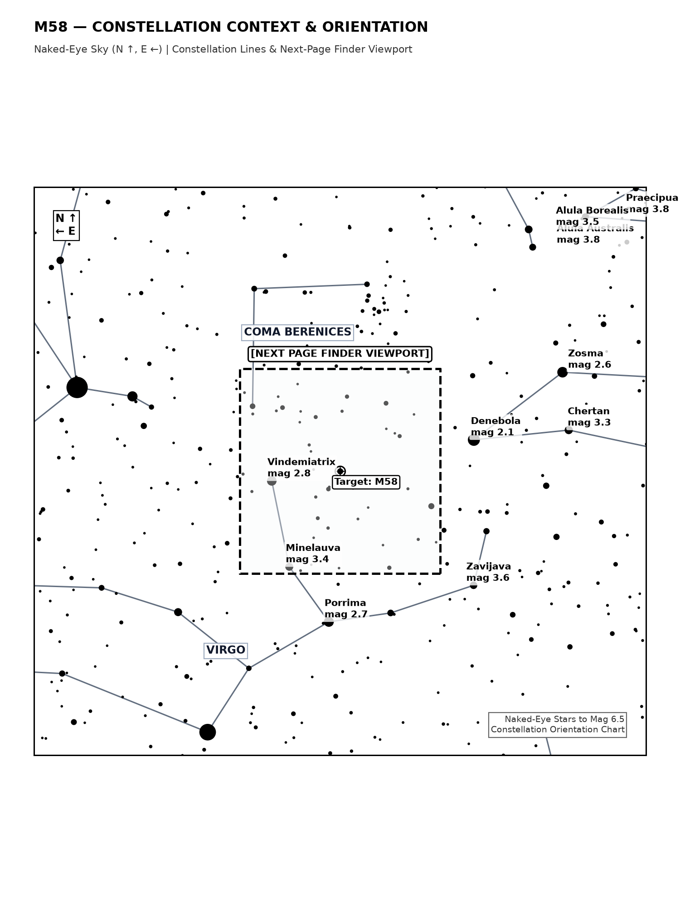

### 3. Wide-Field Star-Hopping Finder Chart
> [!IMPORTANT]
> **Viewport A** provides an upright naked-eye / optical finder orientation (N ↑, E ←) with stars down to visual magnitude 8.5. Standard concentric Telrad rings (0.5°, 2.0°, 4.0°) and 5.0° finder circle are centered directly on the target.

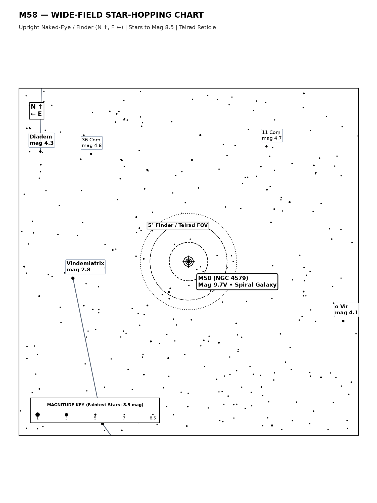

*([📄 Open Full High-Resolution Master A4 Finder Chart](shared/m58/chart_skywatcher-skyliner-200p.png))*

### 4. Observing Strategy & Step-by-Step Hop Instructions

- **Acquisition & Framing (20mm Super / 60×, 50' FOV)**:
  Ethereal oval glow with condensed galactic nucleus; framing the galaxy within the wide 50' field maximizes contrast against the sky.
- **High-Power Inspection & Detail (12.5mm / 96×, 31' FOV)**:
  12.5mm (96×) darkens the background sky, aiding detection of subtle core elongation, dust lanes, and halo extent with averted vision.

**Step-by-Step Star Hop Narrative**:
Locate constellation Virgo. Follow the guide stars on the Wide-Field Chart to RA 189.43°, Dec 11.82°; look for a soft hazy smudge.

---

## M59 (NGC 4621) — Virgo

[↑ Back to Catalog Index](#messier-catalog-index) • [← Previous: M58](#m58) • [Next: M60 →](#m60)

| Technical Parameter | Specification |
| :--- | :--- |
| **Designation** | M59 (NGC 4621) |
| **Constellation** | Virgo |
| **Classification** | Elliptical Galaxy (Galaxy) |
| **Visual Magnitude ($V$)** | 9.6 mag |
| **Apparent Dimensions** | 5.4' × 3.7' |
| **Estimated Distance** | ~18.3 million light-years |
| **Swanson Difficulty** | **Hard** (*NexStar User's Guide II*) |
| **Coordinates (J2000)** | RA **12h 42m 02.3s** • Dec **+11° 38' 48.9"** |
| **Recommended Eyepiece** | 12.5mm (96× magnification, 31' TFOV, 2.1mm exit pupil) |

### 1. Telescope Eyepiece Simulation & Technical Dossier
> [!NOTE]
> **Viewport B** depicts the pre-inverted 180° field view through the Newtonian reflector (12.5mm eyepiece / 96× magnification, 31' true field of view: South at top, West at left, N ↓, E →). **Viewport C** integrates target ephemeris and optical notes.

### 2. Constellation Context & Regional Orientation Chart
> [!TIP]
> **Viewport Context** presents a wide ~50°–65° naked-eye orientation field (stars down to visual magnitude 6.5) with official IAU constellation guide lines. The dashed bounding box marks the exact area covered by the wide-field star-hopping chart below.

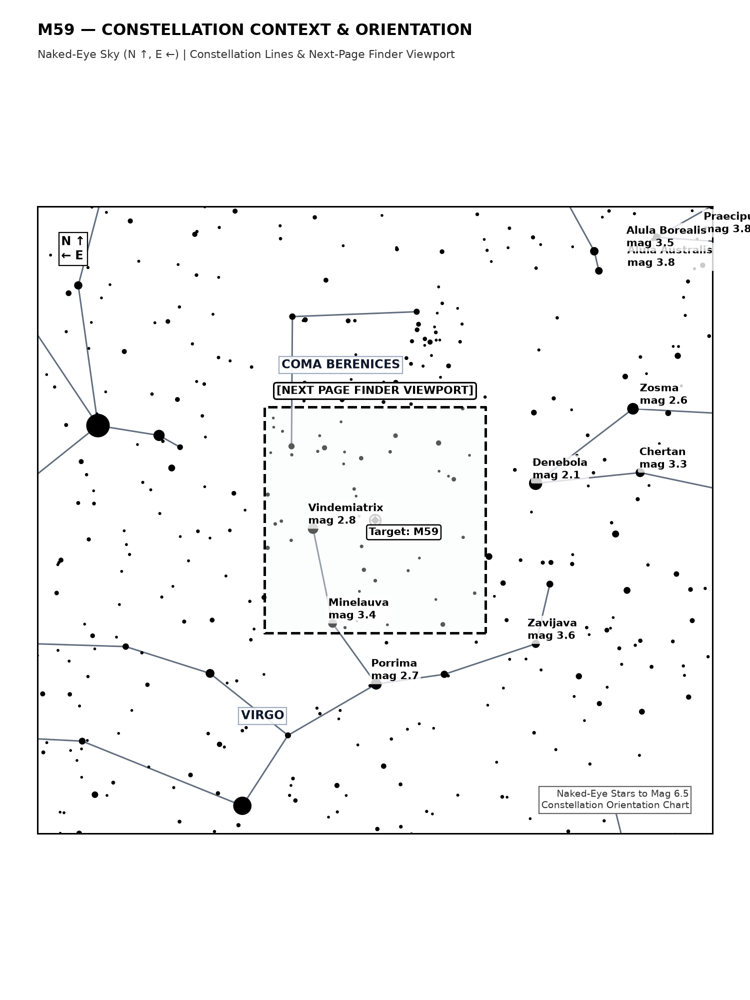

### 3. Wide-Field Star-Hopping Finder Chart
> [!IMPORTANT]
> **Viewport A** provides an upright naked-eye / optical finder orientation (N ↑, E ←) with stars down to visual magnitude 8.5. Standard concentric Telrad rings (0.5°, 2.0°, 4.0°) and 5.0° finder circle are centered directly on the target.

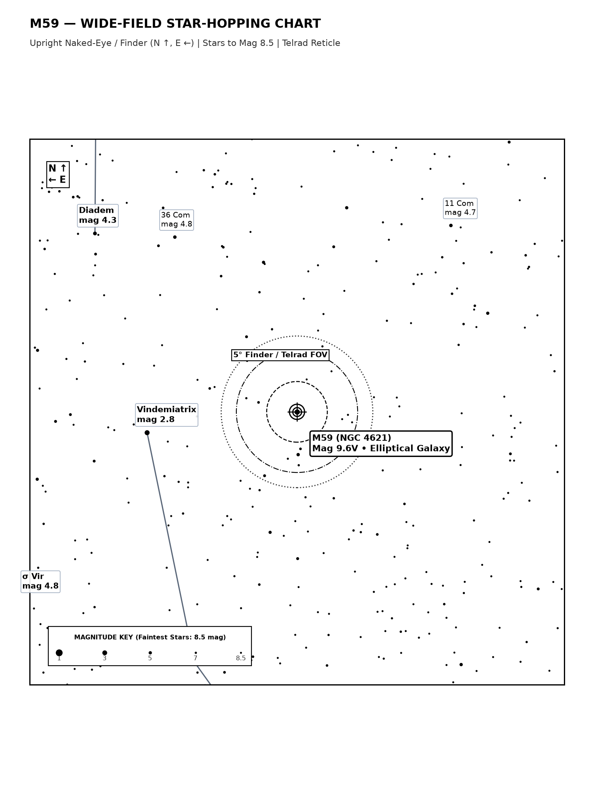

*([📄 Open Full High-Resolution Master A4 Finder Chart](shared/m59/chart_skywatcher-skyliner-200p.png))*

### 4. Observing Strategy & Step-by-Step Hop Instructions

- **Acquisition & Framing (20mm Super / 60×, 50' FOV)**:
  Ethereal oval glow with condensed galactic nucleus; framing the galaxy within the wide 50' field maximizes contrast against the sky.
- **High-Power Inspection & Detail (12.5mm / 96×, 31' FOV)**:
  12.5mm (96×) darkens the background sky, aiding detection of subtle core elongation, dust lanes, and halo extent with averted vision.

**Step-by-Step Star Hop Narrative**:
Locate constellation Virgo. Follow the guide stars on the Wide-Field Chart to RA 190.51°, Dec 11.65°; look for a soft hazy smudge.

---

## M60 (NGC 4649) — Virgo

[↑ Back to Catalog Index](#messier-catalog-index) • [← Previous: M59](#m59) • [Next: M61 →](#m61)

| Technical Parameter | Specification |
| :--- | :--- |
| **Designation** | M60 (NGC 4649) |
| **Constellation** | Virgo |
| **Classification** | Elliptical Galaxy (Galaxy) |
| **Visual Magnitude ($V$)** | 8.8 mag |
| **Apparent Dimensions** | 7.4' × 6.0' |
| **Estimated Distance** | ~16.8 million light-years |
| **Swanson Difficulty** | **Medium** (*NexStar User's Guide II*) |
| **Coordinates (J2000)** | RA **12h 43m 40.0s** • Dec **+11° 33' 09.4"** |
| **Recommended Eyepiece** | 12.5mm (96× magnification, 31' TFOV, 2.1mm exit pupil) |

### 1. Telescope Eyepiece Simulation & Technical Dossier
> [!NOTE]
> **Viewport B** depicts the pre-inverted 180° field view through the Newtonian reflector (12.5mm eyepiece / 96× magnification, 31' true field of view: South at top, West at left, N ↓, E →). **Viewport C** integrates target ephemeris and optical notes.

### 2. Constellation Context & Regional Orientation Chart
> [!TIP]
> **Viewport Context** presents a wide ~50°–65° naked-eye orientation field (stars down to visual magnitude 6.5) with official IAU constellation guide lines. The dashed bounding box marks the exact area covered by the wide-field star-hopping chart below.

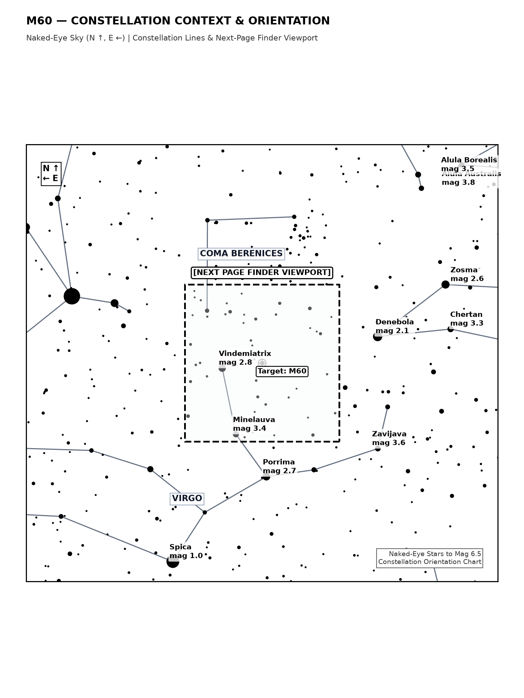

### 3. Wide-Field Star-Hopping Finder Chart
> [!IMPORTANT]
> **Viewport A** provides an upright naked-eye / optical finder orientation (N ↑, E ←) with stars down to visual magnitude 8.5. Standard concentric Telrad rings (0.5°, 2.0°, 4.0°) and 5.0° finder circle are centered directly on the target.

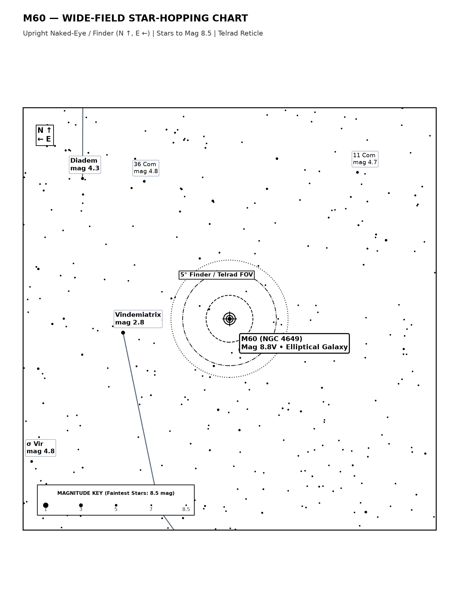

*([📄 Open Full High-Resolution Master A4 Finder Chart](shared/m60/chart_skywatcher-skyliner-200p.png))*

### 4. Observing Strategy & Step-by-Step Hop Instructions

- **Acquisition & Framing (20mm Super / 60×, 50' FOV)**:
  Ethereal oval glow with condensed galactic nucleus; framing the galaxy within the wide 50' field maximizes contrast against the sky.
- **High-Power Inspection & Detail (12.5mm / 96×, 31' FOV)**:
  12.5mm (96×) darkens the background sky, aiding detection of subtle core elongation, dust lanes, and halo extent with averted vision.

**Step-by-Step Star Hop Narrative**:
Locate constellation Virgo. Follow the guide stars on the Wide-Field Chart to RA 190.92°, Dec 11.55°; look for a soft hazy smudge.

---

## M61 (NGC 4303) — Virgo

[↑ Back to Catalog Index](#messier-catalog-index) • [← Previous: M60](#m60) • [Next: M62 →](#m62)

| Technical Parameter | Specification |
| :--- | :--- |
| **Designation** | M61 (NGC 4303) |
| **Constellation** | Virgo |
| **Classification** | Spiral Galaxy (Galaxy) |
| **Visual Magnitude ($V$)** | 9.7 mag |
| **Apparent Dimensions** | 9.7' × 5.8' |
| **Estimated Distance** | ~16.1 million light-years |
| **Swanson Difficulty** | **Hard** (*NexStar User's Guide II*) |
| **Coordinates (J2000)** | RA **12h 21m 55.0s** • Dec **+4° 28' 24.9"** |
| **Recommended Eyepiece** | 12.5mm (96× magnification, 31' TFOV, 2.1mm exit pupil) |

### 1. Telescope Eyepiece Simulation & Technical Dossier
> [!NOTE]
> **Viewport B** depicts the pre-inverted 180° field view through the Newtonian reflector (12.5mm eyepiece / 96× magnification, 31' true field of view: South at top, West at left, N ↓, E →). **Viewport C** integrates target ephemeris and optical notes.

### 2. Constellation Context & Regional Orientation Chart
> [!TIP]
> **Viewport Context** presents a wide ~50°–65° naked-eye orientation field (stars down to visual magnitude 6.5) with official IAU constellation guide lines. The dashed bounding box marks the exact area covered by the wide-field star-hopping chart below.

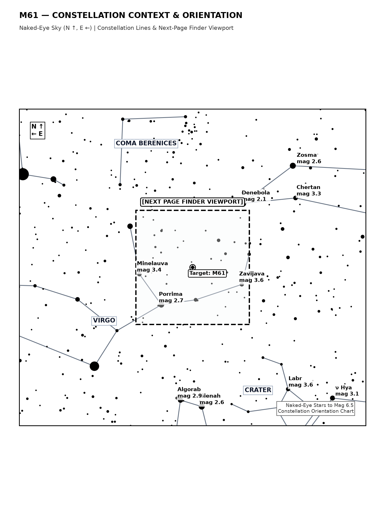

### 3. Wide-Field Star-Hopping Finder Chart
> [!IMPORTANT]
> **Viewport A** provides an upright naked-eye / optical finder orientation (N ↑, E ←) with stars down to visual magnitude 8.5. Standard concentric Telrad rings (0.5°, 2.0°, 4.0°) and 5.0° finder circle are centered directly on the target.

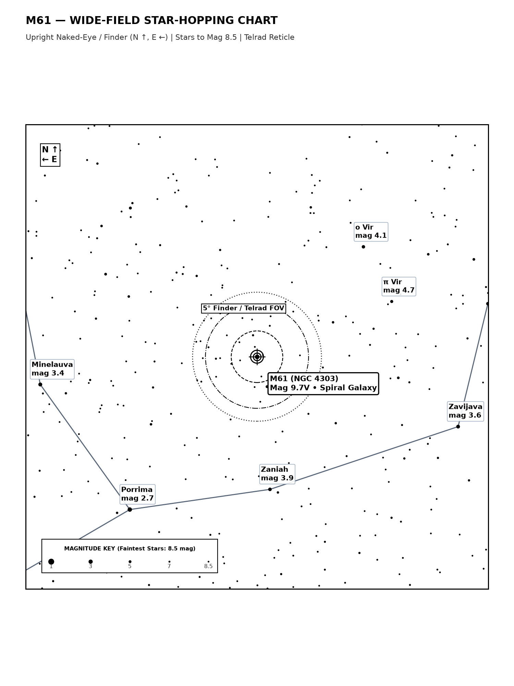

*([📄 Open Full High-Resolution Master A4 Finder Chart](shared/m61/chart_skywatcher-skyliner-200p.png))*

### 4. Observing Strategy & Step-by-Step Hop Instructions

- **Acquisition & Framing (20mm Super / 60×, 50' FOV)**:
  Ethereal oval glow with condensed galactic nucleus; framing the galaxy within the wide 50' field maximizes contrast against the sky.
- **High-Power Inspection & Detail (12.5mm / 96×, 31' FOV)**:
  12.5mm (96×) darkens the background sky, aiding detection of subtle core elongation, dust lanes, and halo extent with averted vision.

**Step-by-Step Star Hop Narrative**:
Locate constellation Virgo. Follow the guide stars on the Wide-Field Chart to RA 185.48°, Dec 4.47°; look for a soft hazy smudge.

---

## M62 (NGC 6266) — Ophiucus

[↑ Back to Catalog Index](#messier-catalog-index) • [← Previous: M61](#m61) • [Next: M63 →](#m63)

| Technical Parameter | Specification |
| :--- | :--- |
| **Designation** | M62 (NGC 6266) |
| **Constellation** | Ophiucus |
| **Classification** | Globular Cluster (GC) |
| **Visual Magnitude ($V$)** | 6.4 mag |
| **Apparent Dimensions** | 15.0' × 15.0' |
| **Estimated Distance** | ~22,181 light-years |
| **Swanson Difficulty** | **Medium** (*NexStar User's Guide II*) |
| **Coordinates (J2000)** | RA **17h 01m 12.6s** • Dec **-30° 06' 44.5"** |
| **Recommended Eyepiece** | 20mm (60× magnification, 49' TFOV, 3.4mm exit pupil) |

### 1. Telescope Eyepiece Simulation & Technical Dossier
> [!NOTE]
> **Viewport B** depicts the pre-inverted 180° field view through the Newtonian reflector (20mm eyepiece / 60× magnification, 49' true field of view: South at top, West at left, N ↓, E →). **Viewport C** integrates target ephemeris and optical notes.

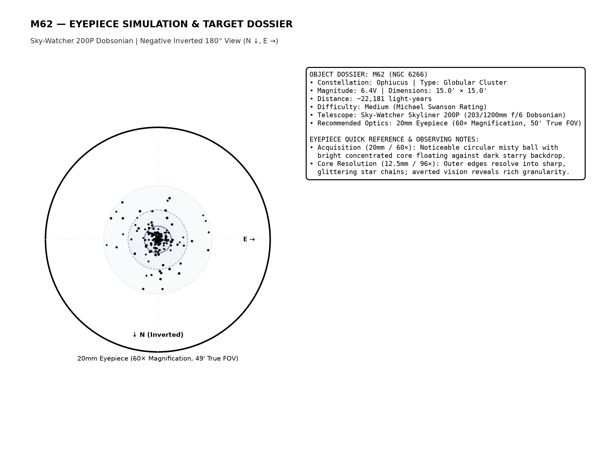

### 2. Constellation Context & Regional Orientation Chart
> [!TIP]
> **Viewport Context** presents a wide ~50°–65° naked-eye orientation field (stars down to visual magnitude 6.5) with official IAU constellation guide lines. The dashed bounding box marks the exact area covered by the wide-field star-hopping chart below.

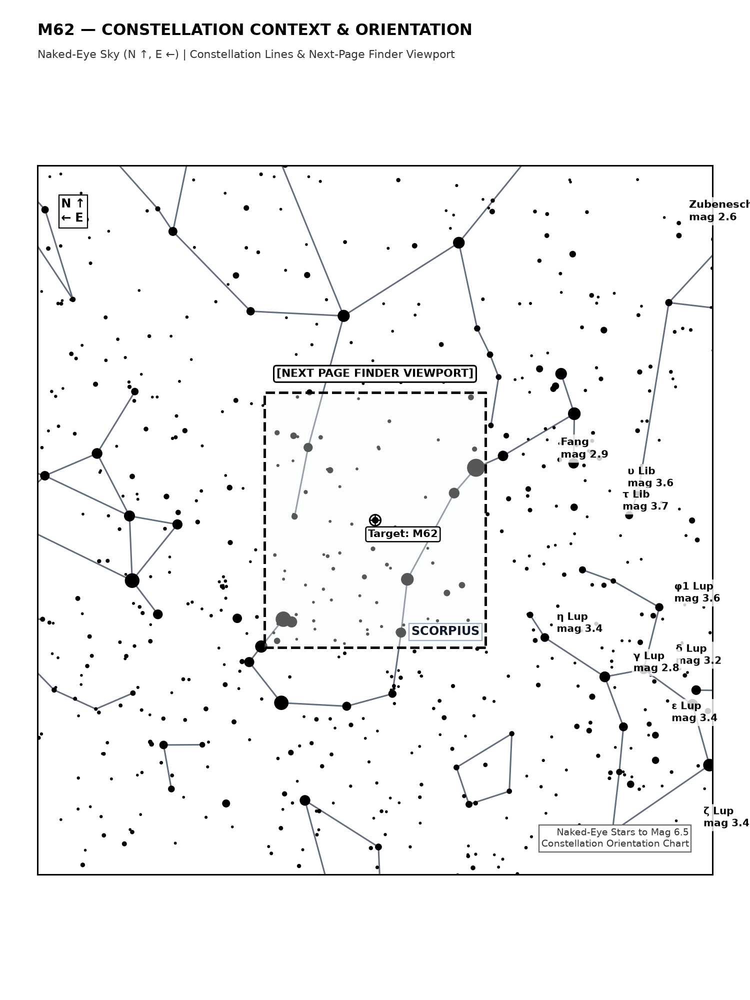

### 3. Wide-Field Star-Hopping Finder Chart
> [!IMPORTANT]
> **Viewport A** provides an upright naked-eye / optical finder orientation (N ↑, E ←) with stars down to visual magnitude 8.5. Standard concentric Telrad rings (0.5°, 2.0°, 4.0°) and 5.0° finder circle are centered directly on the target.

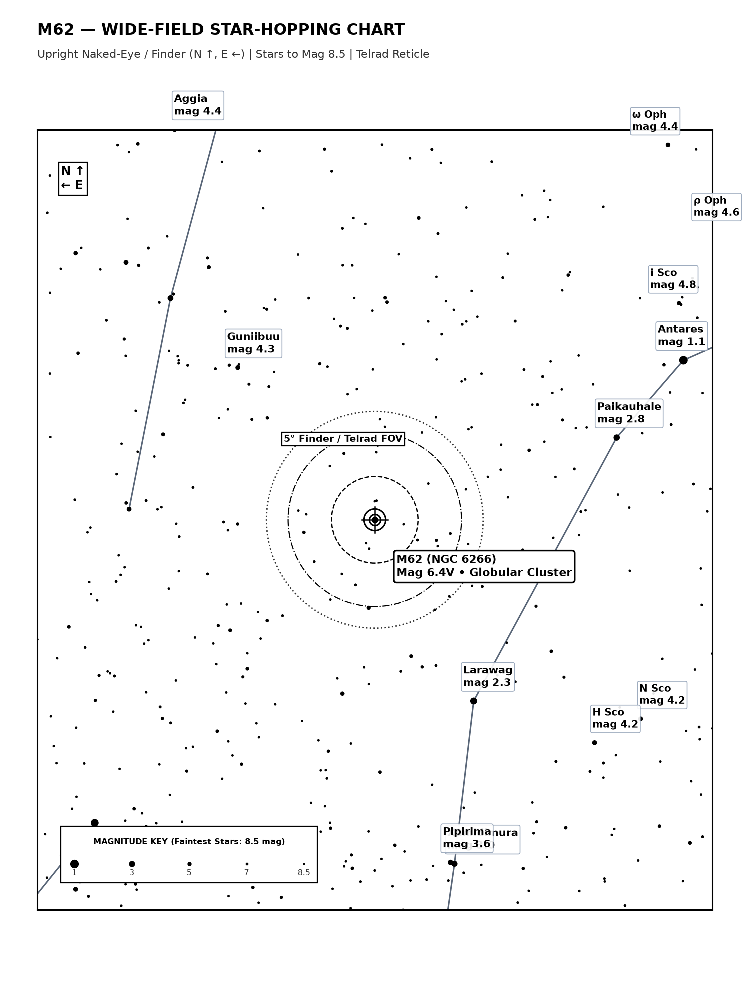

*([📄 Open Full High-Resolution Master A4 Finder Chart](shared/m62/chart_skywatcher-skyliner-200p.png))*

### 4. Observing Strategy & Step-by-Step Hop Instructions

- **Acquisition & Framing (20mm Super / 60×, 50' FOV)**:
  Noticeable circular misty ball with bright concentrated core floating against a dark starry backdrop in Ophiucus.
- **High-Power Inspection & Detail (20mm / 60×, 49' FOV)**:
  20mm (60×) resolves the outer edges into sharp, glittering diamond star points; averted vision reveals rich granularity across the core.

**Step-by-Step Star Hop Narrative**:
Locate anchor constellation Ophiucus on the Context Chart. Slew Telrad reticle to RA 255.30°, Dec -30.11° and center the fuzzy ball in the 20mm finder eyepiece.

---

## M63 Sunflower Galaxy (NGC 5055) — Canes Venatici

[↑ Back to Catalog Index](#messier-catalog-index) • [← Previous: M62](#m62) • [Next: M64 →](#m64)

| Technical Parameter | Specification |
| :--- | :--- |
| **Designation** | M63 (NGC 5055) |
| **Common Name** | **Sunflower Galaxy** |
| **Constellation** | Canes Venatici |
| **Classification** | Spiral Galaxy (Galaxy) |
| **Visual Magnitude ($V$)** | 8.6 mag |
| **Apparent Dimensions** | 13.2' × 7.9' |
| **Estimated Distance** | ~11.3 million light-years |
| **Swanson Difficulty** | **Hard** (*NexStar User's Guide II*) |
| **Coordinates (J2000)** | RA **13h 15m 49.3s** • Dec **+42° 01' 45.4"** |
| **Recommended Eyepiece** | 12.5mm (96× magnification, 31' TFOV, 2.1mm exit pupil) |

### 1. Telescope Eyepiece Simulation & Technical Dossier
> [!NOTE]
> **Viewport B** depicts the pre-inverted 180° field view through the Newtonian reflector (12.5mm eyepiece / 96× magnification, 31' true field of view: South at top, West at left, N ↓, E →). **Viewport C** integrates target ephemeris and optical notes.

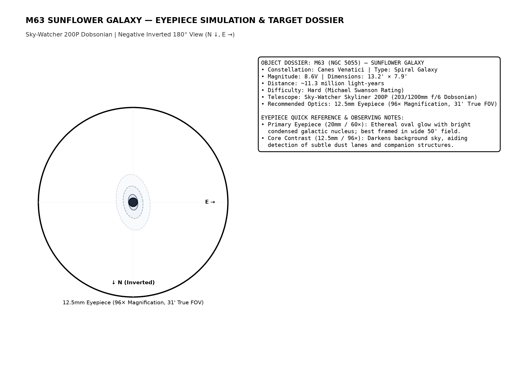

### 2. Constellation Context & Regional Orientation Chart
> [!TIP]
> **Viewport Context** presents a wide ~50°–65° naked-eye orientation field (stars down to visual magnitude 6.5) with official IAU constellation guide lines. The dashed bounding box marks the exact area covered by the wide-field star-hopping chart below.

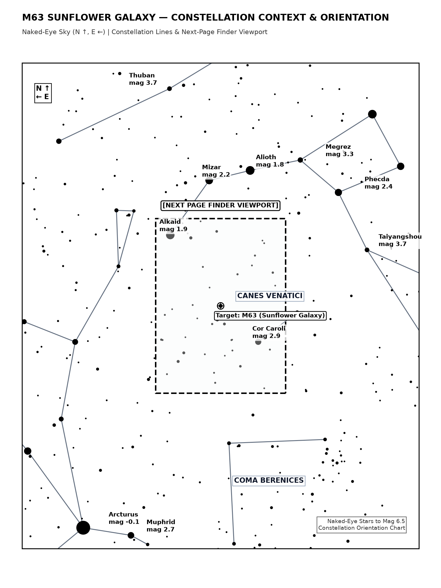

### 3. Wide-Field Star-Hopping Finder Chart
> [!IMPORTANT]
> **Viewport A** provides an upright naked-eye / optical finder orientation (N ↑, E ←) with stars down to visual magnitude 8.5. Standard concentric Telrad rings (0.5°, 2.0°, 4.0°) and 5.0° finder circle are centered directly on the target.

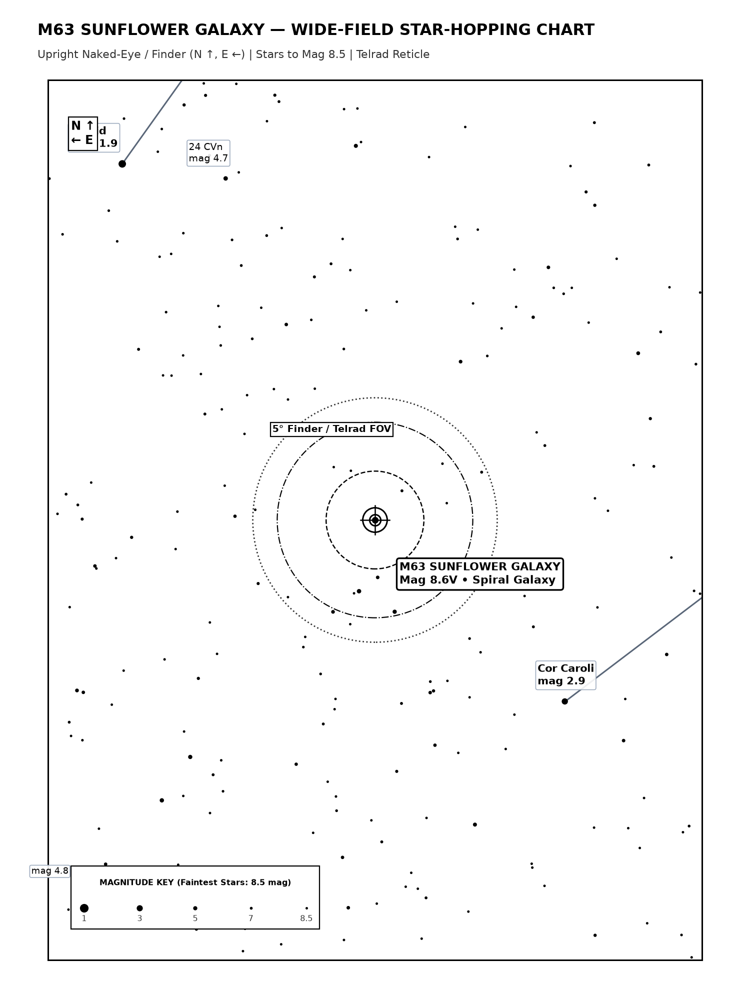

*([📄 Open Full High-Resolution Master A4 Finder Chart](shared/m63/chart_skywatcher-skyliner-200p.png))*

### 4. Observing Strategy & Step-by-Step Hop Instructions

- **Acquisition & Framing (20mm Super / 60×, 50' FOV)**:
  Ethereal oval glow with condensed galactic nucleus; framing the galaxy within the wide 50' field maximizes contrast against the sky.
- **High-Power Inspection & Detail (12.5mm / 96×, 31' FOV)**:
  12.5mm (96×) darkens the background sky, aiding detection of subtle core elongation, dust lanes, and halo extent with averted vision.

**Step-by-Step Star Hop Narrative**:
Locate constellation Canes Venatici. Follow the guide stars on the Wide-Field Chart to RA 198.96°, Dec 42.03°; look for a soft hazy smudge.

---

## M64 Blackeye Galaxy (NGC 4826) — Coma Berenices

[↑ Back to Catalog Index](#messier-catalog-index) • [← Previous: M63](#m63) • [Next: M65 →](#m65)

| Technical Parameter | Specification |
| :--- | :--- |
| **Designation** | M64 (NGC 4826) |
| **Common Name** | **Blackeye Galaxy** |
| **Constellation** | Coma Berenices |
| **Classification** | Spiral Galaxy (Galaxy) |
| **Visual Magnitude ($V$)** | 8.5 mag |
| **Apparent Dimensions** | 9.8' × 4.9' |
| **Estimated Distance** | ~7.4 million light-years |
| **Swanson Difficulty** | **Medium** (*NexStar User's Guide II*) |
| **Coordinates (J2000)** | RA **12h 56m 43.7s** • Dec **+21° 40' 57.6"** |
| **Recommended Eyepiece** | 12.5mm (96× magnification, 31' TFOV, 2.1mm exit pupil) |

### 1. Telescope Eyepiece Simulation & Technical Dossier
> [!NOTE]
> **Viewport B** depicts the pre-inverted 180° field view through the Newtonian reflector (12.5mm eyepiece / 96× magnification, 31' true field of view: South at top, West at left, N ↓, E →). **Viewport C** integrates target ephemeris and optical notes.

### 2. Constellation Context & Regional Orientation Chart
> [!TIP]
> **Viewport Context** presents a wide ~50°–65° naked-eye orientation field (stars down to visual magnitude 6.5) with official IAU constellation guide lines. The dashed bounding box marks the exact area covered by the wide-field star-hopping chart below.

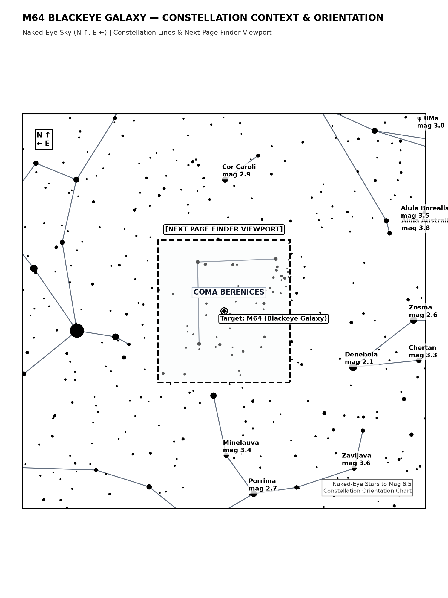

### 3. Wide-Field Star-Hopping Finder Chart
> [!IMPORTANT]
> **Viewport A** provides an upright naked-eye / optical finder orientation (N ↑, E ←) with stars down to visual magnitude 8.5. Standard concentric Telrad rings (0.5°, 2.0°, 4.0°) and 5.0° finder circle are centered directly on the target.

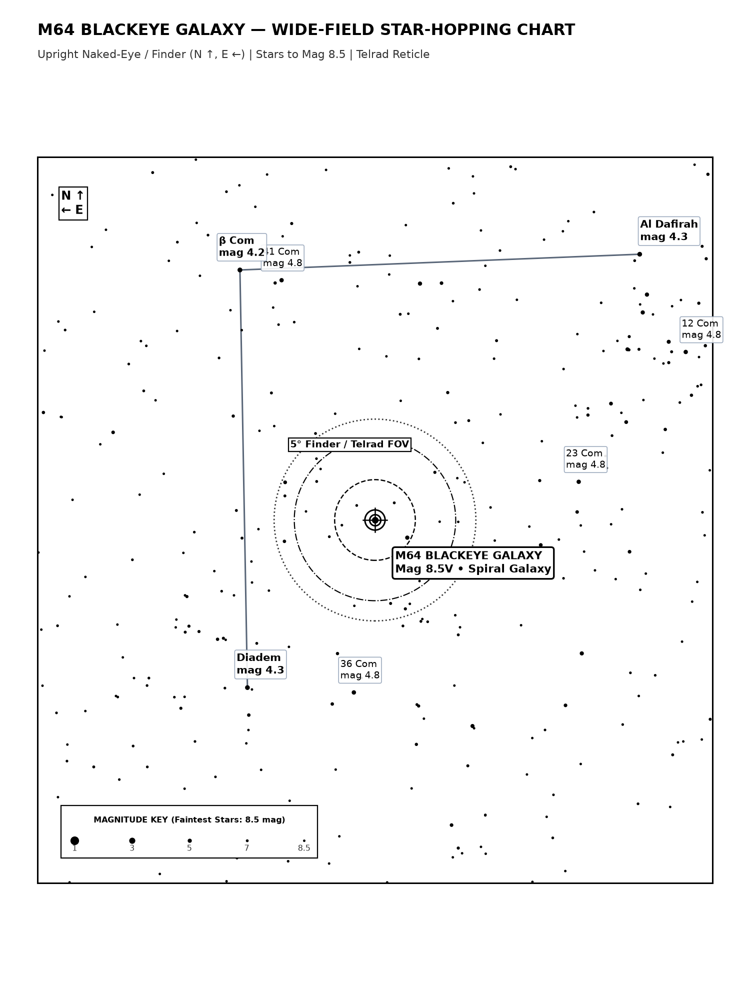

*([📄 Open Full High-Resolution Master A4 Finder Chart](shared/m64/chart_skywatcher-skyliner-200p.png))*

### 4. Observing Strategy & Step-by-Step Hop Instructions

- **Acquisition & Framing (20mm Super / 60×, 50' FOV)**:
  Ethereal oval glow with condensed galactic nucleus; framing the galaxy within the wide 50' field maximizes contrast against the sky.
- **High-Power Inspection & Detail (12.5mm / 96×, 31' FOV)**:
  12.5mm (96×) darkens the background sky, aiding detection of subtle core elongation, dust lanes, and halo extent with averted vision.

**Step-by-Step Star Hop Narrative**:
Locate constellation Coma Berenices. Follow the guide stars on the Wide-Field Chart to RA 194.18°, Dec 21.68°; look for a soft hazy smudge.

---

## M65 (NGC 3623) — Leo

[↑ Back to Catalog Index](#messier-catalog-index) • [← Previous: M64](#m64) • [Next: M66 →](#m66)

| Technical Parameter | Specification |
| :--- | :--- |
| **Designation** | M65 (NGC 3623) |
| **Constellation** | Leo |
| **Classification** | Spiral Galaxy (Galaxy) |
| **Visual Magnitude ($V$)** | 9.3 mag |
| **Apparent Dimensions** | 8.7' × 2.5' |
| **Estimated Distance** | Distance varies |
| **Swanson Difficulty** | **Medium** (*NexStar User's Guide II*) |
| **Coordinates (J2000)** | RA **11h 18m 56.0s** • Dec **+13° 05' 32.0"** |
| **Recommended Eyepiece** | 12.5mm (96× magnification, 31' TFOV, 2.1mm exit pupil) |

### 1. Telescope Eyepiece Simulation & Technical Dossier
> [!NOTE]
> **Viewport B** depicts the pre-inverted 180° field view through the Newtonian reflector (12.5mm eyepiece / 96× magnification, 31' true field of view: South at top, West at left, N ↓, E →). **Viewport C** integrates target ephemeris and optical notes.

### 2. Constellation Context & Regional Orientation Chart
> [!TIP]
> **Viewport Context** presents a wide ~50°–65° naked-eye orientation field (stars down to visual magnitude 6.5) with official IAU constellation guide lines. The dashed bounding box marks the exact area covered by the wide-field star-hopping chart below.

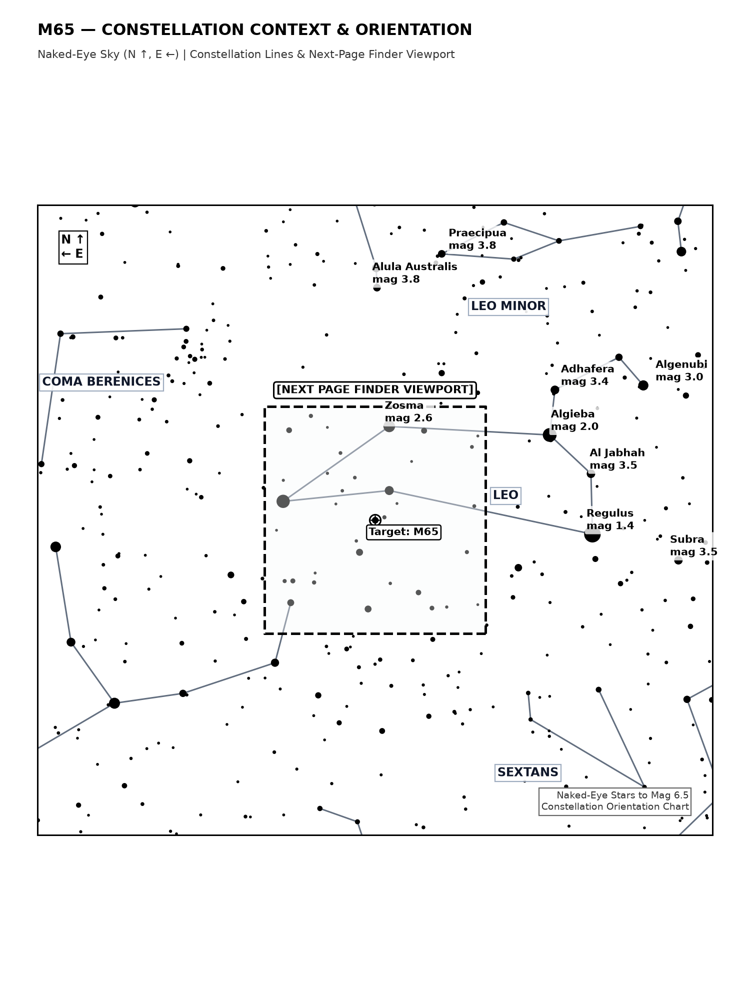

### 3. Wide-Field Star-Hopping Finder Chart
> [!IMPORTANT]
> **Viewport A** provides an upright naked-eye / optical finder orientation (N ↑, E ←) with stars down to visual magnitude 8.5. Standard concentric Telrad rings (0.5°, 2.0°, 4.0°) and 5.0° finder circle are centered directly on the target.

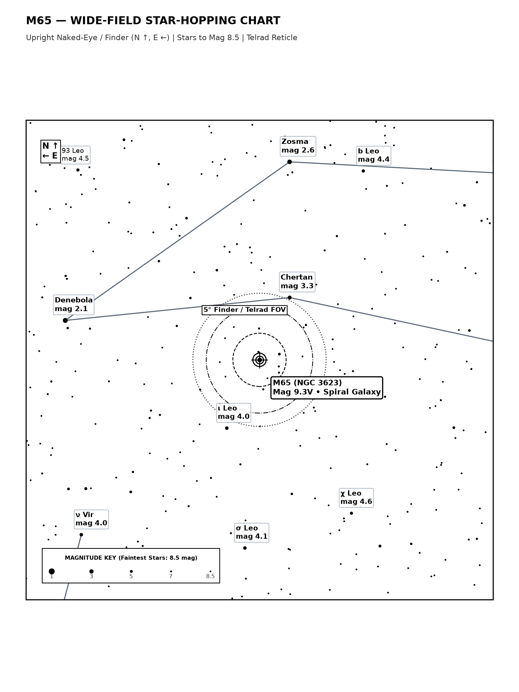

*([📄 Open Full High-Resolution Master A4 Finder Chart](shared/m65/chart_skywatcher-skyliner-200p.png))*

### 4. Observing Strategy & Step-by-Step Hop Instructions

- **Acquisition & Framing (20mm Super / 60×, 50' FOV)**:
  Ethereal oval glow with condensed galactic nucleus; framing the galaxy within the wide 50' field maximizes contrast against the sky.
- **High-Power Inspection & Detail (12.5mm / 96×, 31' FOV)**:
  12.5mm (96×) darkens the background sky, aiding detection of subtle core elongation, dust lanes, and halo extent with averted vision.

**Step-by-Step Star Hop Narrative**:
Locate constellation Leo. Follow the guide stars on the Wide-Field Chart to RA 169.73°, Dec 13.09°; look for a soft hazy smudge.

---

## M66 (NGC 3627) — Leo

[↑ Back to Catalog Index](#messier-catalog-index) • [← Previous: M65](#m65) • [Next: M67 →](#m67)

| Technical Parameter | Specification |
| :--- | :--- |
| **Designation** | M66 (NGC 3627) |
| **Constellation** | Leo |
| **Classification** | Spiral Galaxy (Galaxy) |
| **Visual Magnitude ($V$)** | 8.9 mag |
| **Apparent Dimensions** | 9.1' × 4.2' |
| **Estimated Distance** | ~11.0 million light-years |
| **Swanson Difficulty** | **Medium** (*NexStar User's Guide II*) |
| **Coordinates (J2000)** | RA **11h 20m 15.0s** • Dec **+12° 59' 28.6"** |
| **Recommended Eyepiece** | 12.5mm (96× magnification, 31' TFOV, 2.1mm exit pupil) |

### 1. Telescope Eyepiece Simulation & Technical Dossier
> [!NOTE]
> **Viewport B** depicts the pre-inverted 180° field view through the Newtonian reflector (12.5mm eyepiece / 96× magnification, 31' true field of view: South at top, West at left, N ↓, E →). **Viewport C** integrates target ephemeris and optical notes.

### 2. Constellation Context & Regional Orientation Chart
> [!TIP]
> **Viewport Context** presents a wide ~50°–65° naked-eye orientation field (stars down to visual magnitude 6.5) with official IAU constellation guide lines. The dashed bounding box marks the exact area covered by the wide-field star-hopping chart below.

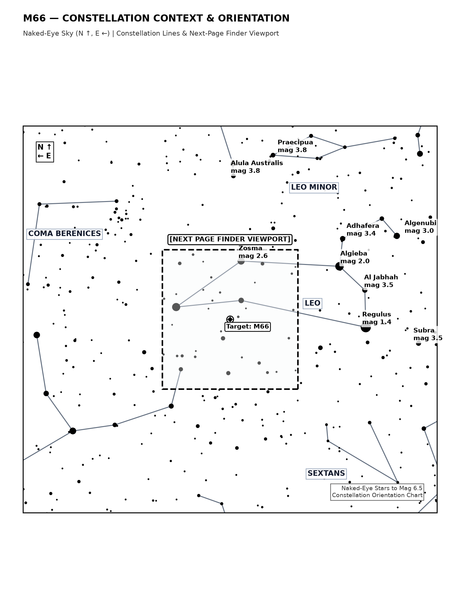

### 3. Wide-Field Star-Hopping Finder Chart
> [!IMPORTANT]
> **Viewport A** provides an upright naked-eye / optical finder orientation (N ↑, E ←) with stars down to visual magnitude 8.5. Standard concentric Telrad rings (0.5°, 2.0°, 4.0°) and 5.0° finder circle are centered directly on the target.

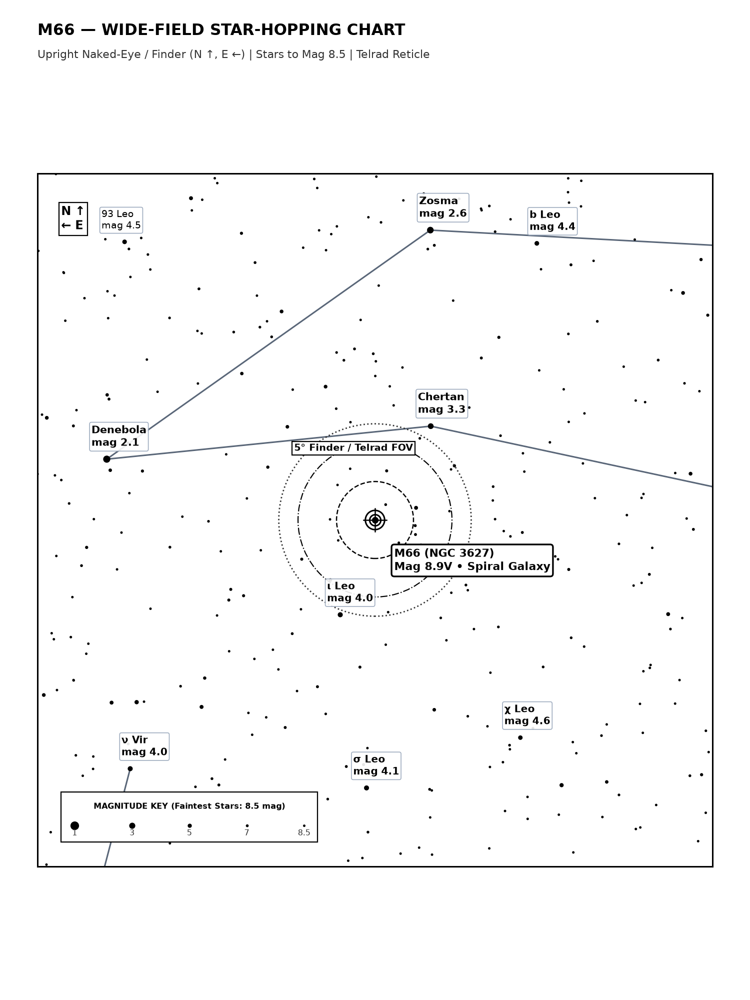

*([📄 Open Full High-Resolution Master A4 Finder Chart](shared/m66/chart_skywatcher-skyliner-200p.png))*

### 4. Observing Strategy & Step-by-Step Hop Instructions

- **Acquisition & Framing (20mm Super / 60×, 50' FOV)**:
  Ethereal oval glow with condensed galactic nucleus; framing the galaxy within the wide 50' field maximizes contrast against the sky.
- **High-Power Inspection & Detail (12.5mm / 96×, 31' FOV)**:
  12.5mm (96×) darkens the background sky, aiding detection of subtle core elongation, dust lanes, and halo extent with averted vision.

**Step-by-Step Star Hop Narrative**:
Locate constellation Leo. Follow the guide stars on the Wide-Field Chart to RA 170.06°, Dec 12.99°; look for a soft hazy smudge.

---

## M67 (NGC 2682) — Cancer

[↑ Back to Catalog Index](#messier-catalog-index) • [← Previous: M66](#m66) • [Next: M68 →](#m68)

| Technical Parameter | Specification |
| :--- | :--- |
| **Designation** | M67 (NGC 2682) |
| **Constellation** | Cancer |
| **Classification** | Open Cluster (OC) |
| **Visual Magnitude ($V$)** | 6.9 mag |
| **Apparent Dimensions** | 25.0' × 25.0' |
| **Estimated Distance** | ~2772 light-years |
| **Swanson Difficulty** | **Medium** (*NexStar User's Guide II*) |
| **Coordinates (J2000)** | RA **8h 51m 18.0s** • Dec **+11° 48' 00.0"** |
| **Recommended Eyepiece** | 20mm (60× magnification, 49' TFOV, 3.4mm exit pupil) |

### 1. Telescope Eyepiece Simulation & Technical Dossier
> [!NOTE]
> **Viewport B** depicts the pre-inverted 180° field view through the Newtonian reflector (20mm eyepiece / 60× magnification, 49' true field of view: South at top, West at left, N ↓, E →). **Viewport C** integrates target ephemeris and optical notes.

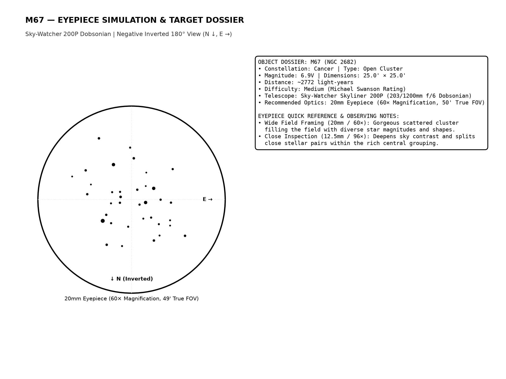

### 2. Constellation Context & Regional Orientation Chart
> [!TIP]
> **Viewport Context** presents a wide ~50°–65° naked-eye orientation field (stars down to visual magnitude 6.5) with official IAU constellation guide lines. The dashed bounding box marks the exact area covered by the wide-field star-hopping chart below.

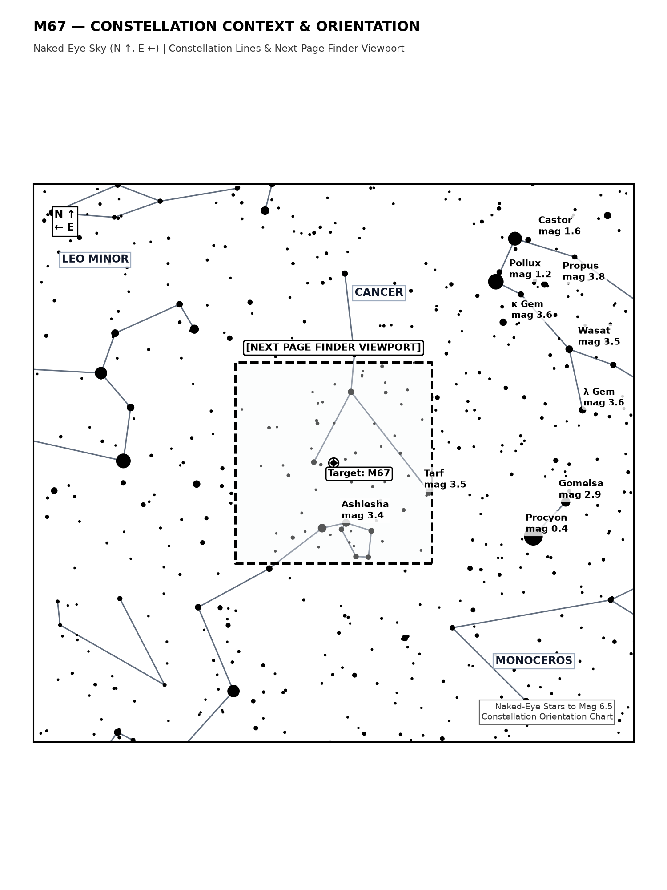

### 3. Wide-Field Star-Hopping Finder Chart
> [!IMPORTANT]
> **Viewport A** provides an upright naked-eye / optical finder orientation (N ↑, E ←) with stars down to visual magnitude 8.5. Standard concentric Telrad rings (0.5°, 2.0°, 4.0°) and 5.0° finder circle are centered directly on the target.

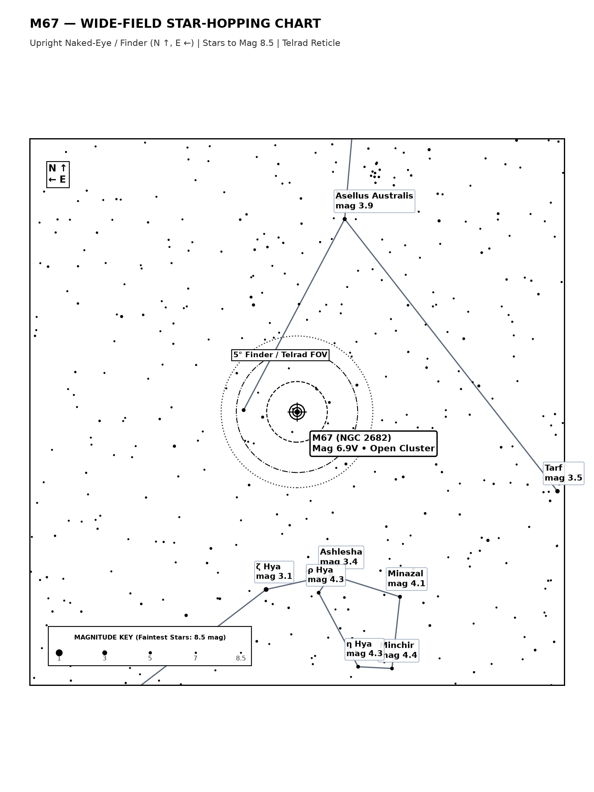

*([📄 Open Full High-Resolution Master A4 Finder Chart](shared/m67/chart_skywatcher-skyliner-200p.png))*

### 4. Observing Strategy & Step-by-Step Hop Instructions

- **Acquisition & Framing (20mm Super / 60×, 50' FOV)**:
  Gorgeous scattered star cluster filling the field with diverse stellar magnitudes and pleasing geometric groupings.
- **High-Power Inspection & Detail (20mm / 60×, 49' FOV)**:
  20mm (60×) deepens sky contrast and splits intimate stellar pairs and chains within the rich central grouping.

**Step-by-Step Star Hop Narrative**:
Locate Cancer via Context Chart. Align Telrad reticle to target coordinates (RA 132.82°, Dec 11.80°); cluster stars emerge immediately in the finder.

---

## M68 (NGC 4590) — Hydra

[↑ Back to Catalog Index](#messier-catalog-index) • [← Previous: M67](#m67) • [Next: M69 →](#m69)

| Technical Parameter | Specification |
| :--- | :--- |
| **Designation** | M68 (NGC 4590) |
| **Constellation** | Hydra |
| **Classification** | Globular Cluster (GC) |
| **Visual Magnitude ($V$)** | 7.3 mag |
| **Apparent Dimensions** | 11.0' × 11.0' |
| **Estimated Distance** | ~33,598 light-years |
| **Swanson Difficulty** | **Hard** (*NexStar User's Guide II*) |
| **Coordinates (J2000)** | RA **12h 39m 28.0s** • Dec **-26° 44' 38.6"** |
| **Recommended Eyepiece** | 12.5mm (96× magnification, 31' TFOV, 2.1mm exit pupil) |

### 1. Telescope Eyepiece Simulation & Technical Dossier
> [!NOTE]
> **Viewport B** depicts the pre-inverted 180° field view through the Newtonian reflector (12.5mm eyepiece / 96× magnification, 31' true field of view: South at top, West at left, N ↓, E →). **Viewport C** integrates target ephemeris and optical notes.

### 2. Constellation Context & Regional Orientation Chart
> [!TIP]
> **Viewport Context** presents a wide ~50°–65° naked-eye orientation field (stars down to visual magnitude 6.5) with official IAU constellation guide lines. The dashed bounding box marks the exact area covered by the wide-field star-hopping chart below.

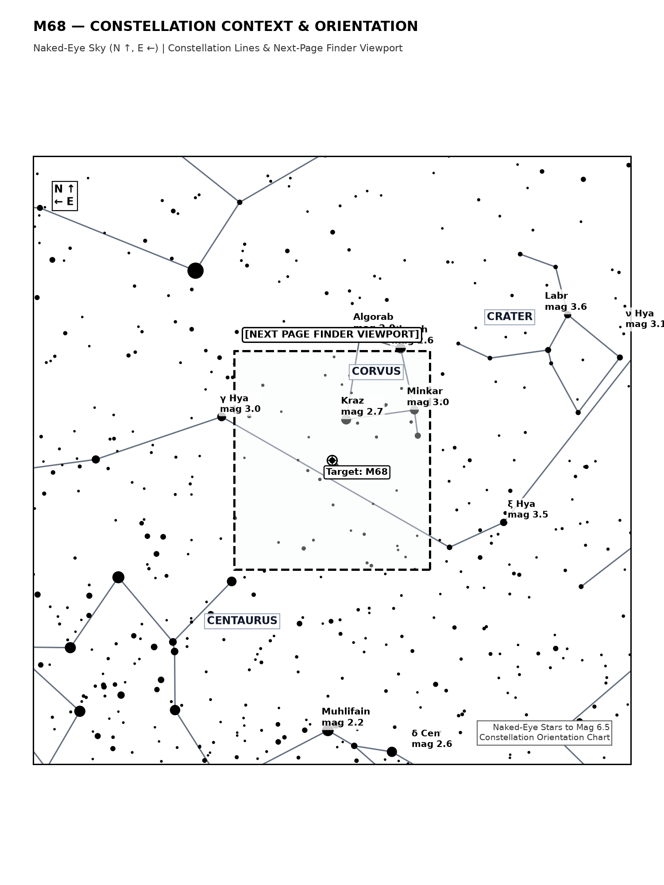

### 3. Wide-Field Star-Hopping Finder Chart
> [!IMPORTANT]
> **Viewport A** provides an upright naked-eye / optical finder orientation (N ↑, E ←) with stars down to visual magnitude 8.5. Standard concentric Telrad rings (0.5°, 2.0°, 4.0°) and 5.0° finder circle are centered directly on the target.

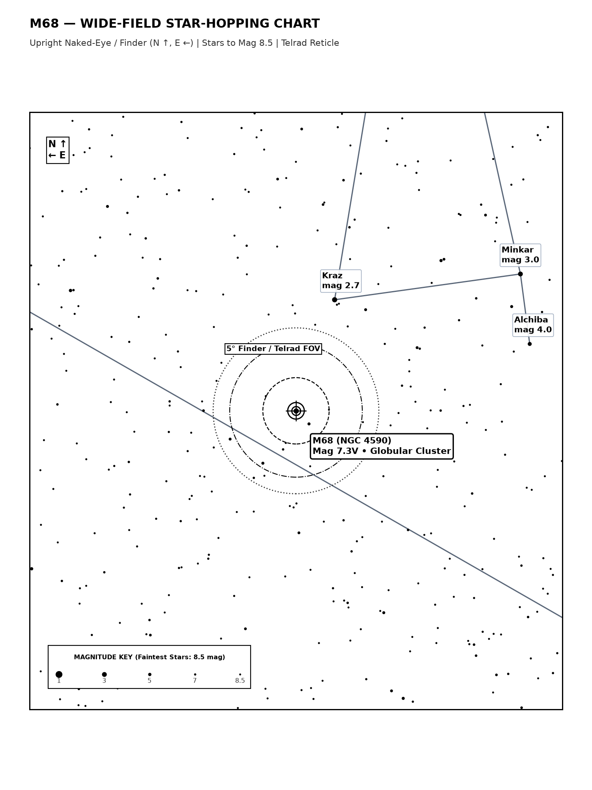

*([📄 Open Full High-Resolution Master A4 Finder Chart](shared/m68/chart_skywatcher-skyliner-200p.png))*

### 4. Observing Strategy & Step-by-Step Hop Instructions

- **Acquisition & Framing (20mm Super / 60×, 50' FOV)**:
  Noticeable circular misty ball with bright concentrated core floating against a dark starry backdrop in Hydra.
- **High-Power Inspection & Detail (12.5mm / 96×, 31' FOV)**:
  12.5mm (96×) resolves the outer edges into sharp, glittering diamond star points; averted vision reveals rich granularity across the core.

**Step-by-Step Star Hop Narrative**:
Locate anchor constellation Hydra on the Context Chart. Slew Telrad reticle to RA 189.87°, Dec -26.74° and center the fuzzy ball in the 20mm finder eyepiece.

---

## M69 (NGC 6637) — Sagittarius

[↑ Back to Catalog Index](#messier-catalog-index) • [← Previous: M68](#m68) • [Next: M70 →](#m70)

| Technical Parameter | Specification |
| :--- | :--- |
| **Designation** | M69 (NGC 6637) |
| **Constellation** | Sagittarius |
| **Classification** | Globular Cluster (GC) |
| **Visual Magnitude ($V$)** | 8.3 mag |
| **Apparent Dimensions** | 8.1' × 8.1' |
| **Estimated Distance** | ~29,684 light-years |
| **Swanson Difficulty** | **Medium** (*NexStar User's Guide II*) |
| **Coordinates (J2000)** | RA **18h 31m 23.1s** • Dec **-32° 20' 53.1"** |
| **Recommended Eyepiece** | 12.5mm (96× magnification, 31' TFOV, 2.1mm exit pupil) |

### 1. Telescope Eyepiece Simulation & Technical Dossier
> [!NOTE]
> **Viewport B** depicts the pre-inverted 180° field view through the Newtonian reflector (12.5mm eyepiece / 96× magnification, 31' true field of view: South at top, West at left, N ↓, E →). **Viewport C** integrates target ephemeris and optical notes.

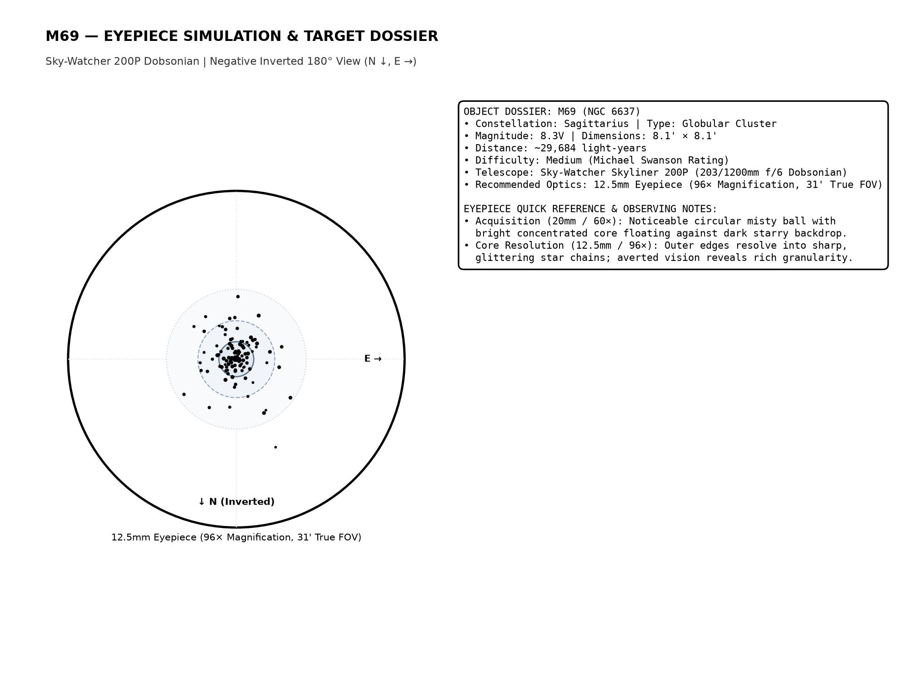

### 2. Constellation Context & Regional Orientation Chart
> [!TIP]
> **Viewport Context** presents a wide ~50°–65° naked-eye orientation field (stars down to visual magnitude 6.5) with official IAU constellation guide lines. The dashed bounding box marks the exact area covered by the wide-field star-hopping chart below.

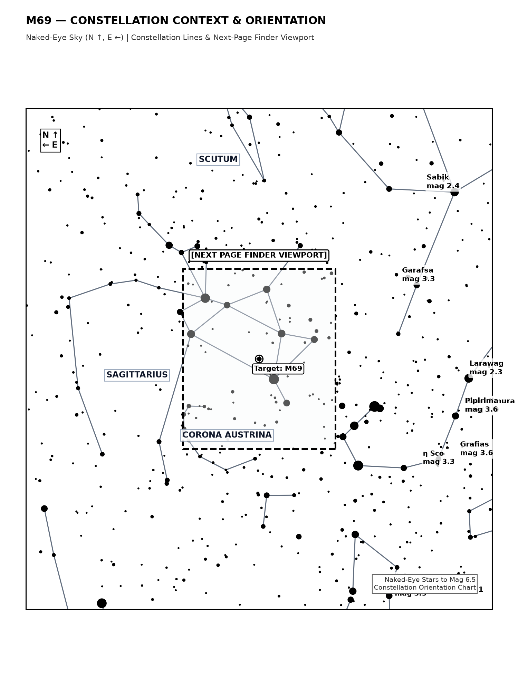

### 3. Wide-Field Star-Hopping Finder Chart
> [!IMPORTANT]
> **Viewport A** provides an upright naked-eye / optical finder orientation (N ↑, E ←) with stars down to visual magnitude 8.5. Standard concentric Telrad rings (0.5°, 2.0°, 4.0°) and 5.0° finder circle are centered directly on the target.

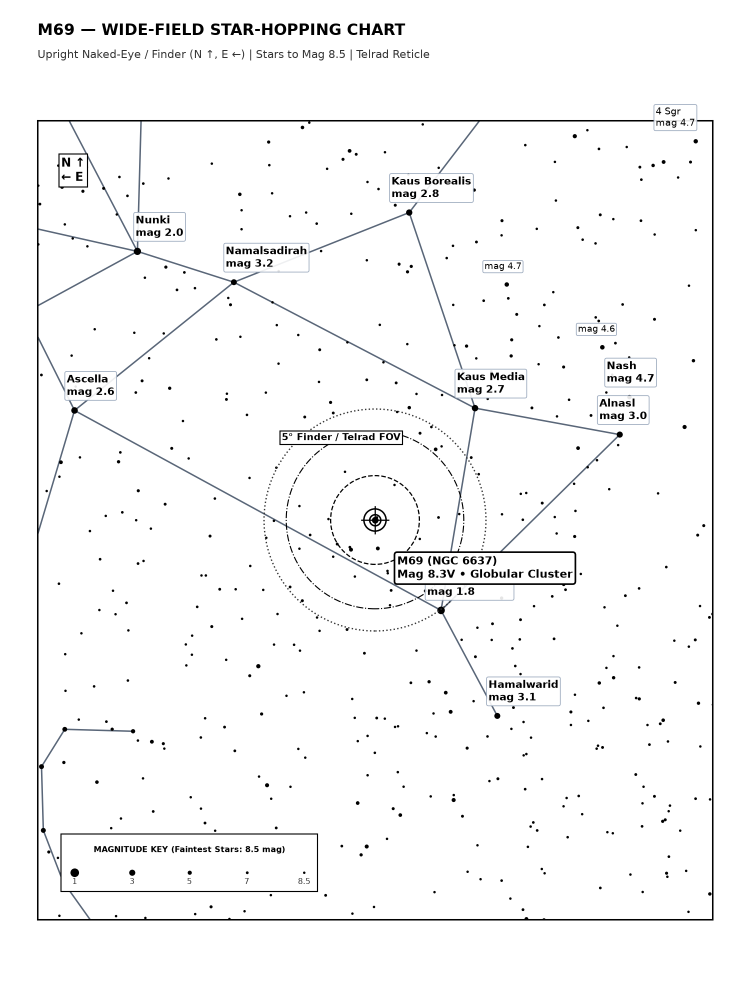

*([📄 Open Full High-Resolution Master A4 Finder Chart](shared/m69/chart_skywatcher-skyliner-200p.png))*

### 4. Observing Strategy & Step-by-Step Hop Instructions

- **Acquisition & Framing (20mm Super / 60×, 50' FOV)**:
  Noticeable circular misty ball with bright concentrated core floating against a dark starry backdrop in Sagittarius.
- **High-Power Inspection & Detail (12.5mm / 96×, 31' FOV)**:
  12.5mm (96×) resolves the outer edges into sharp, glittering diamond star points; averted vision reveals rich granularity across the core.

**Step-by-Step Star Hop Narrative**:
Locate anchor constellation Sagittarius on the Context Chart. Slew Telrad reticle to RA 277.85°, Dec -32.35° and center the fuzzy ball in the 20mm finder eyepiece.

---

## M70 (NGC 6681) — Sagittarius

[↑ Back to Catalog Index](#messier-catalog-index) • [← Previous: M69](#m69) • [Next: M71 →](#m71)

| Technical Parameter | Specification |
| :--- | :--- |
| **Designation** | M70 (NGC 6681) |
| **Constellation** | Sagittarius |
| **Classification** | Globular Cluster (GC) |
| **Visual Magnitude ($V$)** | 7.8 mag |
| **Apparent Dimensions** | 8.0' × 8.0' |
| **Estimated Distance** | ~29,358 light-years |
| **Swanson Difficulty** | **Medium** (*NexStar User's Guide II*) |
| **Coordinates (J2000)** | RA **18h 43m 12.8s** • Dec **-32° 17' 31.6"** |
| **Recommended Eyepiece** | 12.5mm (96× magnification, 31' TFOV, 2.1mm exit pupil) |

### 1. Telescope Eyepiece Simulation & Technical Dossier
> [!NOTE]
> **Viewport B** depicts the pre-inverted 180° field view through the Newtonian reflector (12.5mm eyepiece / 96× magnification, 31' true field of view: South at top, West at left, N ↓, E →). **Viewport C** integrates target ephemeris and optical notes.

### 2. Constellation Context & Regional Orientation Chart
> [!TIP]
> **Viewport Context** presents a wide ~50°–65° naked-eye orientation field (stars down to visual magnitude 6.5) with official IAU constellation guide lines. The dashed bounding box marks the exact area covered by the wide-field star-hopping chart below.

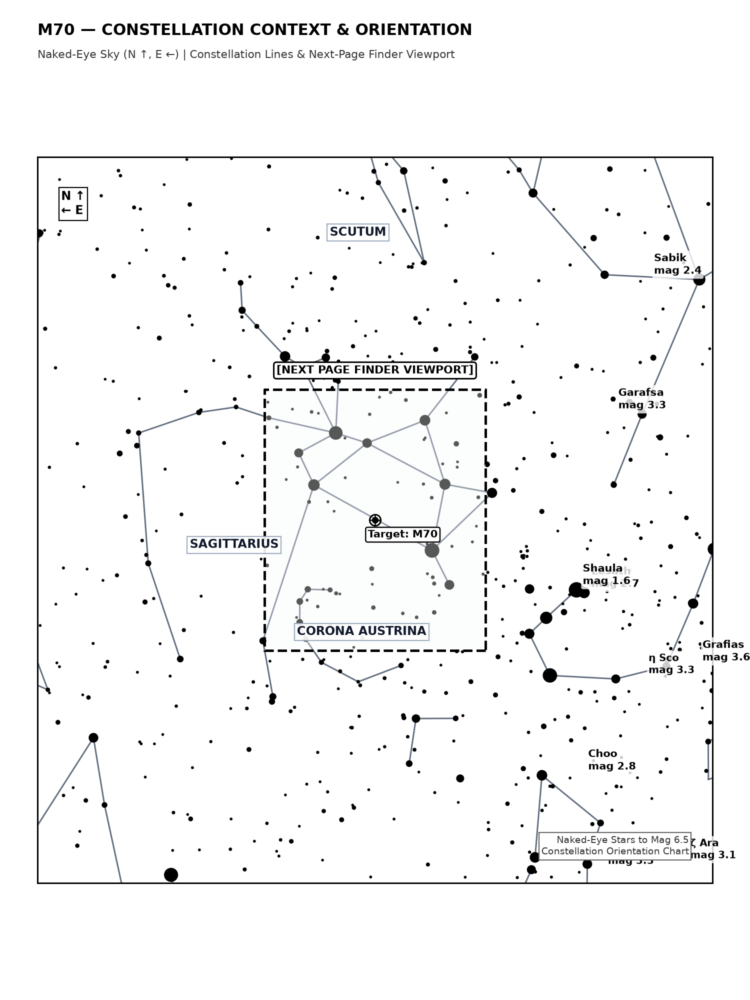

### 3. Wide-Field Star-Hopping Finder Chart
> [!IMPORTANT]
> **Viewport A** provides an upright naked-eye / optical finder orientation (N ↑, E ←) with stars down to visual magnitude 8.5. Standard concentric Telrad rings (0.5°, 2.0°, 4.0°) and 5.0° finder circle are centered directly on the target.

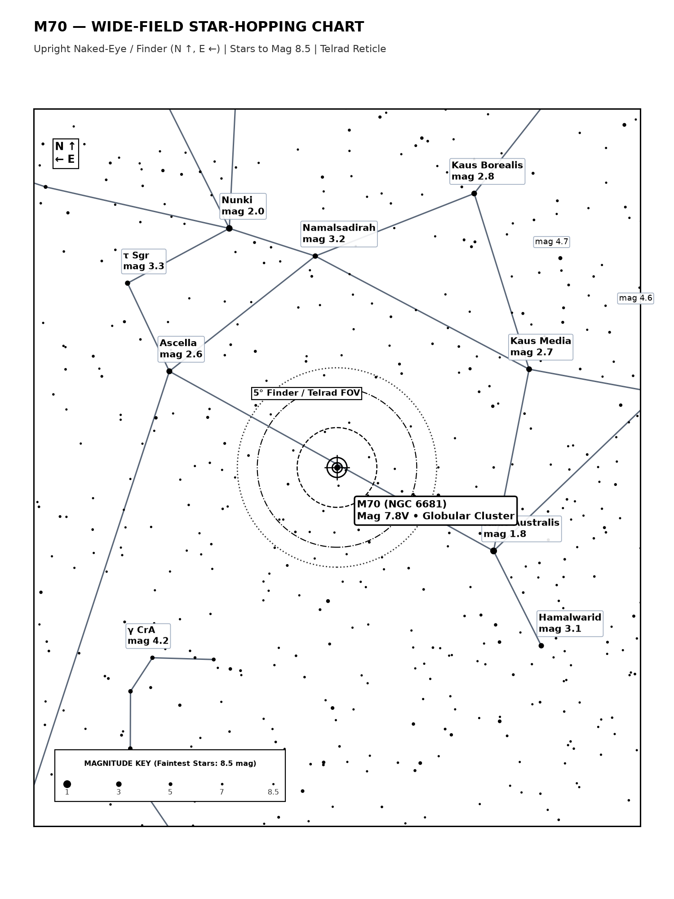

*([📄 Open Full High-Resolution Master A4 Finder Chart](shared/m70/chart_skywatcher-skyliner-200p.png))*

### 4. Observing Strategy & Step-by-Step Hop Instructions

- **Acquisition & Framing (20mm Super / 60×, 50' FOV)**:
  Noticeable circular misty ball with bright concentrated core floating against a dark starry backdrop in Sagittarius.
- **High-Power Inspection & Detail (12.5mm / 96×, 31' FOV)**:
  12.5mm (96×) resolves the outer edges into sharp, glittering diamond star points; averted vision reveals rich granularity across the core.

**Step-by-Step Star Hop Narrative**:
Locate anchor constellation Sagittarius on the Context Chart. Slew Telrad reticle to RA 280.80°, Dec -32.29° and center the fuzzy ball in the 20mm finder eyepiece.

---

## M71 (NGC 6838) — Sagitta

[↑ Back to Catalog Index](#messier-catalog-index) • [← Previous: M70](#m70) • [Next: M72 →](#m72)

| Technical Parameter | Specification |
| :--- | :--- |
| **Designation** | M71 (NGC 6838) |
| **Constellation** | Sagitta |
| **Classification** | Globular Cluster (GC) |
| **Visual Magnitude ($V$)** | 8.4 mag |
| **Apparent Dimensions** | 7.2' × 7.2' |
| **Estimated Distance** | ~13,048 light-years |
| **Swanson Difficulty** | **Hard** (*NexStar User's Guide II*) |
| **Coordinates (J2000)** | RA **19h 53m 46.5s** • Dec **+18° 46' 45.1"** |
| **Recommended Eyepiece** | 12.5mm (96× magnification, 31' TFOV, 2.1mm exit pupil) |

### 1. Telescope Eyepiece Simulation & Technical Dossier
> [!NOTE]
> **Viewport B** depicts the pre-inverted 180° field view through the Newtonian reflector (12.5mm eyepiece / 96× magnification, 31' true field of view: South at top, West at left, N ↓, E →). **Viewport C** integrates target ephemeris and optical notes.

### 2. Constellation Context & Regional Orientation Chart
> [!TIP]
> **Viewport Context** presents a wide ~50°–65° naked-eye orientation field (stars down to visual magnitude 6.5) with official IAU constellation guide lines. The dashed bounding box marks the exact area covered by the wide-field star-hopping chart below.

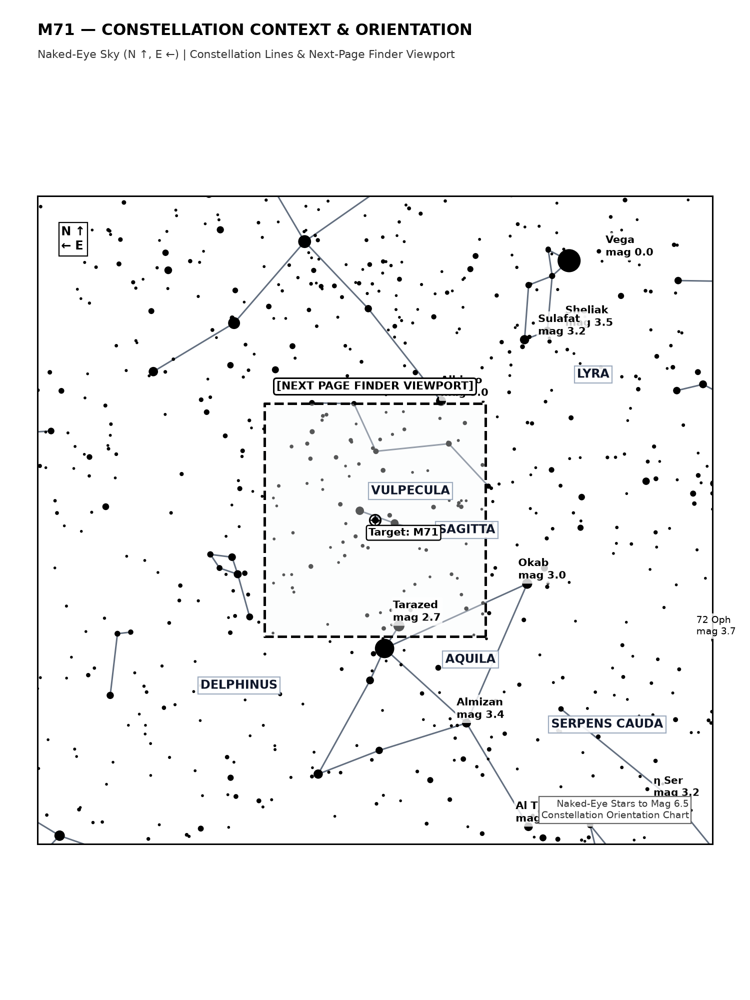

### 3. Wide-Field Star-Hopping Finder Chart
> [!IMPORTANT]
> **Viewport A** provides an upright naked-eye / optical finder orientation (N ↑, E ←) with stars down to visual magnitude 8.5. Standard concentric Telrad rings (0.5°, 2.0°, 4.0°) and 5.0° finder circle are centered directly on the target.

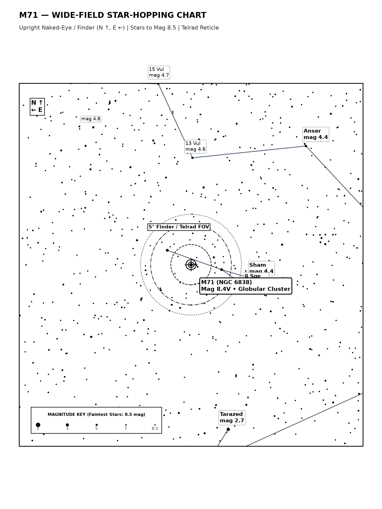

*([📄 Open Full High-Resolution Master A4 Finder Chart](shared/m71/chart_skywatcher-skyliner-200p.png))*

### 4. Observing Strategy & Step-by-Step Hop Instructions

- **Acquisition & Framing (20mm Super / 60×, 50' FOV)**:
  Noticeable circular misty ball with bright concentrated core floating against a dark starry backdrop in Sagitta.
- **High-Power Inspection & Detail (12.5mm / 96×, 31' FOV)**:
  12.5mm (96×) resolves the outer edges into sharp, glittering diamond star points; averted vision reveals rich granularity across the core.

**Step-by-Step Star Hop Narrative**:
Locate anchor constellation Sagitta on the Context Chart. Slew Telrad reticle to RA 298.44°, Dec 18.78° and center the fuzzy ball in the 20mm finder eyepiece.

---

## M72 (NGC 6981) — Aquarius

[↑ Back to Catalog Index](#messier-catalog-index) • [← Previous: M71](#m71) • [Next: M73 →](#m73)

| Technical Parameter | Specification |
| :--- | :--- |
| **Designation** | M72 (NGC 6981) |
| **Constellation** | Aquarius |
| **Classification** | Globular Cluster (GC) |
| **Visual Magnitude ($V$)** | 9.2 mag |
| **Apparent Dimensions** | 6.6' × 6.6' |
| **Estimated Distance** | ~54,573 light-years |
| **Swanson Difficulty** | **Hard** (*NexStar User's Guide II*) |
| **Coordinates (J2000)** | RA **20h 53m 27.7s** • Dec **-12° 32' 14.3"** |
| **Recommended Eyepiece** | 12.5mm (96× magnification, 31' TFOV, 2.1mm exit pupil) |

### 1. Telescope Eyepiece Simulation & Technical Dossier
> [!NOTE]
> **Viewport B** depicts the pre-inverted 180° field view through the Newtonian reflector (12.5mm eyepiece / 96× magnification, 31' true field of view: South at top, West at left, N ↓, E →). **Viewport C** integrates target ephemeris and optical notes.

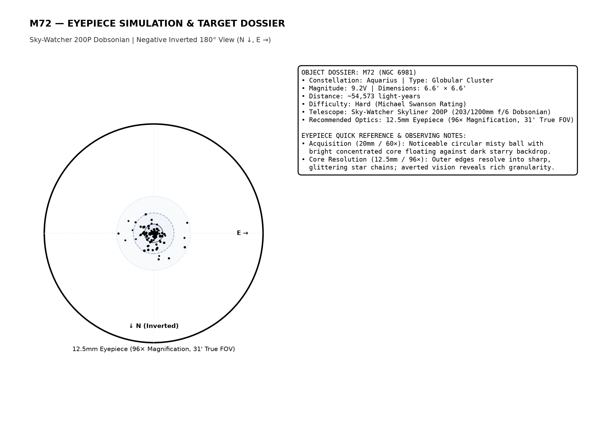

### 2. Constellation Context & Regional Orientation Chart
> [!TIP]
> **Viewport Context** presents a wide ~50°–65° naked-eye orientation field (stars down to visual magnitude 6.5) with official IAU constellation guide lines. The dashed bounding box marks the exact area covered by the wide-field star-hopping chart below.

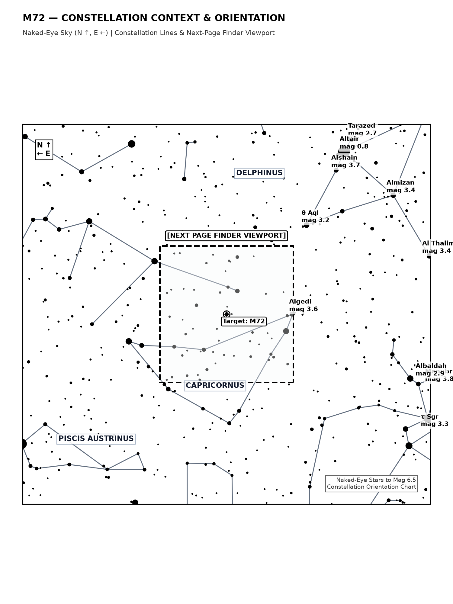

### 3. Wide-Field Star-Hopping Finder Chart
> [!IMPORTANT]
> **Viewport A** provides an upright naked-eye / optical finder orientation (N ↑, E ←) with stars down to visual magnitude 8.5. Standard concentric Telrad rings (0.5°, 2.0°, 4.0°) and 5.0° finder circle are centered directly on the target.

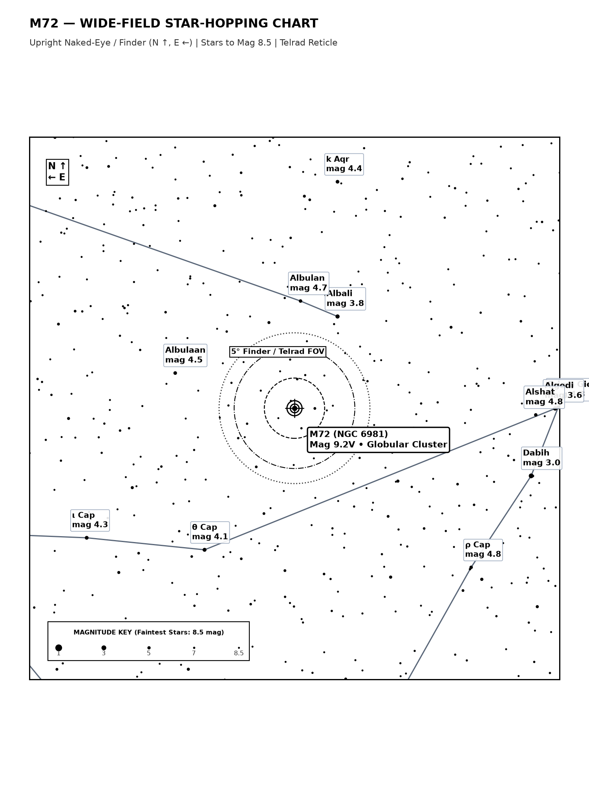

*([📄 Open Full High-Resolution Master A4 Finder Chart](shared/m72/chart_skywatcher-skyliner-200p.png))*

### 4. Observing Strategy & Step-by-Step Hop Instructions

- **Acquisition & Framing (20mm Super / 60×, 50' FOV)**:
  Noticeable circular misty ball with bright concentrated core floating against a dark starry backdrop in Aquarius.
- **High-Power Inspection & Detail (12.5mm / 96×, 31' FOV)**:
  12.5mm (96×) resolves the outer edges into sharp, glittering diamond star points; averted vision reveals rich granularity across the core.

**Step-by-Step Star Hop Narrative**:
Locate anchor constellation Aquarius on the Context Chart. Slew Telrad reticle to RA 313.37°, Dec -12.54° and center the fuzzy ball in the 20mm finder eyepiece.

---

## M73 Four-Star Asterism (NGC 6994) — Aquarius

[↑ Back to Catalog Index](#messier-catalog-index) • [← Previous: M72](#m72) • [Next: M74 →](#m74)

| Technical Parameter | Specification |
| :--- | :--- |
| **Designation** | M73 (NGC 6994) |
| **Common Name** | **Four-Star Asterism** |
| **Constellation** | Aquarius |
| **Classification** | Open Cluster (OC) |
| **Visual Magnitude ($V$)** | 8.9 mag |
| **Apparent Dimensions** | 2.8' × 2.8' |
| **Estimated Distance** | ~2511 light-years |
| **Swanson Difficulty** | **Easy** (*NexStar User's Guide II*) |
| **Coordinates (J2000)** | RA **20h 59m 00.0s** • Dec **-12° 37' 48.0"** |
| **Recommended Eyepiece** | 12.5mm (96× magnification, 31' TFOV, 2.1mm exit pupil) |

### 1. Telescope Eyepiece Simulation & Technical Dossier
> [!NOTE]
> **Viewport B** depicts the pre-inverted 180° field view through the Newtonian reflector (12.5mm eyepiece / 96× magnification, 31' true field of view: South at top, West at left, N ↓, E →). **Viewport C** integrates target ephemeris and optical notes.

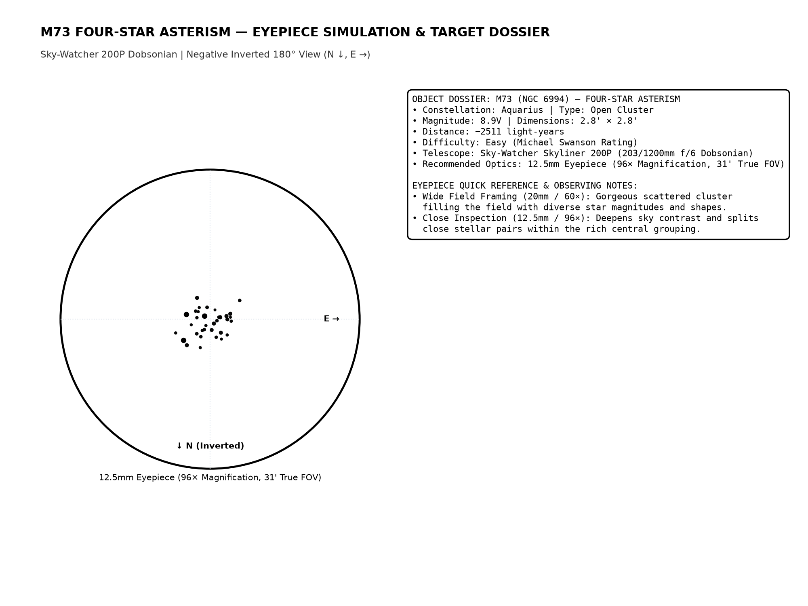

### 2. Constellation Context & Regional Orientation Chart
> [!TIP]
> **Viewport Context** presents a wide ~50°–65° naked-eye orientation field (stars down to visual magnitude 6.5) with official IAU constellation guide lines. The dashed bounding box marks the exact area covered by the wide-field star-hopping chart below.

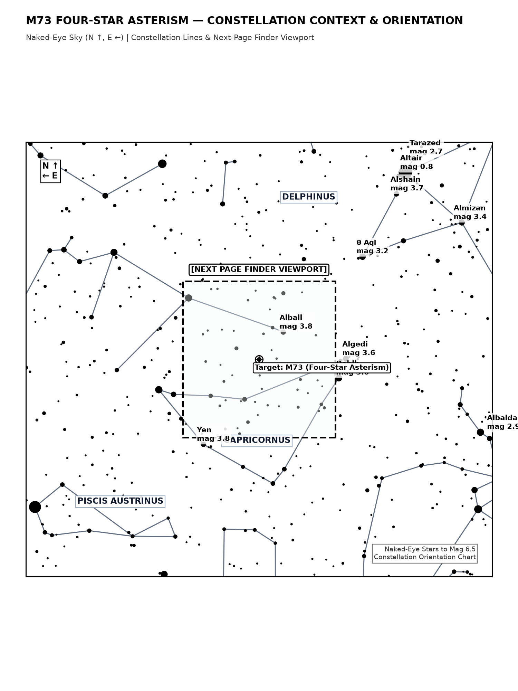

### 3. Wide-Field Star-Hopping Finder Chart
> [!IMPORTANT]
> **Viewport A** provides an upright naked-eye / optical finder orientation (N ↑, E ←) with stars down to visual magnitude 8.5. Standard concentric Telrad rings (0.5°, 2.0°, 4.0°) and 5.0° finder circle are centered directly on the target.

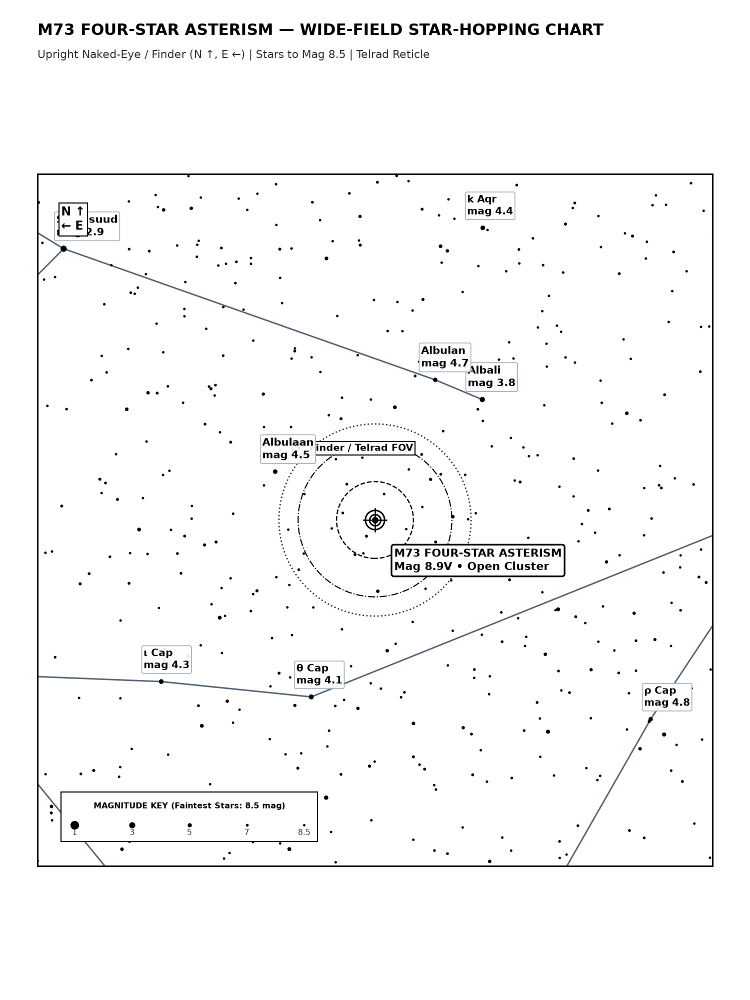

*([📄 Open Full High-Resolution Master A4 Finder Chart](shared/m73/chart_skywatcher-skyliner-200p.png))*

### 4. Observing Strategy & Step-by-Step Hop Instructions

- **Acquisition & Framing (20mm Super / 60×, 50' FOV)**:
  Gorgeous scattered star cluster filling the field with diverse stellar magnitudes and pleasing geometric groupings.
- **High-Power Inspection & Detail (12.5mm / 96×, 31' FOV)**:
  12.5mm (96×) deepens sky contrast and splits intimate stellar pairs and chains within the rich central grouping.

**Step-by-Step Star Hop Narrative**:
Locate Aquarius via Context Chart. Align Telrad reticle to target coordinates (RA 314.75°, Dec -12.63°); cluster stars emerge immediately in the finder.

---

## M74 (NGC 628) — Pisces

[↑ Back to Catalog Index](#messier-catalog-index) • [← Previous: M73](#m73) • [Next: M75 →](#m75)

| Technical Parameter | Specification |
| :--- | :--- |
| **Designation** | M74 (NGC 628) |
| **Constellation** | Pisces |
| **Classification** | Spiral Galaxy (Galaxy) |
| **Visual Magnitude ($V$)** | 9.4 mag |
| **Apparent Dimensions** | 10.5' × 9.5' |
| **Estimated Distance** | ~9.2 million light-years |
| **Swanson Difficulty** | **Hard** (*NexStar User's Guide II*) |
| **Coordinates (J2000)** | RA **1h 36m 41.8s** • Dec **+15° 47' 00.5"** |
| **Recommended Eyepiece** | 12.5mm (96× magnification, 31' TFOV, 2.1mm exit pupil) |

### 1. Telescope Eyepiece Simulation & Technical Dossier
> [!NOTE]
> **Viewport B** depicts the pre-inverted 180° field view through the Newtonian reflector (12.5mm eyepiece / 96× magnification, 31' true field of view: South at top, West at left, N ↓, E →). **Viewport C** integrates target ephemeris and optical notes.

### 2. Constellation Context & Regional Orientation Chart
> [!TIP]
> **Viewport Context** presents a wide ~50°–65° naked-eye orientation field (stars down to visual magnitude 6.5) with official IAU constellation guide lines. The dashed bounding box marks the exact area covered by the wide-field star-hopping chart below.

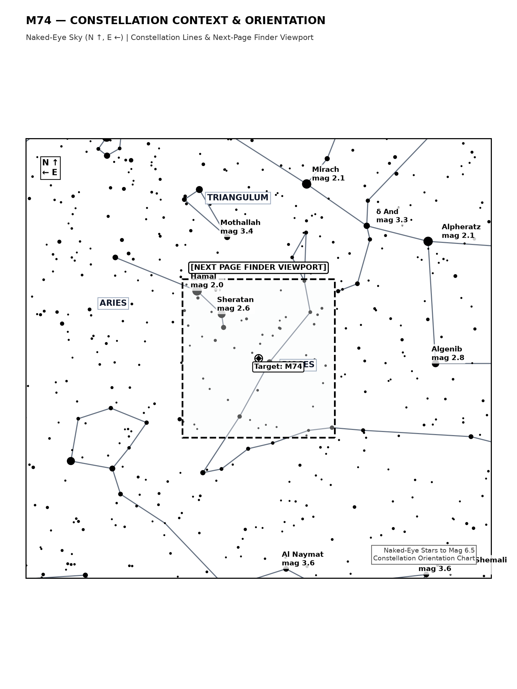

### 3. Wide-Field Star-Hopping Finder Chart
> [!IMPORTANT]
> **Viewport A** provides an upright naked-eye / optical finder orientation (N ↑, E ←) with stars down to visual magnitude 8.5. Standard concentric Telrad rings (0.5°, 2.0°, 4.0°) and 5.0° finder circle are centered directly on the target.

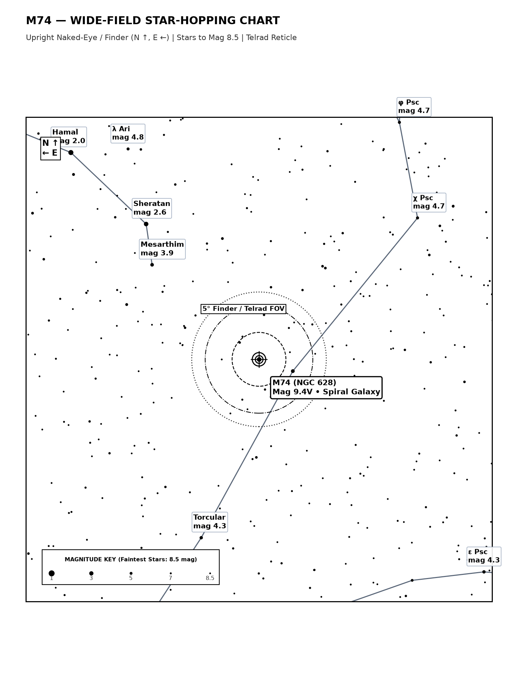

*([📄 Open Full High-Resolution Master A4 Finder Chart](shared/m74/chart_skywatcher-skyliner-200p.png))*

### 4. Observing Strategy & Step-by-Step Hop Instructions

- **Acquisition & Framing (20mm Super / 60×, 50' FOV)**:
  Ethereal oval glow with condensed galactic nucleus; framing the galaxy within the wide 50' field maximizes contrast against the sky.
- **High-Power Inspection & Detail (12.5mm / 96×, 31' FOV)**:
  12.5mm (96×) darkens the background sky, aiding detection of subtle core elongation, dust lanes, and halo extent with averted vision.

**Step-by-Step Star Hop Narrative**:
Locate constellation Pisces. Follow the guide stars on the Wide-Field Chart to RA 24.17°, Dec 15.78°; look for a soft hazy smudge.

---

## M75 (NGC 6864) — Sagittarius

[↑ Back to Catalog Index](#messier-catalog-index) • [← Previous: M74](#m74) • [Next: M76 →](#m76)

| Technical Parameter | Specification |
| :--- | :--- |
| **Designation** | M75 (NGC 6864) |
| **Constellation** | Sagittarius |
| **Classification** | Globular Cluster (GC) |
| **Visual Magnitude ($V$)** | 8.6 mag |
| **Apparent Dimensions** | 6.8' × 1.9' |
| **Estimated Distance** | ~67,523 light-years |
| **Swanson Difficulty** | **Medium** (*NexStar User's Guide II*) |
| **Coordinates (J2000)** | RA **20h 06m 04.8s** • Dec **-21° 55' 20.1"** |
| **Recommended Eyepiece** | 12.5mm (96× magnification, 31' TFOV, 2.1mm exit pupil) |

### 1. Telescope Eyepiece Simulation & Technical Dossier
> [!NOTE]
> **Viewport B** depicts the pre-inverted 180° field view through the Newtonian reflector (12.5mm eyepiece / 96× magnification, 31' true field of view: South at top, West at left, N ↓, E →). **Viewport C** integrates target ephemeris and optical notes.

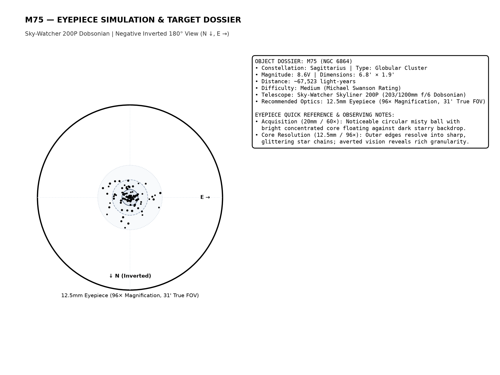

### 2. Constellation Context & Regional Orientation Chart
> [!TIP]
> **Viewport Context** presents a wide ~50°–65° naked-eye orientation field (stars down to visual magnitude 6.5) with official IAU constellation guide lines. The dashed bounding box marks the exact area covered by the wide-field star-hopping chart below.

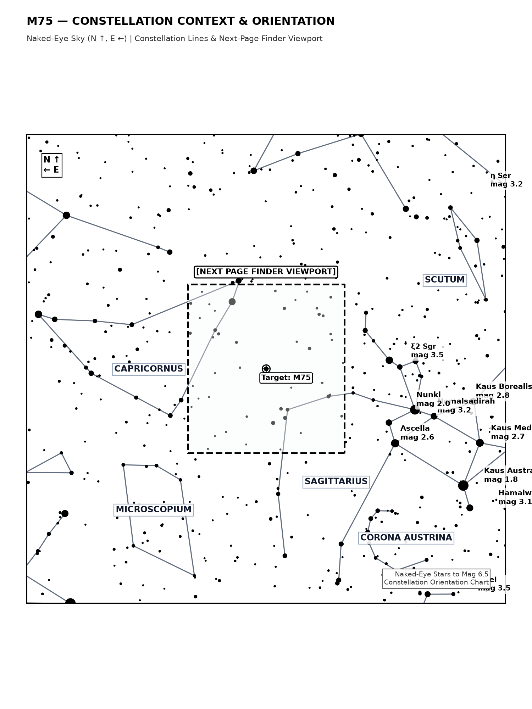

### 3. Wide-Field Star-Hopping Finder Chart
> [!IMPORTANT]
> **Viewport A** provides an upright naked-eye / optical finder orientation (N ↑, E ←) with stars down to visual magnitude 8.5. Standard concentric Telrad rings (0.5°, 2.0°, 4.0°) and 5.0° finder circle are centered directly on the target.

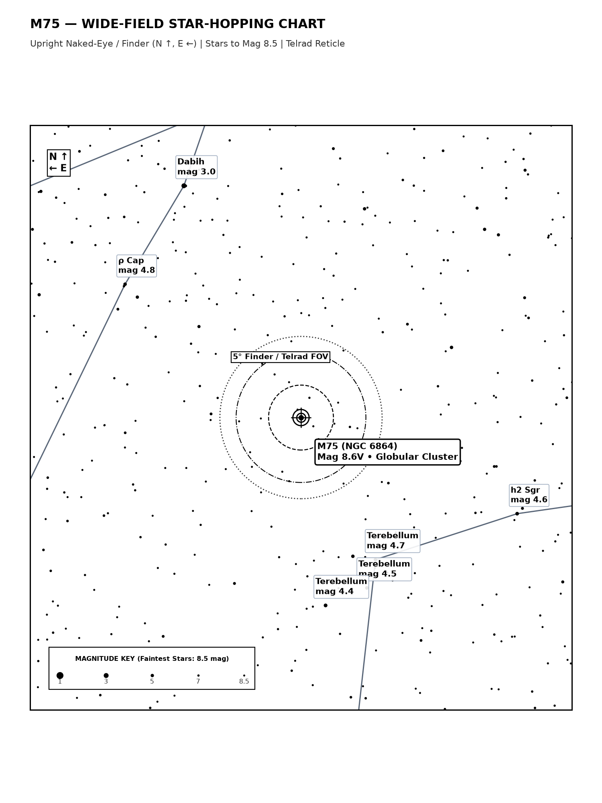

*([📄 Open Full High-Resolution Master A4 Finder Chart](shared/m75/chart_skywatcher-skyliner-200p.png))*

### 4. Observing Strategy & Step-by-Step Hop Instructions

- **Acquisition & Framing (20mm Super / 60×, 50' FOV)**:
  Noticeable circular misty ball with bright concentrated core floating against a dark starry backdrop in Sagittarius.
- **High-Power Inspection & Detail (12.5mm / 96×, 31' FOV)**:
  12.5mm (96×) resolves the outer edges into sharp, glittering diamond star points; averted vision reveals rich granularity across the core.

**Step-by-Step Star Hop Narrative**:
Locate anchor constellation Sagittarius on the Context Chart. Slew Telrad reticle to RA 301.52°, Dec -21.92° and center the fuzzy ball in the 20mm finder eyepiece.

---

## M76 Little Dumbbell, Cork, Butterfly Nebula (NGC 650) — Perseus

[↑ Back to Catalog Index](#messier-catalog-index) • [← Previous: M75](#m75) • [Next: M77 →](#m77)

| Technical Parameter | Specification |
| :--- | :--- |
| **Designation** | M76 (NGC 650) |
| **Common Name** | **Little Dumbbell, Cork, Butterfly Nebula** |
| **Constellation** | Perseus |
| **Classification** | Planetary Nebula (PN) |
| **Visual Magnitude ($V$)** | 10.1 mag |
| **Apparent Dimensions** | 3.1' × 2.3' |
| **Estimated Distance** | ~2433 light-years |
| **Swanson Difficulty** | **Medium** (*NexStar User's Guide II*) |
| **Coordinates (J2000)** | RA **1h 42m 19.9s** • Dec **+51° 34' 31.2"** |
| **Recommended Eyepiece** | 12.5mm (96× magnification, 31' TFOV, 2.1mm exit pupil) |

### 1. Telescope Eyepiece Simulation & Technical Dossier
> [!NOTE]
> **Viewport B** depicts the pre-inverted 180° field view through the Newtonian reflector (12.5mm eyepiece / 96× magnification, 31' true field of view: South at top, West at left, N ↓, E →). **Viewport C** integrates target ephemeris and optical notes.

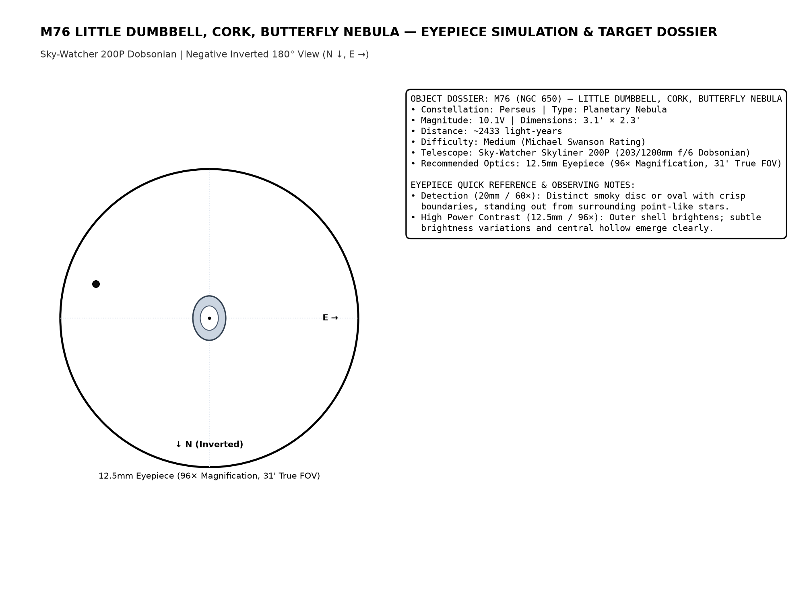

### 2. Constellation Context & Regional Orientation Chart
> [!TIP]
> **Viewport Context** presents a wide ~50°–65° naked-eye orientation field (stars down to visual magnitude 6.5) with official IAU constellation guide lines. The dashed bounding box marks the exact area covered by the wide-field star-hopping chart below.

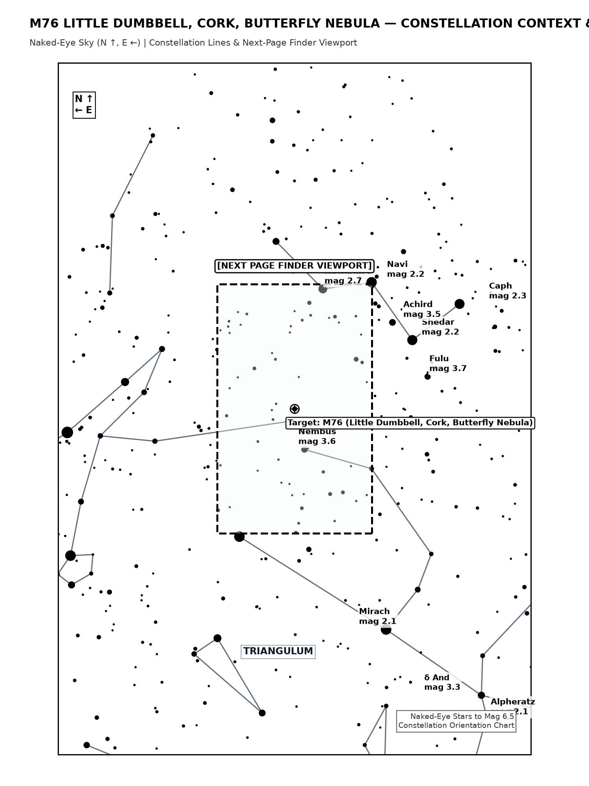

### 3. Wide-Field Star-Hopping Finder Chart
> [!IMPORTANT]
> **Viewport A** provides an upright naked-eye / optical finder orientation (N ↑, E ←) with stars down to visual magnitude 8.5. Standard concentric Telrad rings (0.5°, 2.0°, 4.0°) and 5.0° finder circle are centered directly on the target.

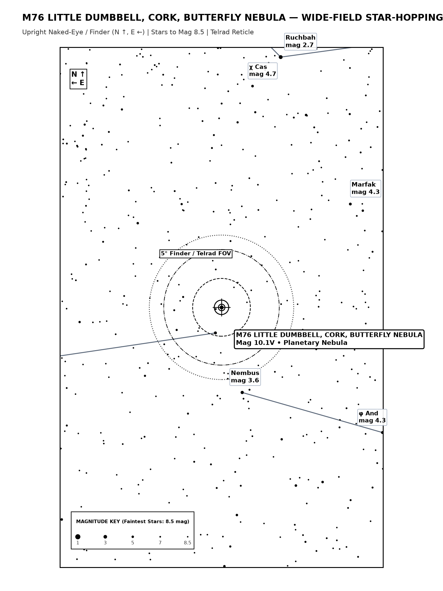

*([📄 Open Full High-Resolution Master A4 Finder Chart](shared/m76/chart_skywatcher-skyliner-200p.png))*

### 4. Observing Strategy & Step-by-Step Hop Instructions

- **Acquisition & Framing (20mm Super / 60×, 50' FOV)**:
  Distinct smoky disc or oval with crisp boundaries, standing out conspicuously from surrounding point-like field stars.
- **High-Power Inspection & Detail (12.5mm / 96×, 31' FOV)**:
  12.5mm (96×) brightens the outer nebular shell; subtle brightness variations and central hollow emerge clearly under steady seeing.

**Step-by-Step Star Hop Narrative**:
Locate Perseus anchor stars. Slew Telrad reticle to target coordinates (RA 25.58°, Dec 51.58°); identify the tiny non-twinkling smoky disk.

---

## M77 Cetus A (NGC 1068) — Cetus

[↑ Back to Catalog Index](#messier-catalog-index) • [← Previous: M76](#m76) • [Next: M78 →](#m78)

| Technical Parameter | Specification |
| :--- | :--- |
| **Designation** | M77 (NGC 1068) |
| **Common Name** | **Cetus A** |
| **Constellation** | Cetus |
| **Classification** | Spiral Galaxy (Galaxy) |
| **Visual Magnitude ($V$)** | 8.9 mag |
| **Apparent Dimensions** | 7.1' × 6.0' |
| **Estimated Distance** | ~14.4 million light-years |
| **Swanson Difficulty** | **Hard** (*NexStar User's Guide II*) |
| **Coordinates (J2000)** | RA **2h 42m 40.8s** • Dec **-0° 00' 47.8"** |
| **Recommended Eyepiece** | 12.5mm (96× magnification, 31' TFOV, 2.1mm exit pupil) |

### 1. Telescope Eyepiece Simulation & Technical Dossier
> [!NOTE]
> **Viewport B** depicts the pre-inverted 180° field view through the Newtonian reflector (12.5mm eyepiece / 96× magnification, 31' true field of view: South at top, West at left, N ↓, E →). **Viewport C** integrates target ephemeris and optical notes.

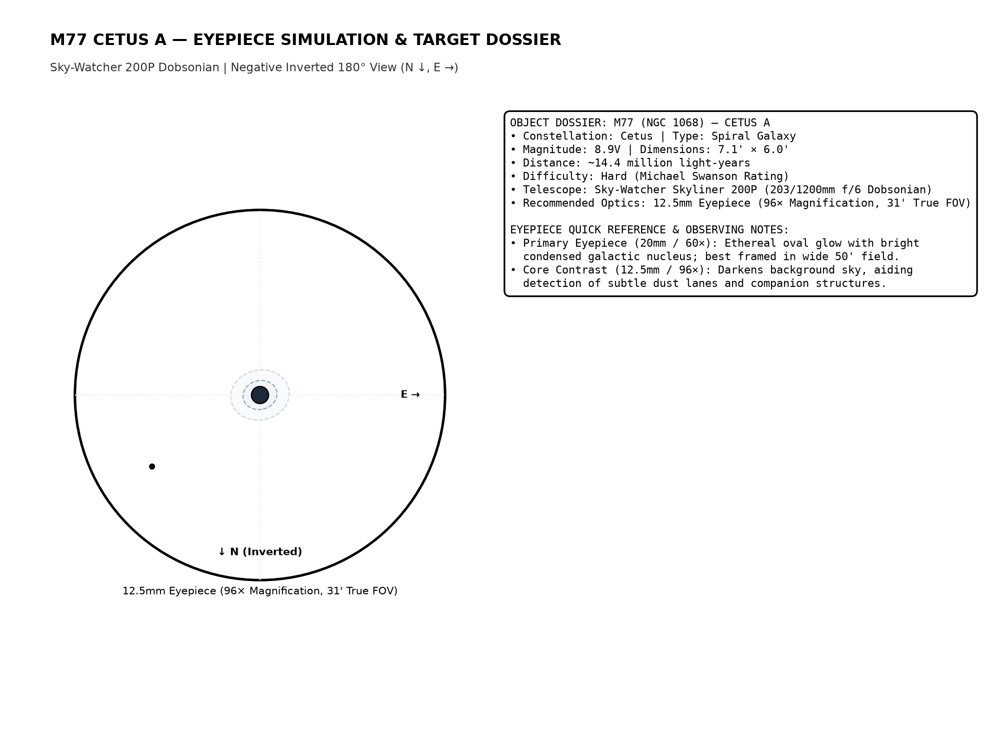

### 2. Constellation Context & Regional Orientation Chart
> [!TIP]
> **Viewport Context** presents a wide ~50°–65° naked-eye orientation field (stars down to visual magnitude 6.5) with official IAU constellation guide lines. The dashed bounding box marks the exact area covered by the wide-field star-hopping chart below.

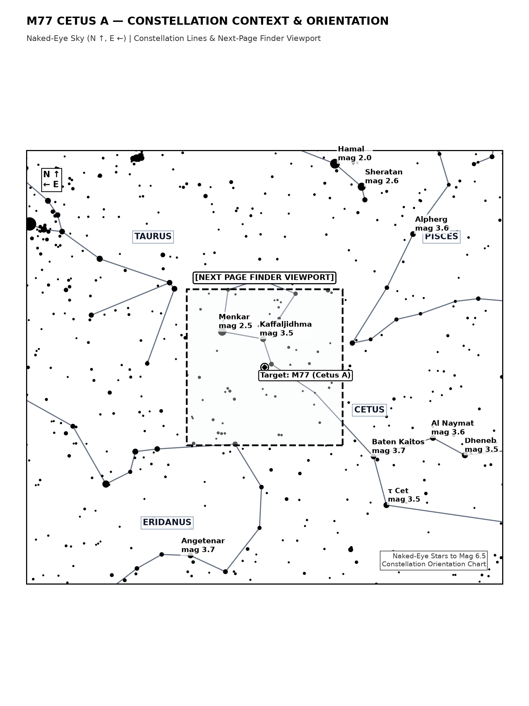

### 3. Wide-Field Star-Hopping Finder Chart
> [!IMPORTANT]
> **Viewport A** provides an upright naked-eye / optical finder orientation (N ↑, E ←) with stars down to visual magnitude 8.5. Standard concentric Telrad rings (0.5°, 2.0°, 4.0°) and 5.0° finder circle are centered directly on the target.

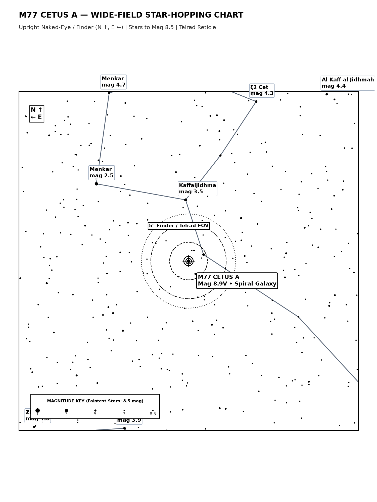

*([📄 Open Full High-Resolution Master A4 Finder Chart](shared/m77/chart_skywatcher-skyliner-200p.png))*

### 4. Observing Strategy & Step-by-Step Hop Instructions

- **Acquisition & Framing (20mm Super / 60×, 50' FOV)**:
  Ethereal oval glow with condensed galactic nucleus; framing the galaxy within the wide 50' field maximizes contrast against the sky.
- **High-Power Inspection & Detail (12.5mm / 96×, 31' FOV)**:
  12.5mm (96×) darkens the background sky, aiding detection of subtle core elongation, dust lanes, and halo extent with averted vision.

**Step-by-Step Star Hop Narrative**:
Locate constellation Cetus. Follow the guide stars on the Wide-Field Chart to RA 40.67°, Dec -0.01°; look for a soft hazy smudge.

---

## M78 (NGC 2068) — Orion

[↑ Back to Catalog Index](#messier-catalog-index) • [← Previous: M77](#m77) • [Next: M79 →](#m79)

| Technical Parameter | Specification |
| :--- | :--- |
| **Designation** | M78 (NGC 2068) |
| **Constellation** | Orion |
| **Classification** | Diffuse Nebula (Nebula) |
| **Visual Magnitude ($V$)** | 8.0 mag |
| **Apparent Dimensions** | 8.0' × 6.0' |
| **Estimated Distance** | ~1598 light-years |
| **Swanson Difficulty** | **Medium** (*NexStar User's Guide II*) |
| **Coordinates (J2000)** | RA **5h 46m 46.8s** • Dec **+0° 00' 50.4"** |
| **Recommended Eyepiece** | 20mm (60× magnification, 49' TFOV, 3.4mm exit pupil) |

### 1. Telescope Eyepiece Simulation & Technical Dossier
> [!NOTE]
> **Viewport B** depicts the pre-inverted 180° field view through the Newtonian reflector (20mm eyepiece / 60× magnification, 49' true field of view: South at top, West at left, N ↓, E →). **Viewport C** integrates target ephemeris and optical notes.

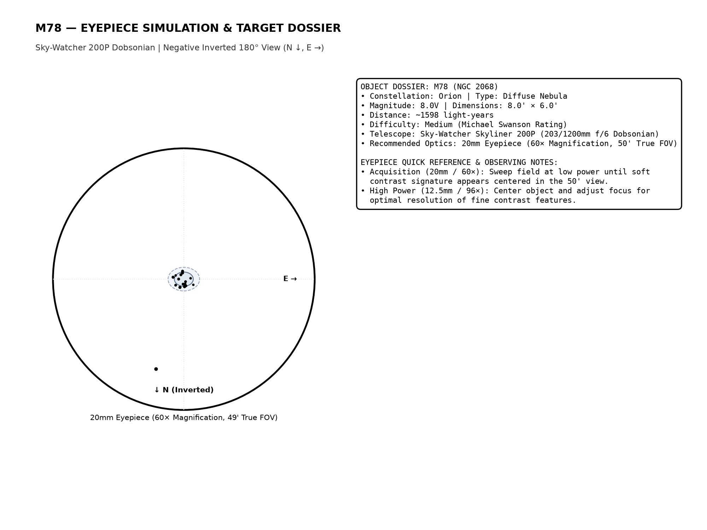

### 2. Constellation Context & Regional Orientation Chart
> [!TIP]
> **Viewport Context** presents a wide ~50°–65° naked-eye orientation field (stars down to visual magnitude 6.5) with official IAU constellation guide lines. The dashed bounding box marks the exact area covered by the wide-field star-hopping chart below.

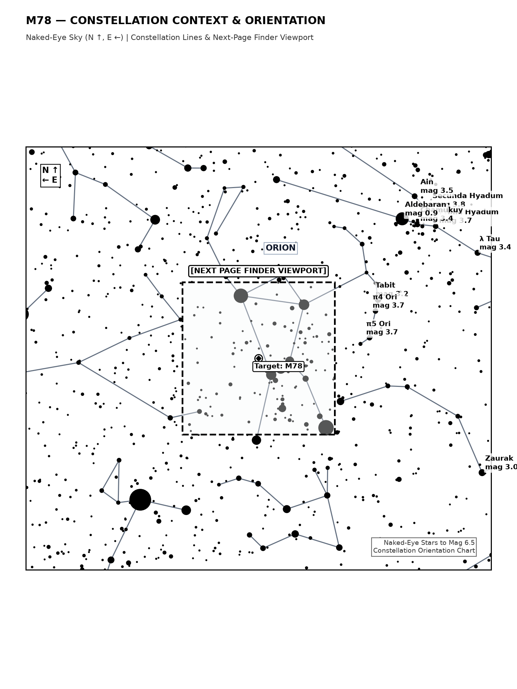

### 3. Wide-Field Star-Hopping Finder Chart
> [!IMPORTANT]
> **Viewport A** provides an upright naked-eye / optical finder orientation (N ↑, E ←) with stars down to visual magnitude 8.5. Standard concentric Telrad rings (0.5°, 2.0°, 4.0°) and 5.0° finder circle are centered directly on the target.

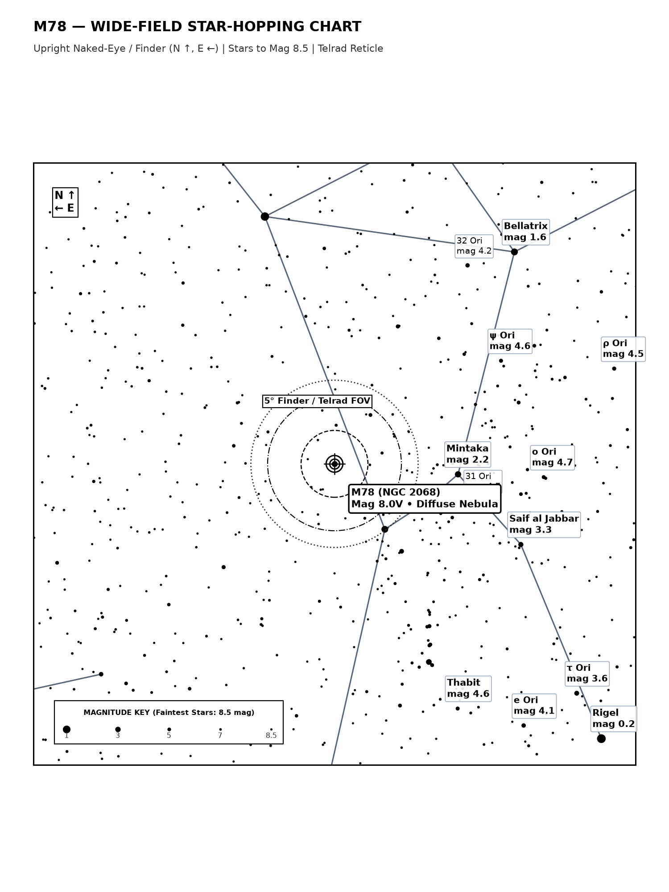

*([📄 Open Full High-Resolution Master A4 Finder Chart](shared/m78/chart_skywatcher-skyliner-200p.png))*

### 4. Observing Strategy & Step-by-Step Hop Instructions

- **Acquisition & Framing (20mm Super / 60×, 50' FOV)**:
  Soft, sprawling contrast signature floating among field stars; best detected by sweeping slowly across the field at 60×.
- **High-Power Inspection & Detail (20mm / 60×, 49' FOV)**:
  20mm (60×) highlights subtle ionization knots, filamentary edges, and embedded star groupings within the glowing cloud.

**Step-by-Step Star Hop Narrative**:
Locate Orion guide stars. Align Telrad reticle to RA 86.69°, Dec 0.01°; sweep gently until nebulous glow fills the field.

---

## M79 (NGC 1904) — Lepus

[↑ Back to Catalog Index](#messier-catalog-index) • [← Previous: M78](#m78) • [Next: M80 →](#m80)

| Technical Parameter | Specification |
| :--- | :--- |
| **Designation** | M79 (NGC 1904) |
| **Constellation** | Lepus |
| **Classification** | Globular Cluster (GC) |
| **Visual Magnitude ($V$)** | 7.7 mag |
| **Apparent Dimensions** | 9.6' × 9.6' |
| **Estimated Distance** | ~42,406 light-years |
| **Swanson Difficulty** | **Medium** (*NexStar User's Guide II*) |
| **Coordinates (J2000)** | RA **5h 24m 10.6s** • Dec **-24° 31' 27.3"** |
| **Recommended Eyepiece** | 12.5mm (96× magnification, 31' TFOV, 2.1mm exit pupil) |

### 1. Telescope Eyepiece Simulation & Technical Dossier
> [!NOTE]
> **Viewport B** depicts the pre-inverted 180° field view through the Newtonian reflector (12.5mm eyepiece / 96× magnification, 31' true field of view: South at top, West at left, N ↓, E →). **Viewport C** integrates target ephemeris and optical notes.

### 2. Constellation Context & Regional Orientation Chart
> [!TIP]
> **Viewport Context** presents a wide ~50°–65° naked-eye orientation field (stars down to visual magnitude 6.5) with official IAU constellation guide lines. The dashed bounding box marks the exact area covered by the wide-field star-hopping chart below.

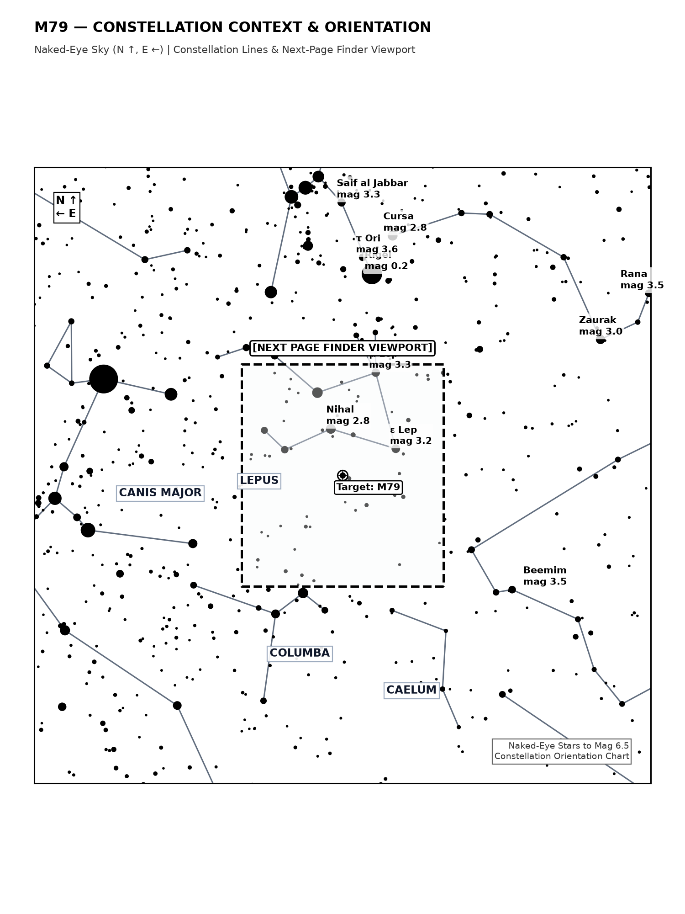

### 3. Wide-Field Star-Hopping Finder Chart
> [!IMPORTANT]
> **Viewport A** provides an upright naked-eye / optical finder orientation (N ↑, E ←) with stars down to visual magnitude 8.5. Standard concentric Telrad rings (0.5°, 2.0°, 4.0°) and 5.0° finder circle are centered directly on the target.

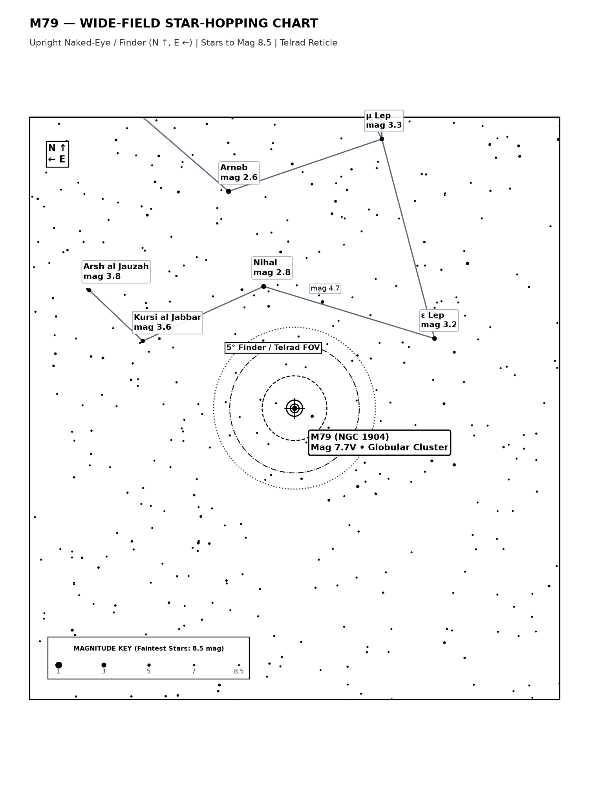

*([📄 Open Full High-Resolution Master A4 Finder Chart](shared/m79/chart_skywatcher-skyliner-200p.png))*

### 4. Observing Strategy & Step-by-Step Hop Instructions

- **Acquisition & Framing (20mm Super / 60×, 50' FOV)**:
  Noticeable circular misty ball with bright concentrated core floating against a dark starry backdrop in Lepus.
- **High-Power Inspection & Detail (12.5mm / 96×, 31' FOV)**:
  12.5mm (96×) resolves the outer edges into sharp, glittering diamond star points; averted vision reveals rich granularity across the core.

**Step-by-Step Star Hop Narrative**:
Locate anchor constellation Lepus on the Context Chart. Slew Telrad reticle to RA 81.04°, Dec -24.52° and center the fuzzy ball in the 20mm finder eyepiece.

---

## M80 (NGC 6093) — Scorpius

[↑ Back to Catalog Index](#messier-catalog-index) • [← Previous: M79](#m79) • [Next: M81 →](#m81)

| Technical Parameter | Specification |
| :--- | :--- |
| **Designation** | M80 (NGC 6093) |
| **Constellation** | Scorpius |
| **Classification** | Globular Cluster (GC) |
| **Visual Magnitude ($V$)** | 7.3 mag |
| **Apparent Dimensions** | 10.0' × 10.0' |
| **Estimated Distance** | ~32,620 light-years |
| **Swanson Difficulty** | **Medium** (*NexStar User's Guide II*) |
| **Coordinates (J2000)** | RA **16h 17m 02.4s** • Dec **-22° 58' 33.9"** |
| **Recommended Eyepiece** | 12.5mm (96× magnification, 31' TFOV, 2.1mm exit pupil) |

### 1. Telescope Eyepiece Simulation & Technical Dossier
> [!NOTE]
> **Viewport B** depicts the pre-inverted 180° field view through the Newtonian reflector (12.5mm eyepiece / 96× magnification, 31' true field of view: South at top, West at left, N ↓, E →). **Viewport C** integrates target ephemeris and optical notes.

### 2. Constellation Context & Regional Orientation Chart
> [!TIP]
> **Viewport Context** presents a wide ~50°–65° naked-eye orientation field (stars down to visual magnitude 6.5) with official IAU constellation guide lines. The dashed bounding box marks the exact area covered by the wide-field star-hopping chart below.

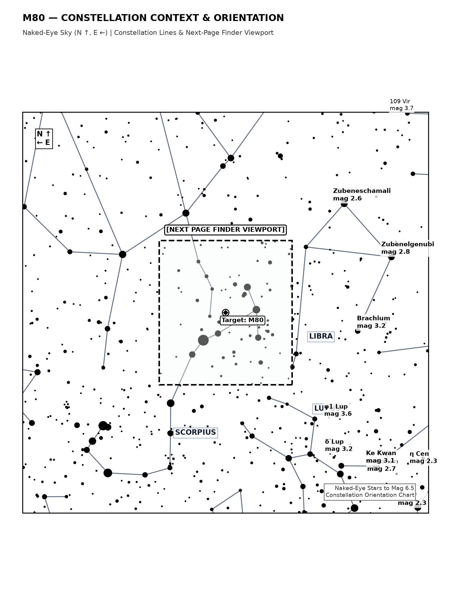

### 3. Wide-Field Star-Hopping Finder Chart
> [!IMPORTANT]
> **Viewport A** provides an upright naked-eye / optical finder orientation (N ↑, E ←) with stars down to visual magnitude 8.5. Standard concentric Telrad rings (0.5°, 2.0°, 4.0°) and 5.0° finder circle are centered directly on the target.

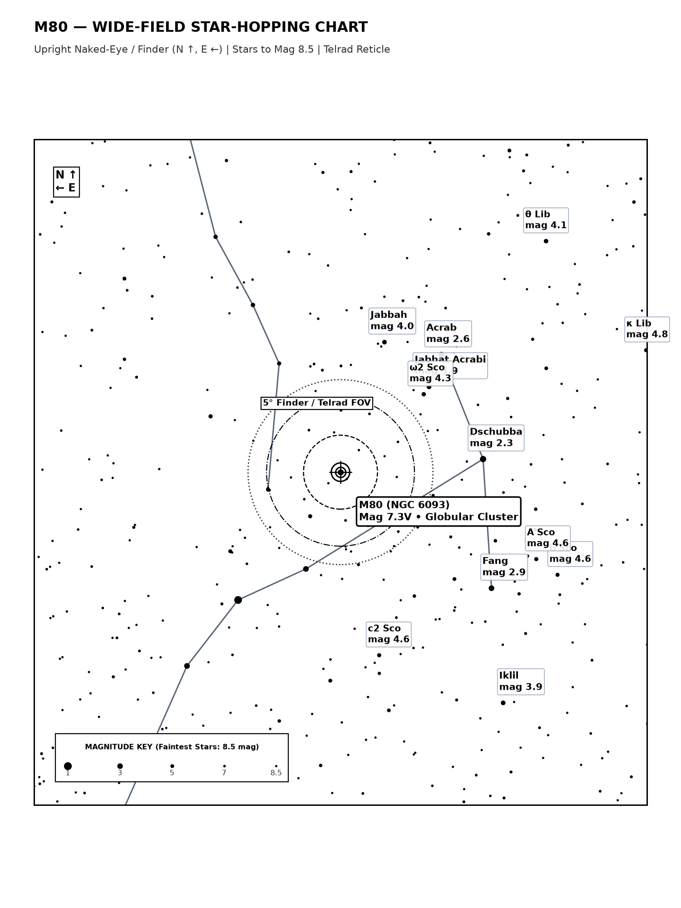

*([📄 Open Full High-Resolution Master A4 Finder Chart](shared/m80/chart_skywatcher-skyliner-200p.png))*

### 4. Observing Strategy & Step-by-Step Hop Instructions

- **Acquisition & Framing (20mm Super / 60×, 50' FOV)**:
  Noticeable circular misty ball with bright concentrated core floating against a dark starry backdrop in Scorpius.
- **High-Power Inspection & Detail (12.5mm / 96×, 31' FOV)**:
  12.5mm (96×) resolves the outer edges into sharp, glittering diamond star points; averted vision reveals rich granularity across the core.

**Step-by-Step Star Hop Narrative**:
Locate anchor constellation Scorpius on the Context Chart. Slew Telrad reticle to RA 244.26°, Dec -22.98° and center the fuzzy ball in the 20mm finder eyepiece.

---

## M81 Bode¹s Galaxy (NGC 3031) — Ursa Major

[↑ Back to Catalog Index](#messier-catalog-index) • [← Previous: M80](#m80) • [Next: M82 →](#m82)

| Technical Parameter | Specification |
| :--- | :--- |
| **Designation** | M81 (NGC 3031) |
| **Common Name** | **Bode¹s Galaxy** |
| **Constellation** | Ursa Major |
| **Classification** | Spiral Galaxy (Galaxy) |
| **Visual Magnitude ($V$)** | 6.9 mag |
| **Apparent Dimensions** | 26.9' × 14.1' |
| **Estimated Distance** | ~3.6 million light-years |
| **Swanson Difficulty** | **Medium** (*NexStar User's Guide II*) |
| **Coordinates (J2000)** | RA **9h 55m 33.2s** • Dec **+69° 03' 55.1"** |
| **Recommended Eyepiece** | 20mm (60× magnification, 49' TFOV, 3.4mm exit pupil) |

### 1. Telescope Eyepiece Simulation & Technical Dossier
> [!NOTE]
> **Viewport B** depicts the pre-inverted 180° field view through the Newtonian reflector (20mm eyepiece / 60× magnification, 49' true field of view: South at top, West at left, N ↓, E →). **Viewport C** integrates target ephemeris and optical notes.

### 2. Constellation Context & Regional Orientation Chart
> [!TIP]
> **Viewport Context** presents a wide ~50°–65° naked-eye orientation field (stars down to visual magnitude 6.5) with official IAU constellation guide lines. The dashed bounding box marks the exact area covered by the wide-field star-hopping chart below.

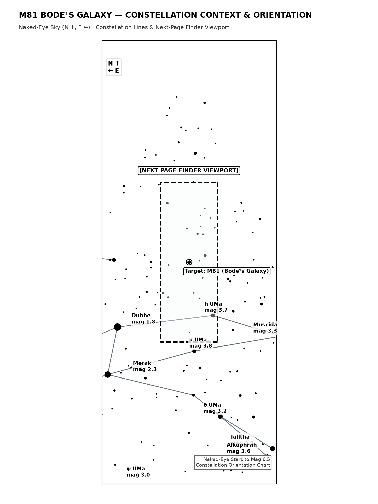

### 3. Wide-Field Star-Hopping Finder Chart
> [!IMPORTANT]
> **Viewport A** provides an upright naked-eye / optical finder orientation (N ↑, E ←) with stars down to visual magnitude 8.5. Standard concentric Telrad rings (0.5°, 2.0°, 4.0°) and 5.0° finder circle are centered directly on the target.

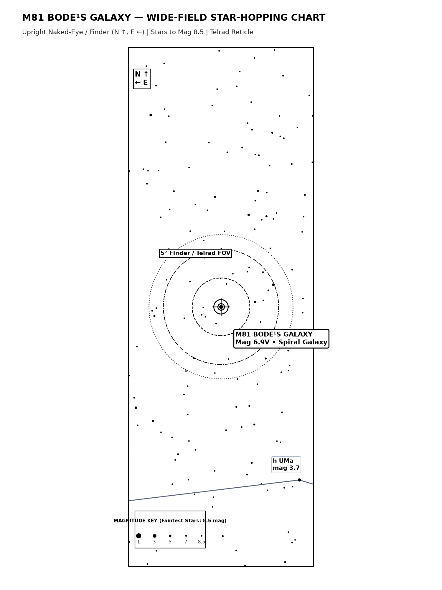

*([📄 Open Full High-Resolution Master A4 Finder Chart](shared/m81/chart_skywatcher-skyliner-200p.png))*

### 4. Observing Strategy & Step-by-Step Hop Instructions

- **Acquisition & Framing (20mm Super / 60×, 50' FOV)**:
  Bode's Galaxy; brilliant spiral galaxy with bright oval disk and highly concentrated starlike nucleus in Ursa Major.
- **High-Power Inspection & Detail (20mm / 60×, 49' FOV)**:
  Pairs beautifully with nearby cigar galaxy M82 in a single wide field; 96× reveals subtle disk elongation and high surface brightness.

**Step-by-Step Star Hop Narrative**:
Draw a diagonal line from Phad (γ UMa) through Dubhe (α UMa) at the lip of the Big Dipper and extend it an equal distance northwest.

---

## M82 Cigar Galaxy (NGC 3034) — Ursa Major

[↑ Back to Catalog Index](#messier-catalog-index) • [← Previous: M81](#m81) • [Next: M83 →](#m83)

| Technical Parameter | Specification |
| :--- | :--- |
| **Designation** | M82 (NGC 3034) |
| **Common Name** | **Cigar Galaxy** |
| **Constellation** | Ursa Major |
| **Classification** | Galaxy (Galaxy) |
| **Visual Magnitude ($V$)** | 8.4 mag |
| **Apparent Dimensions** | 11.2' × 4.3' |
| **Estimated Distance** | ~3.7 million light-years |
| **Swanson Difficulty** | **Medium** (*NexStar User's Guide II*) |
| **Coordinates (J2000)** | RA **9h 55m 52.4s** • Dec **+69° 40' 46.9"** |
| **Recommended Eyepiece** | 12.5mm (96× magnification, 31' TFOV, 2.1mm exit pupil) |

### 1. Telescope Eyepiece Simulation & Technical Dossier
> [!NOTE]
> **Viewport B** depicts the pre-inverted 180° field view through the Newtonian reflector (12.5mm eyepiece / 96× magnification, 31' true field of view: South at top, West at left, N ↓, E →). **Viewport C** integrates target ephemeris and optical notes.

### 2. Constellation Context & Regional Orientation Chart
> [!TIP]
> **Viewport Context** presents a wide ~50°–65° naked-eye orientation field (stars down to visual magnitude 6.5) with official IAU constellation guide lines. The dashed bounding box marks the exact area covered by the wide-field star-hopping chart below.

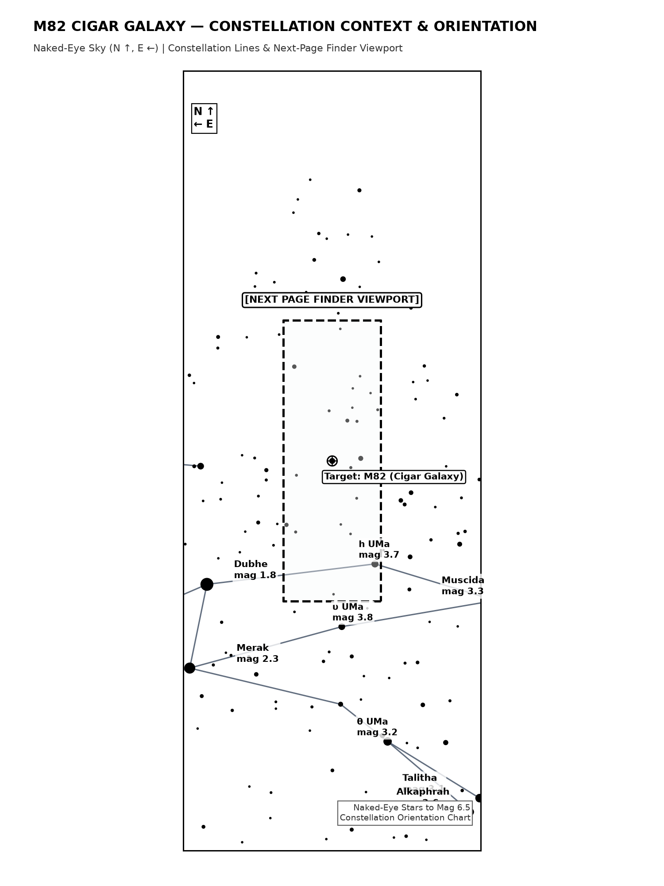

### 3. Wide-Field Star-Hopping Finder Chart
> [!IMPORTANT]
> **Viewport A** provides an upright naked-eye / optical finder orientation (N ↑, E ←) with stars down to visual magnitude 8.5. Standard concentric Telrad rings (0.5°, 2.0°, 4.0°) and 5.0° finder circle are centered directly on the target.

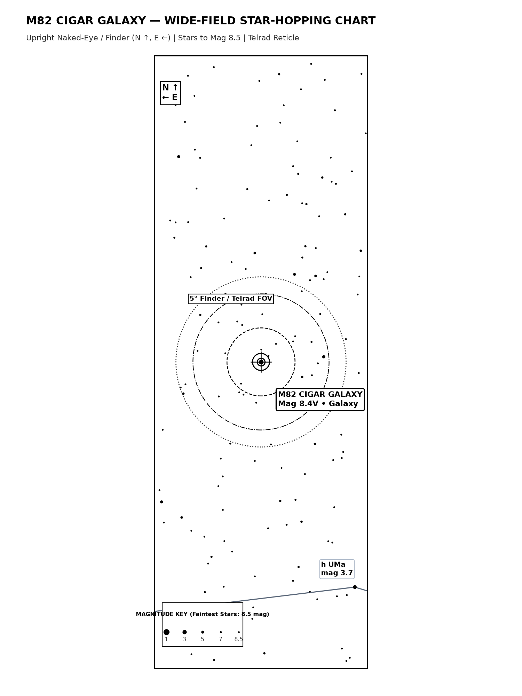

*([📄 Open Full High-Resolution Master A4 Finder Chart](shared/m82/chart_skywatcher-skyliner-200p.png))*

### 4. Observing Strategy & Step-by-Step Hop Instructions

- **Acquisition & Framing (20mm Super / 60×, 50' FOV)**:
  The Cigar Galaxy; famous edge-on starburst galaxy located only 38 arcminutes north of M81.
- **High-Power Inspection & Detail (12.5mm / 96×, 31' FOV)**:
  12.5mm (96×) reveals a dramatic splinter of light bisected by dark dust clouds and irregular mottled starburst knots across the nuclear region.

**Step-by-Step Star Hop Narrative**:
From M81, slew 0.6° due North; M82's bright edge-on needle appears in the same wide-field eyepiece.

---

## M83 Southern Pinwheel Galaxy (NGC 5236) — Hydra

[↑ Back to Catalog Index](#messier-catalog-index) • [← Previous: M82](#m82) • [Next: M84 →](#m84)

| Technical Parameter | Specification |
| :--- | :--- |
| **Designation** | M83 (NGC 5236) |
| **Common Name** | **Southern Pinwheel Galaxy** |
| **Constellation** | Hydra |
| **Classification** | Spiral Galaxy (Galaxy) |
| **Visual Magnitude ($V$)** | 7.5 mag |
| **Apparent Dimensions** | 12.9' × 11.5' |
| **Estimated Distance** | ~4.6 million light-years |
| **Swanson Difficulty** | **Medium** (*NexStar User's Guide II*) |
| **Coordinates (J2000)** | RA **13h 37m 00.9s** • Dec **-29° 51' 56.7"** |
| **Recommended Eyepiece** | 12.5mm (96× magnification, 31' TFOV, 2.1mm exit pupil) |

### 1. Telescope Eyepiece Simulation & Technical Dossier
> [!NOTE]
> **Viewport B** depicts the pre-inverted 180° field view through the Newtonian reflector (12.5mm eyepiece / 96× magnification, 31' true field of view: South at top, West at left, N ↓, E →). **Viewport C** integrates target ephemeris and optical notes.

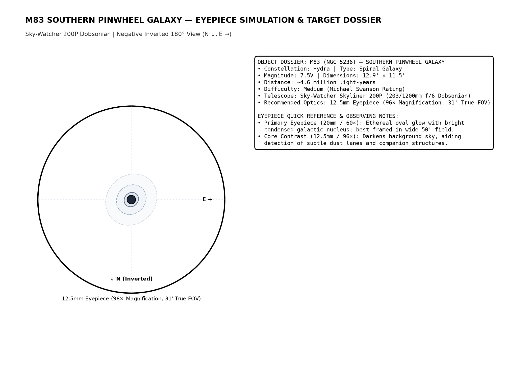

### 2. Constellation Context & Regional Orientation Chart
> [!TIP]
> **Viewport Context** presents a wide ~50°–65° naked-eye orientation field (stars down to visual magnitude 6.5) with official IAU constellation guide lines. The dashed bounding box marks the exact area covered by the wide-field star-hopping chart below.

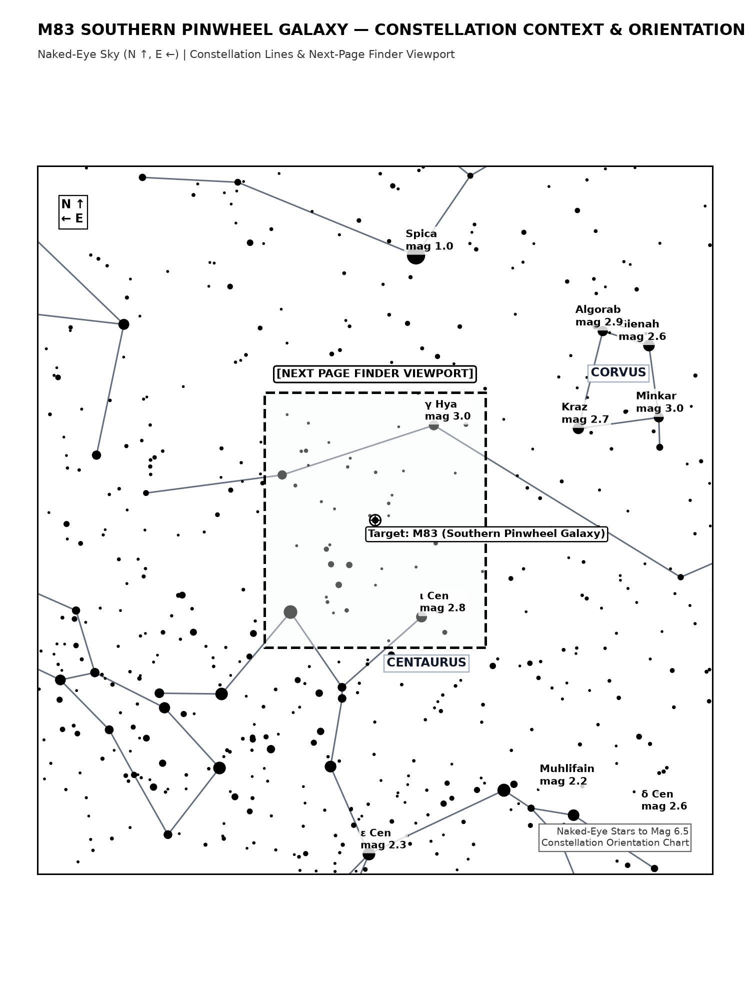

### 3. Wide-Field Star-Hopping Finder Chart
> [!IMPORTANT]
> **Viewport A** provides an upright naked-eye / optical finder orientation (N ↑, E ←) with stars down to visual magnitude 8.5. Standard concentric Telrad rings (0.5°, 2.0°, 4.0°) and 5.0° finder circle are centered directly on the target.

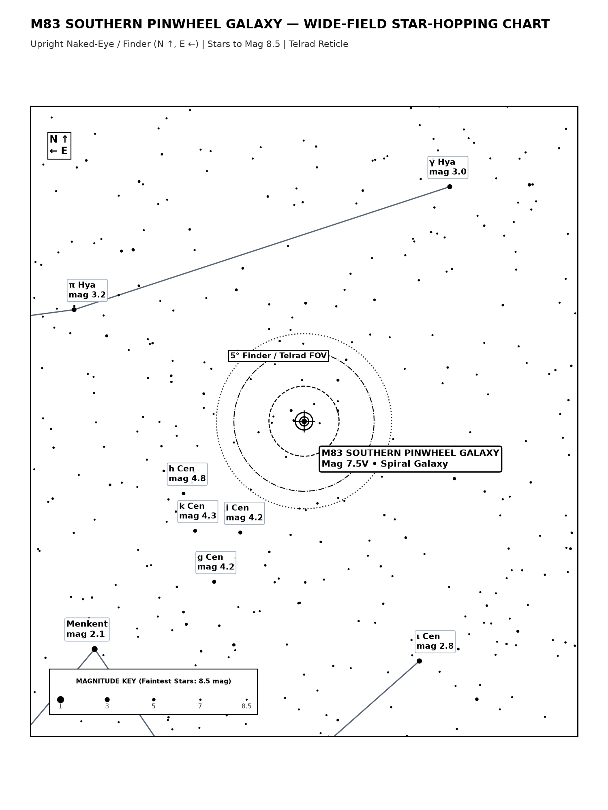

*([📄 Open Full High-Resolution Master A4 Finder Chart](shared/m83/chart_skywatcher-skyliner-200p.png))*

### 4. Observing Strategy & Step-by-Step Hop Instructions

- **Acquisition & Framing (20mm Super / 60×, 50' FOV)**:
  Ethereal oval glow with condensed galactic nucleus; framing the galaxy within the wide 50' field maximizes contrast against the sky.
- **High-Power Inspection & Detail (12.5mm / 96×, 31' FOV)**:
  12.5mm (96×) darkens the background sky, aiding detection of subtle core elongation, dust lanes, and halo extent with averted vision.

**Step-by-Step Star Hop Narrative**:
Locate constellation Hydra. Follow the guide stars on the Wide-Field Chart to RA 204.25°, Dec -29.87°; look for a soft hazy smudge.

---

## M84 (NGC 4374) — Virgo

[↑ Back to Catalog Index](#messier-catalog-index) • [← Previous: M83](#m83) • [Next: M85 →](#m85)

| Technical Parameter | Specification |
| :--- | :--- |
| **Designation** | M84 (NGC 4374) |
| **Constellation** | Virgo |
| **Classification** | Lenticular Galaxy (Galaxy) |
| **Visual Magnitude ($V$)** | 9.1 mag |
| **Apparent Dimensions** | 6.5' × 5.6' |
| **Estimated Distance** | ~18.4 million light-years |
| **Swanson Difficulty** | **Hard** (*NexStar User's Guide II*) |
| **Coordinates (J2000)** | RA **12h 25m 03.7s** • Dec **+12° 53' 13.1"** |
| **Recommended Eyepiece** | 12.5mm (96× magnification, 31' TFOV, 2.1mm exit pupil) |

### 1. Telescope Eyepiece Simulation & Technical Dossier
> [!NOTE]
> **Viewport B** depicts the pre-inverted 180° field view through the Newtonian reflector (12.5mm eyepiece / 96× magnification, 31' true field of view: South at top, West at left, N ↓, E →). **Viewport C** integrates target ephemeris and optical notes.

### 2. Constellation Context & Regional Orientation Chart
> [!TIP]
> **Viewport Context** presents a wide ~50°–65° naked-eye orientation field (stars down to visual magnitude 6.5) with official IAU constellation guide lines. The dashed bounding box marks the exact area covered by the wide-field star-hopping chart below.

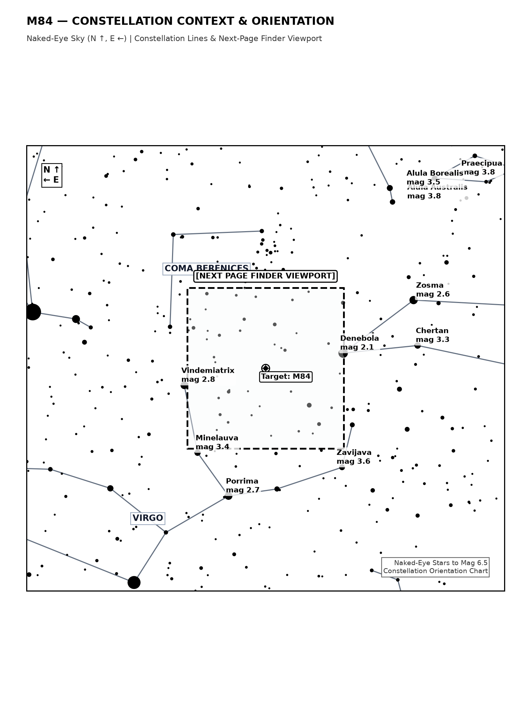

### 3. Wide-Field Star-Hopping Finder Chart
> [!IMPORTANT]
> **Viewport A** provides an upright naked-eye / optical finder orientation (N ↑, E ←) with stars down to visual magnitude 8.5. Standard concentric Telrad rings (0.5°, 2.0°, 4.0°) and 5.0° finder circle are centered directly on the target.

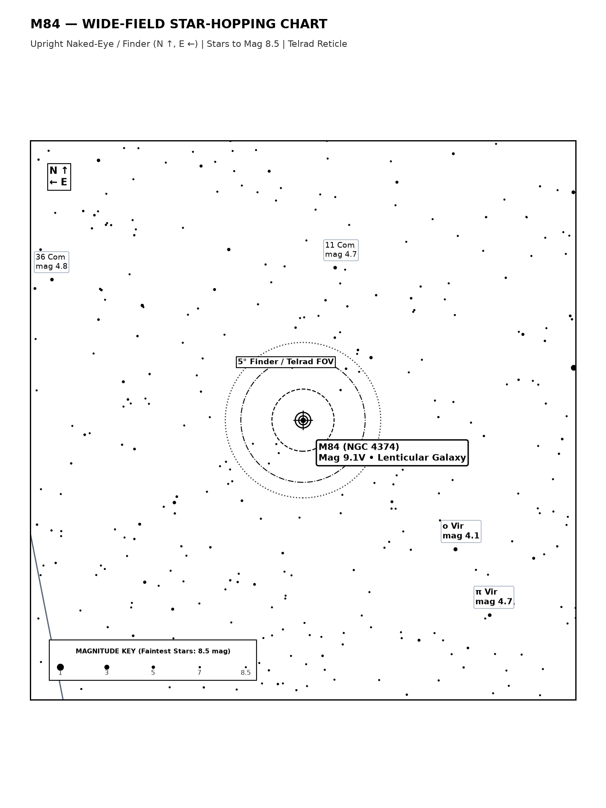

*([📄 Open Full High-Resolution Master A4 Finder Chart](shared/m84/chart_skywatcher-skyliner-200p.png))*

### 4. Observing Strategy & Step-by-Step Hop Instructions

- **Acquisition & Framing (20mm Super / 60×, 50' FOV)**:
  Ethereal oval glow with condensed galactic nucleus; framing the galaxy within the wide 50' field maximizes contrast against the sky.
- **High-Power Inspection & Detail (12.5mm / 96×, 31' FOV)**:
  12.5mm (96×) darkens the background sky, aiding detection of subtle core elongation, dust lanes, and halo extent with averted vision.

**Step-by-Step Star Hop Narrative**:
Locate constellation Virgo. Follow the guide stars on the Wide-Field Chart to RA 186.27°, Dec 12.89°; look for a soft hazy smudge.

---

## M85 (NGC 4382) — Coma Berenices

[↑ Back to Catalog Index](#messier-catalog-index) • [← Previous: M84](#m84) • [Next: M86 →](#m86)

| Technical Parameter | Specification |
| :--- | :--- |
| **Designation** | M85 (NGC 4382) |
| **Constellation** | Coma Berenices |
| **Classification** | Lenticular Galaxy (Galaxy) |
| **Visual Magnitude ($V$)** | 9.1 mag |
| **Apparent Dimensions** | 7.1' × 5.5' |
| **Estimated Distance** | ~18.5 million light-years |
| **Swanson Difficulty** | **Hard** (*NexStar User's Guide II*) |
| **Coordinates (J2000)** | RA **12h 25m 24.1s** • Dec **+18° 11' 27.9"** |
| **Recommended Eyepiece** | 12.5mm (96× magnification, 31' TFOV, 2.1mm exit pupil) |

### 1. Telescope Eyepiece Simulation & Technical Dossier
> [!NOTE]
> **Viewport B** depicts the pre-inverted 180° field view through the Newtonian reflector (12.5mm eyepiece / 96× magnification, 31' true field of view: South at top, West at left, N ↓, E →). **Viewport C** integrates target ephemeris and optical notes.

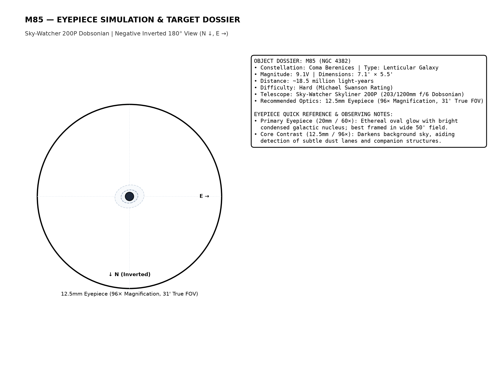

### 2. Constellation Context & Regional Orientation Chart
> [!TIP]
> **Viewport Context** presents a wide ~50°–65° naked-eye orientation field (stars down to visual magnitude 6.5) with official IAU constellation guide lines. The dashed bounding box marks the exact area covered by the wide-field star-hopping chart below.

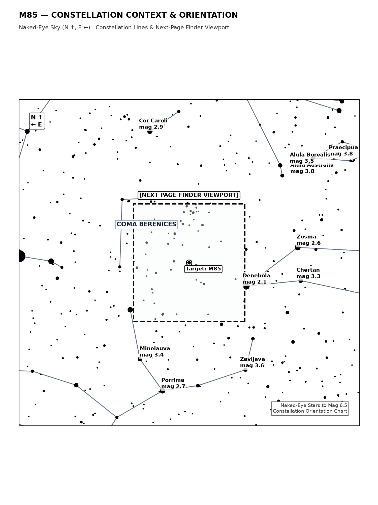

### 3. Wide-Field Star-Hopping Finder Chart
> [!IMPORTANT]
> **Viewport A** provides an upright naked-eye / optical finder orientation (N ↑, E ←) with stars down to visual magnitude 8.5. Standard concentric Telrad rings (0.5°, 2.0°, 4.0°) and 5.0° finder circle are centered directly on the target.

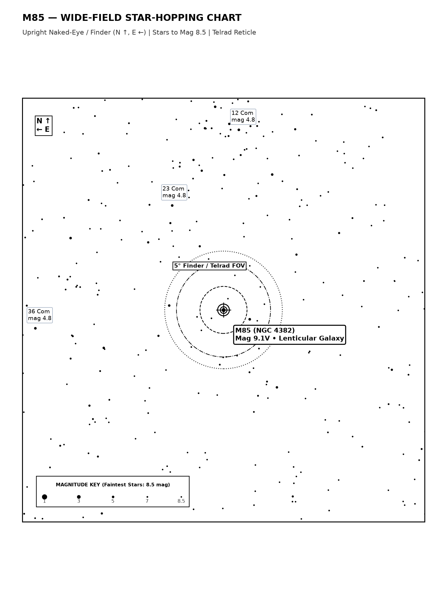

*([📄 Open Full High-Resolution Master A4 Finder Chart](shared/m85/chart_skywatcher-skyliner-200p.png))*

### 4. Observing Strategy & Step-by-Step Hop Instructions

- **Acquisition & Framing (20mm Super / 60×, 50' FOV)**:
  Ethereal oval glow with condensed galactic nucleus; framing the galaxy within the wide 50' field maximizes contrast against the sky.
- **High-Power Inspection & Detail (12.5mm / 96×, 31' FOV)**:
  12.5mm (96×) darkens the background sky, aiding detection of subtle core elongation, dust lanes, and halo extent with averted vision.

**Step-by-Step Star Hop Narrative**:
Locate constellation Coma Berenices. Follow the guide stars on the Wide-Field Chart to RA 186.35°, Dec 18.19°; look for a soft hazy smudge.

---

## M86 (NGC 4406) — Virgo

[↑ Back to Catalog Index](#messier-catalog-index) • [← Previous: M85](#m85) • [Next: M87 →](#m87)

| Technical Parameter | Specification |
| :--- | :--- |
| **Designation** | M86 (NGC 4406) |
| **Constellation** | Virgo |
| **Classification** | Lenticular Galaxy (Galaxy) |
| **Visual Magnitude ($V$)** | 8.9 mag |
| **Apparent Dimensions** | 8.9' × 5.8' |
| **Estimated Distance** | ~15.9 million light-years |
| **Swanson Difficulty** | **Hard** (*NexStar User's Guide II*) |
| **Coordinates (J2000)** | RA **12h 26m 11.8s** • Dec **+12° 56' 45.5"** |
| **Recommended Eyepiece** | 12.5mm (96× magnification, 31' TFOV, 2.1mm exit pupil) |

### 1. Telescope Eyepiece Simulation & Technical Dossier
> [!NOTE]
> **Viewport B** depicts the pre-inverted 180° field view through the Newtonian reflector (12.5mm eyepiece / 96× magnification, 31' true field of view: South at top, West at left, N ↓, E →). **Viewport C** integrates target ephemeris and optical notes.

### 2. Constellation Context & Regional Orientation Chart
> [!TIP]
> **Viewport Context** presents a wide ~50°–65° naked-eye orientation field (stars down to visual magnitude 6.5) with official IAU constellation guide lines. The dashed bounding box marks the exact area covered by the wide-field star-hopping chart below.

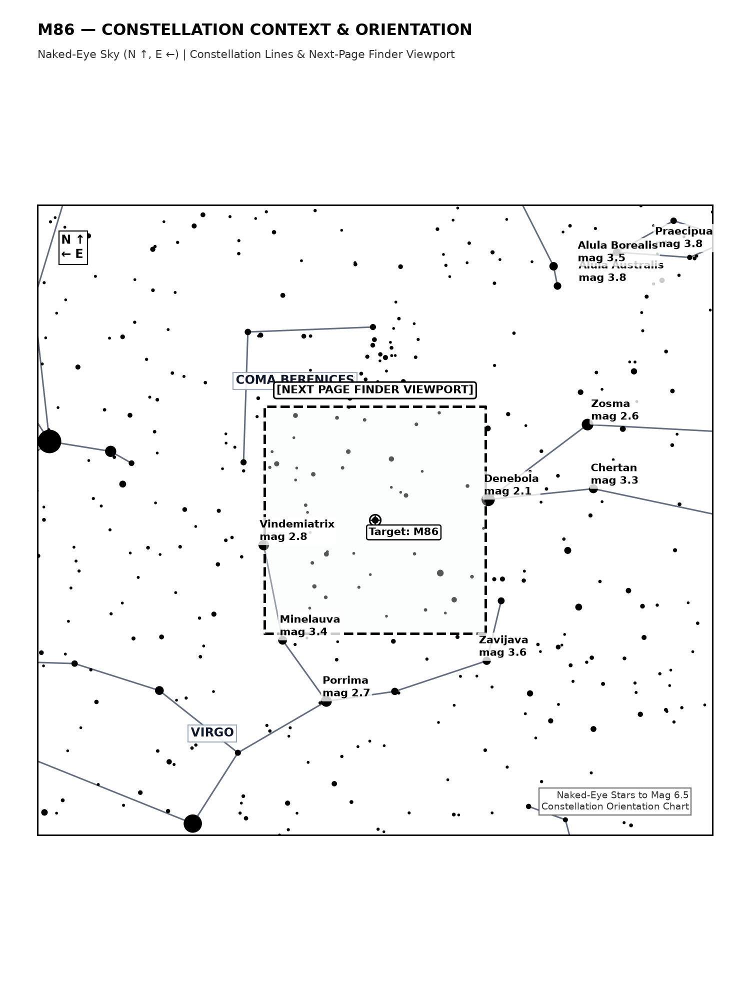

### 3. Wide-Field Star-Hopping Finder Chart
> [!IMPORTANT]
> **Viewport A** provides an upright naked-eye / optical finder orientation (N ↑, E ←) with stars down to visual magnitude 8.5. Standard concentric Telrad rings (0.5°, 2.0°, 4.0°) and 5.0° finder circle are centered directly on the target.

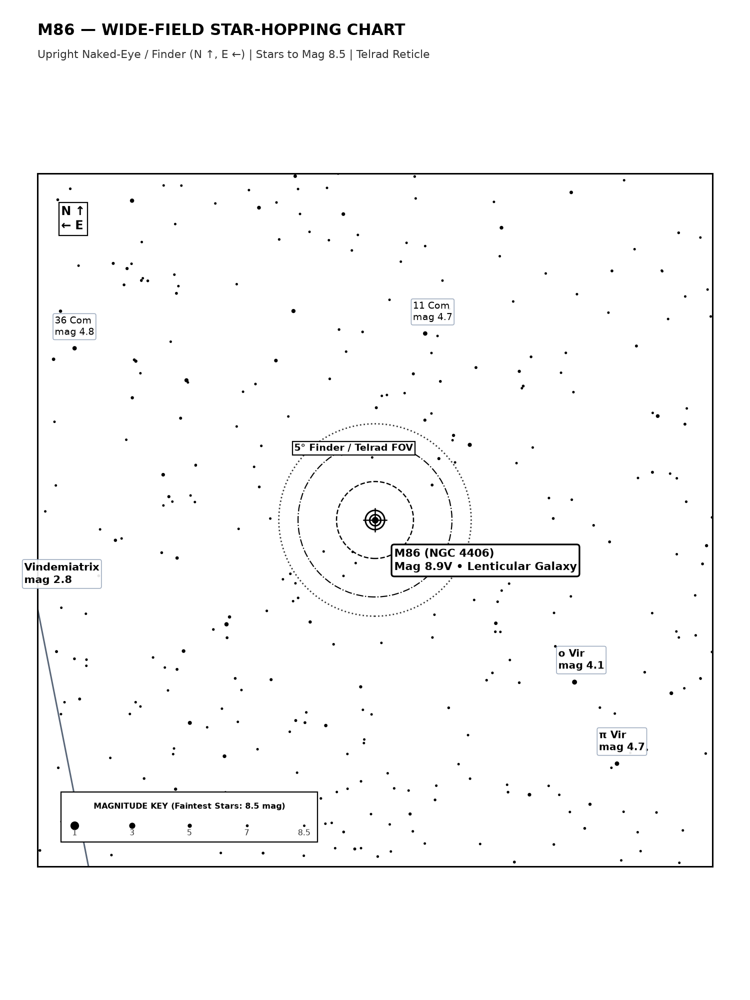

*([📄 Open Full High-Resolution Master A4 Finder Chart](shared/m86/chart_skywatcher-skyliner-200p.png))*

### 4. Observing Strategy & Step-by-Step Hop Instructions

- **Acquisition & Framing (20mm Super / 60×, 50' FOV)**:
  Ethereal oval glow with condensed galactic nucleus; framing the galaxy within the wide 50' field maximizes contrast against the sky.
- **High-Power Inspection & Detail (12.5mm / 96×, 31' FOV)**:
  12.5mm (96×) darkens the background sky, aiding detection of subtle core elongation, dust lanes, and halo extent with averted vision.

**Step-by-Step Star Hop Narrative**:
Locate constellation Virgo. Follow the guide stars on the Wide-Field Chart to RA 186.55°, Dec 12.95°; look for a soft hazy smudge.

---

## M87 Virgo A (NGC 4486) — Virgo

[↑ Back to Catalog Index](#messier-catalog-index) • [← Previous: M86](#m86) • [Next: M88 →](#m88)

| Technical Parameter | Specification |
| :--- | :--- |
| **Designation** | M87 (NGC 4486) |
| **Common Name** | **Virgo A** |
| **Constellation** | Virgo |
| **Classification** | Elliptical Galaxy (Galaxy) |
| **Visual Magnitude ($V$)** | 8.6 mag |
| **Apparent Dimensions** | 7.2' × 6.8' |
| **Estimated Distance** | ~18.4 million light-years |
| **Swanson Difficulty** | **Hard** (*NexStar User's Guide II*) |
| **Coordinates (J2000)** | RA **12h 30m 49.4s** • Dec **+12° 23' 28.0"** |
| **Recommended Eyepiece** | 12.5mm (96× magnification, 31' TFOV, 2.1mm exit pupil) |

### 1. Telescope Eyepiece Simulation & Technical Dossier
> [!NOTE]
> **Viewport B** depicts the pre-inverted 180° field view through the Newtonian reflector (12.5mm eyepiece / 96× magnification, 31' true field of view: South at top, West at left, N ↓, E →). **Viewport C** integrates target ephemeris and optical notes.

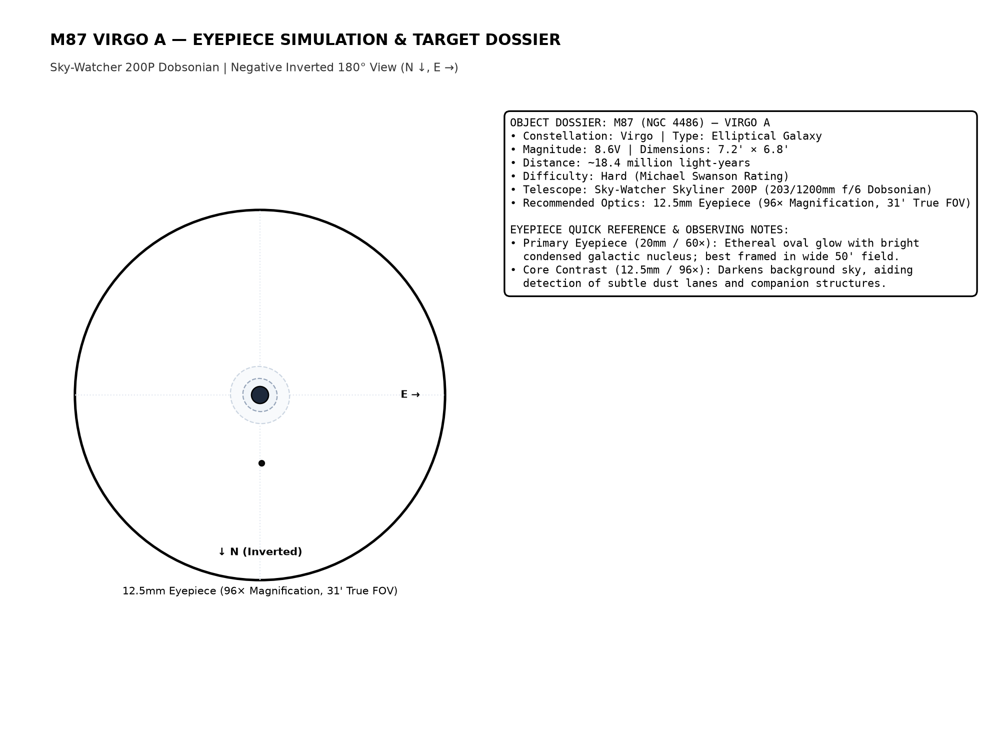

### 2. Constellation Context & Regional Orientation Chart
> [!TIP]
> **Viewport Context** presents a wide ~50°–65° naked-eye orientation field (stars down to visual magnitude 6.5) with official IAU constellation guide lines. The dashed bounding box marks the exact area covered by the wide-field star-hopping chart below.

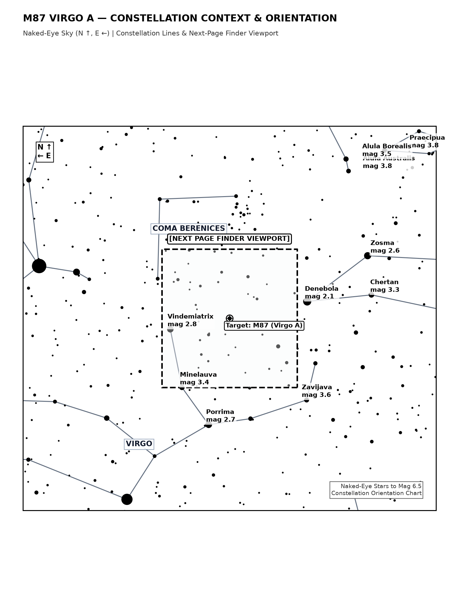

### 3. Wide-Field Star-Hopping Finder Chart
> [!IMPORTANT]
> **Viewport A** provides an upright naked-eye / optical finder orientation (N ↑, E ←) with stars down to visual magnitude 8.5. Standard concentric Telrad rings (0.5°, 2.0°, 4.0°) and 5.0° finder circle are centered directly on the target.

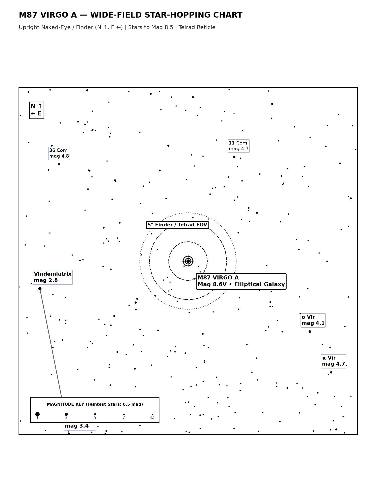

*([📄 Open Full High-Resolution Master A4 Finder Chart](shared/m87/chart_skywatcher-skyliner-200p.png))*

### 4. Observing Strategy & Step-by-Step Hop Instructions

- **Acquisition & Framing (20mm Super / 60×, 50' FOV)**:
  Ethereal oval glow with condensed galactic nucleus; framing the galaxy within the wide 50' field maximizes contrast against the sky.
- **High-Power Inspection & Detail (12.5mm / 96×, 31' FOV)**:
  12.5mm (96×) darkens the background sky, aiding detection of subtle core elongation, dust lanes, and halo extent with averted vision.

**Step-by-Step Star Hop Narrative**:
Locate constellation Virgo. Follow the guide stars on the Wide-Field Chart to RA 187.71°, Dec 12.39°; look for a soft hazy smudge.

---

## M88 (NGC 4501) — Coma Berenices

[↑ Back to Catalog Index](#messier-catalog-index) • [← Previous: M87](#m87) • [Next: M89 →](#m89)

| Technical Parameter | Specification |
| :--- | :--- |
| **Designation** | M88 (NGC 4501) |
| **Constellation** | Coma Berenices |
| **Classification** | Spiral Galaxy (Galaxy) |
| **Visual Magnitude ($V$)** | 9.6 mag |
| **Apparent Dimensions** | 6.9' × 3.7' |
| **Estimated Distance** | ~14.4 million light-years |
| **Swanson Difficulty** | **Hard** (*NexStar User's Guide II*) |
| **Coordinates (J2000)** | RA **12h 31m 59.2s** • Dec **+14° 25' 13.5"** |
| **Recommended Eyepiece** | 12.5mm (96× magnification, 31' TFOV, 2.1mm exit pupil) |

### 1. Telescope Eyepiece Simulation & Technical Dossier
> [!NOTE]
> **Viewport B** depicts the pre-inverted 180° field view through the Newtonian reflector (12.5mm eyepiece / 96× magnification, 31' true field of view: South at top, West at left, N ↓, E →). **Viewport C** integrates target ephemeris and optical notes.

### 2. Constellation Context & Regional Orientation Chart
> [!TIP]
> **Viewport Context** presents a wide ~50°–65° naked-eye orientation field (stars down to visual magnitude 6.5) with official IAU constellation guide lines. The dashed bounding box marks the exact area covered by the wide-field star-hopping chart below.

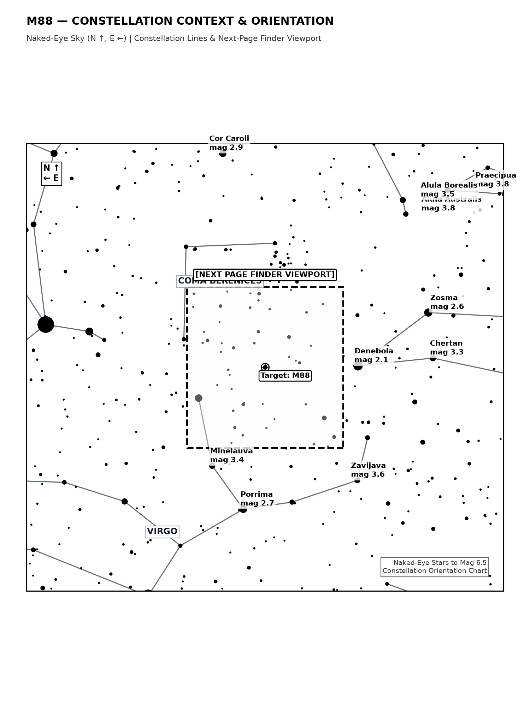

### 3. Wide-Field Star-Hopping Finder Chart
> [!IMPORTANT]
> **Viewport A** provides an upright naked-eye / optical finder orientation (N ↑, E ←) with stars down to visual magnitude 8.5. Standard concentric Telrad rings (0.5°, 2.0°, 4.0°) and 5.0° finder circle are centered directly on the target.

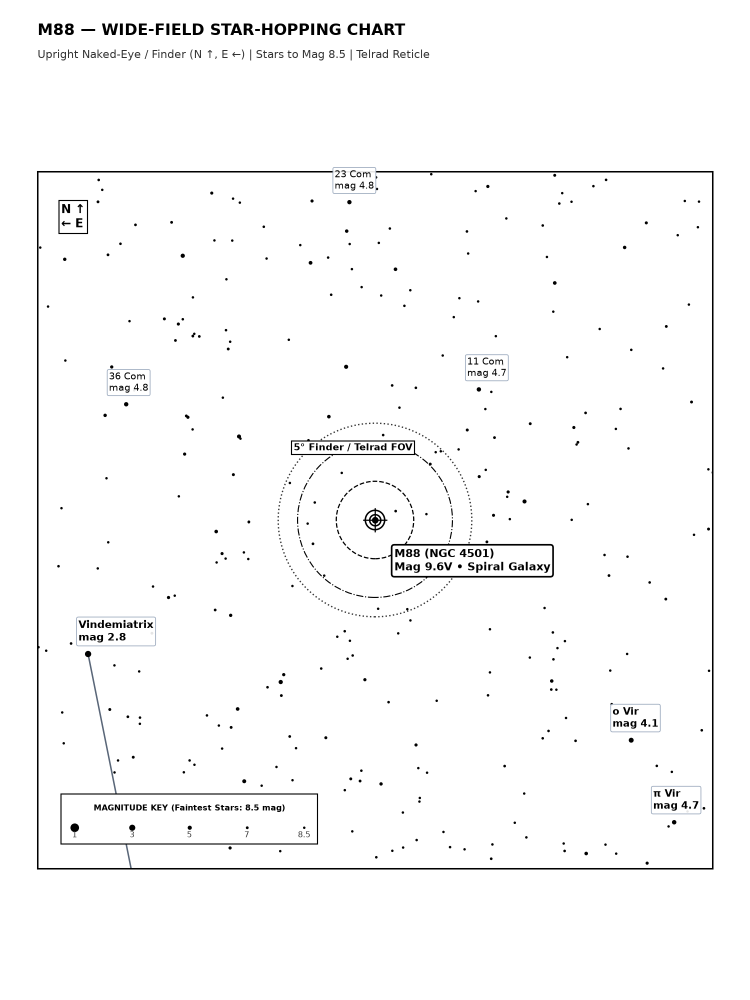

*([📄 Open Full High-Resolution Master A4 Finder Chart](shared/m88/chart_skywatcher-skyliner-200p.png))*

### 4. Observing Strategy & Step-by-Step Hop Instructions

- **Acquisition & Framing (20mm Super / 60×, 50' FOV)**:
  Ethereal oval glow with condensed galactic nucleus; framing the galaxy within the wide 50' field maximizes contrast against the sky.
- **High-Power Inspection & Detail (12.5mm / 96×, 31' FOV)**:
  12.5mm (96×) darkens the background sky, aiding detection of subtle core elongation, dust lanes, and halo extent with averted vision.

**Step-by-Step Star Hop Narrative**:
Locate constellation Coma Berenices. Follow the guide stars on the Wide-Field Chart to RA 188.00°, Dec 14.42°; look for a soft hazy smudge.

---

## M89 (NGC 4552) — Virgo

[↑ Back to Catalog Index](#messier-catalog-index) • [← Previous: M88](#m88) • [Next: M90 →](#m90)

| Technical Parameter | Specification |
| :--- | :--- |
| **Designation** | M89 (NGC 4552) |
| **Constellation** | Virgo |
| **Classification** | Elliptical Galaxy (Galaxy) |
| **Visual Magnitude ($V$)** | 9.8 mag |
| **Apparent Dimensions** | 5.1' × 4.7' |
| **Estimated Distance** | ~15.3 million light-years |
| **Swanson Difficulty** | **Hard** (*NexStar User's Guide II*) |
| **Coordinates (J2000)** | RA **12h 35m 39.9s** • Dec **+12° 33' 21.7"** |
| **Recommended Eyepiece** | 12.5mm (96× magnification, 31' TFOV, 2.1mm exit pupil) |

### 1. Telescope Eyepiece Simulation & Technical Dossier
> [!NOTE]
> **Viewport B** depicts the pre-inverted 180° field view through the Newtonian reflector (12.5mm eyepiece / 96× magnification, 31' true field of view: South at top, West at left, N ↓, E →). **Viewport C** integrates target ephemeris and optical notes.

### 2. Constellation Context & Regional Orientation Chart
> [!TIP]
> **Viewport Context** presents a wide ~50°–65° naked-eye orientation field (stars down to visual magnitude 6.5) with official IAU constellation guide lines. The dashed bounding box marks the exact area covered by the wide-field star-hopping chart below.

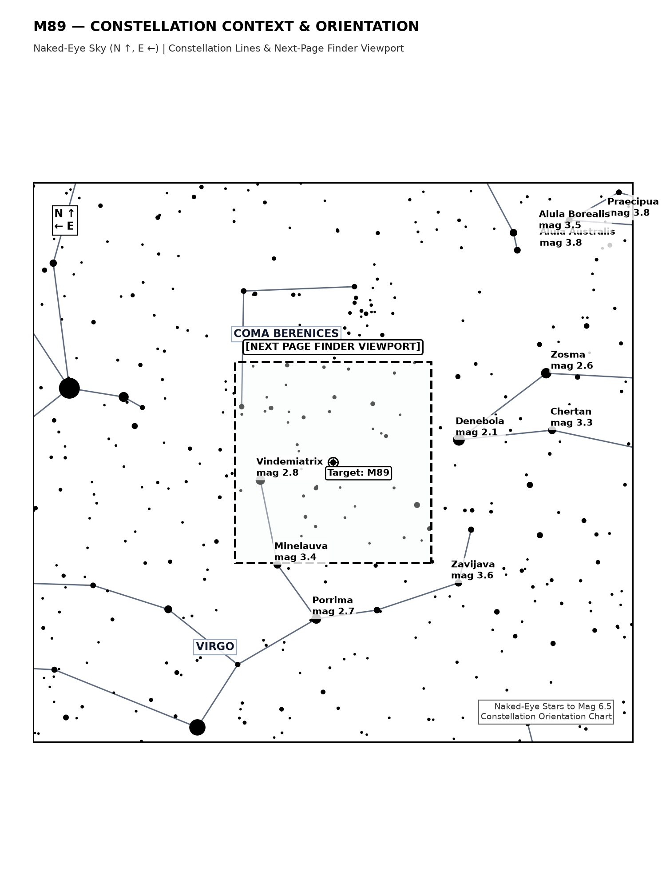

### 3. Wide-Field Star-Hopping Finder Chart
> [!IMPORTANT]
> **Viewport A** provides an upright naked-eye / optical finder orientation (N ↑, E ←) with stars down to visual magnitude 8.5. Standard concentric Telrad rings (0.5°, 2.0°, 4.0°) and 5.0° finder circle are centered directly on the target.

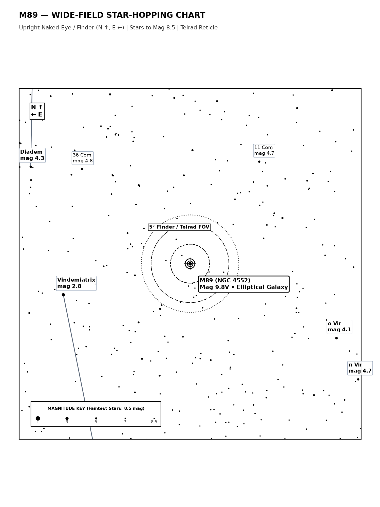

*([📄 Open Full High-Resolution Master A4 Finder Chart](shared/m89/chart_skywatcher-skyliner-200p.png))*

### 4. Observing Strategy & Step-by-Step Hop Instructions

- **Acquisition & Framing (20mm Super / 60×, 50' FOV)**:
  Ethereal oval glow with condensed galactic nucleus; framing the galaxy within the wide 50' field maximizes contrast against the sky.
- **High-Power Inspection & Detail (12.5mm / 96×, 31' FOV)**:
  12.5mm (96×) darkens the background sky, aiding detection of subtle core elongation, dust lanes, and halo extent with averted vision.

**Step-by-Step Star Hop Narrative**:
Locate constellation Virgo. Follow the guide stars on the Wide-Field Chart to RA 188.92°, Dec 12.56°; look for a soft hazy smudge.

---

## M90 (NGC 4569) — Virgo

[↑ Back to Catalog Index](#messier-catalog-index) • [← Previous: M89](#m89) • [Next: M91 →](#m91)

| Technical Parameter | Specification |
| :--- | :--- |
| **Designation** | M90 (NGC 4569) |
| **Constellation** | Virgo |
| **Classification** | Spiral Galaxy (Galaxy) |
| **Visual Magnitude ($V$)** | 9.5 mag |
| **Apparent Dimensions** | 9.5' × 4.4' |
| **Estimated Distance** | ~18.0 million light-years |
| **Swanson Difficulty** | **Hard** (*NexStar User's Guide II*) |
| **Coordinates (J2000)** | RA **12h 36m 49.8s** • Dec **+13° 09' 46.3"** |
| **Recommended Eyepiece** | 12.5mm (96× magnification, 31' TFOV, 2.1mm exit pupil) |

### 1. Telescope Eyepiece Simulation & Technical Dossier
> [!NOTE]
> **Viewport B** depicts the pre-inverted 180° field view through the Newtonian reflector (12.5mm eyepiece / 96× magnification, 31' true field of view: South at top, West at left, N ↓, E →). **Viewport C** integrates target ephemeris and optical notes.

### 2. Constellation Context & Regional Orientation Chart
> [!TIP]
> **Viewport Context** presents a wide ~50°–65° naked-eye orientation field (stars down to visual magnitude 6.5) with official IAU constellation guide lines. The dashed bounding box marks the exact area covered by the wide-field star-hopping chart below.

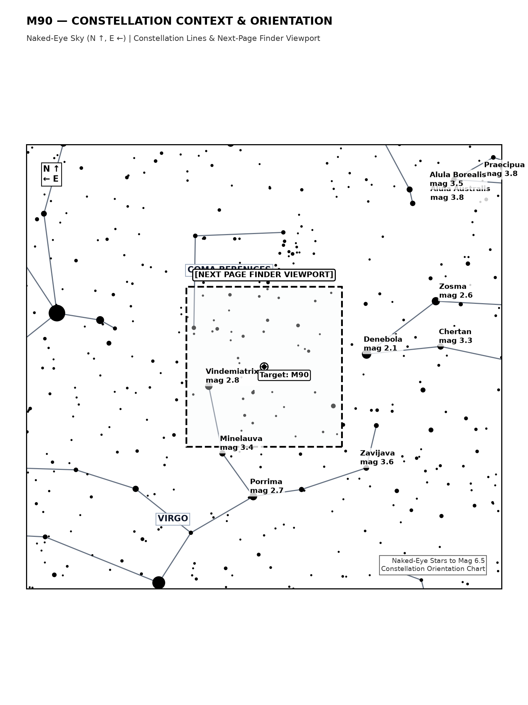

### 3. Wide-Field Star-Hopping Finder Chart
> [!IMPORTANT]
> **Viewport A** provides an upright naked-eye / optical finder orientation (N ↑, E ←) with stars down to visual magnitude 8.5. Standard concentric Telrad rings (0.5°, 2.0°, 4.0°) and 5.0° finder circle are centered directly on the target.

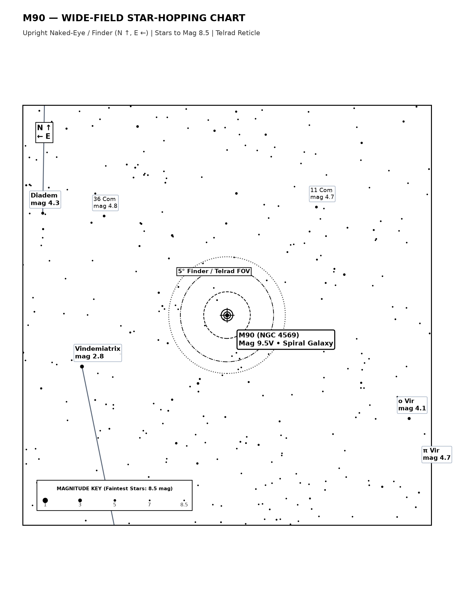

*([📄 Open Full High-Resolution Master A4 Finder Chart](shared/m90/chart_skywatcher-skyliner-200p.png))*

### 4. Observing Strategy & Step-by-Step Hop Instructions

- **Acquisition & Framing (20mm Super / 60×, 50' FOV)**:
  Ethereal oval glow with condensed galactic nucleus; framing the galaxy within the wide 50' field maximizes contrast against the sky.
- **High-Power Inspection & Detail (12.5mm / 96×, 31' FOV)**:
  12.5mm (96×) darkens the background sky, aiding detection of subtle core elongation, dust lanes, and halo extent with averted vision.

**Step-by-Step Star Hop Narrative**:
Locate constellation Virgo. Follow the guide stars on the Wide-Field Chart to RA 189.21°, Dec 13.16°; look for a soft hazy smudge.

---

## M91 (NGC 4548) — Coma Berenices

[↑ Back to Catalog Index](#messier-catalog-index) • [← Previous: M90](#m90) • [Next: M92 →](#m92)

| Technical Parameter | Specification |
| :--- | :--- |
| **Designation** | M91 (NGC 4548) |
| **Constellation** | Coma Berenices |
| **Classification** | Spiral Galaxy (Galaxy) |
| **Visual Magnitude ($V$)** | 10.2 mag |
| **Apparent Dimensions** | 5.4' × 4.3' |
| **Estimated Distance** | ~19.0 million light-years |
| **Swanson Difficulty** | **Hard** (*NexStar User's Guide II*) |
| **Coordinates (J2000)** | RA **12h 35m 26.4s** • Dec **+14° 29' 46.8"** |
| **Recommended Eyepiece** | 12.5mm (96× magnification, 31' TFOV, 2.1mm exit pupil) |

### 1. Telescope Eyepiece Simulation & Technical Dossier
> [!NOTE]
> **Viewport B** depicts the pre-inverted 180° field view through the Newtonian reflector (12.5mm eyepiece / 96× magnification, 31' true field of view: South at top, West at left, N ↓, E →). **Viewport C** integrates target ephemeris and optical notes.

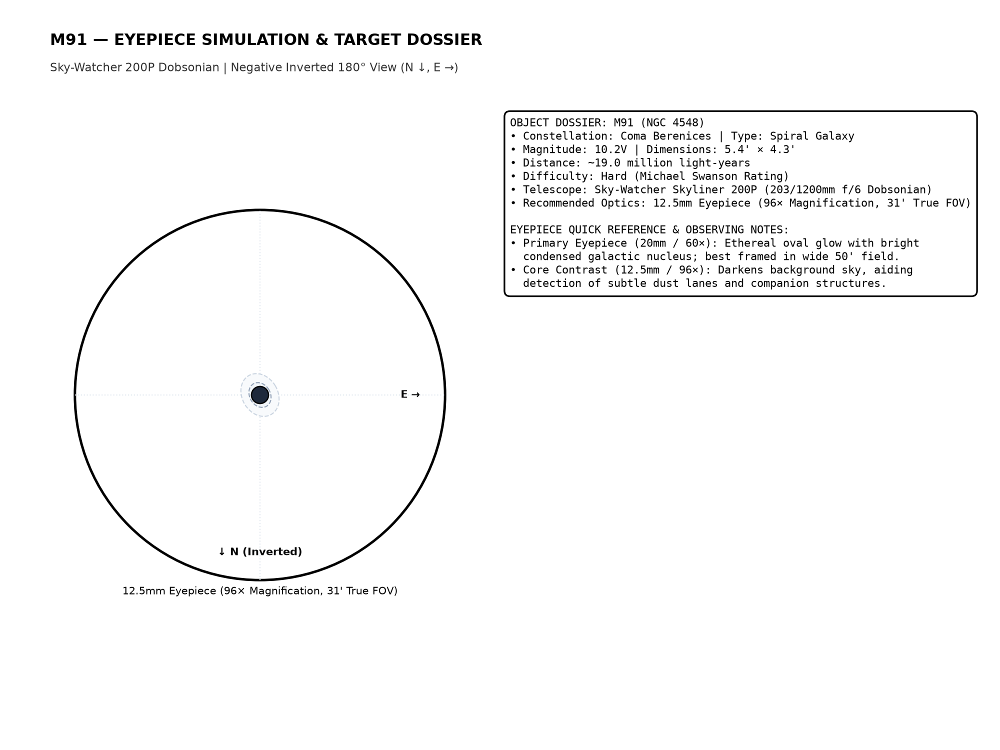

### 2. Constellation Context & Regional Orientation Chart
> [!TIP]
> **Viewport Context** presents a wide ~50°–65° naked-eye orientation field (stars down to visual magnitude 6.5) with official IAU constellation guide lines. The dashed bounding box marks the exact area covered by the wide-field star-hopping chart below.

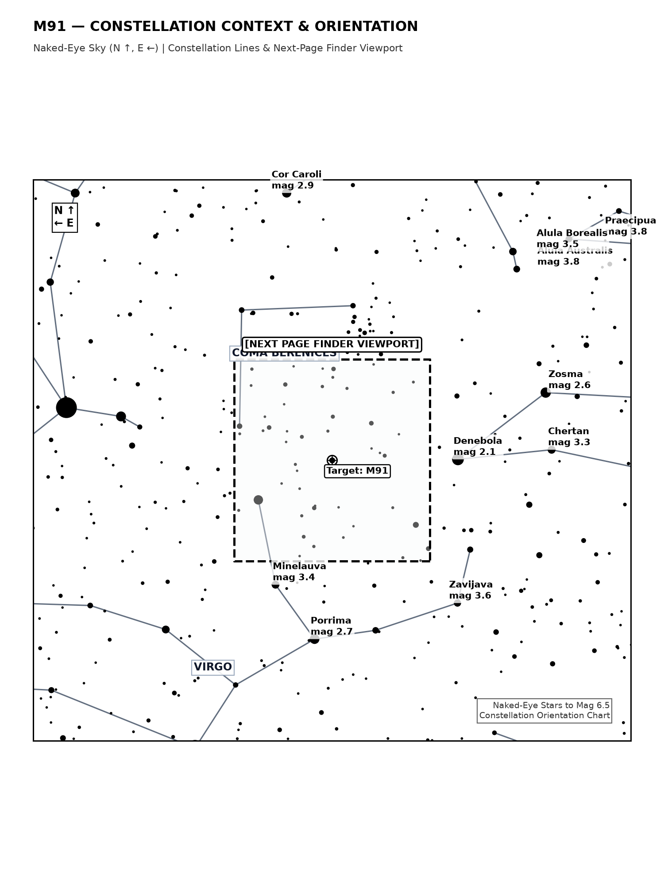

### 3. Wide-Field Star-Hopping Finder Chart
> [!IMPORTANT]
> **Viewport A** provides an upright naked-eye / optical finder orientation (N ↑, E ←) with stars down to visual magnitude 8.5. Standard concentric Telrad rings (0.5°, 2.0°, 4.0°) and 5.0° finder circle are centered directly on the target.

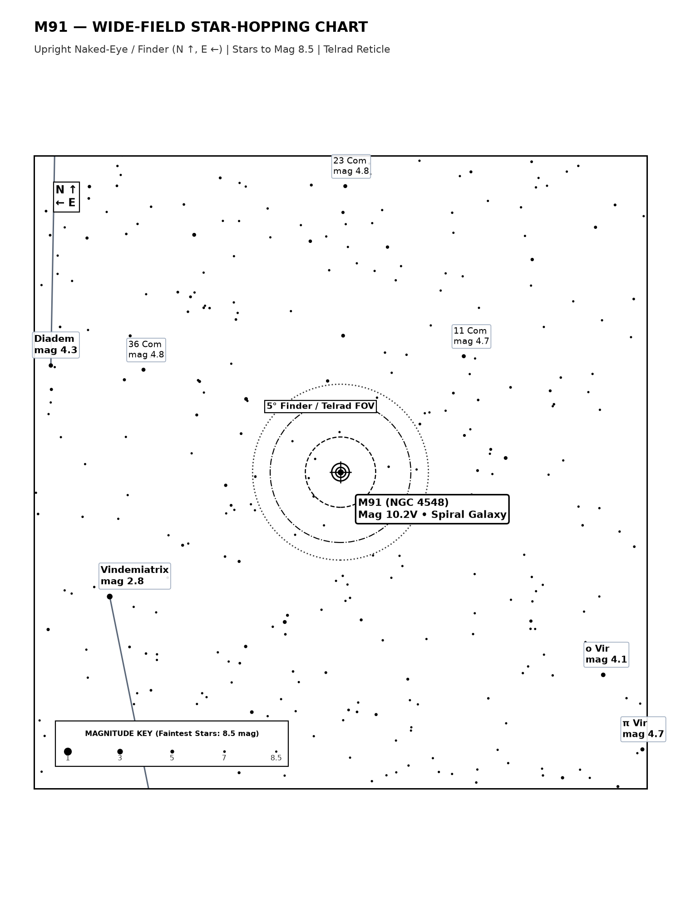

*([📄 Open Full High-Resolution Master A4 Finder Chart](shared/m91/chart_skywatcher-skyliner-200p.png))*

### 4. Observing Strategy & Step-by-Step Hop Instructions

- **Acquisition & Framing (20mm Super / 60×, 50' FOV)**:
  Ethereal oval glow with condensed galactic nucleus; framing the galaxy within the wide 50' field maximizes contrast against the sky.
- **High-Power Inspection & Detail (12.5mm / 96×, 31' FOV)**:
  12.5mm (96×) darkens the background sky, aiding detection of subtle core elongation, dust lanes, and halo extent with averted vision.

**Step-by-Step Star Hop Narrative**:
Locate constellation Coma Berenices. Follow the guide stars on the Wide-Field Chart to RA 188.86°, Dec 14.50°; look for a soft hazy smudge.

---

## M92 (NGC 6341) — Hercules

[↑ Back to Catalog Index](#messier-catalog-index) • [← Previous: M91](#m91) • [Next: M93 →](#m93)

| Technical Parameter | Specification |
| :--- | :--- |
| **Designation** | M92 (NGC 6341) |
| **Constellation** | Hercules |
| **Classification** | Globular Cluster (GC) |
| **Visual Magnitude ($V$)** | 6.5 mag |
| **Apparent Dimensions** | 14.0' × 14.0' |
| **Estimated Distance** | ~26,748 light-years |
| **Swanson Difficulty** | **Easy** (*NexStar User's Guide II*) |
| **Coordinates (J2000)** | RA **17h 17m 07.4s** • Dec **+43° 08' 09.4"** |
| **Recommended Eyepiece** | 12.5mm (96× magnification, 31' TFOV, 2.1mm exit pupil) |

### 1. Telescope Eyepiece Simulation & Technical Dossier
> [!NOTE]
> **Viewport B** depicts the pre-inverted 180° field view through the Newtonian reflector (12.5mm eyepiece / 96× magnification, 31' true field of view: South at top, West at left, N ↓, E →). **Viewport C** integrates target ephemeris and optical notes.

### 2. Constellation Context & Regional Orientation Chart
> [!TIP]
> **Viewport Context** presents a wide ~50°–65° naked-eye orientation field (stars down to visual magnitude 6.5) with official IAU constellation guide lines. The dashed bounding box marks the exact area covered by the wide-field star-hopping chart below.

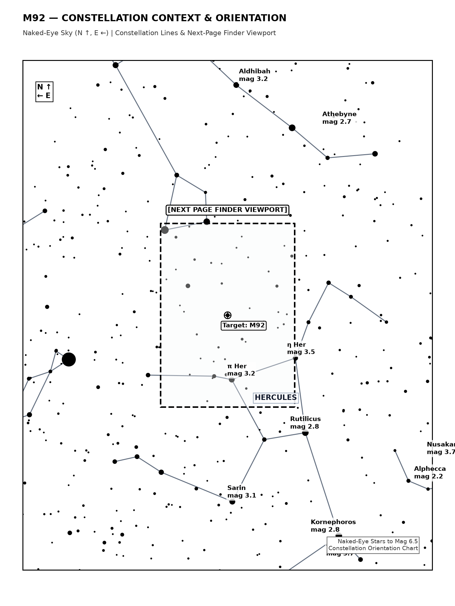

### 3. Wide-Field Star-Hopping Finder Chart
> [!IMPORTANT]
> **Viewport A** provides an upright naked-eye / optical finder orientation (N ↑, E ←) with stars down to visual magnitude 8.5. Standard concentric Telrad rings (0.5°, 2.0°, 4.0°) and 5.0° finder circle are centered directly on the target.

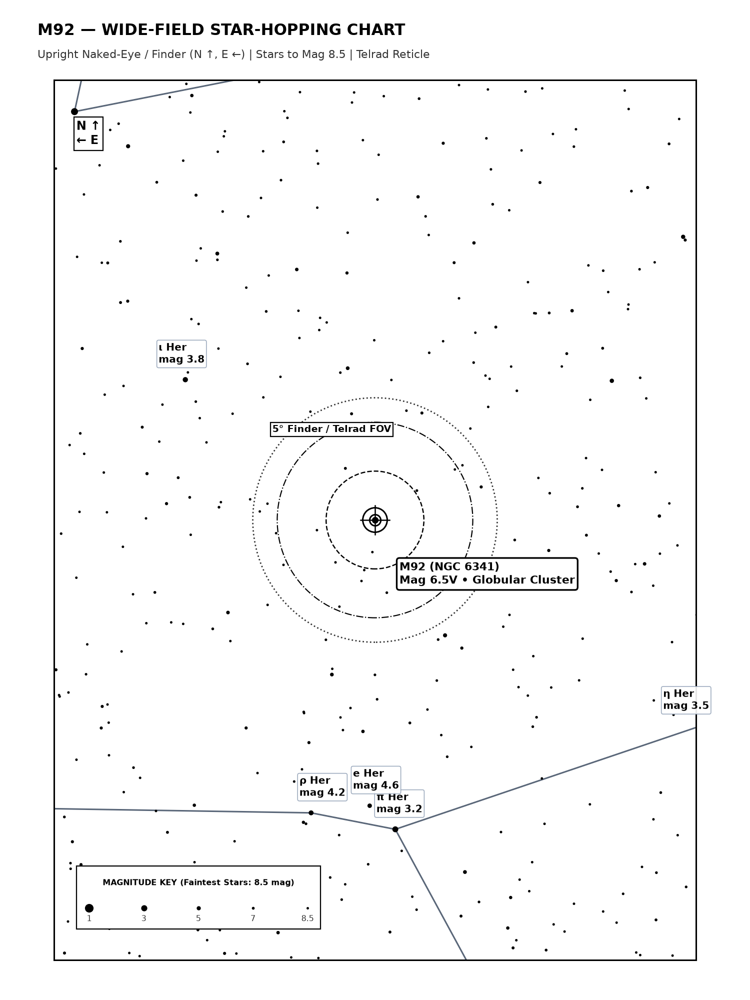

*([📄 Open Full High-Resolution Master A4 Finder Chart](shared/m92/chart_skywatcher-skyliner-200p.png))*

### 4. Observing Strategy & Step-by-Step Hop Instructions

- **Acquisition & Framing (20mm Super / 60×, 50' FOV)**:
  Noticeable circular misty ball with bright concentrated core floating against a dark starry backdrop in Hercules.
- **High-Power Inspection & Detail (12.5mm / 96×, 31' FOV)**:
  12.5mm (96×) resolves the outer edges into sharp, glittering diamond star points; averted vision reveals rich granularity across the core.

**Step-by-Step Star Hop Narrative**:
Locate anchor constellation Hercules on the Context Chart. Slew Telrad reticle to RA 259.28°, Dec 43.14° and center the fuzzy ball in the 20mm finder eyepiece.

---

## M93 (NGC 2447) — Puppis

[↑ Back to Catalog Index](#messier-catalog-index) • [← Previous: M92](#m92) • [Next: M94 →](#m94)

| Technical Parameter | Specification |
| :--- | :--- |
| **Designation** | M93 (NGC 2447) |
| **Constellation** | Puppis |
| **Classification** | Open Cluster (OC) |
| **Visual Magnitude ($V$)** | 6.2 mag |
| **Apparent Dimensions** | 10.0' × 10.0' |
| **Estimated Distance** | ~3,588 light-years |
| **Swanson Difficulty** | **Medium** (*NexStar User's Guide II*) |
| **Coordinates (J2000)** | RA **7h 44m 30.0s** • Dec **-23° 51' 25.2"** |
| **Recommended Eyepiece** | 12.5mm (96× magnification, 31' TFOV, 2.1mm exit pupil) |

### 1. Telescope Eyepiece Simulation & Technical Dossier
> [!NOTE]
> **Viewport B** depicts the pre-inverted 180° field view through the Newtonian reflector (12.5mm eyepiece / 96× magnification, 31' true field of view: South at top, West at left, N ↓, E →). **Viewport C** integrates target ephemeris and optical notes.

### 2. Constellation Context & Regional Orientation Chart
> [!TIP]
> **Viewport Context** presents a wide ~50°–65° naked-eye orientation field (stars down to visual magnitude 6.5) with official IAU constellation guide lines. The dashed bounding box marks the exact area covered by the wide-field star-hopping chart below.

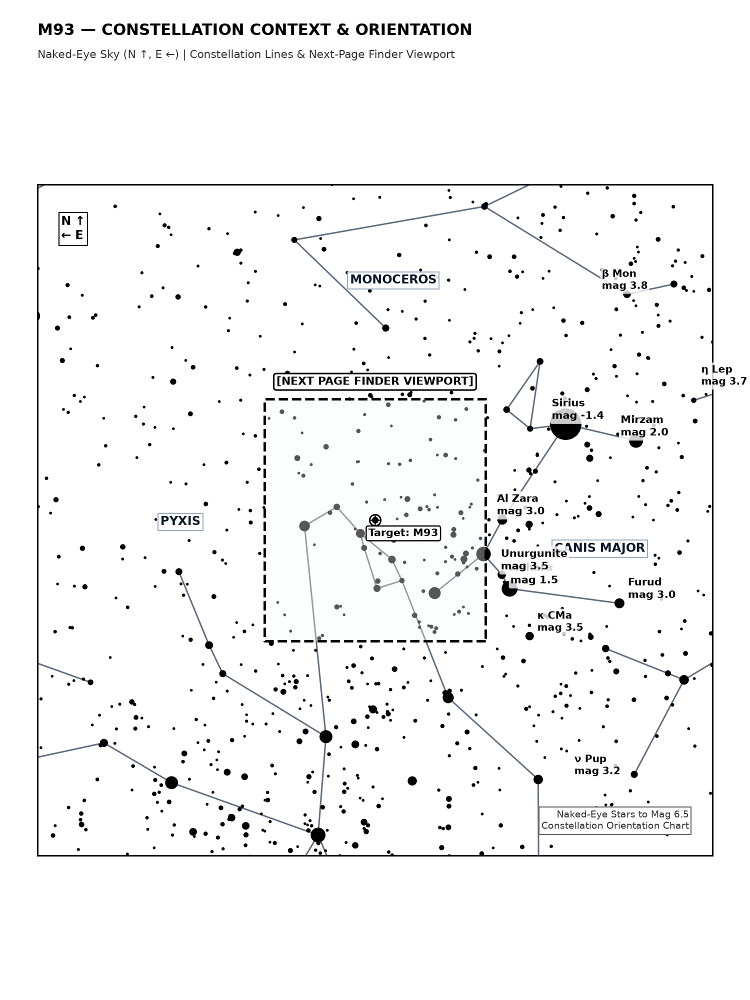

### 3. Wide-Field Star-Hopping Finder Chart
> [!IMPORTANT]
> **Viewport A** provides an upright naked-eye / optical finder orientation (N ↑, E ←) with stars down to visual magnitude 8.5. Standard concentric Telrad rings (0.5°, 2.0°, 4.0°) and 5.0° finder circle are centered directly on the target.

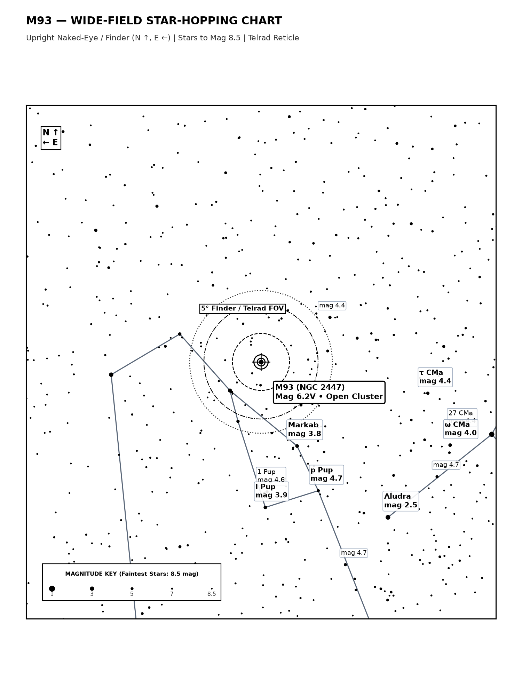

*([📄 Open Full High-Resolution Master A4 Finder Chart](shared/m93/chart_skywatcher-skyliner-200p.png))*

### 4. Observing Strategy & Step-by-Step Hop Instructions

- **Acquisition & Framing (20mm Super / 60×, 50' FOV)**:
  Gorgeous scattered star cluster filling the field with diverse stellar magnitudes and pleasing geometric groupings.
- **High-Power Inspection & Detail (12.5mm / 96×, 31' FOV)**:
  12.5mm (96×) deepens sky contrast and splits intimate stellar pairs and chains within the rich central grouping.

**Step-by-Step Star Hop Narrative**:
Locate Puppis via Context Chart. Align Telrad reticle to target coordinates (RA 116.12°, Dec -23.86°); cluster stars emerge immediately in the finder.

---

## M94 (NGC 4736) — Canes Venatici

[↑ Back to Catalog Index](#messier-catalog-index) • [← Previous: M93](#m93) • [Next: M95 →](#m95)

| Technical Parameter | Specification |
| :--- | :--- |
| **Designation** | M94 (NGC 4736) |
| **Constellation** | Canes Venatici |
| **Classification** | Spiral Galaxy (Galaxy) |
| **Visual Magnitude ($V$)** | 8.2 mag |
| **Apparent Dimensions** | 11.2' × 9.1' |
| **Estimated Distance** | ~4.9 million light-years |
| **Swanson Difficulty** | **Medium** (*NexStar User's Guide II*) |
| **Coordinates (J2000)** | RA **12h 50m 53.1s** • Dec **+41° 07' 12.5"** |
| **Recommended Eyepiece** | 12.5mm (96× magnification, 31' TFOV, 2.1mm exit pupil) |

### 1. Telescope Eyepiece Simulation & Technical Dossier
> [!NOTE]
> **Viewport B** depicts the pre-inverted 180° field view through the Newtonian reflector (12.5mm eyepiece / 96× magnification, 31' true field of view: South at top, West at left, N ↓, E →). **Viewport C** integrates target ephemeris and optical notes.

### 2. Constellation Context & Regional Orientation Chart
> [!TIP]
> **Viewport Context** presents a wide ~50°–65° naked-eye orientation field (stars down to visual magnitude 6.5) with official IAU constellation guide lines. The dashed bounding box marks the exact area covered by the wide-field star-hopping chart below.

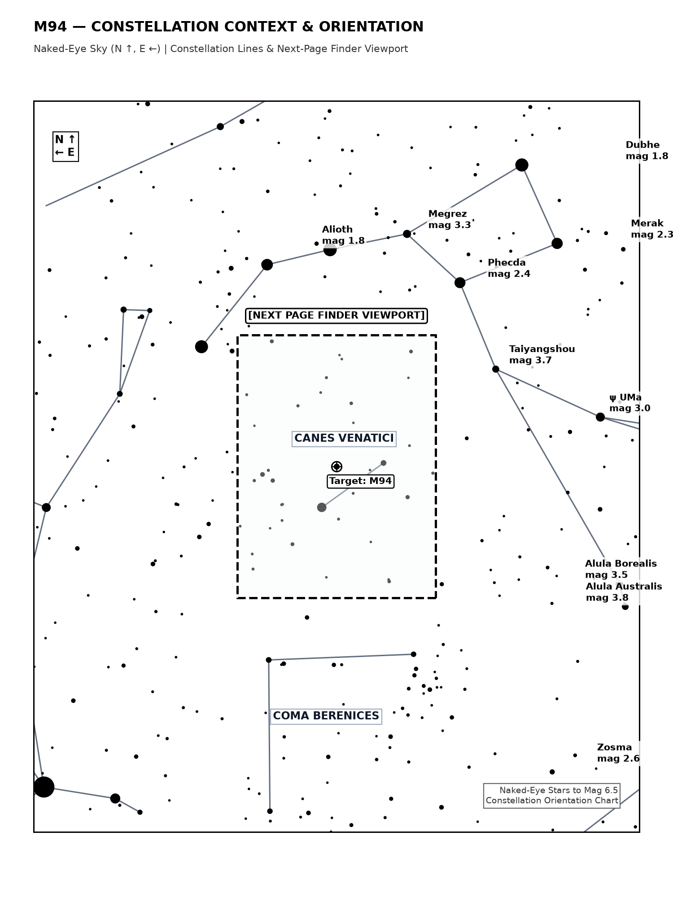

### 3. Wide-Field Star-Hopping Finder Chart
> [!IMPORTANT]
> **Viewport A** provides an upright naked-eye / optical finder orientation (N ↑, E ←) with stars down to visual magnitude 8.5. Standard concentric Telrad rings (0.5°, 2.0°, 4.0°) and 5.0° finder circle are centered directly on the target.

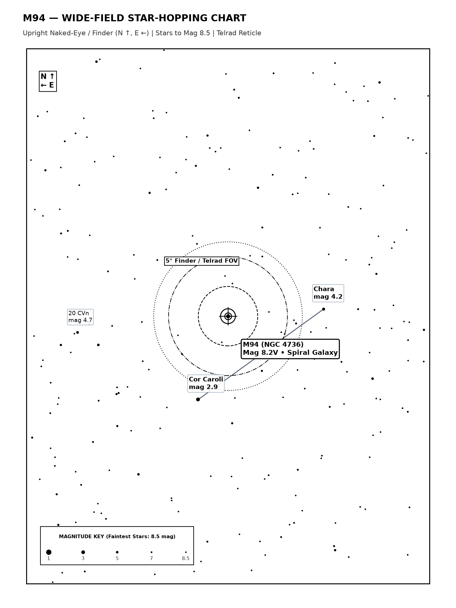

*([📄 Open Full High-Resolution Master A4 Finder Chart](shared/m94/chart_skywatcher-skyliner-200p.png))*

### 4. Observing Strategy & Step-by-Step Hop Instructions

- **Acquisition & Framing (20mm Super / 60×, 50' FOV)**:
  Ethereal oval glow with condensed galactic nucleus; framing the galaxy within the wide 50' field maximizes contrast against the sky.
- **High-Power Inspection & Detail (12.5mm / 96×, 31' FOV)**:
  12.5mm (96×) darkens the background sky, aiding detection of subtle core elongation, dust lanes, and halo extent with averted vision.

**Step-by-Step Star Hop Narrative**:
Locate constellation Canes Venatici. Follow the guide stars on the Wide-Field Chart to RA 192.72°, Dec 41.12°; look for a soft hazy smudge.

---

## M95 (NGC 3351) — Leo

[↑ Back to Catalog Index](#messier-catalog-index) • [← Previous: M94](#m94) • [Next: M96 →](#m96)

| Technical Parameter | Specification |
| :--- | :--- |
| **Designation** | M95 (NGC 3351) |
| **Constellation** | Leo |
| **Classification** | Spiral Galaxy (Galaxy) |
| **Visual Magnitude ($V$)** | 9.7 mag |
| **Apparent Dimensions** | 3.1' × 2.9' |
| **Estimated Distance** | ~10.0 million light-years |
| **Swanson Difficulty** | **Hard** (*NexStar User's Guide II*) |
| **Coordinates (J2000)** | RA **10h 43m 57.7s** • Dec **+11° 42' 13.0"** |
| **Recommended Eyepiece** | 12.5mm (96× magnification, 31' TFOV, 2.1mm exit pupil) |

### 1. Telescope Eyepiece Simulation & Technical Dossier
> [!NOTE]
> **Viewport B** depicts the pre-inverted 180° field view through the Newtonian reflector (12.5mm eyepiece / 96× magnification, 31' true field of view: South at top, West at left, N ↓, E →). **Viewport C** integrates target ephemeris and optical notes.

### 2. Constellation Context & Regional Orientation Chart
> [!TIP]
> **Viewport Context** presents a wide ~50°–65° naked-eye orientation field (stars down to visual magnitude 6.5) with official IAU constellation guide lines. The dashed bounding box marks the exact area covered by the wide-field star-hopping chart below.

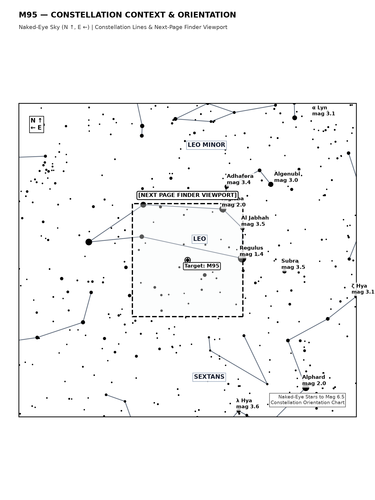

### 3. Wide-Field Star-Hopping Finder Chart
> [!IMPORTANT]
> **Viewport A** provides an upright naked-eye / optical finder orientation (N ↑, E ←) with stars down to visual magnitude 8.5. Standard concentric Telrad rings (0.5°, 2.0°, 4.0°) and 5.0° finder circle are centered directly on the target.

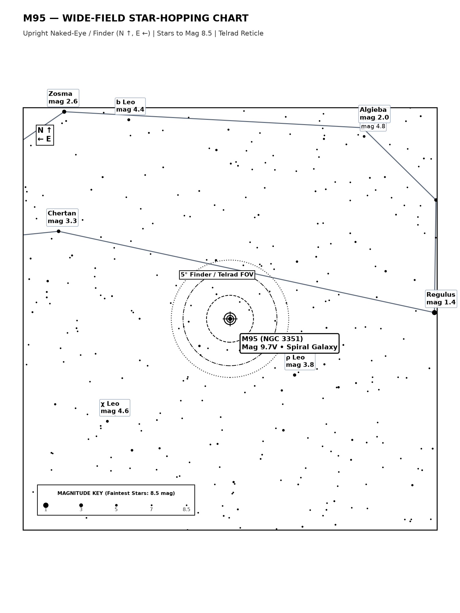

*([📄 Open Full High-Resolution Master A4 Finder Chart](shared/m95/chart_skywatcher-skyliner-200p.png))*

### 4. Observing Strategy & Step-by-Step Hop Instructions

- **Acquisition & Framing (20mm Super / 60×, 50' FOV)**:
  Ethereal oval glow with condensed galactic nucleus; framing the galaxy within the wide 50' field maximizes contrast against the sky.
- **High-Power Inspection & Detail (12.5mm / 96×, 31' FOV)**:
  12.5mm (96×) darkens the background sky, aiding detection of subtle core elongation, dust lanes, and halo extent with averted vision.

**Step-by-Step Star Hop Narrative**:
Locate constellation Leo. Follow the guide stars on the Wide-Field Chart to RA 160.99°, Dec 11.70°; look for a soft hazy smudge.

---

## M96 (NGC 3368) — Leo

[↑ Back to Catalog Index](#messier-catalog-index) • [← Previous: M95](#m95) • [Next: M97 →](#m97)

| Technical Parameter | Specification |
| :--- | :--- |
| **Designation** | M96 (NGC 3368) |
| **Constellation** | Leo |
| **Classification** | Spiral Galaxy (Galaxy) |
| **Visual Magnitude ($V$)** | 9.3 mag |
| **Apparent Dimensions** | 7.6' × 5.2' |
| **Estimated Distance** | ~9.6 million light-years |
| **Swanson Difficulty** | **Hard** (*NexStar User's Guide II*) |
| **Coordinates (J2000)** | RA **10h 46m 45.7s** • Dec **+11° 49' 11.8"** |
| **Recommended Eyepiece** | 12.5mm (96× magnification, 31' TFOV, 2.1mm exit pupil) |

### 1. Telescope Eyepiece Simulation & Technical Dossier
> [!NOTE]
> **Viewport B** depicts the pre-inverted 180° field view through the Newtonian reflector (12.5mm eyepiece / 96× magnification, 31' true field of view: South at top, West at left, N ↓, E →). **Viewport C** integrates target ephemeris and optical notes.

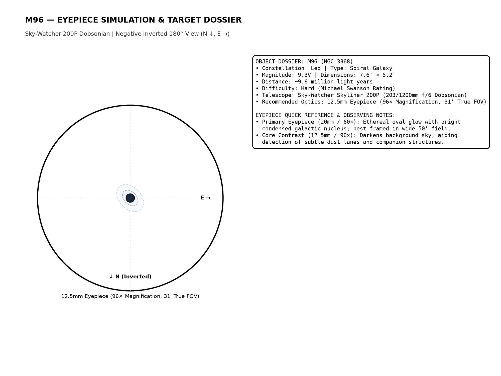

### 2. Constellation Context & Regional Orientation Chart
> [!TIP]
> **Viewport Context** presents a wide ~50°–65° naked-eye orientation field (stars down to visual magnitude 6.5) with official IAU constellation guide lines. The dashed bounding box marks the exact area covered by the wide-field star-hopping chart below.

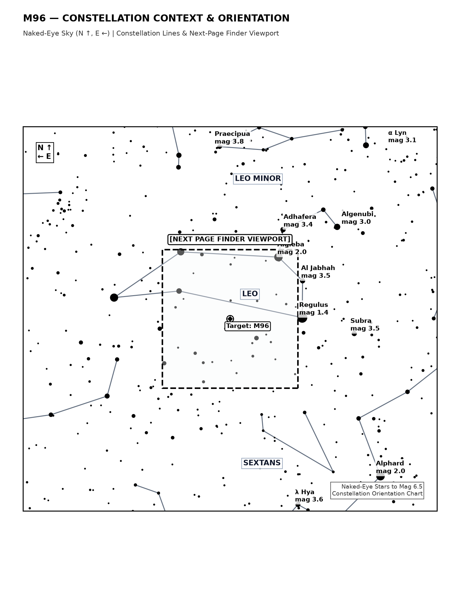

### 3. Wide-Field Star-Hopping Finder Chart
> [!IMPORTANT]
> **Viewport A** provides an upright naked-eye / optical finder orientation (N ↑, E ←) with stars down to visual magnitude 8.5. Standard concentric Telrad rings (0.5°, 2.0°, 4.0°) and 5.0° finder circle are centered directly on the target.

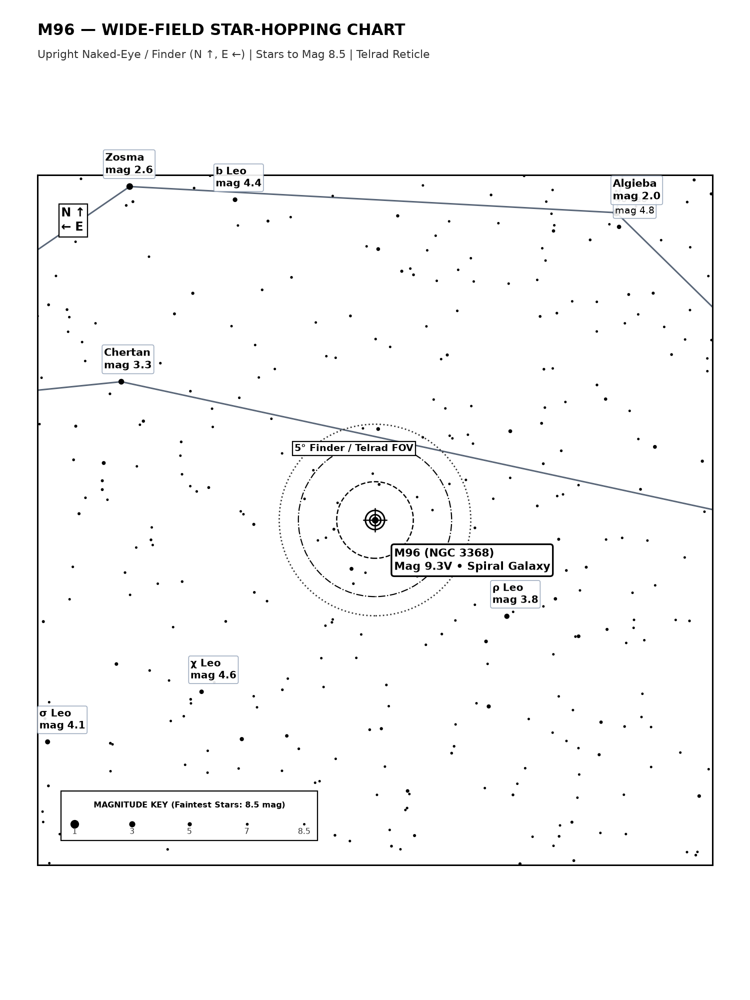

*([📄 Open Full High-Resolution Master A4 Finder Chart](shared/m96/chart_skywatcher-skyliner-200p.png))*

### 4. Observing Strategy & Step-by-Step Hop Instructions

- **Acquisition & Framing (20mm Super / 60×, 50' FOV)**:
  Ethereal oval glow with condensed galactic nucleus; framing the galaxy within the wide 50' field maximizes contrast against the sky.
- **High-Power Inspection & Detail (12.5mm / 96×, 31' FOV)**:
  12.5mm (96×) darkens the background sky, aiding detection of subtle core elongation, dust lanes, and halo extent with averted vision.

**Step-by-Step Star Hop Narrative**:
Locate constellation Leo. Follow the guide stars on the Wide-Field Chart to RA 161.69°, Dec 11.82°; look for a soft hazy smudge.

---

## M97 Owl Nebula (NGC 3587) — Ursa Major

[↑ Back to Catalog Index](#messier-catalog-index) • [← Previous: M96](#m96) • [Next: M98 →](#m98)

| Technical Parameter | Specification |
| :--- | :--- |
| **Designation** | M97 (NGC 3587) |
| **Common Name** | **Owl Nebula** |
| **Constellation** | Ursa Major |
| **Classification** | Planetary Nebula (PN) |
| **Visual Magnitude ($V$)** | 9.9 mag |
| **Apparent Dimensions** | 3.4' × 3.3' |
| **Estimated Distance** | ~2025 light-years |
| **Swanson Difficulty** | **Medium** (*NexStar User's Guide II*) |
| **Coordinates (J2000)** | RA **11h 14m 47.7s** • Dec **+55° 01' 08.7"** |
| **Recommended Eyepiece** | 12.5mm (96× magnification, 31' TFOV, 2.1mm exit pupil) |

### 1. Telescope Eyepiece Simulation & Technical Dossier
> [!NOTE]
> **Viewport B** depicts the pre-inverted 180° field view through the Newtonian reflector (12.5mm eyepiece / 96× magnification, 31' true field of view: South at top, West at left, N ↓, E →). **Viewport C** integrates target ephemeris and optical notes.

### 2. Constellation Context & Regional Orientation Chart
> [!TIP]
> **Viewport Context** presents a wide ~50°–65° naked-eye orientation field (stars down to visual magnitude 6.5) with official IAU constellation guide lines. The dashed bounding box marks the exact area covered by the wide-field star-hopping chart below.

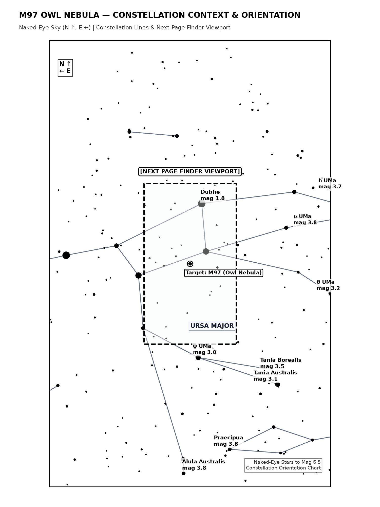

### 3. Wide-Field Star-Hopping Finder Chart
> [!IMPORTANT]
> **Viewport A** provides an upright naked-eye / optical finder orientation (N ↑, E ←) with stars down to visual magnitude 8.5. Standard concentric Telrad rings (0.5°, 2.0°, 4.0°) and 5.0° finder circle are centered directly on the target.

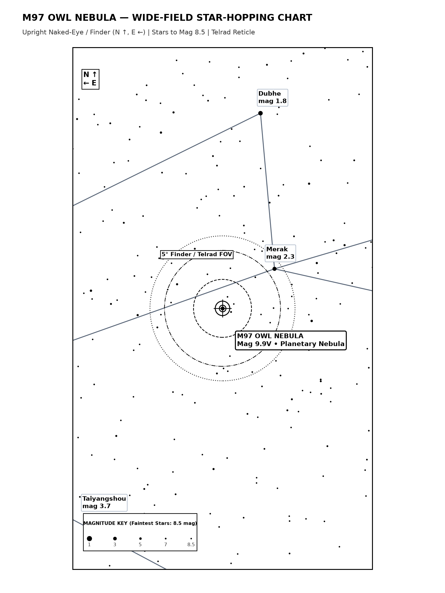

*([📄 Open Full High-Resolution Master A4 Finder Chart](shared/m97/chart_skywatcher-skyliner-200p.png))*

### 4. Observing Strategy & Step-by-Step Hop Instructions

- **Acquisition & Framing (20mm Super / 60×, 50' FOV)**:
  Distinct smoky disc or oval with crisp boundaries, standing out conspicuously from surrounding point-like field stars.
- **High-Power Inspection & Detail (12.5mm / 96×, 31' FOV)**:
  12.5mm (96×) brightens the outer nebular shell; subtle brightness variations and central hollow emerge clearly under steady seeing.

**Step-by-Step Star Hop Narrative**:
Locate Ursa Major anchor stars. Slew Telrad reticle to target coordinates (RA 168.70°, Dec 55.02°); identify the tiny non-twinkling smoky disk.

---

## M98 (NGC 4192) — Coma Berenices

[↑ Back to Catalog Index](#messier-catalog-index) • [← Previous: M97](#m97) • [Next: M99 →](#m99)

| Technical Parameter | Specification |
| :--- | :--- |
| **Designation** | M98 (NGC 4192) |
| **Constellation** | Coma Berenices |
| **Classification** | Spiral Galaxy (Galaxy) |
| **Visual Magnitude ($V$)** | 10.1 mag |
| **Apparent Dimensions** | 9.8' × 2.8' |
| **Estimated Distance** | ~34.8 million light-years |
| **Swanson Difficulty** | **Hard** (*NexStar User's Guide II*) |
| **Coordinates (J2000)** | RA **12h 13m 48.3s** • Dec **+14° 54' 01.7"** |
| **Recommended Eyepiece** | 12.5mm (96× magnification, 31' TFOV, 2.1mm exit pupil) |

### 1. Telescope Eyepiece Simulation & Technical Dossier
> [!NOTE]
> **Viewport B** depicts the pre-inverted 180° field view through the Newtonian reflector (12.5mm eyepiece / 96× magnification, 31' true field of view: South at top, West at left, N ↓, E →). **Viewport C** integrates target ephemeris and optical notes.

### 2. Constellation Context & Regional Orientation Chart
> [!TIP]
> **Viewport Context** presents a wide ~50°–65° naked-eye orientation field (stars down to visual magnitude 6.5) with official IAU constellation guide lines. The dashed bounding box marks the exact area covered by the wide-field star-hopping chart below.

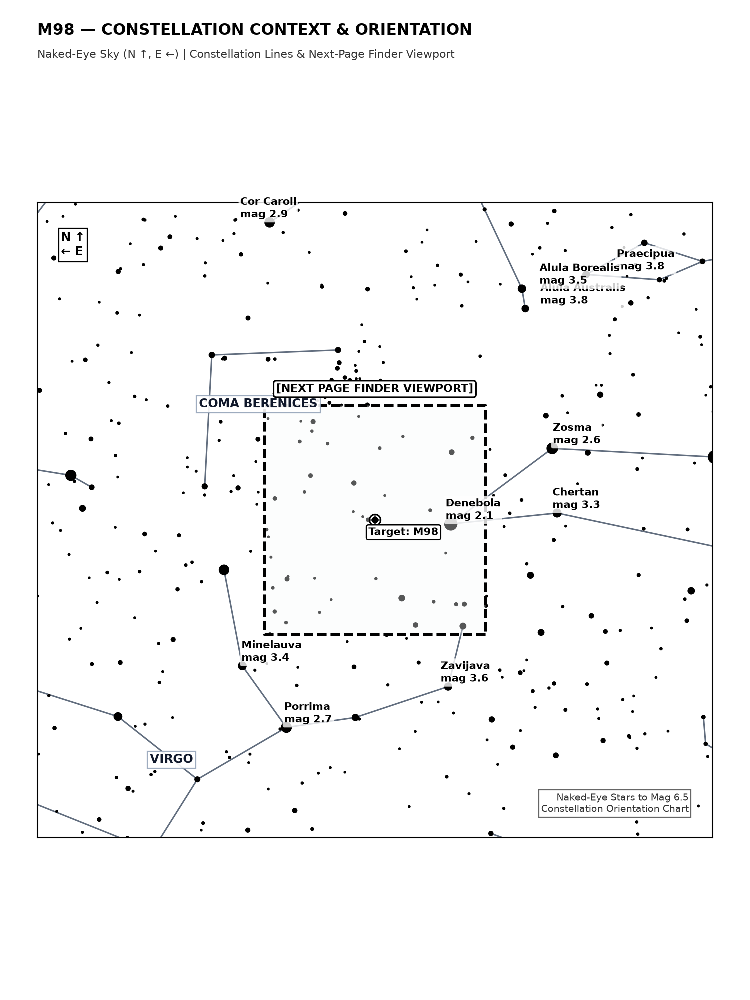

### 3. Wide-Field Star-Hopping Finder Chart
> [!IMPORTANT]
> **Viewport A** provides an upright naked-eye / optical finder orientation (N ↑, E ←) with stars down to visual magnitude 8.5. Standard concentric Telrad rings (0.5°, 2.0°, 4.0°) and 5.0° finder circle are centered directly on the target.

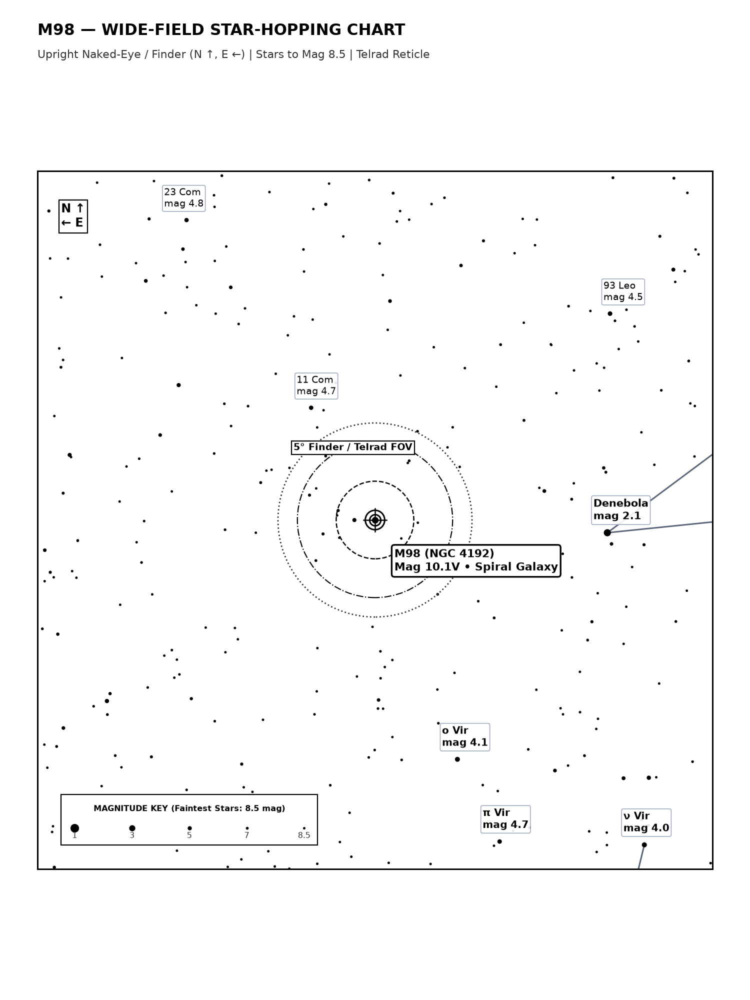

*([📄 Open Full High-Resolution Master A4 Finder Chart](shared/m98/chart_skywatcher-skyliner-200p.png))*

### 4. Observing Strategy & Step-by-Step Hop Instructions

- **Acquisition & Framing (20mm Super / 60×, 50' FOV)**:
  Ethereal oval glow with condensed galactic nucleus; framing the galaxy within the wide 50' field maximizes contrast against the sky.
- **High-Power Inspection & Detail (12.5mm / 96×, 31' FOV)**:
  12.5mm (96×) darkens the background sky, aiding detection of subtle core elongation, dust lanes, and halo extent with averted vision.

**Step-by-Step Star Hop Narrative**:
Locate constellation Coma Berenices. Follow the guide stars on the Wide-Field Chart to RA 183.45°, Dec 14.90°; look for a soft hazy smudge.

---

## M99 (NGC 4254) — Coma Berenices

[↑ Back to Catalog Index](#messier-catalog-index) • [← Previous: M98](#m98) • [Next: M100 →](#m100)

| Technical Parameter | Specification |
| :--- | :--- |
| **Designation** | M99 (NGC 4254) |
| **Constellation** | Coma Berenices |
| **Classification** | Spiral Galaxy (Galaxy) |
| **Visual Magnitude ($V$)** | 9.9 mag |
| **Apparent Dimensions** | 5.4' × 4.7' |
| **Estimated Distance** | ~15.4 million light-years |
| **Swanson Difficulty** | **Hard** (*NexStar User's Guide II*) |
| **Coordinates (J2000)** | RA **12h 18m 49.6s** • Dec **+14° 24' 59.4"** |
| **Recommended Eyepiece** | 12.5mm (96× magnification, 31' TFOV, 2.1mm exit pupil) |

### 1. Telescope Eyepiece Simulation & Technical Dossier
> [!NOTE]
> **Viewport B** depicts the pre-inverted 180° field view through the Newtonian reflector (12.5mm eyepiece / 96× magnification, 31' true field of view: South at top, West at left, N ↓, E →). **Viewport C** integrates target ephemeris and optical notes.

### 2. Constellation Context & Regional Orientation Chart
> [!TIP]
> **Viewport Context** presents a wide ~50°–65° naked-eye orientation field (stars down to visual magnitude 6.5) with official IAU constellation guide lines. The dashed bounding box marks the exact area covered by the wide-field star-hopping chart below.

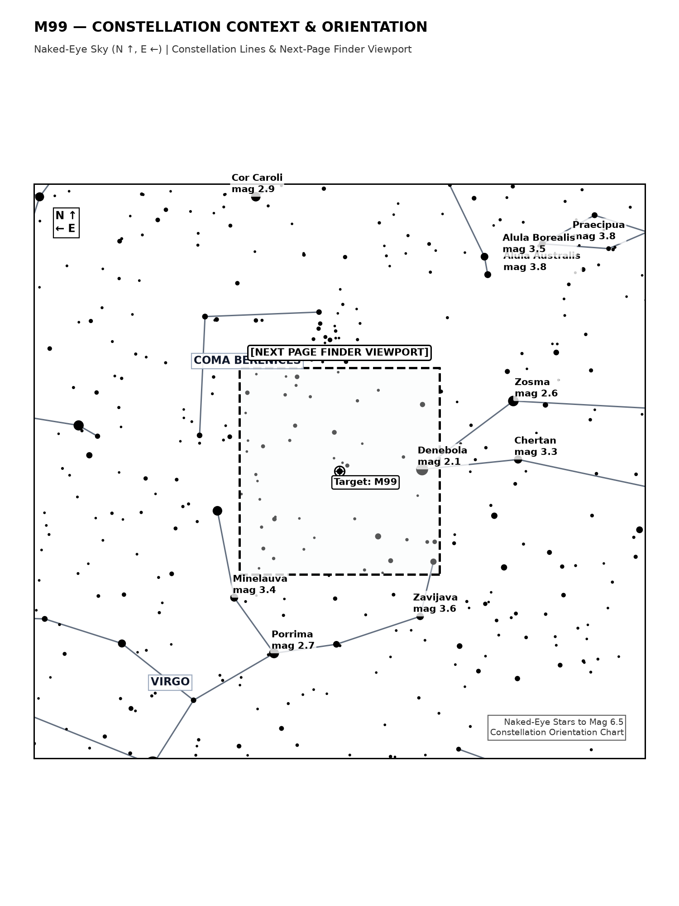

### 3. Wide-Field Star-Hopping Finder Chart
> [!IMPORTANT]
> **Viewport A** provides an upright naked-eye / optical finder orientation (N ↑, E ←) with stars down to visual magnitude 8.5. Standard concentric Telrad rings (0.5°, 2.0°, 4.0°) and 5.0° finder circle are centered directly on the target.

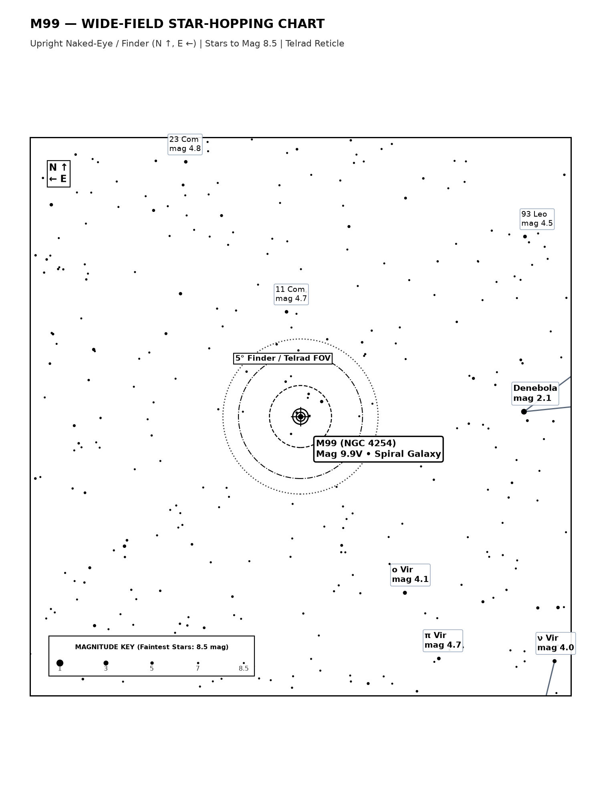

*([📄 Open Full High-Resolution Master A4 Finder Chart](shared/m99/chart_skywatcher-skyliner-200p.png))*

### 4. Observing Strategy & Step-by-Step Hop Instructions

- **Acquisition & Framing (20mm Super / 60×, 50' FOV)**:
  Ethereal oval glow with condensed galactic nucleus; framing the galaxy within the wide 50' field maximizes contrast against the sky.
- **High-Power Inspection & Detail (12.5mm / 96×, 31' FOV)**:
  12.5mm (96×) darkens the background sky, aiding detection of subtle core elongation, dust lanes, and halo extent with averted vision.

**Step-by-Step Star Hop Narrative**:
Locate constellation Coma Berenices. Follow the guide stars on the Wide-Field Chart to RA 184.71°, Dec 14.42°; look for a soft hazy smudge.

---

## M100 (NGC 4321) — Coma Berenices

[↑ Back to Catalog Index](#messier-catalog-index) • [← Previous: M99](#m99) • [Next: M101 →](#m101)

| Technical Parameter | Specification |
| :--- | :--- |
| **Designation** | M100 (NGC 4321) |
| **Constellation** | Coma Berenices |
| **Classification** | Spiral Galaxy (Galaxy) |
| **Visual Magnitude ($V$)** | 9.4 mag |
| **Apparent Dimensions** | 7.4' × 6.3' |
| **Estimated Distance** | ~16.9 million light-years |
| **Swanson Difficulty** | **Hard** (*NexStar User's Guide II*) |
| **Coordinates (J2000)** | RA **12h 22m 54.9s** • Dec **+15° 49' 20.6"** |
| **Recommended Eyepiece** | 12.5mm (96× magnification, 31' TFOV, 2.1mm exit pupil) |

### 1. Telescope Eyepiece Simulation & Technical Dossier
> [!NOTE]
> **Viewport B** depicts the pre-inverted 180° field view through the Newtonian reflector (12.5mm eyepiece / 96× magnification, 31' true field of view: South at top, West at left, N ↓, E →). **Viewport C** integrates target ephemeris and optical notes.

### 2. Constellation Context & Regional Orientation Chart
> [!TIP]
> **Viewport Context** presents a wide ~50°–65° naked-eye orientation field (stars down to visual magnitude 6.5) with official IAU constellation guide lines. The dashed bounding box marks the exact area covered by the wide-field star-hopping chart below.

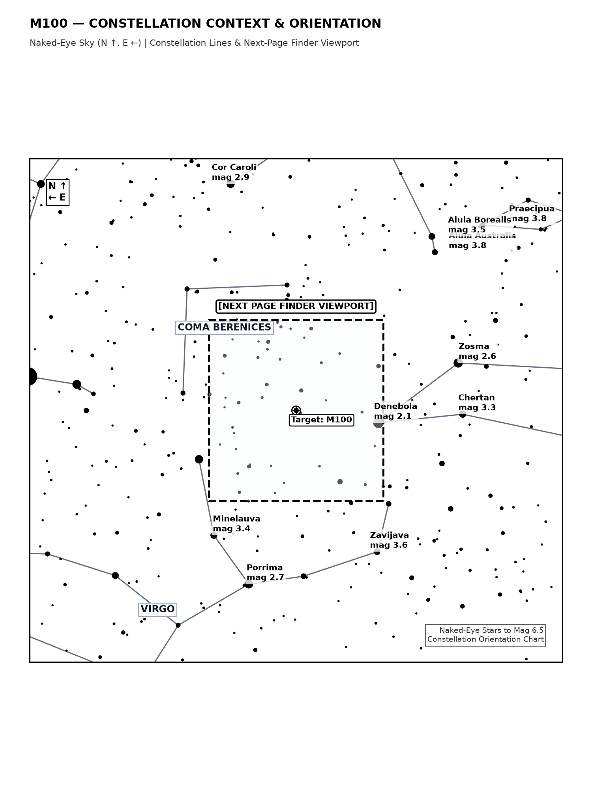

### 3. Wide-Field Star-Hopping Finder Chart
> [!IMPORTANT]
> **Viewport A** provides an upright naked-eye / optical finder orientation (N ↑, E ←) with stars down to visual magnitude 8.5. Standard concentric Telrad rings (0.5°, 2.0°, 4.0°) and 5.0° finder circle are centered directly on the target.

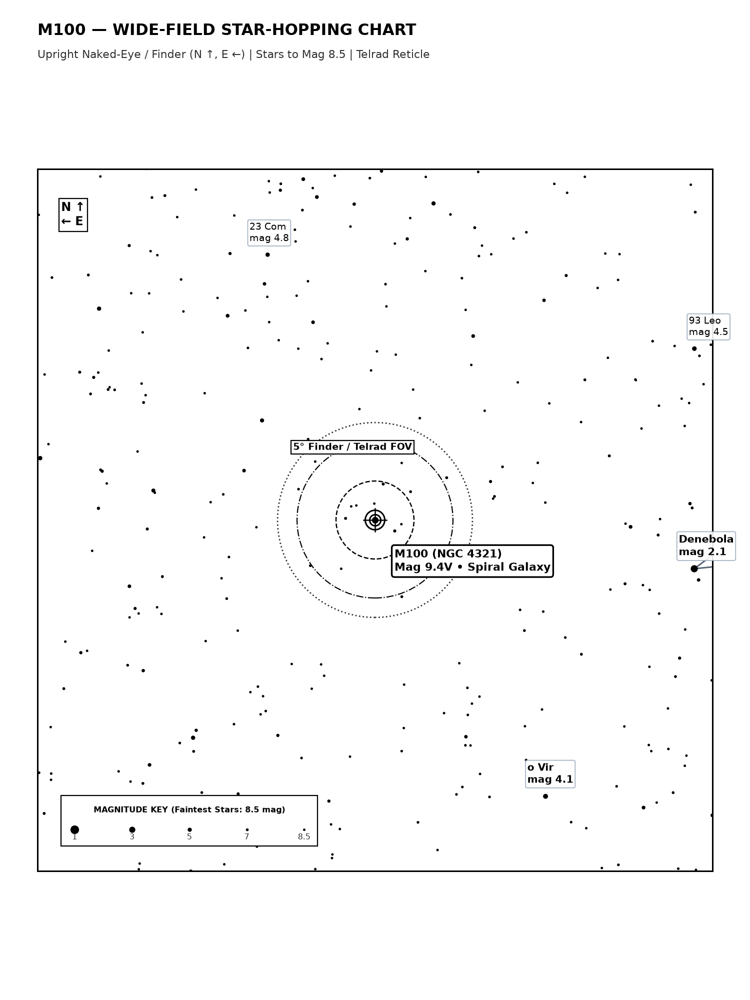

*([📄 Open Full High-Resolution Master A4 Finder Chart](shared/m100/chart_skywatcher-skyliner-200p.png))*

### 4. Observing Strategy & Step-by-Step Hop Instructions

- **Acquisition & Framing (20mm Super / 60×, 50' FOV)**:
  Ethereal oval glow with condensed galactic nucleus; framing the galaxy within the wide 50' field maximizes contrast against the sky.
- **High-Power Inspection & Detail (12.5mm / 96×, 31' FOV)**:
  12.5mm (96×) darkens the background sky, aiding detection of subtle core elongation, dust lanes, and halo extent with averted vision.

**Step-by-Step Star Hop Narrative**:
Locate constellation Coma Berenices. Follow the guide stars on the Wide-Field Chart to RA 185.73°, Dec 15.82°; look for a soft hazy smudge.

---

## M101 Pinwheel Galaxy (NGC 5457) — Ursa Major

[↑ Back to Catalog Index](#messier-catalog-index) • [← Previous: M100](#m100) • [Next: M102 →](#m102)

| Technical Parameter | Specification |
| :--- | :--- |
| **Designation** | M101 (NGC 5457) |
| **Common Name** | **Pinwheel Galaxy** |
| **Constellation** | Ursa Major |
| **Classification** | Spiral Galaxy (Galaxy) |
| **Visual Magnitude ($V$)** | 7.9 mag |
| **Apparent Dimensions** | 28.8' × 26.9' |
| **Estimated Distance** | ~6.4 million light-years |
| **Swanson Difficulty** | **Hard** (*NexStar User's Guide II*) |
| **Coordinates (J2000)** | RA **14h 03m 12.6s** • Dec **+54° 20' 55.5"** |
| **Recommended Eyepiece** | 20mm (60× magnification, 49' TFOV, 3.4mm exit pupil) |

### 1. Telescope Eyepiece Simulation & Technical Dossier
> [!NOTE]
> **Viewport B** depicts the pre-inverted 180° field view through the Newtonian reflector (20mm eyepiece / 60× magnification, 49' true field of view: South at top, West at left, N ↓, E →). **Viewport C** integrates target ephemeris and optical notes.

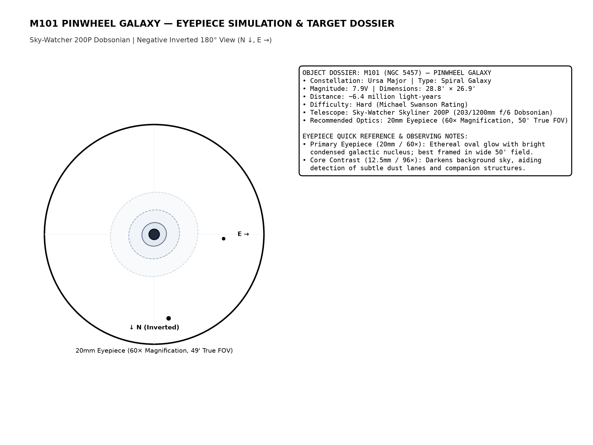

### 2. Constellation Context & Regional Orientation Chart
> [!TIP]
> **Viewport Context** presents a wide ~50°–65° naked-eye orientation field (stars down to visual magnitude 6.5) with official IAU constellation guide lines. The dashed bounding box marks the exact area covered by the wide-field star-hopping chart below.

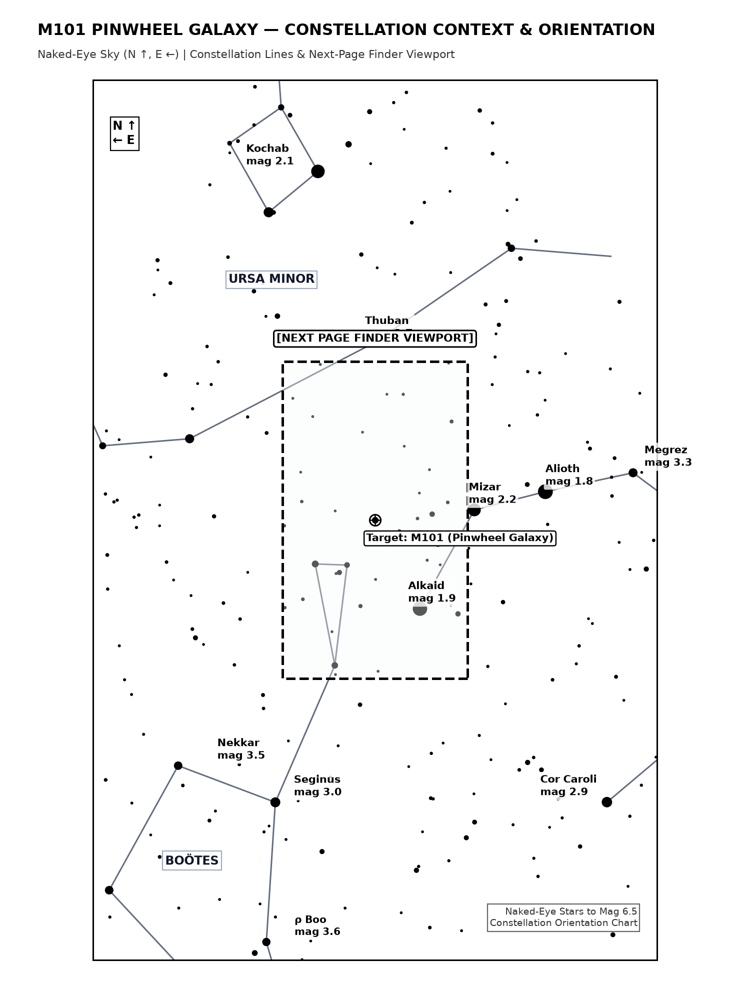

### 3. Wide-Field Star-Hopping Finder Chart
> [!IMPORTANT]
> **Viewport A** provides an upright naked-eye / optical finder orientation (N ↑, E ←) with stars down to visual magnitude 8.5. Standard concentric Telrad rings (0.5°, 2.0°, 4.0°) and 5.0° finder circle are centered directly on the target.

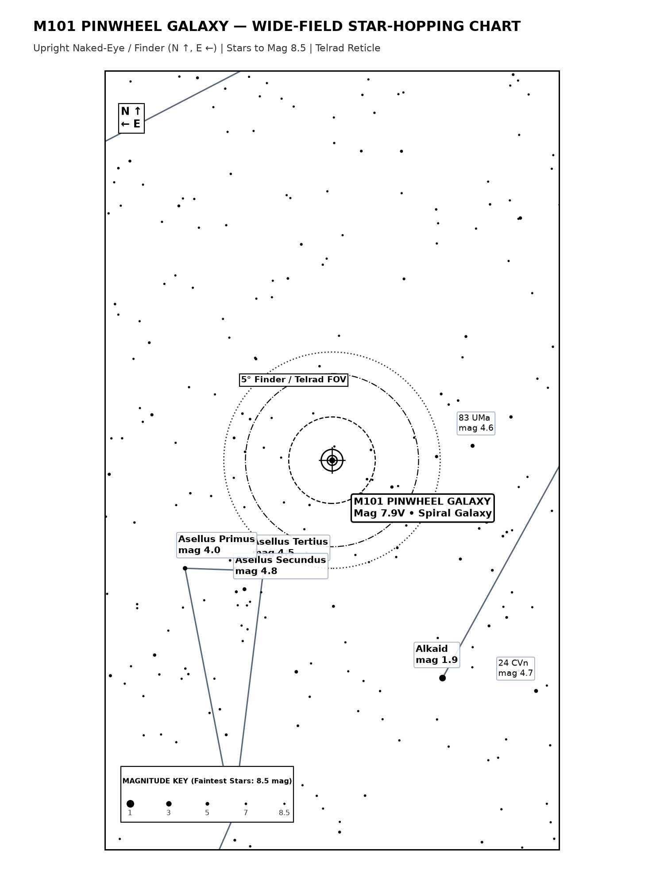

*([📄 Open Full High-Resolution Master A4 Finder Chart](shared/m101/chart_skywatcher-skyliner-200p.png))*

### 4. Observing Strategy & Step-by-Step Hop Instructions

- **Acquisition & Framing (20mm Super / 60×, 50' FOV)**:
  Ethereal oval glow with condensed galactic nucleus; framing the galaxy within the wide 50' field maximizes contrast against the sky.
- **High-Power Inspection & Detail (20mm / 60×, 49' FOV)**:
  20mm (60×) darkens the background sky, aiding detection of subtle core elongation, dust lanes, and halo extent with averted vision.

**Step-by-Step Star Hop Narrative**:
Locate constellation Ursa Major. Follow the guide stars on the Wide-Field Chart to RA 210.80°, Dec 54.35°; look for a soft hazy smudge.

---

## M102 Spindle Galaxy (NGC 5866) — Draco

[↑ Back to Catalog Index](#messier-catalog-index) • [← Previous: M101](#m101) • [Next: M103 →](#m103)

| Technical Parameter | Specification |
| :--- | :--- |
| **Designation** | M102 (NGC 5866) |
| **Common Name** | **Spindle Galaxy** |
| **Constellation** | Draco |
| **Classification** | Lenticular Galaxy (Galaxy) |
| **Visual Magnitude ($V$)** | 9.9 mag |
| **Apparent Dimensions** | 6.5' × 3.1' |
| **Estimated Distance** | ~17.7 million light-years |
| **Swanson Difficulty** | **Medium** (*NexStar User's Guide II*) |
| **Coordinates (J2000)** | RA **15h 06m 29.6s** • Dec **+55° 45' 47.9"** |
| **Recommended Eyepiece** | 12.5mm (96× magnification, 31' TFOV, 2.1mm exit pupil) |

### 1. Telescope Eyepiece Simulation & Technical Dossier
> [!NOTE]
> **Viewport B** depicts the pre-inverted 180° field view through the Newtonian reflector (12.5mm eyepiece / 96× magnification, 31' true field of view: South at top, West at left, N ↓, E →). **Viewport C** integrates target ephemeris and optical notes.

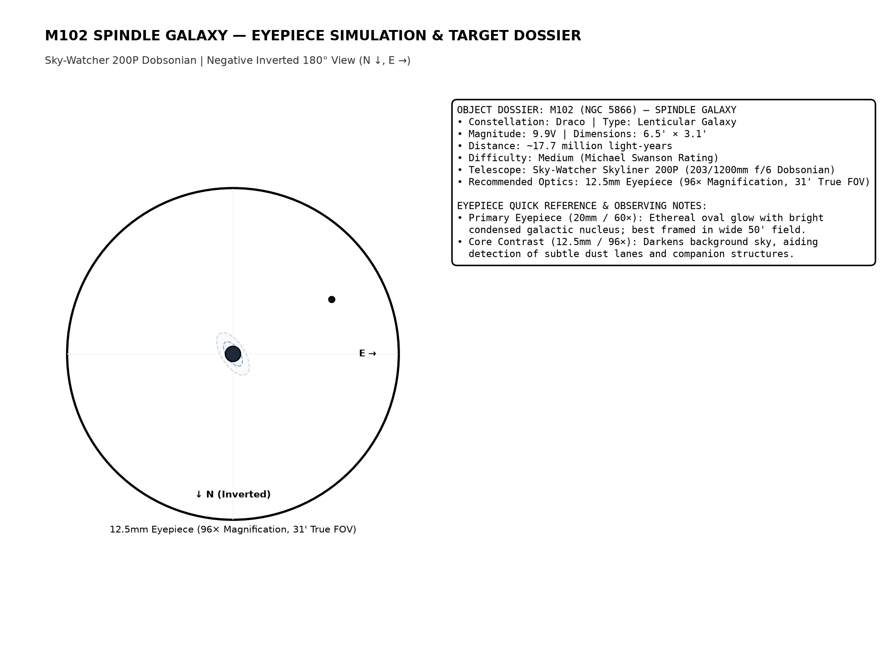

### 2. Constellation Context & Regional Orientation Chart
> [!TIP]
> **Viewport Context** presents a wide ~50°–65° naked-eye orientation field (stars down to visual magnitude 6.5) with official IAU constellation guide lines. The dashed bounding box marks the exact area covered by the wide-field star-hopping chart below.

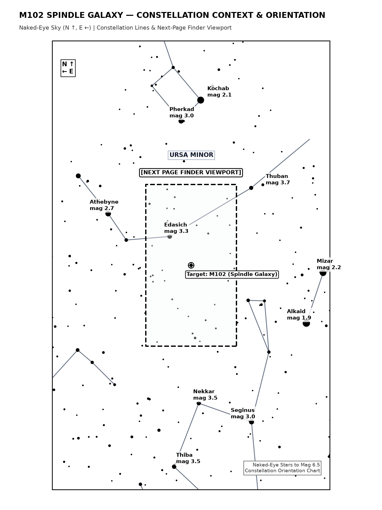

### 3. Wide-Field Star-Hopping Finder Chart
> [!IMPORTANT]
> **Viewport A** provides an upright naked-eye / optical finder orientation (N ↑, E ←) with stars down to visual magnitude 8.5. Standard concentric Telrad rings (0.5°, 2.0°, 4.0°) and 5.0° finder circle are centered directly on the target.

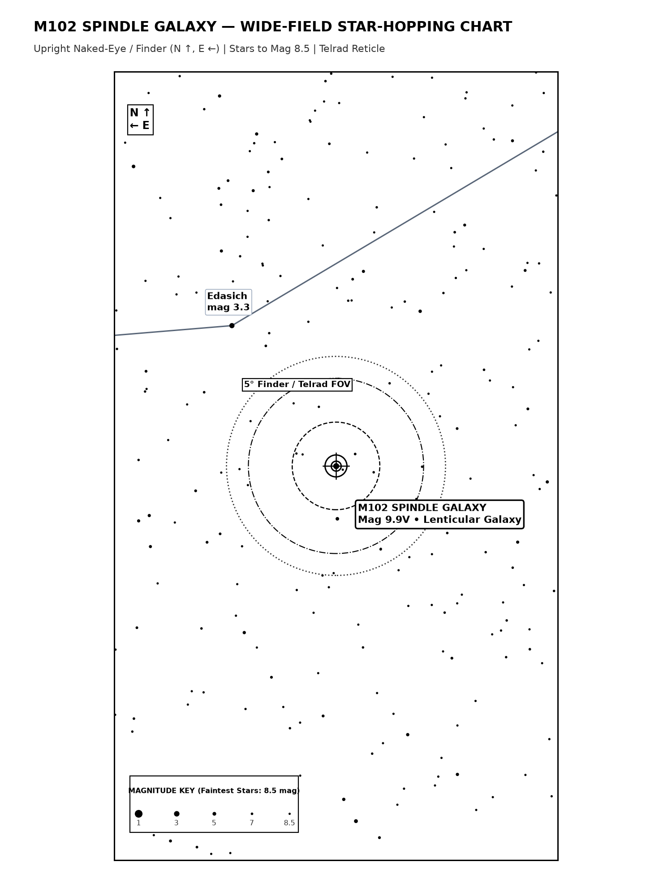

*([📄 Open Full High-Resolution Master A4 Finder Chart](shared/m102/chart_skywatcher-skyliner-200p.png))*

### 4. Observing Strategy & Step-by-Step Hop Instructions

- **Acquisition & Framing (20mm Super / 60×, 50' FOV)**:
  Ethereal oval glow with condensed galactic nucleus; framing the galaxy within the wide 50' field maximizes contrast against the sky.
- **High-Power Inspection & Detail (12.5mm / 96×, 31' FOV)**:
  12.5mm (96×) darkens the background sky, aiding detection of subtle core elongation, dust lanes, and halo extent with averted vision.

**Step-by-Step Star Hop Narrative**:
Locate constellation Draco. Follow the guide stars on the Wide-Field Chart to RA 226.62°, Dec 55.76°; look for a soft hazy smudge.

---

## M103 (NGC 581) — Cassiopeia

[↑ Back to Catalog Index](#messier-catalog-index) • [← Previous: M102](#m102) • [Next: M104 →](#m104)

| Technical Parameter | Specification |
| :--- | :--- |
| **Designation** | M103 (NGC 581) |
| **Constellation** | Cassiopeia |
| **Classification** | Open Cluster (OC) |
| **Visual Magnitude ($V$)** | 7.4 mag |
| **Apparent Dimensions** | 6.0' × 6.0' |
| **Estimated Distance** | ~9,786 light-years |
| **Swanson Difficulty** | **Easy** (*NexStar User's Guide II*) |
| **Coordinates (J2000)** | RA **1h 33m 23.0s** • Dec **+60° 39' 00.0"** |
| **Recommended Eyepiece** | 12.5mm (96× magnification, 31' TFOV, 2.1mm exit pupil) |

### 1. Telescope Eyepiece Simulation & Technical Dossier
> [!NOTE]
> **Viewport B** depicts the pre-inverted 180° field view through the Newtonian reflector (12.5mm eyepiece / 96× magnification, 31' true field of view: South at top, West at left, N ↓, E →). **Viewport C** integrates target ephemeris and optical notes.

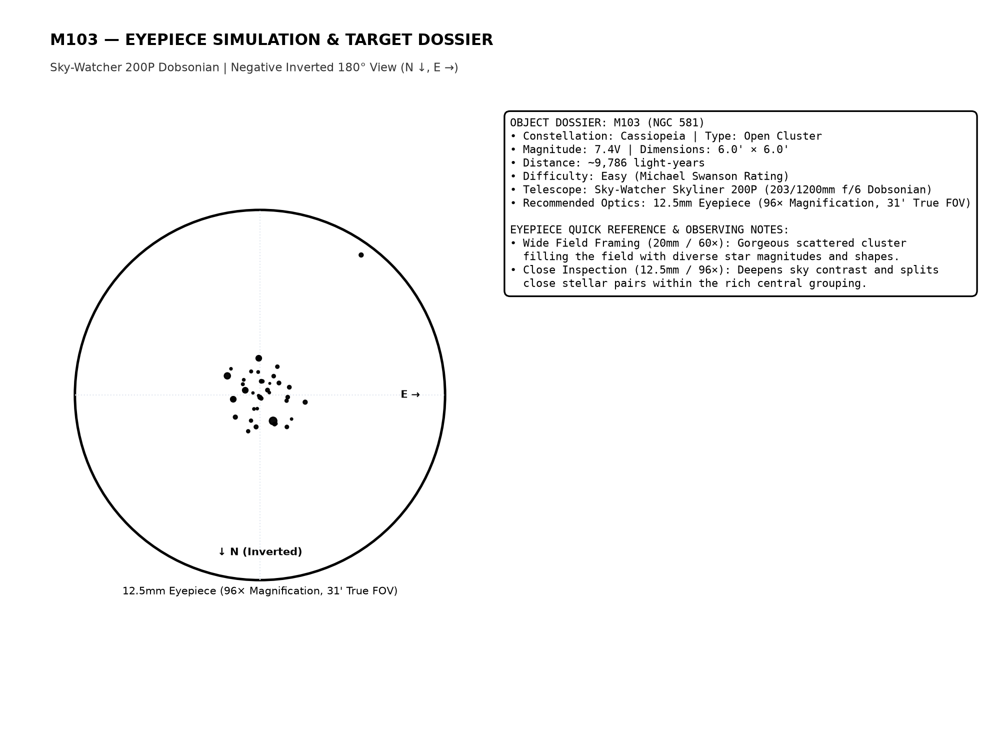

### 2. Constellation Context & Regional Orientation Chart
> [!TIP]
> **Viewport Context** presents a wide ~50°–65° naked-eye orientation field (stars down to visual magnitude 6.5) with official IAU constellation guide lines. The dashed bounding box marks the exact area covered by the wide-field star-hopping chart below.

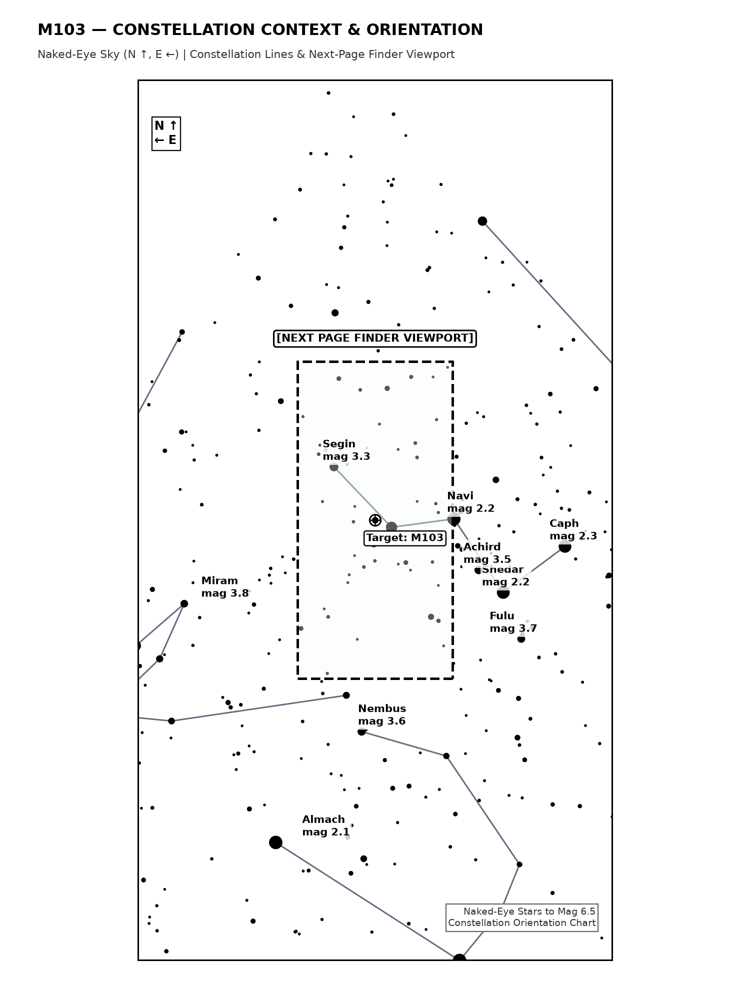

### 3. Wide-Field Star-Hopping Finder Chart
> [!IMPORTANT]
> **Viewport A** provides an upright naked-eye / optical finder orientation (N ↑, E ←) with stars down to visual magnitude 8.5. Standard concentric Telrad rings (0.5°, 2.0°, 4.0°) and 5.0° finder circle are centered directly on the target.

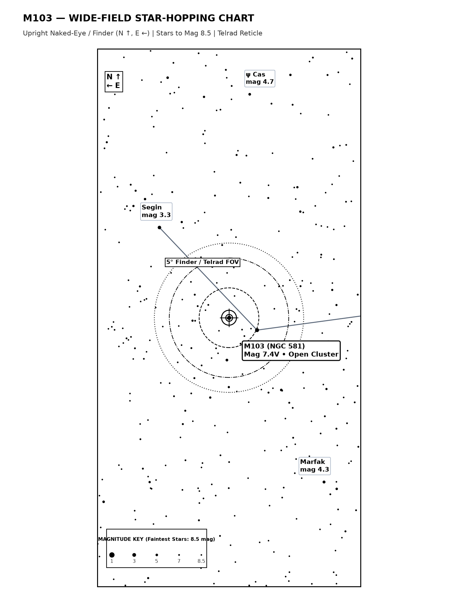

*([📄 Open Full High-Resolution Master A4 Finder Chart](shared/m103/chart_skywatcher-skyliner-200p.png))*

### 4. Observing Strategy & Step-by-Step Hop Instructions

- **Acquisition & Framing (20mm Super / 60×, 50' FOV)**:
  Gorgeous scattered star cluster filling the field with diverse stellar magnitudes and pleasing geometric groupings.
- **High-Power Inspection & Detail (12.5mm / 96×, 31' FOV)**:
  12.5mm (96×) deepens sky contrast and splits intimate stellar pairs and chains within the rich central grouping.

**Step-by-Step Star Hop Narrative**:
Locate Cassiopeia via Context Chart. Align Telrad reticle to target coordinates (RA 23.35°, Dec 60.65°); cluster stars emerge immediately in the finder.

---

## M104 Sombrero Galaxy (NGC 4594) — Virgo

[↑ Back to Catalog Index](#messier-catalog-index) • [← Previous: M103](#m103) • [Next: M105 →](#m105)

| Technical Parameter | Specification |
| :--- | :--- |
| **Designation** | M104 (NGC 4594) |
| **Common Name** | **Sombrero Galaxy** |
| **Constellation** | Virgo |
| **Classification** | Spiral Galaxy (Galaxy) |
| **Visual Magnitude ($V$)** | 8.0 mag |
| **Apparent Dimensions** | 8.7' × 3.5' |
| **Estimated Distance** | ~9.0 million light-years |
| **Swanson Difficulty** | **Medium** (*NexStar User's Guide II*) |
| **Coordinates (J2000)** | RA **12h 39m 59.4s** • Dec **-11° 37' 23.0"** |
| **Recommended Eyepiece** | 12.5mm (96× magnification, 31' TFOV, 2.1mm exit pupil) |

### 1. Telescope Eyepiece Simulation & Technical Dossier
> [!NOTE]
> **Viewport B** depicts the pre-inverted 180° field view through the Newtonian reflector (12.5mm eyepiece / 96× magnification, 31' true field of view: South at top, West at left, N ↓, E →). **Viewport C** integrates target ephemeris and optical notes.

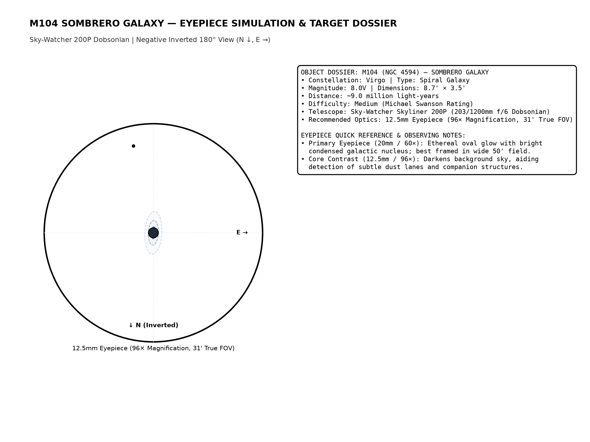

### 2. Constellation Context & Regional Orientation Chart
> [!TIP]
> **Viewport Context** presents a wide ~50°–65° naked-eye orientation field (stars down to visual magnitude 6.5) with official IAU constellation guide lines. The dashed bounding box marks the exact area covered by the wide-field star-hopping chart below.

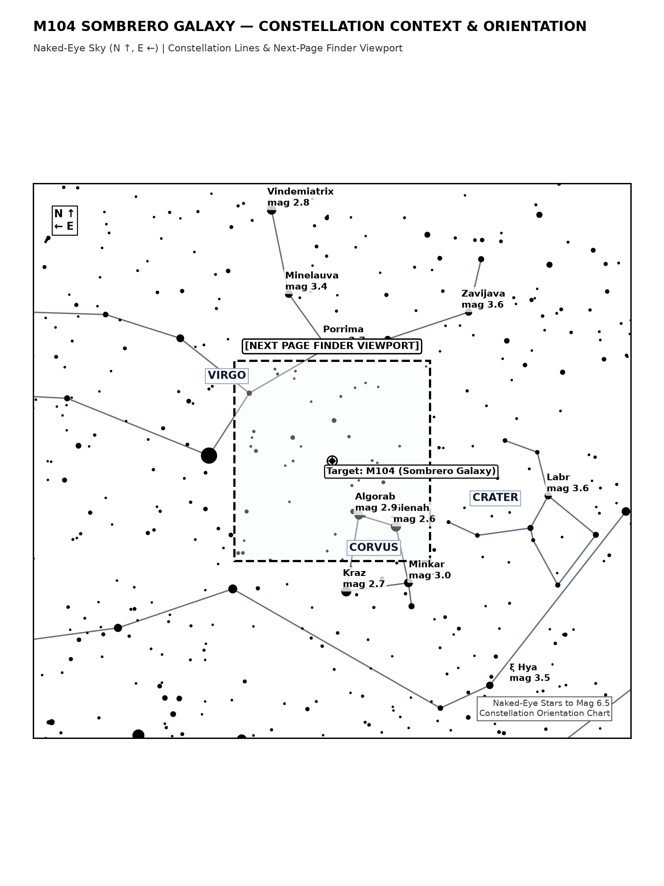

### 3. Wide-Field Star-Hopping Finder Chart
> [!IMPORTANT]
> **Viewport A** provides an upright naked-eye / optical finder orientation (N ↑, E ←) with stars down to visual magnitude 8.5. Standard concentric Telrad rings (0.5°, 2.0°, 4.0°) and 5.0° finder circle are centered directly on the target.

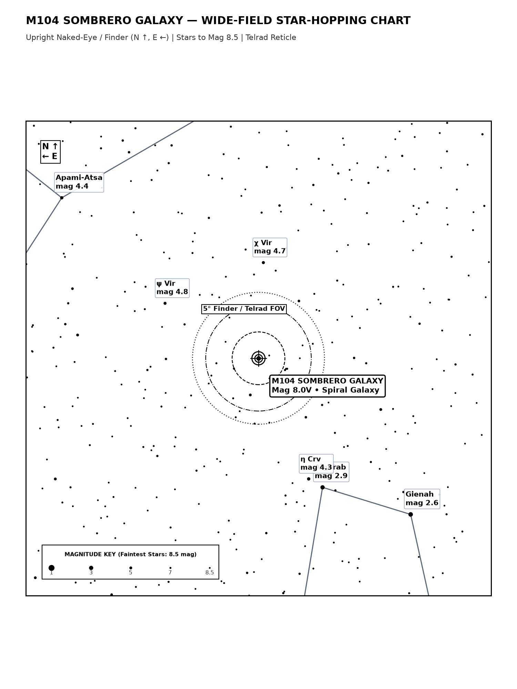

*([📄 Open Full High-Resolution Master A4 Finder Chart](shared/m104/chart_skywatcher-skyliner-200p.png))*

### 4. Observing Strategy & Step-by-Step Hop Instructions

- **Acquisition & Framing (20mm Super / 60×, 50' FOV)**:
  The Sombrero Galaxy; striking edge-on spiral galaxy in Virgo boasting an immense central bulge and prominent dust lane.
- **High-Power Inspection & Detail (12.5mm / 96×, 31' FOV)**:
  96× reveals the classic sombrero hat profile: brilliant glowing core sharply bisected along its southern edge by a crisp dark dust lane.

**Step-by-Step Star Hop Narrative**:
Locate the Spica-Algorab line. From Algorab (δ Corvi), slew 5.5° northeast into southern Virgo.

---

## M105 (NGC 3379) — Leo

[↑ Back to Catalog Index](#messier-catalog-index) • [← Previous: M104](#m104) • [Next: M106 →](#m106)

| Technical Parameter | Specification |
| :--- | :--- |
| **Designation** | M105 (NGC 3379) |
| **Constellation** | Leo |
| **Classification** | Elliptical Galaxy (Galaxy) |
| **Visual Magnitude ($V$)** | 9.3 mag |
| **Apparent Dimensions** | 5.4' × 4.8' |
| **Estimated Distance** | ~9.8 million light-years |
| **Swanson Difficulty** | **Hard** (*NexStar User's Guide II*) |
| **Coordinates (J2000)** | RA **10h 47m 49.6s** • Dec **+12° 34' 53.9"** |
| **Recommended Eyepiece** | 12.5mm (96× magnification, 31' TFOV, 2.1mm exit pupil) |

### 1. Telescope Eyepiece Simulation & Technical Dossier
> [!NOTE]
> **Viewport B** depicts the pre-inverted 180° field view through the Newtonian reflector (12.5mm eyepiece / 96× magnification, 31' true field of view: South at top, West at left, N ↓, E →). **Viewport C** integrates target ephemeris and optical notes.

### 2. Constellation Context & Regional Orientation Chart
> [!TIP]
> **Viewport Context** presents a wide ~50°–65° naked-eye orientation field (stars down to visual magnitude 6.5) with official IAU constellation guide lines. The dashed bounding box marks the exact area covered by the wide-field star-hopping chart below.

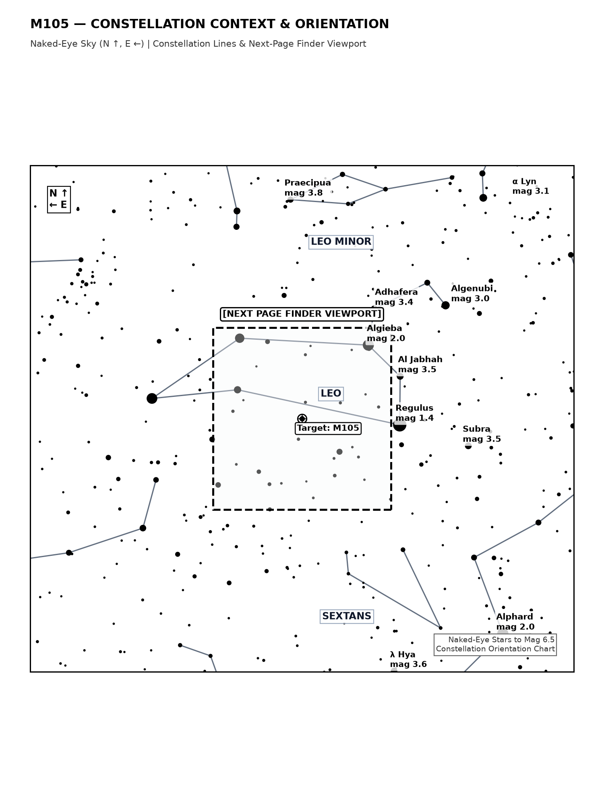

### 3. Wide-Field Star-Hopping Finder Chart
> [!IMPORTANT]
> **Viewport A** provides an upright naked-eye / optical finder orientation (N ↑, E ←) with stars down to visual magnitude 8.5. Standard concentric Telrad rings (0.5°, 2.0°, 4.0°) and 5.0° finder circle are centered directly on the target.

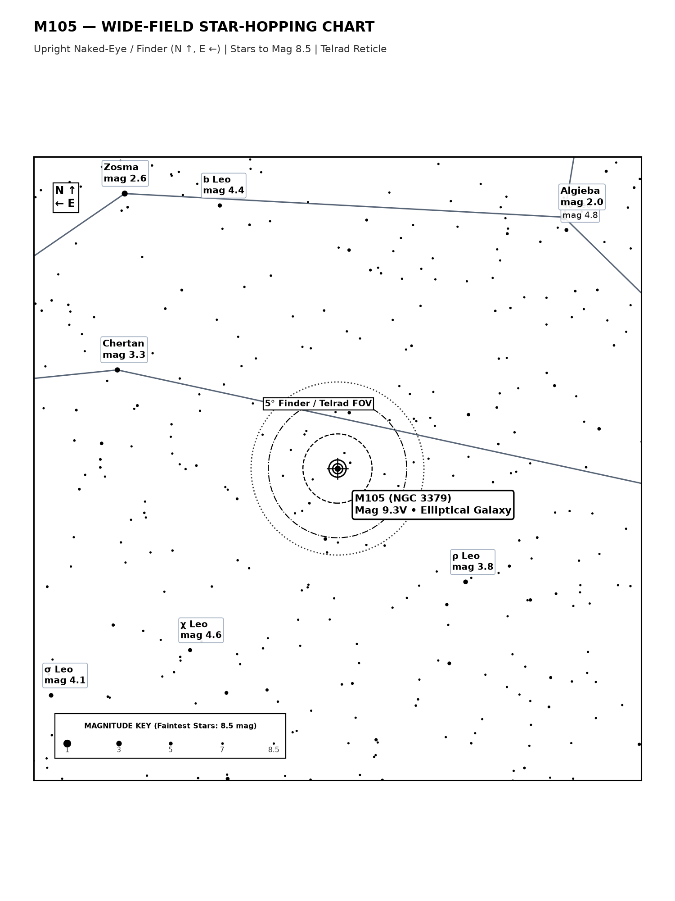

*([📄 Open Full High-Resolution Master A4 Finder Chart](shared/m105/chart_skywatcher-skyliner-200p.png))*

### 4. Observing Strategy & Step-by-Step Hop Instructions

- **Acquisition & Framing (20mm Super / 60×, 50' FOV)**:
  Ethereal oval glow with condensed galactic nucleus; framing the galaxy within the wide 50' field maximizes contrast against the sky.
- **High-Power Inspection & Detail (12.5mm / 96×, 31' FOV)**:
  12.5mm (96×) darkens the background sky, aiding detection of subtle core elongation, dust lanes, and halo extent with averted vision.

**Step-by-Step Star Hop Narrative**:
Locate constellation Leo. Follow the guide stars on the Wide-Field Chart to RA 161.96°, Dec 12.58°; look for a soft hazy smudge.

---

## M106 (NGC 4258) — Canes Venatici

[↑ Back to Catalog Index](#messier-catalog-index) • [← Previous: M105](#m105) • [Next: M107 →](#m107)

| Technical Parameter | Specification |
| :--- | :--- |
| **Designation** | M106 (NGC 4258) |
| **Constellation** | Canes Venatici |
| **Classification** | Spiral Galaxy (Galaxy) |
| **Visual Magnitude ($V$)** | 8.4 mag |
| **Apparent Dimensions** | 18.6' × 7.2' |
| **Estimated Distance** | ~7.0 million light-years |
| **Swanson Difficulty** | **Hard** (*NexStar User's Guide II*) |
| **Coordinates (J2000)** | RA **12h 18m 57.6s** • Dec **+47° 18' 13.4"** |
| **Recommended Eyepiece** | 20mm (60× magnification, 49' TFOV, 3.4mm exit pupil) |

### 1. Telescope Eyepiece Simulation & Technical Dossier
> [!NOTE]
> **Viewport B** depicts the pre-inverted 180° field view through the Newtonian reflector (20mm eyepiece / 60× magnification, 49' true field of view: South at top, West at left, N ↓, E →). **Viewport C** integrates target ephemeris and optical notes.

### 2. Constellation Context & Regional Orientation Chart
> [!TIP]
> **Viewport Context** presents a wide ~50°–65° naked-eye orientation field (stars down to visual magnitude 6.5) with official IAU constellation guide lines. The dashed bounding box marks the exact area covered by the wide-field star-hopping chart below.

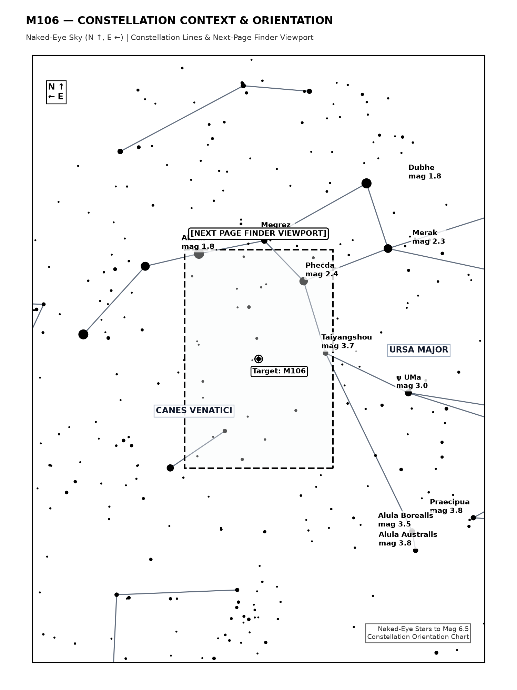

### 3. Wide-Field Star-Hopping Finder Chart
> [!IMPORTANT]
> **Viewport A** provides an upright naked-eye / optical finder orientation (N ↑, E ←) with stars down to visual magnitude 8.5. Standard concentric Telrad rings (0.5°, 2.0°, 4.0°) and 5.0° finder circle are centered directly on the target.

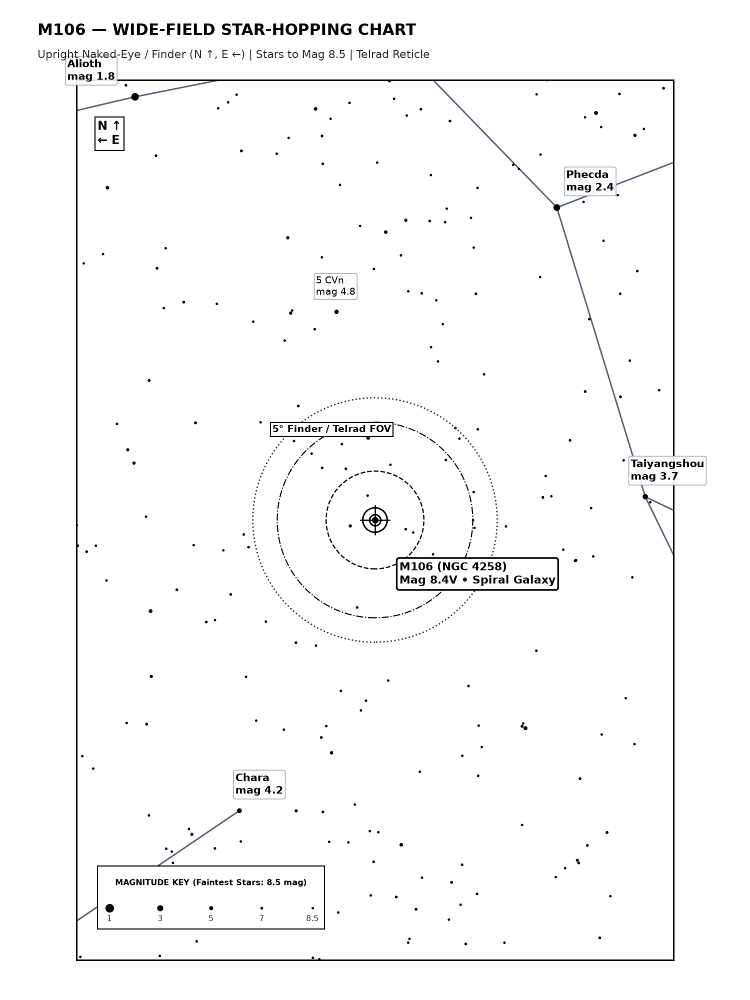

*([📄 Open Full High-Resolution Master A4 Finder Chart](shared/m106/chart_skywatcher-skyliner-200p.png))*

### 4. Observing Strategy & Step-by-Step Hop Instructions

- **Acquisition & Framing (20mm Super / 60×, 50' FOV)**:
  Ethereal oval glow with condensed galactic nucleus; framing the galaxy within the wide 50' field maximizes contrast against the sky.
- **High-Power Inspection & Detail (20mm / 60×, 49' FOV)**:
  20mm (60×) darkens the background sky, aiding detection of subtle core elongation, dust lanes, and halo extent with averted vision.

**Step-by-Step Star Hop Narrative**:
Locate constellation Canes Venatici. Follow the guide stars on the Wide-Field Chart to RA 184.74°, Dec 47.30°; look for a soft hazy smudge.

---

## M107 (NGC 6171) — Ophiucus

[↑ Back to Catalog Index](#messier-catalog-index) • [← Previous: M106](#m106) • [Next: M108 →](#m108)

| Technical Parameter | Specification |
| :--- | :--- |
| **Designation** | M107 (NGC 6171) |
| **Constellation** | Ophiucus |
| **Classification** | Globular Cluster (GC) |
| **Visual Magnitude ($V$)** | 7.8 mag |
| **Apparent Dimensions** | 13.0' × 13.0' |
| **Estimated Distance** | ~20,876 light-years |
| **Swanson Difficulty** | **Medium** (*NexStar User's Guide II*) |
| **Coordinates (J2000)** | RA **16h 32m 31.9s** • Dec **-13° 03' 13.6"** |
| **Recommended Eyepiece** | 12.5mm (96× magnification, 31' TFOV, 2.1mm exit pupil) |

### 1. Telescope Eyepiece Simulation & Technical Dossier
> [!NOTE]
> **Viewport B** depicts the pre-inverted 180° field view through the Newtonian reflector (12.5mm eyepiece / 96× magnification, 31' true field of view: South at top, West at left, N ↓, E →). **Viewport C** integrates target ephemeris and optical notes.

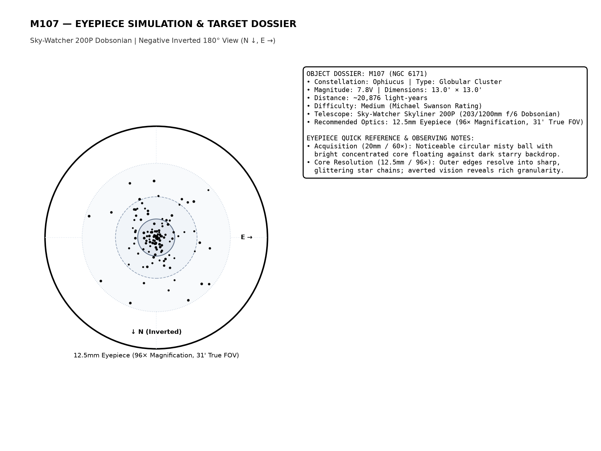

### 2. Constellation Context & Regional Orientation Chart
> [!TIP]
> **Viewport Context** presents a wide ~50°–65° naked-eye orientation field (stars down to visual magnitude 6.5) with official IAU constellation guide lines. The dashed bounding box marks the exact area covered by the wide-field star-hopping chart below.

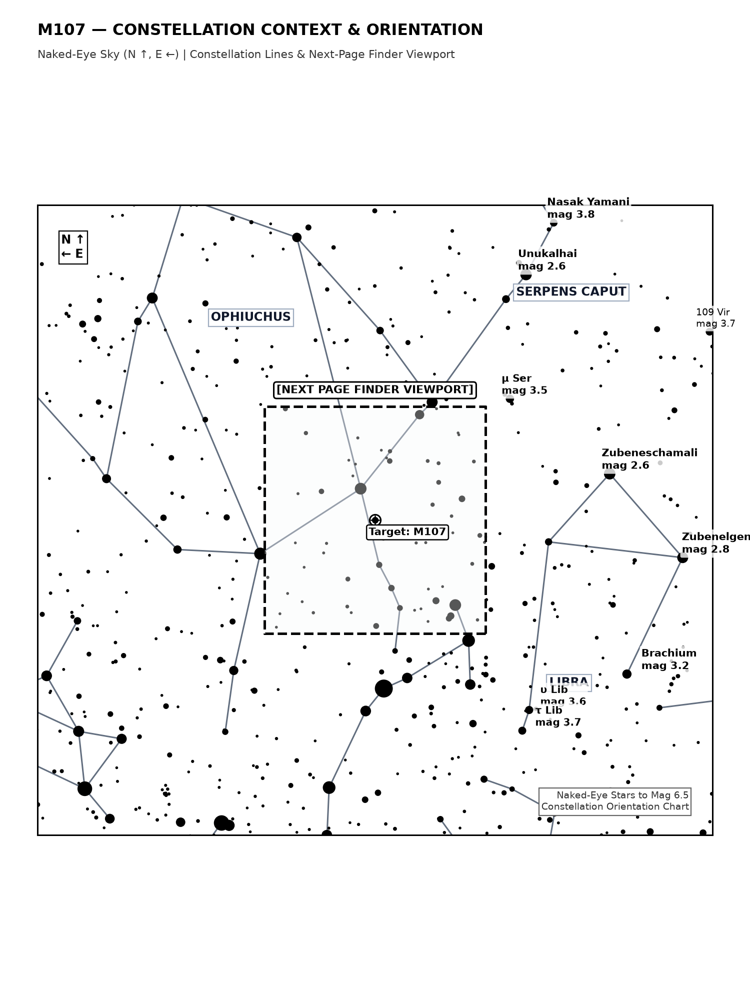

### 3. Wide-Field Star-Hopping Finder Chart
> [!IMPORTANT]
> **Viewport A** provides an upright naked-eye / optical finder orientation (N ↑, E ←) with stars down to visual magnitude 8.5. Standard concentric Telrad rings (0.5°, 2.0°, 4.0°) and 5.0° finder circle are centered directly on the target.

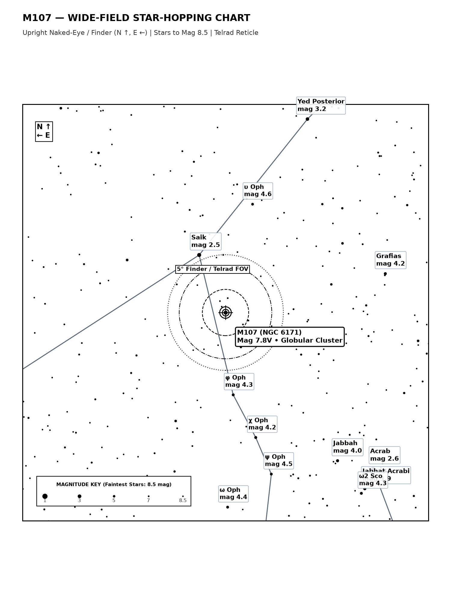

*([📄 Open Full High-Resolution Master A4 Finder Chart](shared/m107/chart_skywatcher-skyliner-200p.png))*

### 4. Observing Strategy & Step-by-Step Hop Instructions

- **Acquisition & Framing (20mm Super / 60×, 50' FOV)**:
  Noticeable circular misty ball with bright concentrated core floating against a dark starry backdrop in Ophiucus.
- **High-Power Inspection & Detail (12.5mm / 96×, 31' FOV)**:
  12.5mm (96×) resolves the outer edges into sharp, glittering diamond star points; averted vision reveals rich granularity across the core.

**Step-by-Step Star Hop Narrative**:
Locate anchor constellation Ophiucus on the Context Chart. Slew Telrad reticle to RA 248.13°, Dec -13.05° and center the fuzzy ball in the 20mm finder eyepiece.

---

## M108 (NGC 3556) — Ursa Major

[↑ Back to Catalog Index](#messier-catalog-index) • [← Previous: M107](#m107) • [Next: M109 →](#m109)

| Technical Parameter | Specification |
| :--- | :--- |
| **Designation** | M108 (NGC 3556) |
| **Constellation** | Ursa Major |
| **Classification** | Spiral Galaxy (Galaxy) |
| **Visual Magnitude ($V$)** | 10.0 mag |
| **Apparent Dimensions** | 8.7' × 2.2' |
| **Estimated Distance** | ~14.1 million light-years |
| **Swanson Difficulty** | **Hard** (*NexStar User's Guide II*) |
| **Coordinates (J2000)** | RA **11h 11m 31.0s** • Dec **+55° 40' 26.8"** |
| **Recommended Eyepiece** | 12.5mm (96× magnification, 31' TFOV, 2.1mm exit pupil) |

### 1. Telescope Eyepiece Simulation & Technical Dossier
> [!NOTE]
> **Viewport B** depicts the pre-inverted 180° field view through the Newtonian reflector (12.5mm eyepiece / 96× magnification, 31' true field of view: South at top, West at left, N ↓, E →). **Viewport C** integrates target ephemeris and optical notes.

### 2. Constellation Context & Regional Orientation Chart
> [!TIP]
> **Viewport Context** presents a wide ~50°–65° naked-eye orientation field (stars down to visual magnitude 6.5) with official IAU constellation guide lines. The dashed bounding box marks the exact area covered by the wide-field star-hopping chart below.

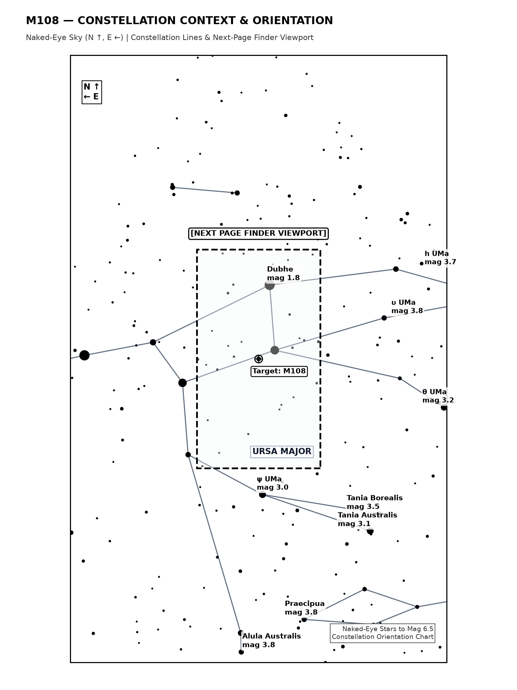

### 3. Wide-Field Star-Hopping Finder Chart
> [!IMPORTANT]
> **Viewport A** provides an upright naked-eye / optical finder orientation (N ↑, E ←) with stars down to visual magnitude 8.5. Standard concentric Telrad rings (0.5°, 2.0°, 4.0°) and 5.0° finder circle are centered directly on the target.

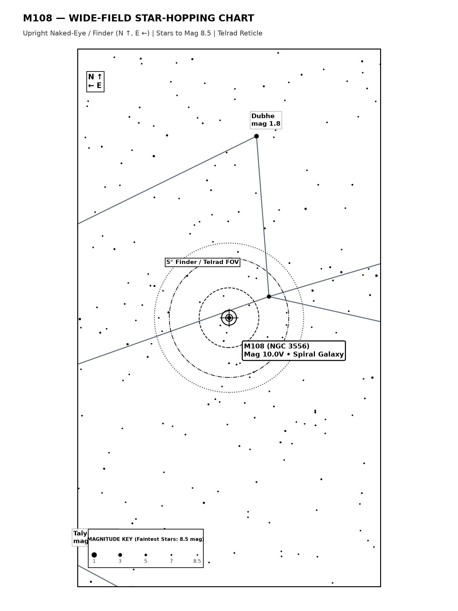

*([📄 Open Full High-Resolution Master A4 Finder Chart](shared/m108/chart_skywatcher-skyliner-200p.png))*

### 4. Observing Strategy & Step-by-Step Hop Instructions

- **Acquisition & Framing (20mm Super / 60×, 50' FOV)**:
  Ethereal oval glow with condensed galactic nucleus; framing the galaxy within the wide 50' field maximizes contrast against the sky.
- **High-Power Inspection & Detail (12.5mm / 96×, 31' FOV)**:
  12.5mm (96×) darkens the background sky, aiding detection of subtle core elongation, dust lanes, and halo extent with averted vision.

**Step-by-Step Star Hop Narrative**:
Locate constellation Ursa Major. Follow the guide stars on the Wide-Field Chart to RA 167.88°, Dec 55.67°; look for a soft hazy smudge.

---

## M109 (NGC 3992) — Ursa Major

[↑ Back to Catalog Index](#messier-catalog-index) • [← Previous: M108](#m108) • [Next: M110 →](#m110)

| Technical Parameter | Specification |
| :--- | :--- |
| **Designation** | M109 (NGC 3992) |
| **Constellation** | Ursa Major |
| **Classification** | Spiral Galaxy (Galaxy) |
| **Visual Magnitude ($V$)** | 9.8 mag |
| **Apparent Dimensions** | 7.6' × 4.7' |
| **Estimated Distance** | ~25.6 million light-years |
| **Swanson Difficulty** | **Hard** (*NexStar User's Guide II*) |
| **Coordinates (J2000)** | RA **11h 57m 36.0s** • Dec **+53° 22' 28.3"** |
| **Recommended Eyepiece** | 12.5mm (96× magnification, 31' TFOV, 2.1mm exit pupil) |

### 1. Telescope Eyepiece Simulation & Technical Dossier
> [!NOTE]
> **Viewport B** depicts the pre-inverted 180° field view through the Newtonian reflector (12.5mm eyepiece / 96× magnification, 31' true field of view: South at top, West at left, N ↓, E →). **Viewport C** integrates target ephemeris and optical notes.

### 2. Constellation Context & Regional Orientation Chart
> [!TIP]
> **Viewport Context** presents a wide ~50°–65° naked-eye orientation field (stars down to visual magnitude 6.5) with official IAU constellation guide lines. The dashed bounding box marks the exact area covered by the wide-field star-hopping chart below.

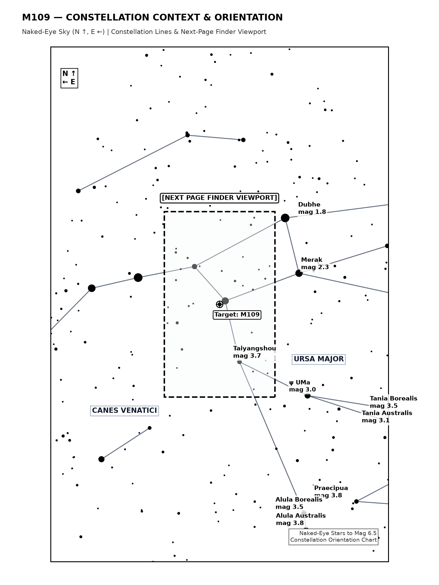

### 3. Wide-Field Star-Hopping Finder Chart
> [!IMPORTANT]
> **Viewport A** provides an upright naked-eye / optical finder orientation (N ↑, E ←) with stars down to visual magnitude 8.5. Standard concentric Telrad rings (0.5°, 2.0°, 4.0°) and 5.0° finder circle are centered directly on the target.

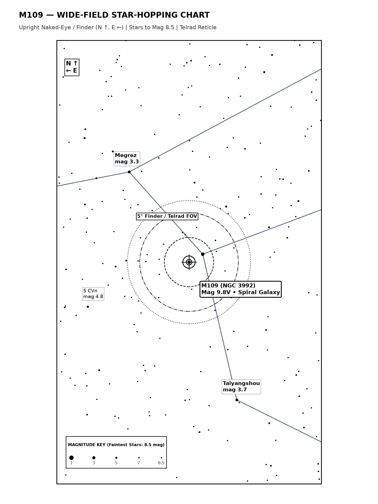

*([📄 Open Full High-Resolution Master A4 Finder Chart](shared/m109/chart_skywatcher-skyliner-200p.png))*

### 4. Observing Strategy & Step-by-Step Hop Instructions

- **Acquisition & Framing (20mm Super / 60×, 50' FOV)**:
  Ethereal oval glow with condensed galactic nucleus; framing the galaxy within the wide 50' field maximizes contrast against the sky.
- **High-Power Inspection & Detail (12.5mm / 96×, 31' FOV)**:
  12.5mm (96×) darkens the background sky, aiding detection of subtle core elongation, dust lanes, and halo extent with averted vision.

**Step-by-Step Star Hop Narrative**:
Locate constellation Ursa Major. Follow the guide stars on the Wide-Field Chart to RA 179.40°, Dec 53.37°; look for a soft hazy smudge.

---

## M110 Satellite of M31 (NGC 205) — Andromeda

[↑ Back to Catalog Index](#messier-catalog-index) • [← Previous: M109](#m109) • [Next: M1 →](#m1)

| Technical Parameter | Specification |
| :--- | :--- |
| **Designation** | M110 (NGC 205) |
| **Common Name** | **Satellite of M31** |
| **Constellation** | Andromeda |
| **Classification** | Elliptical Galaxy (Galaxy) |
| **Visual Magnitude ($V$)** | 8.1 mag |
| **Apparent Dimensions** | 21.9' × 11.0' |
| **Estimated Distance** | ~2,687,888 light-years |
| **Swanson Difficulty** | **Hard** (*NexStar User's Guide II*) |
| **Coordinates (J2000)** | RA **0h 40m 22.1s** • Dec **+41° 41' 07.1"** |
| **Recommended Eyepiece** | 20mm (60× magnification, 49' TFOV, 3.4mm exit pupil) |

### 1. Telescope Eyepiece Simulation & Technical Dossier
> [!NOTE]
> **Viewport B** depicts the pre-inverted 180° field view through the Newtonian reflector (20mm eyepiece / 60× magnification, 49' true field of view: South at top, West at left, N ↓, E →). **Viewport C** integrates target ephemeris and optical notes.

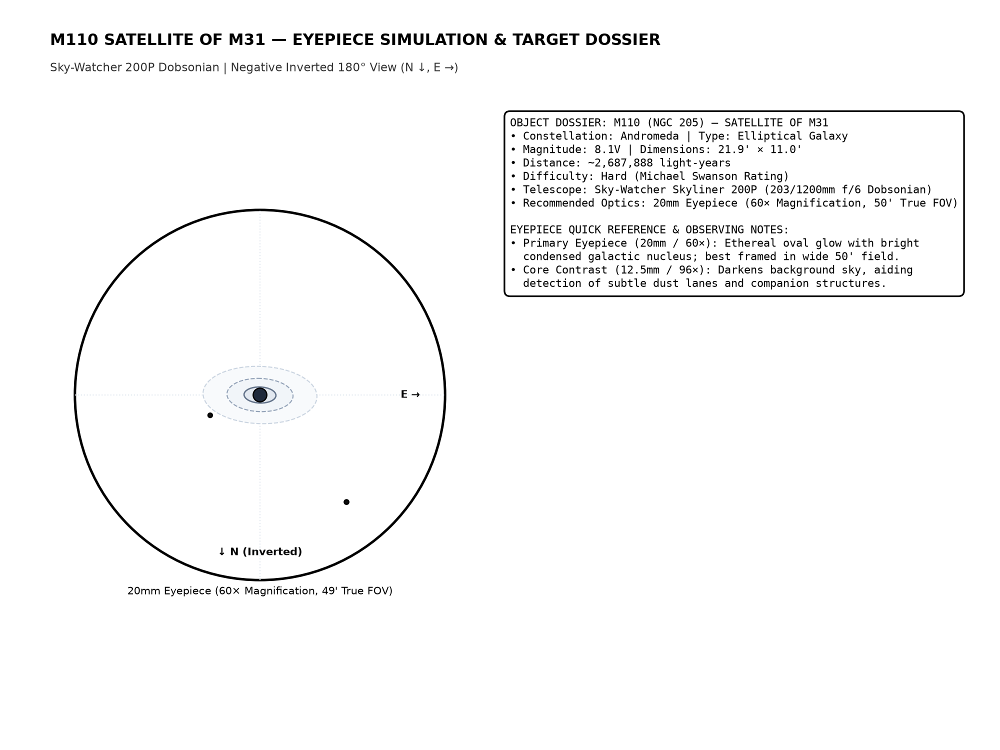

### 2. Constellation Context & Regional Orientation Chart
> [!TIP]
> **Viewport Context** presents a wide ~50°–65° naked-eye orientation field (stars down to visual magnitude 6.5) with official IAU constellation guide lines. The dashed bounding box marks the exact area covered by the wide-field star-hopping chart below.

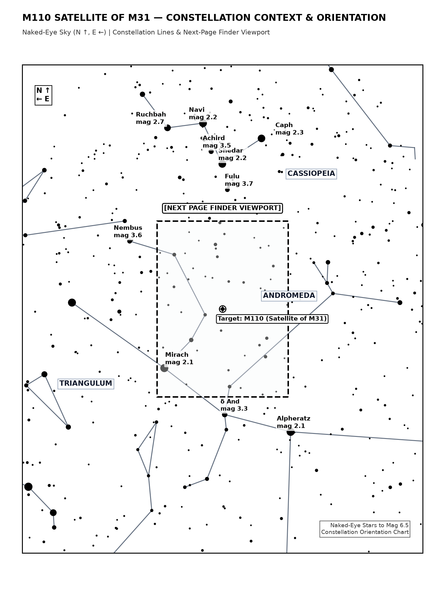

### 3. Wide-Field Star-Hopping Finder Chart
> [!IMPORTANT]
> **Viewport A** provides an upright naked-eye / optical finder orientation (N ↑, E ←) with stars down to visual magnitude 8.5. Standard concentric Telrad rings (0.5°, 2.0°, 4.0°) and 5.0° finder circle are centered directly on the target.

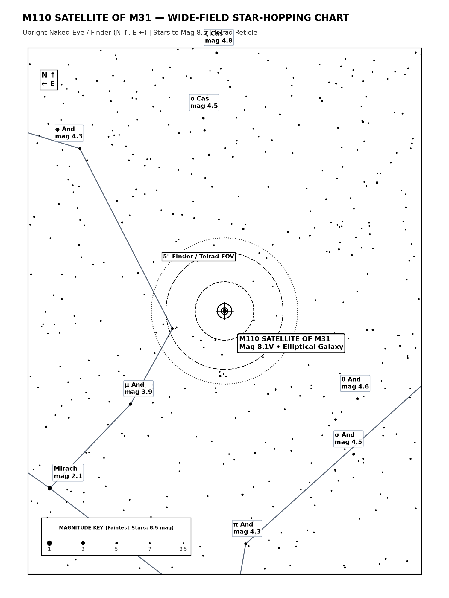

*([📄 Open Full High-Resolution Master A4 Finder Chart](shared/m110/chart_skywatcher-skyliner-200p.png))*

### 4. Observing Strategy & Step-by-Step Hop Instructions

- **Acquisition & Framing (20mm Super / 60×, 50' FOV)**:
  Ethereal oval glow with condensed galactic nucleus; framing the galaxy within the wide 50' field maximizes contrast against the sky.
- **High-Power Inspection & Detail (20mm / 60×, 49' FOV)**:
  20mm (60×) darkens the background sky, aiding detection of subtle core elongation, dust lanes, and halo extent with averted vision.

**Step-by-Step Star Hop Narrative**:
Locate constellation Andromeda. Follow the guide stars on the Wide-Field Chart to RA 10.09°, Dec 41.69°; look for a soft hazy smudge.

---

