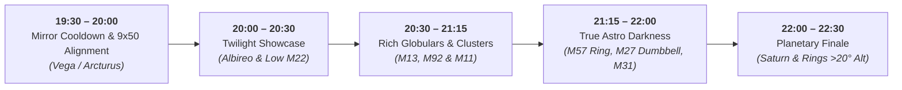

# 🌌 Dvigrad Stargazing Party — Master Observation Plan & Field Guide
**Date**: Saturday, September 12, 2026  
**Time Window**: 20:00 – 22:30 CEST (UTC+2)  
**Location**: Dvigrad Medieval Fortress ruins, Kanfanar, Istria, Croatia (`4RG7+G5 Kanfanar`)  
**Coordinates**: 45.12637° N, 13.81296° E | Elevation: 143 m  
**Primary Instrument**: Sky-Watcher Skyliner Classic 200P Dobsonian (200 mm / 8" Newtonian Reflector, f/6, 1200 mm FL)  

---

## 1. Executive Summary & Site Conditions

### 1.1 Location & Light Pollution Analysis
The ruins of Dvigrad are situated in the deep, protected Lim Valley (Draga) depression. This topography shields the site from direct line-of-sight suburban glare from Rovinj (west) and Pula (south).
- **Bortle Class**: **Class 4** (Rural / Suburban Transition).
- **Zenith Sky Brightness**: **20.86 – 21.15 mag/arcsec²** (clean, high-contrast dark sky).
- **Naked-Eye Limiting Magnitude (NELM)**: **6.0 – 6.2 mag** at zenith.
- **Artificial Brightness**: 203 – 316 µcd/m².
- **Milky Way Visibility**: The Great Rift through Cygnus, Aquila, and Scutum is clearly visible to the naked eye with structured dark clouds and mottling.

### 1.2 Horizon Obstructions & Local Geography
The limestone valley walls and surrounding Istrian oak/pine forest produce a **10° to 15° horizon obstruction** in all azimuths:
- **South & South-West**: The low Draga valley walls rise ~12°–15°. Deep southern targets (Sagittarius core, Lagoon M8, Trifid M20) sink into the trees very early.
- **East & North-East**: Terrain slope rises ~10°–14°. Rising targets (Saturn, Perseus) must reach ~15° altitude before emerging from ground foliage and boundary-layer thermal turbulence.
- **Zenith & High Skies (>30°)**: Completely unobstructed, crystalline transparency.

### 1.3 Moon Ephemeris — Pristine Darkness!
- **Phase**: Waxing Crescent (only **3.1% illuminated**, 1.1 days after New Moon).
- **Moonset**: **19:38 CEST** (Azimuth 262° W).
- **Observation Impact**: **ZERO lunar light pollution**. During the observation party window (20:00 – 22:30 CEST), the Moon is already well below the horizon (-4° to -30° altitude). You will enjoy genuine Bortle 4 contrast for faint deep-sky nebulae and galaxies!

---

## 2. Twilight & Astronomical Timeline (2026-09-12)

```mermaid
gantt
    title Dvigrad Stargazing Party Timeline (CEST)
    dateFormat HH:mm
    axisFormat %H:%M
    section Sun & Sky
    Sunset (19:19)                       :milestone, 19:19, 19:19
    Civil Twilight (to 19:50)            :done, 19:19, 19:50
    Moonset (19:38)                      :milestone, 19:38, 19:38
    Nautical Twilight (to 20:26)         :active, 19:50, 20:26
    Astronomical Twilight (to 21:05)     :active, 20:26, 21:05
    True Astro Darkness (Moonless)       :crit, active, 21:05, 22:30
    section Telescope Program
    Mirror Cooldown & Alignment          :done, 19:30, 20:00
    Twilight Showcase (Albireo, M22)     :active, 20:00, 20:30
    Deep Globulars & Clusters (M13, M92, M11) :active, 20:30, 21:15
    Peak Deep Sky (M57, M27, M31, Double Cl.) :crit, active, 21:15, 22:00
    Planetary Finale (Saturn & Titan)    :active, 22:00, 22:30
```

| Phase | Time Window (CEST) | Sun Altitude | Visual & Telescopic Notes |
| :--- | :---: | :---: | :--- |
| **Setup & Cooldown** | 19:30 – 20:00 | -2° to -8° | Unpack 200P Dobsonian; allow primary mirror to thermally equilibrate. Align 9x50 finder on bright dusk stars (Vega, Arcturus). |
| **Nautical Twilight** | 20:00 – 20:26 | -8° to -12° | Sky darkens from deep blue to slate. Bright stars and constellations emerge. Best time for double stars (Albireo) and low-altitude southern sweep (M22). |
| **Astro Twilight** | 20:26 – 21:05 | -12° to -18° | Fainter Milky Way dust lanes appear. Globular clusters pop into view (M13, M92). |
| **Astronomical Darkness** | **21:05 – 22:30+** | **< -18.0°** | **True maximum darkness.** Zero atmospheric scattering from the Sun. Peak window for diffuse nebulae (M57, M27) and external galaxies (M31, M32, M110). |

---

## 3. Optical Configuration: Sky-Watcher 200P Dobsonian

| Specification | Metric | Practical Field Meaning |
| :--- | :--- | :--- |
| **Aperture ($D$)** | 200 mm (7.87 inches) | Collects 820× more light than the human eye. |
| **Focal Length ($F$)** | 1200 mm | Fast/moderate Newtonian ($f/6$) with mild coma at edge of wide fields. |
| **Resolving Limit** | 0.58 arcseconds (Dawes) | Easily resolves tight binary pairs and planetary ring divisions. |
| **Limiting Magnitude** | ~13.3 – 14.0 mag | Readily reveals faint stars, planetary nebula central stars, and dwarf satellite galaxies. |

### Eyepiece Capabilities
1. **20 mm Eyepiece (Wide-Field / Finder)**:
   - **Magnification**: **60×** ($1200 / 20$)
   - **Exit Pupil**: **3.3 mm** (Bright, high-contrast image ideal for faint extended nebulae and large galaxies).
   - **True Field of View (TFOV)**: **~50 arcminutes (0.83°)** (~1.6× diameter of the Full Moon).
   - **Primary Use**: Initial star-hopping acquisition, framing the entire Andromeda Galaxy core & companions, and sprawling open clusters like the Double Cluster.
2. **12.5 mm Eyepiece (High-Power / Resolution)**:
   - **Magnification**: **96×** ($1200 / 12.5$)
   - **Exit Pupil**: **2.1 mm** (Darkens background sky glow, enhancing visibility of stellar cores).
   - **True Field of View (TFOV)**: **~31 arcminutes (0.52°)** (~1 Full Moon diameter).
   - **Primary Use**: Resolving individual pinprick stars in M13, M92, and M11; discerning the smoke-ring hole of M57; viewing the rings and moons of Saturn.

---

## 4. Curated Target Catalog

All coordinates and Alt/Az ephemerides are calculated specifically for **Dvigrad at 21:15 CEST (mid-session)**:

| # | Target Name | Constellation | Type | Mag | Size | Alt / Az @ 21:15 | Recommended Eyepiece | Chart Reference |
| :-: | :--- | :--- | :--- | :-: | :-: | :-: | :-: | :--- |
| **1** | **Albireo ($\beta$ Cygni)** | Cygnus | Double Star | 3.1 / 5.1 | 34.3" sep | 73° / 170° (S) | 20mm & 12.5mm | [Chart 2](file:///home/branko/Documents/repos/github.com/btoic/stargazing/observations/dvigrad-2026-09-12/charts/chart_2_vulpecula_m27_albireo.pdf) |
| **2** | **M22 (NGC 6656)** | Sagittarius | Globular Cl. | 5.1 | 32.0' | 17.5° / 195° (SSW) | 20mm $\rightarrow$ 12.5mm | [Full Sky Map](file:///home/branko/Documents/repos/github.com/btoic/stargazing/observations/dvigrad-2026-09-12/full_sky_map.pdf) *(Observe early!)* |
| **3** | **M13 (Great Globular)** | Hercules | Globular Cl. | 5.8 | 20.0' | 63.4° / 268° (W) | 12.5mm (96×) | [Chart 3](file:///home/branko/Documents/repos/github.com/btoic/stargazing/observations/dvigrad-2026-09-12/charts/chart_3_hercules_m13_m92.pdf) |
| **4** | **M92 (NGC 6341)** | Hercules | Globular Cl. | 6.3 | 14.0' | 71.2° / 295° (WNW) | 12.5mm (96×) | [Chart 3](file:///home/branko/Documents/repos/github.com/btoic/stargazing/observations/dvigrad-2026-09-12/charts/chart_3_hercules_m13_m92.pdf) |
| **5** | **M11 (Wild Duck Cluster)** | Scutum | Open Cluster | 5.8 | 14.0' | 35.2° / 205° (SSW) | 20mm & 12.5mm | [Chart 6](file:///home/branko/Documents/repos/github.com/btoic/stargazing/observations/dvigrad-2026-09-12/charts/chart_6_scutum_m11_and_saturn.pdf) |
| **6** | **M57 (Ring Nebula)** | Lyra | Planetary Neb. | 8.8 | 1.4' × 1.0' | 76.1° / 222° (SW) | 12.5mm (96×) | [Chart 1](file:///home/branko/Documents/repos/github.com/btoic/stargazing/observations/dvigrad-2026-09-12/charts/chart_1_lyra_m57.pdf) |
| **7** | **M27 (Dumbbell Nebula)** | Vulpecula | Planetary Neb. | 7.4 | 8.0' × 5.6' | 68.2° / 164° (SSE) | 20mm (60×) | [Chart 2](file:///home/branko/Documents/repos/github.com/btoic/stargazing/observations/dvigrad-2026-09-12/charts/chart_2_vulpecula_m27_albireo.pdf) |
| **8** | **Double Cluster (NGC 869/884)** | Perseus | Dual Open Cl. | 3.7 / 3.8 | 60.0' | 34.1° / 038° (NE) | 20mm (60×) | [Chart 5](file:///home/branko/Documents/repos/github.com/btoic/stargazing/observations/dvigrad-2026-09-12/charts/chart_5_perseus_double_cluster.pdf) |
| **9** | **M31 (Andromeda Galaxy)** | Andromeda | Spiral Galaxy | 3.4 | 190' × 60' | 43.5° / 068° (ENE) | 20mm (60×) | [Chart 4](file:///home/branko/Documents/repos/github.com/btoic/stargazing/observations/dvigrad-2026-09-12/charts/chart_4_andromeda_m31.pdf) |
| **10** | **Saturn & Titan** | Aquarius | Planet & Rings | +0.6 | 19.2" (disk) | 18°–23° / 115° (ESE) | 12.5mm (96×) | [Chart 6](file:///home/branko/Documents/repos/github.com/btoic/stargazing/observations/dvigrad-2026-09-12/charts/chart_6_scutum_m11_and_saturn.pdf) |

---

## 5. Practical Field Protocols for Dvigrad

> [!NOTE]
> **Star-Hopping Instructions & Eyepiece Views**: Detailed step-by-step star-hopping narratives, Telrad reticle alignments, and inverted 180° telescope eyepiece simulations have been omitted from this master summary to keep it compact and printable. Complete field instructions for each object are located directly on the corresponding finder chart in [Section 6](#6-field-chart-assets-directory).

### 5.1 Valley Humidity & Dew Management
Dvigrad lies at the floor of the Draga valley, where nocturnal cold-air drainage concentrates moisture.
- **Secondary Mirror**: The diagonal flat mirror on Newtonian reflectors is susceptible to dew. Keep the front dust cover on the telescope while socializing or during breaks.
- **Eyepieces**: Keep unmounted eyepieces in your pockets or in a closed foam case so your body heat prevents condensation on the glass.
- **Dew Shield**: If you have a flexible foam or cardboard collar extending 1.5× the tube diameter past the front rim, use it!

### 5.2 Dark Adaptation & Ergonomics
- **Red Flashlights Only**: White light destroys rhodopsin in the retinas; full dark adaptation requires 20–30 minutes. Shield phone screens with deep red film or disable them entirely.
- **The "Zenith Trap" (Dobson's Hole)**:
  - Objects straight overhead (>80° altitude, such as Vega and M57) can be clumsy to track in an Alt-Az Dobsonian because azimuth movements require swinging the entire heavy rocker box around rapidly.
  - **Pro Tip**: Observe M57 and Albireo between 21:00 and 21:45 when they have rolled slightly past the meridian (70°–75°), making manual nudging smooth and intuitive.
- **Saturn Timing**:
  - Saturn clears Dvigrad's 15° valley obstruction at 21:40 CEST. Reserve the 22:00–22:30 window to observe its edge-on ring system and Titan at >20° altitude above turbulent surface air.
- **Observation Chair / Stool**:
  - An adjustable stool or camping chair dramatically improves observer comfort and stability. Observers who sit down can hold their eye at the exit pupil steadily, seeing up to 1 full magnitude fainter detail!

---

## 6. Field Chart Assets Directory

All maps and finder charts are generated in high-resolution vector PDF and PNG formats, optimized with **toner-saver negative eyepiece simulations** and **monochrome B/W printing layouts**:

- 🗺️ **Full Night Sky Planisphere (All Horizons & Constellations)**:  
  [full_sky_map.pdf](file:///home/branko/Documents/repos/github.com/btoic/stargazing/observations/dvigrad-2026-09-12/full_sky_map.pdf) | [full_sky_map.png](file:///home/branko/Documents/repos/github.com/btoic/stargazing/observations/dvigrad-2026-09-12/full_sky_map.png)
- 🔭 **Chart 1: M57 Ring Nebula in Lyra**:  
  [chart_1_lyra_m57.pdf](file:///home/branko/Documents/repos/github.com/btoic/stargazing/observations/dvigrad-2026-09-12/charts/chart_1_lyra_m57.pdf) | [chart_1_lyra_m57.png](file:///home/branko/Documents/repos/github.com/btoic/stargazing/observations/dvigrad-2026-09-12/charts/chart_1_lyra_m57.png)
- 🔭 **Chart 2: M27 Dumbbell Nebula & Albireo in Vulpecula / Cygnus**:  
  [chart_2_vulpecula_m27_albireo.pdf](file:///home/branko/Documents/repos/github.com/btoic/stargazing/observations/dvigrad-2026-09-12/charts/chart_2_vulpecula_m27_albireo.pdf) | [chart_2_vulpecula_m27_albireo.png](file:///home/branko/Documents/repos/github.com/btoic/stargazing/observations/dvigrad-2026-09-12/charts/chart_2_vulpecula_m27_albireo.png)
- 🔭 **Chart 3: M13 & M92 Globular Clusters in Hercules**:  
  [chart_3_hercules_m13_m92.pdf](file:///home/branko/Documents/repos/github.com/btoic/stargazing/observations/dvigrad-2026-09-12/charts/chart_3_hercules_m13_m92.pdf) | [chart_3_hercules_m13_m92.png](file:///home/branko/Documents/repos/github.com/btoic/stargazing/observations/dvigrad-2026-09-12/charts/chart_3_hercules_m13_m92.png)
- 🔭 **Chart 4: M31 Andromeda Galaxy, M32 & M110**:  
  [chart_4_andromeda_m31.pdf](file:///home/branko/Documents/repos/github.com/btoic/stargazing/observations/dvigrad-2026-09-12/charts/chart_4_andromeda_m31.pdf) | [chart_4_andromeda_m31.png](file:///home/branko/Documents/repos/github.com/btoic/stargazing/observations/dvigrad-2026-09-12/charts/chart_4_andromeda_m31.png)
- 🔭 **Chart 5: Double Cluster (NGC 869 / 884) in Perseus**:  
  [chart_5_perseus_double_cluster.pdf](file:///home/branko/Documents/repos/github.com/btoic/stargazing/observations/dvigrad-2026-09-12/charts/chart_5_perseus_double_cluster.pdf) | [chart_5_perseus_double_cluster.png](file:///home/branko/Documents/repos/github.com/btoic/stargazing/observations/dvigrad-2026-09-12/charts/chart_5_perseus_double_cluster.png)
- 🔭 **Chart 6: M11 Wild Duck Cluster & Saturn in Scutum / Aquarius**:  
  [chart_6_scutum_m11_and_saturn.pdf](file:///home/branko/Documents/repos/github.com/btoic/stargazing/observations/dvigrad-2026-09-12/charts/chart_6_scutum_m11_and_saturn.pdf) | [chart_6_scutum_m11_and_saturn.png](file:///home/branko/Documents/repos/github.com/btoic/stargazing/observations/dvigrad-2026-09-12/charts/chart_6_scutum_m11_and_saturn.png)
