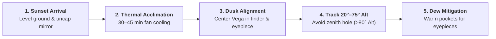

# Tutorial: Dobsonian Field Craft & Thermal Management

Operating a large aperture Dobsonian telescope (200 mm / 8" or larger) requires practical field awareness to unlock its full optical performance.

---

## 1. Primary Mirror Acclimation (Thermal Equilibrium)

A 200 mm glass mirror has significant thermal mass. When transported from a warm room or vehicle into the cooler nighttime air:
- The mirror stays warm while the ambient air drops.
- A turbulent boundary layer of warm, buoyant air forms directly over the parabolic optical face.
- Light rays pass through this boiling air boundary, causing stars to bloat and fine details (lunar craterlets, planetary belts, globular cluster pinpricks) to blur.

### Practical Rules:
1. **Unpack 30–45 minutes prior to dark**: Set up the telescope during sunset or civil twilight.
2. **Remove the front dust cover and rear cap**: Allow air circulation around the primary mirror cell.
3. **Cooling Fans**: If your Dobsonian has a rear battery-powered cooling fan, run it for the first 30 minutes to scrub the boundary layer.

---

## 2. Navigating the Zenith Trap ("Dobson's Hole")

Because a Dobsonian mount operates on simple Altitude (up/down) and Azimuth (left/right turntable) axes:
- Near the zenith (altitudes >80°), the azimuth axis is pointed almost directly at the target.
- A tiny sideways displacement of the object requires a huge, fast rotation of the entire heavy rocker box on its Teflon pads.
- Manual tracking becomes jerky and frustrating.

### Field Solutions:
- **Time your observations**: Observe objects when they are between **50° and 75° altitude**.
- If a target passes directly overhead (e.g. Vega or M57), observe it 30–45 minutes *before* or *after* its zenith meridian transit.

---

## 3. Valley Humidity & Dew Prevention

Observation sites situated in depressions, river valleys, or karst basins (such as Dvigrad's Lim Valley / Draga) experience nocturnal **cold-air drainage**, which rapidly drives the local microclimate toward 100% relative humidity.

### Prevention Measures:
- **Eyepiece Protection**:
  - Keep eyepieces you are not actively using inside warm interior jacket pockets or closed foam cases. Body warmth keeps the glass above the ambient dew point.
  - Never breathe directly onto cold eyepiece eye-lenses.
- **Secondary Mirror Dew Shield**:
  - Newtonian secondary mirrors sit near the open top rim of the tube and radiate heat directly into the freezing night sky.
  - Attach a lightweight foam or cardboard collar extending 1.5× the tube diameter past the front spider to act as a radiant dew shield.
- **Dust Covers During Breaks**:
  - When taking a break for refreshments or socializing, always put the front dust cover back onto the telescope tube.

---

## 4. Dark Adaptation & Visual Physiology

Human night vision relies on retinal rod cells, which produce the light-sensitive photopigment **rhodopsin**.
- **Adaptation Time**: Full dark adaptation takes **20 to 30 minutes** in total darkness.
- **White Light Destruction**: Even a brief flash of white light (such as unlocking a smartphone or a car headlight) instantly bleaches rhodopsin, resetting the adaptation cycle to zero.
- **Red Light Only**: Deep red light (>650 nm) does not bleach rhodopsin. Use dim red LED headlamps or apply red cellophane film to torches.
- **Averted Vision**: The central fovea of the eye consists exclusively of color-sensitive cone cells, which are blind in low light. The highest concentration of rod cells is located **10° to 15° off-center**. Look slightly to the side of a faint object (like M31 dust lanes or M57's ring core) to see it brighten dramatically!
