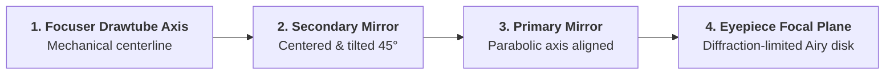
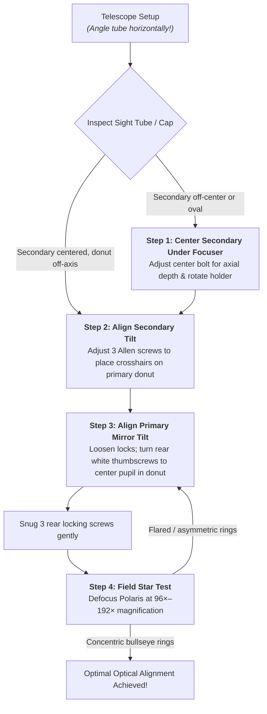
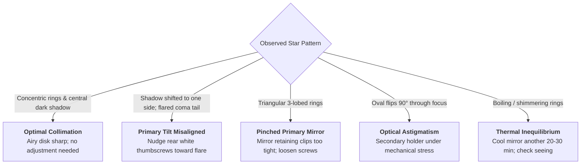

# Tutorial: Newtonian Dobsonian Mirror Collimation Guide
**Instrument**: Sky-Watcher Skyliner Classic 200P Dobsonian (200 mm / 8" Newtonian Reflector, $f/6$, 1200 mm FL)  
**Printable Field Guide**: [dobsonian-mirror-collimation.pdf](file:///home/branko/Documents/repos/github.com/btoic/stargazing/tutorials/dobsonian-mirror-collimation.pdf) (Publication-Quality 3-Page PDF)

---

## 1. Introduction & Optical Fundamentals

Collimation is the process of precisely aligning the optical axes of a telescope's mirrors so that all light collected across the 200 mm aperture converges into a single, diffraction-limited focal point.

In a Newtonian reflector, three mechanical axes must be brought into alignment:
1. **Focuser Mechanical Axis**: The geometric centerline of the 2" Crayford drawtube.
2. **Secondary Mirror (Diagonal Flat)**: Positioned squarely under the focuser and tilted at exactly $45^\circ$ to fold the optical cone into the eyepiece.
3. **Primary Mirror Optical Axis**: The parabolic optical axis of the 200 mm primary mirror, which must reflect back directly along the center of the secondary mirror and into the eyepiece.

> [!CAUTION]
> ### CRITICAL SAFETY PROTOCOL: TILT TUBE HORIZONTALLY BEFORE COLLIMATING!
> 1. **Never collimate with the optical tube pointing straight up!** If an Allen key, screwdriver, or thumbscrew slips from cold fingers, it will fall directly down the tube and shatter or scratch the 200 mm parabolic primary mirror coatings.
> 2. **Position the tube horizontally or tilted 20°–30° above the ground.** If a tool is dropped, it will safely hit the steel tube wall without touching optical surfaces.
> 3. **Never overtighten screws:** Firm finger tightness is sufficient. Excessive torque on mirror clips or locking screws creates severe optical astigmatism (pinched optics).

---

## 2. Collimation Tools Overview

| Tool | Mechanism | Best Used For | Notes for Sky-Watcher 200P |
| :--- | :--- | :--- | :--- |
| **Collimation Cap** | Simple plastic plug with a 1.5 mm central peephole and reflective foil underside. | Primary & secondary rough alignment. | Included with most telescopes; immune to calibration drift. |
| **Cheshire / Sight Tube** | Metal barrel with crosshairs at the bottom and a 45° reflective side cutout. | **All 3 steps** (Secondary position, secondary tilt, primary tilt). | The most reliable and complete passive optical alignment tool. |
| **Laser Collimator** | 1.25" barrel emitting a red diode beam and 45° angled bullseye target plate. | Fast nighttime checks of secondary and primary tilt. | Only reliable if the laser itself is verified/collimated in a V-block first! |
| **Field Star Test** | High-power eyepiece (12.5 mm or Barlowed to 150×–200×) viewing Polaris. | **Final definitive wavefront verification.** | Directly reveals diffraction rings and coma without any tool error. |

---

## 3. Mechanical Hardware Controls

On the Sky-Watcher Skyliner 200P Dobsonian, collimation adjustments are split between the **secondary spider hub** (top of tube) and the **primary rear cell** (bottom of tube).

### 3.1 Secondary Mirror Spider & Hub (Front View)
- **Center Hub Screw (Phillips / Slotted)**: Controls the axial position (depth) of the secondary mirror holder along the length of the optical tube, and allows rotation of the holder face toward the focuser.
- **Three Allen / Hex Tilt Screws (2.0 or 2.5 mm)**: Spaced at 120° intervals around the center bolt. Tightening or loosening these tilts the secondary mirror angle to aim the reflection at the primary mirror.

### 3.2 Primary Mirror Cell (Rear View)
- **Three Large White/Silver Thumbscrews**: Collimation adjustment screws. Turning these compresses internal heavy-duty springs, tilting the primary mirror.
- **Three Small Black Thumbscrews**: Locking screws. These push directly against the mirror cell to lock its position against gravitational drift.
  - **Crucial Rule**: The 3 black locking screws **must be backed off by 1/2 turn counter-clockwise before adjusting the white collimation thumbscrews**, and gently snugged afterward.

---

## 4. The 3-Step Collimation Procedure

Follow these three steps in strict sequence. Looking through a **Cheshire Eyepiece** or **Collimation Cap**, observe the circular reflections down the drawtube:

---

### Step 1: Center Secondary Mirror Under Focuser (Panel B)
**Goal**: Ensure the secondary mirror is positioned squarely beneath the focuser drawtube and appears as a perfect circle.

1. Rack the focuser in, then slowly rack outward while looking through the collimation cap peephole until the outer edge of the secondary mirror is just slightly smaller than the inside barrel of the drawtube.
2. **Check Axial Centering (Left-Right in tube)**:
   - If the secondary mirror is too far up or down the tube, loosen the 3 Allen tilt screws slightly and turn the large center Phillips bolt to slide the secondary mirror holder along the tube axis until centered under the drawtube.
3. **Check Rotational Orientation (Shape)**:
   - If the secondary appears elliptical or egg-shaped rather than circular, grasp the secondary holder stalk by hand and gently rotate it until the reflective face points squarely at the focuser tube.
4. Snug the 3 Allen tilt screws lightly to hold the position.

---

### Step 2: Align Secondary Mirror Tilt (Panel C)
**Goal**: Direct the secondary mirror reflection straight down the optical tube so the focuser axis points at the primary mirror center donut.

1. Look through the sight tube / Cheshire crosshairs.
2. In the reflection of the primary mirror, confirm that **all three primary mirror support clips** are clearly and evenly visible around the perimeter.
3. Insert a 2.0 mm (or 2.5 mm) Allen key into the 3 tilt screws on the spider hub.
4. Make tiny adjustments (1/8-turn increments—as you tighten one, slightly loosen the opposing two).
5. Stop when the **crosshairs of the sight tube intersect dead-center inside the primary mirror center donut ring**.

---

### Step 3: Align Primary Mirror Tilt (Panel D)
**Goal**: Tilt the primary mirror so its optical axis coincides with the focuser axis, bringing the observer's eye / collimation cap pupil into the center of the donut ring.

1. Move to the rear of the telescope.
2. **Loosen the 3 small black locking screws** by 1/2 turn counter-clockwise.
3. Look through the collimation cap or Cheshire eyepiece. Locate the dark center spot (which is the reflection of your pupil or the collimation cap peephole).
4. Turn the **3 large white/silver thumbscrews** one at a time while watching how the black spot moves.
5. Adjust until the **black pupil spot sits dead-center inside the primary mirror donut ring**.
6. Gently snug the 3 black locking screws. Re-check the view—if the spot shifted during locking, counter-adjust slightly.

> [!TIP]
> **The Newtonian Optical Offset Phenomenon (Panel D)**:  
> When fully collimated, the outer focuser barrel, secondary mirror rim, primary reflection, and primary center donut will all appear **perfectly concentric**.  
> However, the dark silhouette reflection of the secondary mirror holder itself will appear **slightly shifted toward the primary mirror end of the tube**. This is completely normal and mathematically required in fast Newtonian optics ($f/4$–$f/6$) due to the conical geometry of the converging light beam!

---

## 5. Field Star Test Verification

The optical star test is the ultimate, real-sky verification of telescope collimation. It tests the complete optical train including thermal and mechanical effects.

### 5.1 How to Conduct the Star Test
1. **Acclimate Primary Mirror**: Allow the 200 mm glass mirror to cool outdoors for at least 30–45 minutes.
2. **Target Selection**: Pick a moderately bright 2nd or 3rd magnitude star high in the sky. **Polaris ($+2.0$ mag)** is ideal in the Northern Hemisphere because it does not drift out of the field of view while adjusting screws!
3. **High Magnification**: Insert your 12.5 mm eyepiece (96×), or add a 2× Barlow (192×).
4. **Dead-Center Positioning**: Center the star **precisely in the middle of the eyepiece field of view**. Newtonian reflectors suffer from natural off-axis coma; inspecting a star near the edge of the field of view will give a false indication of miscollimation!
5. **Defocus Slightly**: Turn the focuser knob 1/4 to 1/2 turn inside and outside of focus until 4–6 circular diffraction rings expand around the dark central silhouette of the secondary mirror.

---

### 5.2 Star Test Diagnosis & Action Guide

| Visual Symptom | Root Cause | Corrective Field Action |
| :--- | :--- | :--- |
| **Decentered Rings / Coma Flare** Secondary shadow shifted; flared comet-like tail at best focus. | Primary mirror tilt is slightly off-axis. | Keep star centered in field. Turn rear white thumbscrews in tiny 1/16-turn increments until rings become a symmetrical bullseye. |
| **Triangular / Trefoil Rings** Diffraction rings show 3 distinct flat sides or lobes. | **Pinched Optics**: Primary mirror support clips are screwed down too tightly against the mirror face. | Back off the retaining clip screws until a business card can slip freely between the rubber pad and mirror surface. |
| **Astigmatic Ellipse Flip** Star elongates into an ellipse that rotates 90° as you rack from intra-focal to extra-focal. | Secondary mirror pinched or glued under mechanical tension, or eyepiece astigmatism. | Loosen secondary center screw and 3 Allen screws slightly; ensure diagonal holder is not strained. |
| **Boiling, Wavering Rings** Diffraction pattern is turbulent, constantly vibrating. | Thermal boundary layer on warm primary mirror, or bad atmospheric turbulence (poor seeing). | Allow mirror to acclimate another 20–30 minutes. Run rear cooling fan. Pick a calmer observing night. |
| **Collimation Shifts During Slew** Collimation changes between horizon and zenith. | Loose spider vanes or weak primary mirror spring tension. | Tighten 4 spider knurled nuts on outside of tube. Screw all 3 primary white thumbscrews halfway in to compress springs. |

---

### 5.3 Recommended Video Tutorials (Live Eyepiece Star Testing)

If diffraction ring diagrams feel abstract, watching live video footage through the eyepiece is the fastest way to recognize these patterns:

- 🎬 **[Star Test to Fix Your Telescope — AstroBiscuits (YouTube)](https://www.youtube.com/watch?v=mviFGu37AcI)**  
  *Best for seeing the star test in action.* Filmed directly through the telescope eyepiece, this video demonstrates real out-of-focus diffraction patterns on real stars, showing how coma flare fans out, how the dark secondary shadow shifts off-center, and how adjusting collimation screws restores a sharp pinpoint Airy disk.
- 🎬 **[How to Collimate your Dobsonian Telescope — Small Optics (YouTube)](https://www.youtube.com/watch?v=ht0WAEpya1o)**  
  *Best for hands-on Dobsonian hardware handling.* Uses a Sky-Watcher Dobsonian to demonstrate secondary mirror rotation, spider hub Allen screw adjustments, and primary rear cell thumbscrew manipulation.
- 🎬 **[How to Collimate a Telescope — Orion Telescopes (YouTube)](https://www.youtube.com/watch?v=YAVGcGEBmCE)**  
  *Best for optical ray theory and tool usage.* Explains how light cones reflect off secondary and primary mirrors, and how sight tubes, collimation caps, and Cheshire eyepieces align the optical train.

---

## 6. Pre-Observation Field Checklist

Print out the [3-Page Collimation Guide PDF](file:///home/branko/Documents/repos/github.com/btoic/stargazing/tutorials/dobsonian-mirror-collimation.pdf) and follow this rapid 2-minute checklist before each observing session:

- [ ] **Safety Check**: Tube tilted 20°–30° above horizontal before inserting Allen keys.
- [ ] **Secondary Check**: Look through Collimation Cap / Cheshire. Confirm all 3 primary mirror clips are visible.
- [ ] **Secondary Tilt**: Crosshairs align with primary mirror center donut.
- [ ] **Primary Tilt**: Loosen 3 black locking thumbscrews. Adjust 3 white thumbscrews until black pupil reflection is centered in the donut ring.
- [ ] **Locking**: Gently snug 3 black locking screws without overtightening.
- [ ] **Star Check**: Center Polaris in 12.5 mm eyepiece at 96×. Defocus slightly to confirm concentric diffraction bullseyes.
