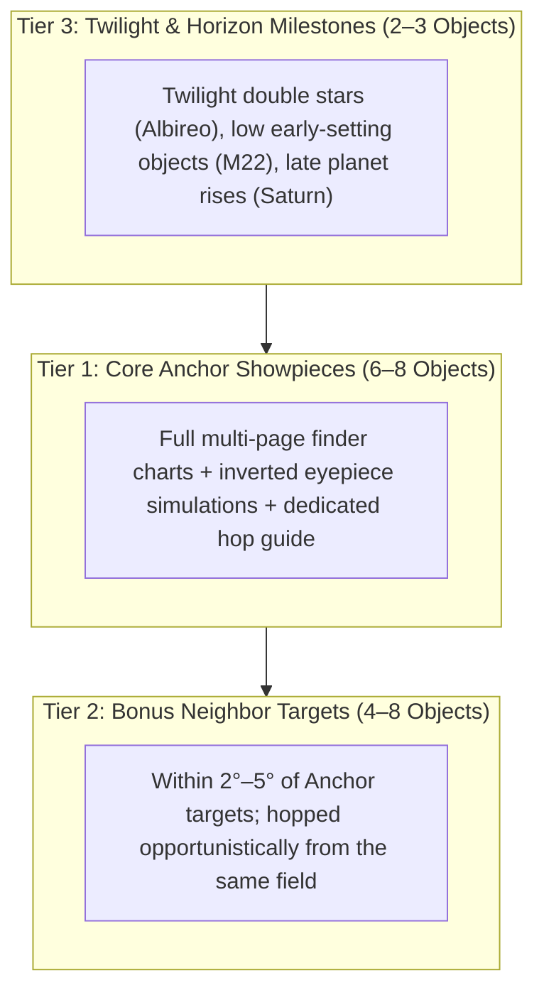

# Session Target Budgeting & "Bonus Neighbor" Hopping Methodology

How many objects should you plan to observe in a single night session? Why do experienced observers often see more than what is on the schedule, while novices feel rushed?

This guide details the astronomical planning principles for budgeting observation targets and organizing nightly sessions around **Anchor Showpieces** and **Neighboring Bonus Targets**.

---

## 1. The Dwell-Time Budget: Observer Skill × Object Difficulty

A common beginner mistake is either scheduling 25 targets for a 2.5-hour session (rushing through faint fuzzies without truly seeing them) or assuming every object takes the same flat 15 minutes.

In reality, **Total Dwell Time ($T_\text{dwell}$)** is the sum of two distinct phases:
$$T_\text{dwell} = T_\text{acquire} + T_\text{observe}$$

1. **Acquisition Time ($T_\text{acquire}$)**: Identifying anchor guide stars, aligning the Telrad/finder scope, star-hopping through field stars, and centering the object in the low-power eyepiece.
2. **Eyepiece Inspection Time ($T_\text{observe}$)**: Swapping to higher magnification (e.g. 96× / 12.5mm), focusing, adapting averted vision to dark-adapt rod cells, discerning core granularity, spiral arms, or nebula shells, and sharing the view.

### The 2D Timing Matrix: Observer Skill vs. Object Difficulty

Acquisition time scales dramatically with both **Observer Skill** and **Object Difficulty** (calibrated from Michael Swanson's *NexStar User's Guide II*):

- **Very Easy / Easy Showpieces (e.g. M13, M31, M42, M45, M57, Albireo)**:
  - An **Advanced observer** with muscle memory and sky familiarity needs only **1 to 2 minutes** to drop the Telrad onto M13 and center it. After 4–6 minutes of enjoying the core resolution at 96×, total dwell is only **5 to 8 minutes**.
  - A **Beginner** may take 5–10 minutes to locate the Hercules Keystone, catching M13 in ~12–15 minutes total.
- **Medium Targets (e.g. M1 Crab Nebula, M27 Dumbbell, M11 Wild Duck, M56, M81/M82)**:
  - Fainter contrast or multiple intermediate hop steps. Takes 2–4 min acquisition for advanced observers, 10–15 min for beginners.
- **Hard Targets (e.g. M33 Triangulum, M74, M76, M87, M71, M108)**:
  - Low surface brightness, dense star fields, or subtle contrast. Requires methodical star-hopping and prolonged averted vision.

| Object Difficulty Rating | Timing Phase | Beginner / Starter | Intermediate Observer | Advanced / Seasoned Observer |
| :--- | :--- | :---: | :---: | :---: |
| **Very Easy / Easy** *(M13, M31, M45, M57, Albireo)* | **Acquisition ($T_\text{acq}$)** **Inspection ($T_\text{obs}$)** **Total Dwell ($T_\text{dwell}$)** | 5–10 min 5–8 min **10–18 min** *(avg ~14m)* | 2–4 min 5–8 min **7–12 min** *(avg ~9.5m)* | **1–2 min** 4–6 min **5–8 min** *(avg ~6.5m)* |
| **Medium** *(M1, M27, M11, M56, M81/M82)* | **Acquisition ($T_\text{acq}$)** **Inspection ($T_\text{obs}$)** **Total Dwell ($T_\text{dwell}$)** | 10–15 min 8–10 min **18–25 min** *(avg ~21.5m)* | 4–7 min 6–9 min **10–16 min** *(avg ~13m)* | 2–4 min 5–8 min **7–12 min** *(avg ~9.5m)* |
| **Hard** *(M33, M74, M76, M87, M71)* | **Acquisition ($T_\text{acq}$)** **Inspection ($T_\text{obs}$)** **Total Dwell ($T_\text{dwell}$)** | 18–25 min 8–10 min **26–35 min** *(avg ~30m)* | 8–12 min 8–10 min **16–22 min** *(avg ~19m)* | 4–8 min 8–12 min **12–20 min** *(avg ~16m)* |

---

### The Mathematical Session Budget Formula

To calculate realistic target numbers for any session, first deduct **30 minutes of overhead** (equipment setup, primary mirror thermal acclimation, finder alignment, and dark-adaptation breaks):
$$T_\text{net} = T_\text{darkness} - 30\text{ min}$$

We calculate three distinct pacing levels:
1. **Min Targets (Relaxed Pace / In-Depth Visual Study)**: Prioritizes extended averted vision, sketching, or tackling challenging Medium/Hard targets.
2. **Avg Targets (Balanced Program — Recommended)**: Optimal curated mix (~60% Easy anchors, ~30% Medium targets, ~10% Hard challenges) + opportunistic neighbor hops.
3. **Max Targets (Active Sweeps / Marathon Pace)**: High-tempo sweeps across bright Easy/Very Easy clusters and showpieces.

#### Benchmark Budget for a 2.5-Hour Darkness Window ($T_\text{net} = 120\text{ min}$):

- **Beginner / Starter**:
  - **Min**: **4 primary targets** (~30 min/target, zero pressure, deep inspection)
  - **Avg**: **6 primary targets** (~20 min/target, 4 Easy showpieces + 2 Medium targets) — *(Recommended)*
  - **Max**: **8 primary targets** (~15 min/target, focusing strictly on bright Easy showpieces)
- **Intermediate Observer**:
  - **Min**: **6 primary targets** (~20 min/target, deep averted vision inspection)
  - **Avg**: **8 to 9 primary targets** (~13–15 min/target, 5 Easy + 3 Medium + 1 Hard) — *(Recommended)*
  - **Max**: **12 primary targets** (~10 min/target, active hopping with 2–3 neighbor bonus targets)
- **Advanced / Seasoned Observer**:
  - **Min**: **8 primary targets** (~15 min/target, in-depth averted vision sketches / difficult targets)
  - **Avg**: **12 to 14 primary targets** (~8–10 min/target, rapid 1–2 min hops + high-power detail) — *(Recommended)*
  - **Max**: **16 to 18 primary targets** (~6–7 min/target, rapid Messier marathon sweeps)

---

### Observer Choice & Interactive Planning
During session planning, the planning tool does not unilaterally force a fixed number of targets. Instead, it:
1. Computes the net darkness window for the date and site.
2. Calculates the **Min**, **Avg (Recommended)**, and **Max** target counts.
3. Presents an interactive multiple-choice prompt giving the observer the final call, with a custom write-in field to enter any specific target count or custom wishlist.

---

## 2. The Three-Tier Observation Portfolio

To balance structure with serendipity, divide your nightly program into three distinct tiers:

1. **Tier 1: Core Anchor Showpieces (6 to 8 Objects)**:
   - The headline program of the night (e.g. M13, M57, M27, M31, Double Cluster, M11).
   - Backed by dedicated multi-page PocketBook Era finder charts, inverted eyepiece simulations, and step-by-step hopping instructions.
2. **Tier 2: Bonus Neighbor Targets (4 to 8 Objects)**:
   - Objects located within $2^\circ$ to $6^\circ$ of a Tier 1 anchor.
   - Once your telescope is already pointing at the anchor constellation, hopping to these nearby gems requires minimal azimuth/altitude adjustment. If transparent seeing or swift viewing permits, sweep them up!
3. **Tier 3: Twilight & Horizon Milestones (2 to 3 Objects)**:
   - **Twilight Starter**: Bright double stars (e.g. Albireo) that do not require true darkness and actually show richer contrast against a twilight blue sky.
   - **Early-Setting Sweeps**: Low-altitude southern targets (e.g. M22 in Sagittarius) observed during late nautical twilight before they dip behind local trees.
   - **Nightcap Planetary Finale**: Bright planets (e.g. Saturn or Jupiter) rising late in the session once they clear the 15°–20° horizon obstruction.

---

## 3. Top Neighbor Clusters: Field-Tested Pairings

When you are already targeted on a primary showpiece, these adjacent bonus targets are within arm's reach:

### A. Lyra: The Ring Nebula Cluster
- **Anchor**: **M57 Ring Nebula** (Planetary Nebula, mag 8.8, **Easy**).
- **Bonus 1 — M56 (NGC 6779)**: Globular Cluster, mag 8.3, **Medium**.
  - *How to hop*: Halfway along the line connecting Sulafat ($\gamma$ Lyr) and Albireo ($\beta$ Cyg). A compact, granular ball of stars against the Milky Way background.
- **Bonus 2 — $\epsilon$ Lyrae ("The Double-Double")**: Quadruple Star, mag 4.7 / 5.1, **Very Easy**.
  - *How to hop*: Just 1.5° northeast of Vega. Naked eye splits two stars; 96× (12.5mm) splits each pair into tight twins.

### B. Vulpecula / Sagitta: The Dumbbell Corridor
- **Anchor**: **M27 Dumbbell Nebula** (Planetary Nebula, mag 7.4, **Medium**) & **Albireo** (Double Star, **Very Easy**).
- **Bonus 1 — The Coathanger (Collinder 399 / Brocchi's Cluster)**: Asterism, mag 3.6, **Very Easy**.
  - *How to hop*: 8° south-southeast of Albireo. Best viewed in 20mm (60×) or binoculars; 6 stars form a straight crossbar with 4 stars forming the hook.
- **Bonus 2 — M71 (NGC 6838)**: Globular Cluster, mag 8.2, **Hard**.
  - *How to hop*: Located just 4° south of M27, precisely along the arrow shaft of Sagitta between $\gamma$ and $\delta$ Sagittae. A loose, partially resolved globular cluster once debated as a dense open cluster.

### C. Cassiopeia / Perseus: The Royal Jewels
- **Anchor**: **Perseus Double Cluster (NGC 869 / NGC 884)** (Dual Open Clusters, mag 3.7/3.8, **Easy**).
- **Bonus 1 — M103 (NGC 581)**: Open Cluster, mag 7.4, **Easy**.
  - *How to hop*: Located just 1° northeast of Ruchbah ($\delta$ Cassiopeiae)—the exact same star used as the launchpad for the Double Cluster hop! A fan-shaped open cluster with a bright foreground double star.
- **Bonus 2 — NGC 457 ("Owl Cluster" or "ET Cluster")**: Open Cluster, mag 6.4, **Easy**.
  - *How to hop*: 2° south-southeast of Ruchbah ($\delta$ Cas). Resembles an owl or extraterrestrial figure with two gleaming eyes ($\phi$ Cas).

### D. Scutum: The Wild Duck & Shield
- **Anchor**: **M11 Wild Duck Cluster** (Open Cluster, mag 5.8, **Easy**).
- **Bonus 1 — M26 (NGC 6694)**: Open Cluster, mag 8.0, **Medium**.
  - *How to hop*: Slew 3.5° south-southwest from M11 past $\delta$ Scuti. A fainter, diamond-shaped open cluster nestled in the Scutum star cloud.

---

## 4. How to Budget Your Next Observing Session

When planning an observation night with the `stargazing-planner` skill:
1. **Determine Session Duration**: Note sunset, nautical twilight end, and total available darkness hours.
2. **Select 6 to 8 Anchors**: Spread across early-setting, high-transit, and late-rising targets.
3. **Annotate 3 to 6 Neighbor Bonuses**: Add nearby Messier and NGC objects directly into the Target Catalog notes so observers know they are right around the corner.
4. **Order by Azimuth & Altitude**: Sweep systematically from West/Southwest (early setting) toward the Meridian (highest contrast), ending East/Southeast (rising planets). Never hop back-and-forth across the zenith repeatedly.
