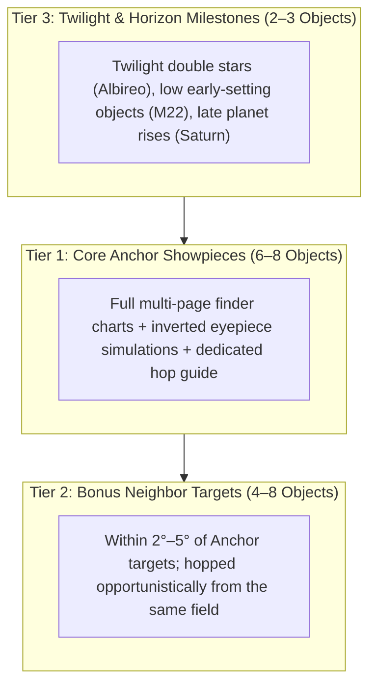

# Session Target Budgeting & "Bonus Neighbor" Hopping Methodology

How many objects should you plan to observe in a single night session? Why do experienced observers often see more than what is on the schedule, while novices feel rushed?

This guide details the astronomical planning principles for budgeting observation targets and organizing nightly sessions around **Anchor Showpieces** and **Neighboring Bonus Targets**.

---

## 1. The Dwell-Time Budget: Quality Over Quantity

A common beginner mistake is scheduling 20 to 30 targets for a 2.5-hour observation session. In practice, this leads to rushed "faint-fuzzy stamp collecting," where you spend 80% of your night star-hopping, verifying coordinates, and nudging the rocker box, and only 30 seconds squinting into the eyepiece before moving on.

### The Realistic Timing Formula
For a **2.5-hour (150-minute)** astronomical darkness window:
- **Acquisition & Star Hopping**: 3 to 7 minutes per target (locating starting anchor star, stepping through finder scope, centering in low power).
- **Eyepiece Swapping & Focusing**: 2 to 3 minutes (stepping from 20mm search power up to 12.5mm or 6mm resolution power).
- **Averted Vision & Visual Integration**: 8 to 12 minutes. The human eye and brain require several minutes of steady averted vision at the exit pupil for retinal rod cells to resolve delicate spiral galaxy arms, planetary nebula shells, or split globular cluster core stars.
- **Discussion & Sharing**: 3 to 5 minutes (if observing with friends or family).

$$\text{Total Dwell Time per Primary Target} \approx 15 \text{ to } 20 \text{ minutes}$$

$$\frac{150 \text{ minutes of darkness}}{18 \text{ min average dwell}} \approx \mathbf{6 \text{ to } 8 \text{ Primary Anchor Targets}}$$

Planning **6 to 8 primary targets** gives you a relaxed, immersive observing rhythm with zero time pressure.

---

## 2. The Three-Tier Observation Portfolio

To balance structure with serendipity, divide your nightly program into three distinct tiers:

1. **Tier 1: Core Anchor Showpieces (6 to 8 Objects)**:
   - The headline program of the night (e.g. M13, M57, M27, M31, Double Cluster, M11).
   - Backed by dedicated multi-page PocketBook Era finder charts, inverted eyepiece simulations, and step-by-step hopping instructions.
2. **Tier 2: Bonus Neighbor Targets (4 to 8 Objects)**:
   - Objects located within $2^\circ$ to $6^\circ$ of a Tier 1 anchor.
   - Once your telescope is already pointing at the anchor constellation, hopping to these nearby gems requires minimal azimuth/altitude adjustment. If transparent seeing or swift viewing permits, sweep them up!
3. **Tier 3: Twilight & Horizon Milestones (2 to 3 Objects)**:
   - **Twilight Starter**: Bright double stars (e.g. Albireo) that do not require true darkness and actually show richer contrast against a twilight blue sky.
   - **Early-Setting Sweeps**: Low-altitude southern targets (e.g. M22 in Sagittarius) observed during late nautical twilight before they dip behind local trees.
   - **Nightcap Planetary Finale**: Bright planets (e.g. Saturn or Jupiter) rising late in the session once they clear the 15°–20° horizon obstruction.

---

## 3. Top Neighbor Clusters: Field-Tested Pairings

When you are already targeted on a primary showpiece, these adjacent bonus targets are within arm's reach:

### A. Lyra: The Ring Nebula Cluster
- **Anchor**: **M57 Ring Nebula** (Planetary Nebula, mag 8.8, **Easy**).
- **Bonus 1 — M56 (NGC 6779)**: Globular Cluster, mag 8.3, **Medium**.
  - *How to hop*: Halfway along the line connecting Sulafat ($\gamma$ Lyr) and Albireo ($\beta$ Cyg). A compact, granular ball of stars against the Milky Way background.
- **Bonus 2 — $\epsilon$ Lyrae ("The Double-Double")**: Quadruple Star, mag 4.7 / 5.1, **Very Easy**.
  - *How to hop*: Just 1.5° northeast of Vega. Naked eye splits two stars; 96× (12.5mm) splits each pair into tight twins.

### B. Vulpecula / Sagitta: The Dumbbell Corridor
- **Anchor**: **M27 Dumbbell Nebula** (Planetary Nebula, mag 7.4, **Medium**) & **Albireo** (Double Star, **Very Easy**).
- **Bonus 1 — The Coathanger (Collinder 399 / Brocchi's Cluster)**: Asterism, mag 3.6, **Very Easy**.
  - *How to hop*: 8° south-southeast of Albireo. Best viewed in 20mm (60×) or binoculars; 6 stars form a straight crossbar with 4 stars forming the hook.
- **Bonus 2 — M71 (NGC 6838)**: Globular Cluster, mag 8.2, **Hard**.
  - *How to hop*: Located just 4° south of M27, precisely along the arrow shaft of Sagitta between $\gamma$ and $\delta$ Sagittae. A loose, partially resolved globular cluster once debated as a dense open cluster.

### C. Cassiopeia / Perseus: The Royal Jewels
- **Anchor**: **Perseus Double Cluster (NGC 869 / NGC 884)** (Dual Open Clusters, mag 3.7/3.8, **Easy**).
- **Bonus 1 — M103 (NGC 581)**: Open Cluster, mag 7.4, **Easy**.
  - *How to hop*: Located just 1° northeast of Ruchbah ($\delta$ Cassiopeiae)—the exact same star used as the launchpad for the Double Cluster hop! A fan-shaped open cluster with a bright foreground double star.
- **Bonus 2 — NGC 457 ("Owl Cluster" or "ET Cluster")**: Open Cluster, mag 6.4, **Easy**.
  - *How to hop*: 2° south-southeast of Ruchbah ($\delta$ Cas). Resembles an owl or extraterrestrial figure with two gleaming eyes ($\phi$ Cas).

### D. Scutum: The Wild Duck & Shield
- **Anchor**: **M11 Wild Duck Cluster** (Open Cluster, mag 5.8, **Easy**).
- **Bonus 1 — M26 (NGC 6694)**: Open Cluster, mag 8.0, **Medium**.
  - *How to hop*: Slew 3.5° south-southwest from M11 past $\delta$ Scuti. A fainter, diamond-shaped open cluster nestled in the Scutum star cloud.

---

## 4. How to Budget Your Next Observing Session

When planning an observation night with the `stargazing-planner` skill:
1. **Determine Session Duration**: Note sunset, nautical twilight end, and total available darkness hours.
2. **Select 6 to 8 Anchors**: Spread across early-setting, high-transit, and late-rising targets.
3. **Annotate 3 to 6 Neighbor Bonuses**: Add nearby Messier and NGC objects directly into the Target Catalog notes so observers know they are right around the corner.
4. **Order by Azimuth & Altitude**: Sweep systematically from West/Southwest (early setting) toward the Meridian (highest contrast), ending East/Southeast (rising planets). Never hop back-and-forth across the zenith repeatedly.
