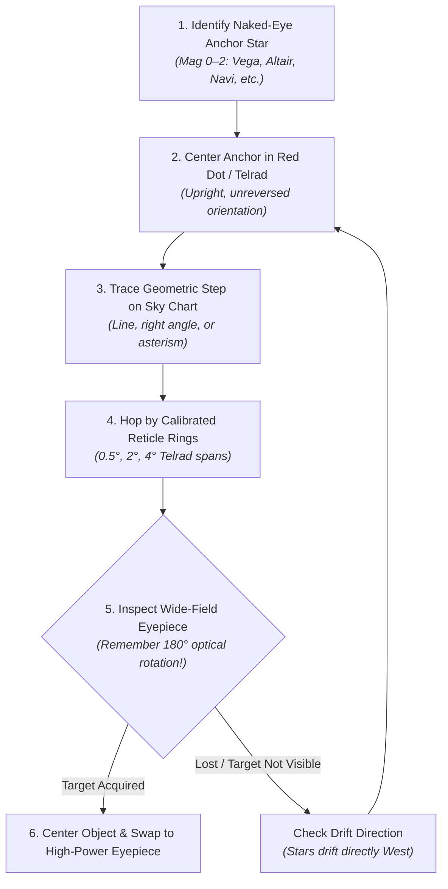

# Tutorial: Star-Hopping Fundamentals

Star-hopping is the classic, reliable technique for navigating the night sky with a manual telescope (such as a Dobsonian) without GoTo motors or electronic digital setting circles.

---

## 1. The Core Principles of Star-Hopping

1. **Start from Naked-Eye Anchors**:
   - Begin with a 0th–2nd magnitude star that is immediately recognizable without optical aid (e.g., Vega in Lyra, Altair in Aquila, Navi in Cassiopeia, Alpheratz in Pegasus).
2. **Move in Geometrical Steps**:
   - Trace geometric patterns: lines, right angles, equilateral triangles, or asterisms (such as the Keystone of Hercules or the Teapot of Sagittarius).
3. **Calibrate Distances by Known Angular Spans**:
   - Use known hand spans at arm's length for wide leaps:
     - **Tip of pinky finger**: ~1°
     - **Three middle fingers together**: ~5°
     - **Closed fist**: ~10°
     - **Spread pinky to thumb**: ~20°–25°
   - Use finder reticles for precise short hops:
     - **Inner Telrad ring**: 0.5° (30 arcminutes — approx. Full Moon diameter)
     - **Middle Telrad ring**: 2.0°
     - **Outer Telrad ring**: 4.0°
     - **Standard 8×50 / 9×50 optical finder**: ~5.0° diameter

---

## 2. Navigating Optical Inversions

One of the greatest stumbling blocks for beginners is optical inversion:

| Optical Element | Image Orientation | Comparison to Naked Eye / Sky Chart |
| :--- | :--- | :--- |
| **Naked Eye / Red Dot / Telrad** | Upright & Unreversed | **Identical** to standard sky charts (N up, E left). |
| **Right-Angle Correct-Image (RACI)** | Upright & Unreversed | **Identical** to standard sky charts. |
| **Newtonian Reflector Eyepiece** | **Inverted 180°** (Rotated) | Up becomes Down, Left becomes Right. |
| **Straight-Through Finder (9×50)** | **Inverted 180°** (Rotated) | Matches the main Newtonian eyepiece. |
| **Refractor / SCT with Star Diagonal** | **Mirror-Reversed** | Up is up, but Left and Right are swapped. |

### Rule of Thumb for Newtonian Dobsonians:
- When matching eyepiece stars to a wide-field finder chart, physically turn the chart upside down, or refer to **Viewport B (Eyepiece Simulation)** on our finder charts, which is pre-inverted by 180°.

---

## 3. Eyepiece Field of View & Drift Timing

To understand how much sky you see through your telescope:

$$\text{Magnification} = \frac{\text{Telescope Focal Length } (F)}{\text{Eyepiece Focal Length } (F_e)}$$

$$\text{True Field of View (TFOV)} = \frac{\text{Eyepiece Apparent Field of View (AFOV)}}{\text{Magnification}}$$

### Field Drift Timing Technique:
If you are unsure of your true field of view:
1. Turn off any drive motors and center an equatorial star (near Dec 0°).
2. Nudge the telescope so the star sits right at the eastern edge.
3. Time in seconds ($t$) how long it takes the star to drift across the center to the western edge:
   $$\text{TFOV (degrees)} \approx \frac{t_{\text{seconds}}}{240 \times \cos(\delta)}$$
